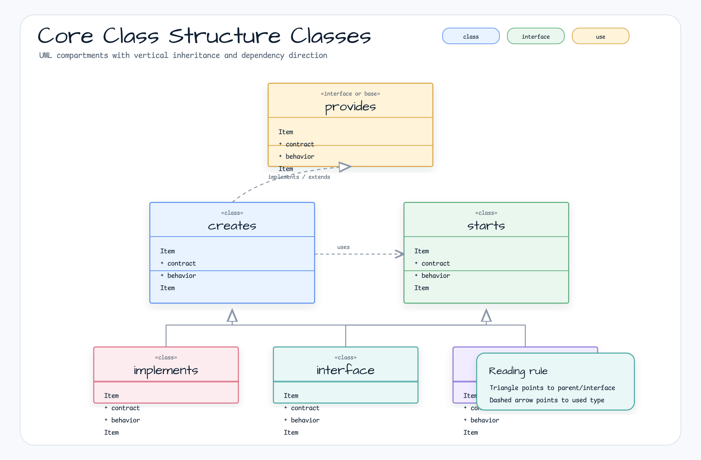
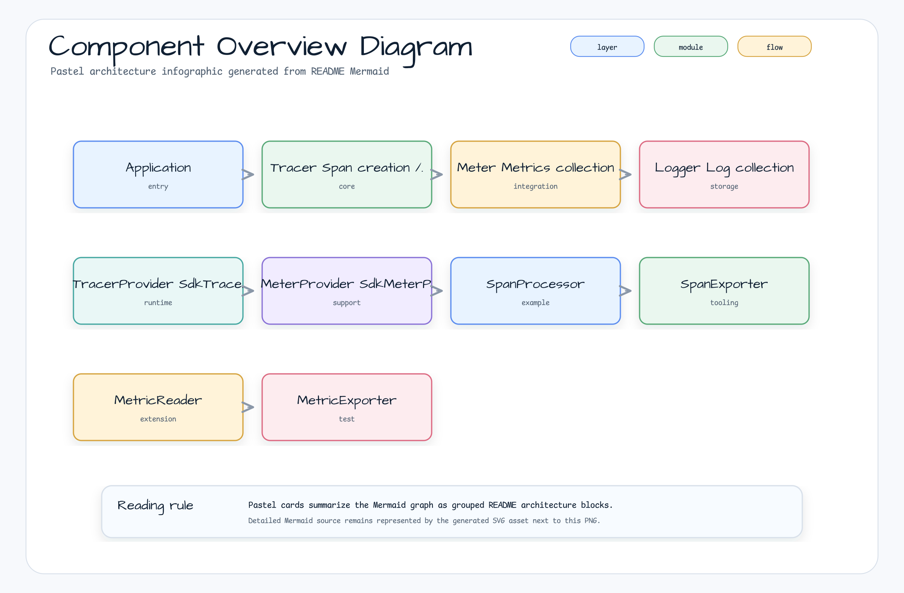
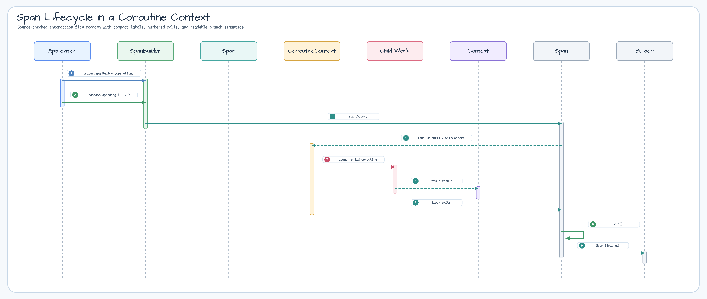
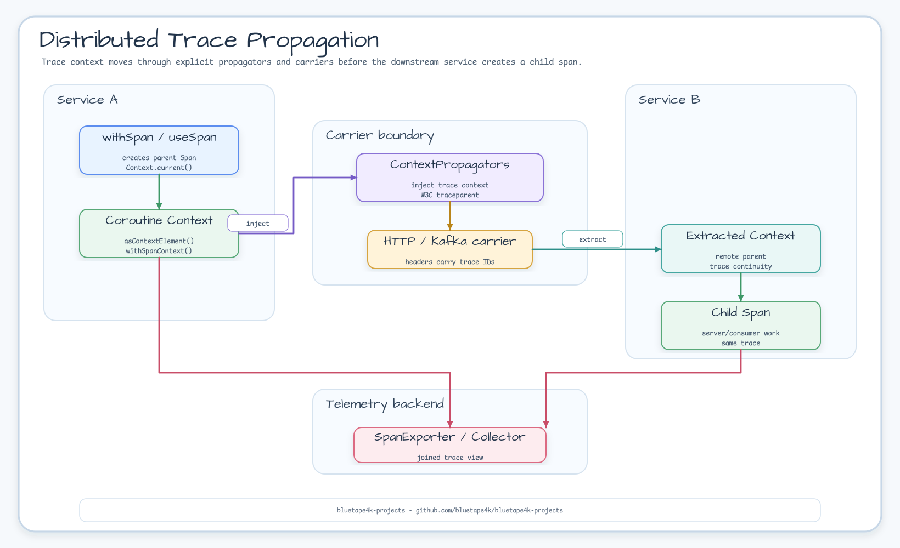

# Module bluetape4k-opentelemetry

[English](./README.md) | 한국어

[OpenTelemetry](https://opentelemetry.io/)는 클라우드 네이티브 소프트웨어를 위한 관측 가능성 프레임워크입니다. 이 모듈은 OpenTelemetry를 Kotlin에서 더욱 쉽고 편리하게 사용할 수 있도록 하는 확장 함수와 유틸리티를 제공합니다.

## 특징

- **Kotlin 확장 함수**: OpenTelemetry Java SDK를 코틀린스럽게 사용
- **Coroutines 지원**: `suspend` 함수와 코루틴 컨텍스트 전파
- **`Tracer.withSpan()`**: 한 번 호출로 Span을 시작·종료하는 suspend/blocking DSL
- **Flow 트레이싱**: `Flow.traced()` / `Flow.tracedCollect()` — 1 collect = 1 Span
- **Span 관리**: 자동 리소스 관리를 위한 `use` 패턴
- **DSL 제공**: Attributes, TracerProvider, MeterProvider 설정을 위한 DSL
- **레거시 WebFlux 트레이싱 헬퍼**: `createTracingWebFilter()`는 이전
  Spring WebFlux API를 대상으로 하며, 마이그레이션 참고용으로만 유지합니다.
- **Spring Boot Starter 지원**: 자동 설정 OpenTelemetry SDK

## 아키텍처 다이어그램

### OpenTelemetry 핵심 클래스 구조



### OpenTelemetry 구성 요소



### Span 생명주기 (Coroutines 환경)



### 분산 추적 전파 흐름



## 의존성

```kotlin
dependencies {
  implementation("io.github.bluetape4k:bluetape4k-opentelemetry:${bluetape4kVersion}")
}
```

## 주요 기능

### 1. OpenTelemetry SDK 설정

```kotlin
import io.bluetape4k.opentelemetry.*
import io.opentelemetry.sdk.trace.SdkTracerProvider
import io.opentelemetry.sdk.metrics.SdkMeterProvider

// OpenTelemetry SDK 생성
val openTelemetry = openTelemetrySdk {
  setTracerProvider(tracerProvider)
  setMeterProvider(meterProvider)
  setPropagators(ContextPropagators.create(W3CTraceContextPropagator.getInstance()))
}

// 글로벌 OpenTelemetry로 등록
val globalOtel = openTelemetrySdkGlobal {
  setTracerProvider(tracerProvider)
  setMeterProvider(meterProvider)
}

// 글로벌 인스턴스 접근
val otel = globalOpenTelemetry
```

### 2. Tracer 생성 및 Span 관리

```kotlin
import io.bluetape4k.opentelemetry.trace.*
import io.opentelemetry.api.trace.SpanKind
import java.time.Duration

// Tracer 생성
val tracer = openTelemetry.tracer("my-service") {
  setInstrumentationVersion("1.0.0")
}

// Span 수동 생성 및 관리
val span = tracer.startSpan("my-operation") {
  setSpanKind(SpanKind.INTERNAL)
  setAttribute("custom.attribute", "value")
}

// use 패턴으로 자동 관리 (try-finally 자동 처리)
span.use { currentSpan ->
  // Span 컨텍스트 내에서 작업 수행
  currentSpan.addEvent("Processing started")
  doWork()
}  // Span이 자동으로 종료됨

// SpanBuilder에서 직접 생성
tracer.spanBuilder("my-operation").useSpan { span ->
  doWork()
}

// 일반 예외는 span에 기록한 뒤 원본 예외 타입을 유지한 채 다시 던짐
tracer.spanBuilder("failing-operation").useSpan { span ->
  runCatching { doWork() }
    .onFailure {
      span.recordException(it)
      throw it
    }
}

// 하위 호환용 인자이며, 현재 구현은 span 종료 시각을 인위적으로 미루지 않음
span.use(waitTimeout = 5000) { /* 작업 */ }
span.use(Duration.ofSeconds(5)) { /* 작업 */ }
```

### 3. Coroutines 지원

```kotlin
import io.bluetape4k.opentelemetry.coroutines.*
import kotlinx.coroutines.delay

suspend fun coroutineExample() {
  val tracer = openTelemetry.getTracer("my-service")

  // 코루틴에서 Span 사용
  tracer.spanBuilder("async-operation").useSpanSuspending { span ->
    span.addEvent("Before delay")
    delay(1000)
    span.addEvent("After delay")
  }  // Span이 자동으로 종료됨

  // 기존 Span을 코루틴 컨텍스트에서 사용
  val span = tracer.spanBuilder("parent").startSpan()
  span.useSuspending { currentSpan ->
    withContext(Dispatchers.IO) {
      // Span 컨텍스트가 전파됨
      doAsyncWork()
    }
  }
}

// 명시적 Span Context 전파
suspend fun withExplicitContext() {
  val span = tracer.spanBuilder("operation").startSpan()
  withSpanContext(span) { currentSpan ->
    // Span Context가 설정된 상태에서 실행
    doWork()
  }
}

// suspend 작업 주위에 Span을 생성하고 범위를 지정할 때 useSpanSuspending 사용
tracer.spanBuilder("recommended").useSpanSuspending(Dispatchers.IO) { span ->
  doAsyncWork()
}
```

### 3-A. Tracer.withSpan() — 단일 호출 DSL

`Tracer.withSpan()`은 블록을 단일 Span으로 감싸 시작·상태 설정·종료를 자동으로 처리합니다.
suspend/blocking 두 가지 변형을 제공합니다.

```kotlin
import io.bluetape4k.opentelemetry.trace.withSpan
import io.bluetape4k.opentelemetry.coroutines.withSpan

// suspend 변형 (코루틴 내부)
val result: String = tracer.withSpan("my-op") { span ->
  span.setAttribute(AttributeKey.stringKey("key"), "value")
  "done"
}

// 시작 전 attribute 설정
tracer.withSpan("my-op", configure = {
  setAttribute(AttributeKey.stringKey("env"), "prod")
  setSpanKind(SpanKind.SERVER)
}) { span ->
  doWork()
}

// 중첩 호출 → parent-child 트레이스 생성
tracer.withSpan("parent") {
  tracer.withSpan("child") { doWork() }
}

// CancellationException → StatusCode.UNSET (ERROR 미기록)
// 그 외 Throwable     → StatusCode.ERROR + recordException + 재던짐
```

**Span 생명주기 계약:**
- 정상 완료 → `StatusCode.OK`, Span 종료
- `CancellationException` → `StatusCode.UNSET`, Span 종료, 예외 재던짐
- 그 외 `Throwable` → `StatusCode.ERROR` + `recordException`, Span 종료, 예외 재던짐
- 예외 메시지 `null` → `"unspecified error"` (내부 클래스명 절대 노출 안 함)

### 3-B. Flow 트레이싱 — `traced()` / `tracedCollect()`

**1 collect = 1 Span** (emit 횟수와 무관).

```kotlin
import io.bluetape4k.opentelemetry.coroutines.traced
import io.bluetape4k.opentelemetry.coroutines.tracedCollect

// traced() — collect 전체를 단일 Span으로 감쌈
flowOf(1, 2, 3)
    .traced(tracer, "my-flow") {
        setAttribute(AttributeKey.stringKey("source"), "db")
    }
    .collect { item -> process(item) }

// 다른 연산자와 조합 가능 — Span은 전체 collect 기간 동안 유지
flowOf(1, 2, 3, 4)
    .traced(tracer, "take-flow")
    .take(2)
    .collect { }

// tracedCollect — action이 Span의 OTel Context 안에서 실행
// action 내부에서 Span.current()는 tracedCollect가 생성한 Span 반환
flowOf(42).tracedCollect(tracer, "collect-span") { item ->
    val span = Span.current()  // tracedCollect가 생성한 동일 Span
    process(item)
}
```

**계약:**
- 정상 완료 → `StatusCode.OK`
- `CancellationException` (timeout, `take()`, 취소) → `StatusCode.UNSET`
- 그 외 예외 → `StatusCode.ERROR` + `recordException`, 예외 재던짐
- `traced()` vs `tracedCollect()` 선택 기준:
  - `traced()` — 새 Flow 반환. OTel Context는 **producer** 코루틴에만 활성화
  - `tracedCollect()` — 터미널 연산자. OTel Context는 **producer + consumer(action)** 코루틴 양쪽에 활성화

### 4. Attributes 관리

```kotlin
import io.bluetape4k.opentelemetry.common.*

// AttributeKey 생성
val userIdKey = "user.id".toAttributeKey()
val countKey = longAttributeKeyOf("request.count")
val tagsKey = "tags".toStringArrayAttributeKey()

// Attributes 빌더
val attributes = attributes {
  put("service.name", "my-service")
  put("service.version", "1.0.0")
  put("request.count", 100L)
  put("is.active", true)
  put("tags", listOf("tag1", "tag2"))
}

// 간편한 Attributes 생성
val attrs1 = attributesOf("key", "value")
val attrs2 = attributesOf(userIdKey, "user123", countKey, 10L)

// Map에서 Attributes 변환
val map = mapOf(
  "key1" to "value1",
  "count" to 42L,
  "enabled" to true
)
val fromMap = map.toAttributes()
```

### 5. Context 관리

```kotlin
import io.bluetape4k.opentelemetry.*

// 현재 Context 가져오기
val currentContext = currentOtelContext()

// Root Context
val rootContext = rootOtelContext()

// Context 내에서 작업 실행
val result = currentContext.withCurrent {
  // Context가 설정된 상태에서 실행
  doWork()
}

// Context에서 Span 가져오기
val span = currentContext.getSpan()
val spanOrNull = currentContext.getSpanOrNull()
```

### 6. TracerProvider 설정

```kotlin
import io.bluetape4k.opentelemetry.trace.*
import io.opentelemetry.api.common.Attributes
import io.opentelemetry.sdk.resources.Resource
import io.opentelemetry.semconv.ServiceAttributes
import io.opentelemetry.exporter.logging.LoggingSpanExporter

// SdkTracerProvider 생성
val tracerProvider = sdkTracerProvider {
  addSpanProcessor(simpleSpanProcessorOf(LoggingSpanExporter.create()))
  setResource(Resource.create(Attributes.of(ServiceAttributes.SERVICE_NAME, "my-service")))
}

// SpanProcessor 생성
val simpleProcessor = simpleSpanProcessorOf(LoggingSpanExporter.create())
val batchProcessor = batchSpanProcessorOf(LoggingSpanExporter.create()) {
  setScheduleDelay(java.time.Duration.ofMillis(250))
}
```

### 7. Metrics 지원

```kotlin
import io.bluetape4k.opentelemetry.*
import io.bluetape4k.opentelemetry.metrics.*
import io.opentelemetry.sdk.testing.exporter.InMemoryMetricReader

// Meter 생성
val meter = openTelemetry.meter("my-service") {
  setInstrumentationVersion("1.0.0")
}

// SdkMeterProvider 생성
val meterProvider = sdkMeterProvider {
  registerMetricReader(InMemoryMetricReader.create())
}

// MetricReader/Exporter
val inMemoryReader = inMemoryMetricReaderOf()
val loggingReader = periodicMetricReader(loggingMetricExporterOf()) {
  setInterval(java.time.Duration.ofSeconds(5))
}
```

### 8. SpanExporter 설정

```kotlin
import io.bluetape4k.opentelemetry.trace.*
import io.opentelemetry.exporter.logging.LoggingSpanExporter
import io.opentelemetry.exporter.otlp.trace.OtlpGrpcSpanExporter

// Logging SpanExporter
val loggingExporter = loggingSpanExporterOf()

// 여러 Exporter 조합
val compositeExporter = spanExporterOf(
  LoggingSpanExporter.create(),
  OtlpGrpcSpanExporter.builder().build()
)
```

### 9. 레거시 Spring WebFlux 트레이싱 헬퍼

> **Spring Boot 버전 제약:**
> `createTracingWebFilter()`는 `opentelemetry-spring-webflux-5.3` 아티팩트를 사용하며, Spring WebFlux 5.3 / 6.x (Spring Boot 3) 대상입니다.
> 현재 bluetape4k의 Spring 연동은 Spring Boot 4.x만 지원합니다. OTel instrumentation BOM에서 Spring Framework 7 대응 아티팩트를 제공하기 전까지 이 헬퍼를 새 Spring Boot 4 애플리케이션에 사용하지 마세요.

```kotlin
import io.bluetape4k.opentelemetry.webflux.createTracingWebFilter
import io.bluetape4k.opentelemetry.webflux.webfluxServerTelemetry

// @Bean으로 ApplicationContext당 1회만 호출하세요
@Configuration
class TracingConfig(private val openTelemetry: OpenTelemetry) {

    @Bean
    fun tracingWebFilter(): WebFilter = openTelemetry.createTracingWebFilter()
}
```

**운영 주의사항:**
- `createTracingWebFilter()`는 `ApplicationContext`당 1회만 호출하세요. 내부적으로 Reactor `Hooks.onEachOperator`를 전역 등록합니다. 중복 호출 시 훅이 중첩되어 예측 불가능한 동작이 발생합니다.
- 테스트에서는 `@AfterAll`에서 `Hooks.resetOnEachOperator()`를 호출하여 훅 누수를 방지하세요.
- `Authorization` 등 민감 헤더는 기본적으로 캡처되지 않습니다. 특정 헤더를 허용하려면 환경변수 `OTEL_INSTRUMENTATION_HTTP_CAPTURE_HEADERS_SERVER_REQUEST`를 설정하세요. **PII를 포함하는 헤더는 절대 추가하지 마세요.**

## 테스트 전략

### CI 테스트 설정 참고 사항

GitHub Actions 같은 Linux CI 환경에서는 Reactor Netty가 **io_uring** 네이티브 트랜스포트를 사용합니다. Spring 애플리케이션 컨텍스트를 공유하는 여러 테스트 메서드가 순차적으로 실행될 때, io_uring 이벤트 루프 재초기화 과정에서 레이스 컨디션이 발생할 수 있습니다:

```
io.netty.channel.ChannelException: eventfd_write(...) failed: Bad file descriptor
```

**원인:** `DefaultLoopResources.cacheNativeClientLoops()`가 기존 서버 이벤트 루프 그룹에 `shutdownGracefully()`를 호출하는 시점에 해당 `eventfd` 파일 디스크립터가 이미 닫혀 있어 발생합니다.

**해결책:** `build.gradle.kts`의 test 태스크에 JVM 인수를 추가하여 네이티브 트랜스포트를 비활성화합니다:

```kotlin
tasks {
    test {
        jvmArgs("-Dreactor.netty.native=false")  // 테스트 JVM에만 적용
    }
}
```

이 설정은 테스트 실행 시에만 io_uring 대신 NIO 트랜스포트를 사용하도록 강제합니다. **프로덕션 애플리케이션은 별도 JVM으로 실행되므로 이 플래그의 영향을 받지 않습니다.**

### 단위 테스트

```kotlin
import io.bluetape4k.opentelemetry.trace.*
import io.opentelemetry.sdk.trace.SdkTracerProvider
import io.opentelemetry.sdk.trace.export.InMemorySpanExporter
import io.opentelemetry.sdk.trace.export.SimpleSpanProcessor

class MyServiceTest {
  private val spanExporter = InMemorySpanExporter.create()
  private val tracerProvider = sdkTracerProvider {
    addSpanProcessor(SimpleSpanProcessor.create(spanExporter))
  }
  private val tracer = tracerProvider.get("test")

  @AfterEach
  fun tearDown() {
    spanExporter.reset()
  }

  @Test
  fun `span이 올바르게 생성되는지 확인`() {
    // given
    val service = MyService(tracer)

    // when
    service.doWork()

    // then
    val spans = spanExporter.finishedSpanItems
    spans shouldHaveSize 1
    spans.first().name shouldBe "do-work"
  }
}
```

### 테스트 환경별 권장 설정

| 환경     | Agent | Exporter               | 검증 수준                  |
|--------|-------|------------------------|------------------------|
| 운영/통합  | ON    | GlobalOpenTelemetry 사용 | 트레이스 연결 확인             |
| 단위 테스트 | OFF   | InMemorySpanExporter   | 상세 검증 (parentSpanId 등) |
| 통합 테스트 | ON    | Logging/OTLP           | 트레이스 생성 확인             |

## OpenTelemetry Java Agent

Java Agent를 사용하여 애플리케이션을 자동으로 계측할 수 있습니다:

```bash
# Agent 다운로드
curl -L -o opentelemetry-javaagent.jar \
  https://github.com/open-telemetry/opentelemetry-java-instrumentation/releases/latest/download/opentelemetry-javaagent.jar

# 애플리케이션 실행
java -javaagent:opentelemetry-javaagent.jar \
  -Dotel.service.name=my-service \
  -Dotel.traces.exporter=otlp \
  -jar my-application.jar
```

Gradle Task로 Agent 다운로드:

```kotlin
tasks.register<de.undercouch.gradle.tasks.download.Download>("downloadAgent") {
  src("https://github.com/open-telemetry/.../opentelemetry-javaagent.jar")
  dest("${project.layout.buildDirectory.asFile.get()}/opentelemetry-javaagent.jar")
  onlyIfModified(true)
}
```

## 예제

더 많은 예제는 `src/test/kotlin/io/bluetape4k/opentelemetry/examples` 패키지에서 확인할 수 있습니다:

- `logging/`: Logging Exporter 예제
- `metrics/`: Metrics 수집 예제
- `javaagent/`: Java Agent 통합 예제 (Spring Boot)

## 참고 자료

- [OpenTelemetry 공식 문서](https://opentelemetry.io/docs/)
- [OpenTelemetry Java SDK](https://github.com/open-telemetry/opentelemetry-java)
- [OpenTelemetry Kotlin Extension](https://github.com/open-telemetry/opentelemetry-java/tree/main/extensions/kotlin)
- [OpenTelemetry Spring Boot Starter](https://github.com/open-telemetry/opentelemetry-java-instrumentation/tree/main/instrumentation/spring/spring-boot-autoconfigure)

## 라이선스

MIT License
