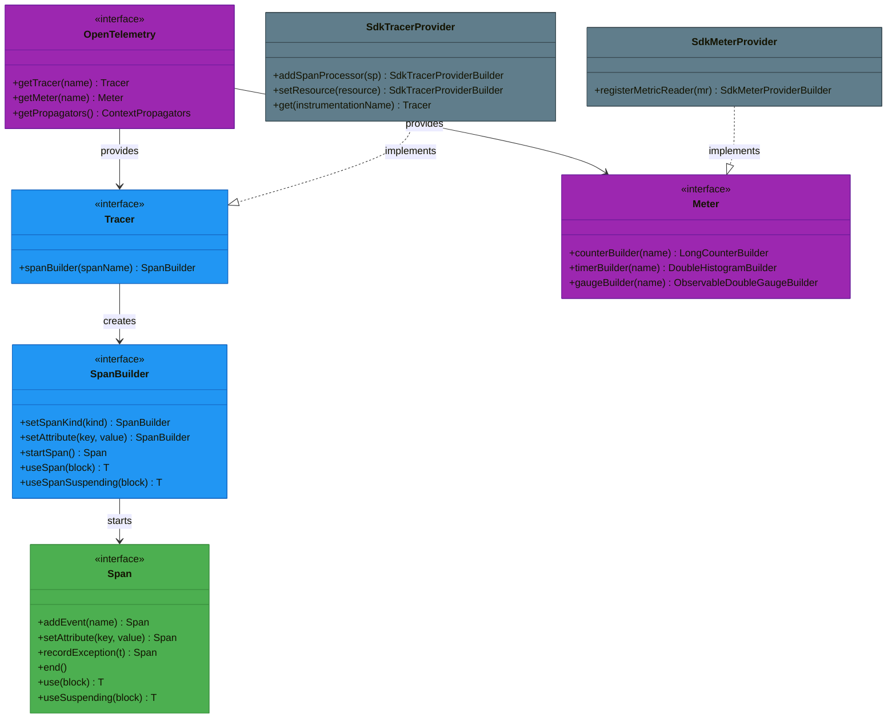
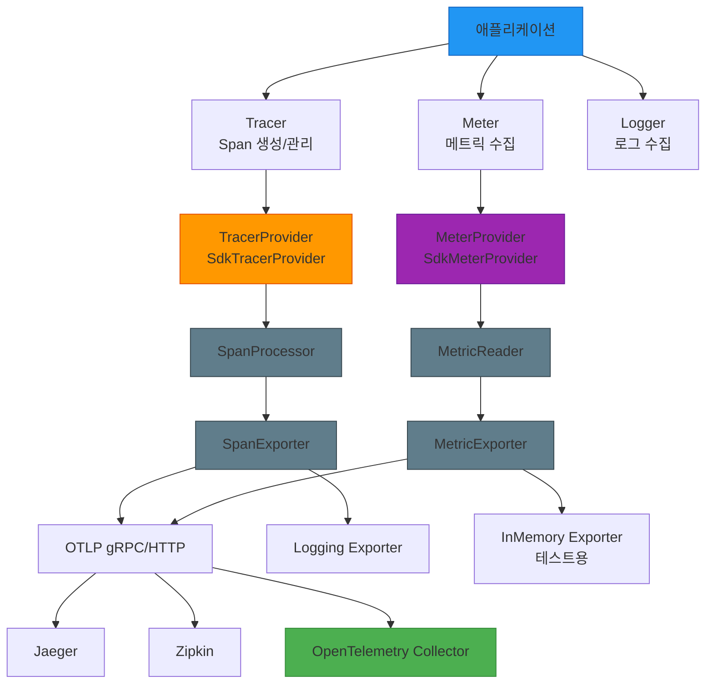
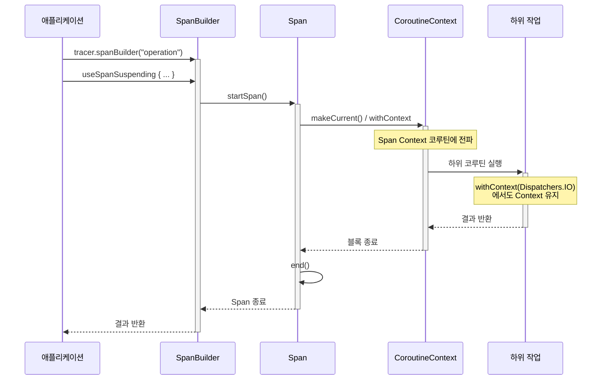
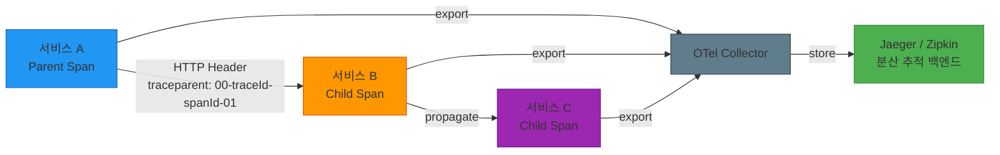

# Module bluetape4k-opentelemetry

[OpenTelemetry](https://opentelemetry.io/)는 클라우드 네이티브 소프트웨어를 위한 관측 가능성 프레임워크입니다. 이 모듈은 OpenTelemetry를 Kotlin에서 더욱 쉽고 편리하게 사용할 수 있도록 하는 확장 함수와 유틸리티를 제공합니다.

## 특징

- **Kotlin 확장 함수**: OpenTelemetry Java SDK를 코틀린스럽게 사용
- **Coroutines 지원**: `suspend` 함수와 코루틴 컨텍스트 전파
- **Span 관리**: 자동 리소스 관리를 위한 `use` 패턴
- **DSL 제공**: Attributes, TracerProvider, MeterProvider 설정을 위한 DSL
- **Spring Boot 통합**: Spring Boot Starter 지원

## 의존성

```kotlin
dependencies {
  implementation("io.github.bluetape4k:bluetape4k-opentelemetry:${bluetape4kVersion}")
}
```

## 주요 기능

### 1. OpenTelemetry SDK 설정

```kotlin
import io.bluetape4k.opentelemetry.*
import io.opentelemetry.sdk.trace.SdkTracerProvider
import io.opentelemetry.sdk.metrics.SdkMeterProvider

// OpenTelemetry SDK 생성
val openTelemetry = openTelemetrySdk {
  setTracerProvider(tracerProvider)
  setMeterProvider(meterProvider)
  setPropagators(ContextPropagators.create(W3CTraceContextPropagator.getInstance()))
}

// 글로벌 OpenTelemetry로 등록
val globalOtel = openTelemetrySdkGlobal {
  setTracerProvider(tracerProvider)
  setMeterProvider(meterProvider)
}

// 글로벌 인스턴스 접근
val otel = globalOpenTelemetry
```

### 2. Tracer 생성 및 Span 관리

```kotlin
import io.bluetape4k.opentelemetry.trace.*
import io.opentelemetry.api.trace.SpanKind
import java.time.Duration

// Tracer 생성
val tracer = openTelemetry.tracer("my-service") {
  setInstrumentationVersion("1.0.0")
}

// Span 수동 생성 및 관리
val span = tracer.startSpan("my-operation") {
  setSpanKind(SpanKind.INTERNAL)
  setAttribute("custom.attribute", "value")
}

// use 패턴으로 자동 관리 (try-finally 자동 처리)
span.use { currentSpan ->
  // Span 컨텍스트 내에서 작업 수행
  currentSpan.addEvent("Processing started")
  doWork()
}  // Span이 자동으로 종료됨

// SpanBuilder에서 직접 생성
tracer.spanBuilder("my-operation").useSpan { span ->
  doWork()
}

// 일반 예외는 span에 기록한 뒤 원본 예외 타입을 유지한 채 다시 던짐
tracer.spanBuilder("failing-operation").useSpan { span ->
  runCatching { doWork() }
    .onFailure {
      span.recordException(it)
      throw it
    }
}

// 하위 호환용 인자이며, 현재 구현은 span 종료 시각을 인위적으로 미루지 않음
span.use(waitTimeout = 5000) { /* 작업 */ }
span.use(Duration.ofSeconds(5)) { /* 작업 */ }
```

### 3. Coroutines 지원

```kotlin
import io.bluetape4k.opentelemetry.coroutines.*
import kotlinx.coroutines.delay

suspend fun coroutineExample() {
  val tracer = openTelemetry.getTracer("my-service")

  // 코루틴에서 Span 사용
  tracer.spanBuilder("async-operation").useSpanSuspending { span ->
    span.addEvent("Before delay")
    delay(1000)
    span.addEvent("After delay")
  }  // Span이 자동으로 종료됨

  // 기존 Span을 코루틴 컨텍스트에서 사용
  val span = tracer.spanBuilder("parent").startSpan()
  span.useSuspending { currentSpan ->
    withContext(Dispatchers.IO) {
      // Span 컨텍스트가 전파됨
      doAsyncWork()
    }
  }
}

// 명시적 Span Context 전파
suspend fun withExplicitContext() {
  val span = tracer.spanBuilder("operation").startSpan()
  withSpanContext(span) { currentSpan ->
    // Span Context가 설정된 상태에서 실행
    doWork()
  }
}

// deprecated 된 useSuspendSpan 대신 useSpanSuspending 사용 권장
tracer.spanBuilder("recommended").useSpanSuspending(Dispatchers.IO) { span ->
  doAsyncWork()
}
```

### 4. Attributes 관리

```kotlin
import io.bluetape4k.opentelemetry.common.*

// AttributeKey 생성
val userIdKey = "user.id".toAttributeKey()
val countKey = longAttributeKeyOf("request.count")
val tagsKey = "tags".toStringArrayAttributeKey()

// Attributes 빌더
val attributes = attributes {
  put("service.name", "my-service")
  put("service.version", "1.0.0")
  put("request.count", 100L)
  put("is.active", true)
  put("tags", listOf("tag1", "tag2"))
}

// 간편한 Attributes 생성
val attrs1 = attributesOf("key", "value")
val attrs2 = attributesOf(userIdKey, "user123", countKey, 10L)

// Map에서 Attributes 변환
val map = mapOf(
  "key1" to "value1",
  "count" to 42L,
  "enabled" to true
)
val fromMap = map.toAttributes()
```

### 5. Context 관리

```kotlin
import io.bluetape4k.opentelemetry.*

// 현재 Context 가져오기
val currentContext = currentOtelContext()

// Root Context
val rootContext = rootOtelContext()

// Context 내에서 작업 실행
val result = currentContext.withCurrent {
  // Context가 설정된 상태에서 실행
  doWork()
}

// Context에서 Span 가져오기
val span = currentContext.getSpan()
val spanOrNull = currentContext.getSpanOrNull()
```

### 6. TracerProvider 설정

```kotlin
import io.bluetape4k.opentelemetry.trace.*
import io.opentelemetry.api.common.Attributes
import io.opentelemetry.sdk.resources.Resource
import io.opentelemetry.semconv.ServiceAttributes
import io.opentelemetry.exporter.logging.LoggingSpanExporter

// SdkTracerProvider 생성
val tracerProvider = sdkTracerProvider {
  addSpanProcessor(simpleSpanProcessorOf(LoggingSpanExporter.create()))
  setResource(Resource.create(Attributes.of(ServiceAttributes.SERVICE_NAME, "my-service")))
}

// SpanProcessor 생성
val simpleProcessor = simpleSpanProcessorOf(LoggingSpanExporter.create())
val batchProcessor = batchSpanProcessorOf(LoggingSpanExporter.create()) {
  setScheduleDelay(java.time.Duration.ofMillis(250))
}
```

### 7. Metrics 지원

```kotlin
import io.bluetape4k.opentelemetry.*
import io.bluetape4k.opentelemetry.metrics.*
import io.opentelemetry.sdk.testing.exporter.InMemoryMetricReader

// Meter 생성
val meter = openTelemetry.meter("my-service") {
  setInstrumentationVersion("1.0.0")
}

// SdkMeterProvider 생성
val meterProvider = sdkMeterProvider {
  registerMetricReader(InMemoryMetricReader.create())
}

// MetricReader/Exporter
val inMemoryReader = inMemoryMetricReaderOf()
val loggingReader = periodicMetricReader(loggingMetricExporterOf()) {
  setInterval(java.time.Duration.ofSeconds(5))
}
```

### 8. SpanExporter 설정

```kotlin
import io.bluetape4k.opentelemetry.trace.*
import io.opentelemetry.exporter.logging.LoggingSpanExporter
import io.opentelemetry.exporter.otlp.trace.OtlpGrpcSpanExporter

// Logging SpanExporter
val loggingExporter = loggingSpanExporterOf()

// 여러 Exporter 조합
val compositeExporter = spanExporterOf(
  LoggingSpanExporter.create(),
  OtlpGrpcSpanExporter.builder().build()
)
```

## 아키텍처 다이어그램

### OpenTelemetry 핵심 클래스 구조



### OpenTelemetry 구성 요소



### Span 생명주기 (Coroutines 환경)



### 분산 추적 전파 흐름



## 테스트 전략

### 단위 테스트

```kotlin
import io.bluetape4k.opentelemetry.trace.*
import io.opentelemetry.sdk.trace.SdkTracerProvider
import io.opentelemetry.sdk.trace.export.InMemorySpanExporter
import io.opentelemetry.sdk.trace.export.SimpleSpanProcessor

class MyServiceTest {
  private val spanExporter = InMemorySpanExporter.create()
  private val tracerProvider = sdkTracerProvider {
    addSpanProcessor(SimpleSpanProcessor.create(spanExporter))
  }
  private val tracer = tracerProvider.get("test")

  @AfterEach
  fun tearDown() {
    spanExporter.reset()
  }

  @Test
  fun `span이 올바르게 생성되는지 확인`() {
    // given
    val service = MyService(tracer)

    // when
    service.doWork()

    // then
    val spans = spanExporter.finishedSpanItems
    spans shouldHaveSize 1
    spans.first().name shouldBe "do-work"
  }
}
```

### 테스트 환경별 권장 설정

| 환경     | Agent | Exporter               | 검증 수준                  |
|--------|-------|------------------------|------------------------|
| 운영/통합  | ON    | GlobalOpenTelemetry 사용 | 트레이스 연결 확인             |
| 단위 테스트 | OFF   | InMemorySpanExporter   | 상세 검증 (parentSpanId 등) |
| 통합 테스트 | ON    | Logging/OTLP           | 트레이스 생성 확인             |

## OpenTelemetry Java Agent

Java Agent를 사용하여 애플리케이션을 자동으로 계측할 수 있습니다:

```bash
# Agent 다운로드
curl -L -o opentelemetry-javaagent.jar \
  https://github.com/open-telemetry/opentelemetry-java-instrumentation/releases/latest/download/opentelemetry-javaagent.jar

# 애플리케이션 실행
java -javaagent:opentelemetry-javaagent.jar \
  -Dotel.service.name=my-service \
  -Dotel.traces.exporter=otlp \
  -jar my-application.jar
```

Gradle Task로 Agent 다운로드:

```kotlin
tasks.register<de.undercouch.gradle.tasks.download.Download>("downloadAgent") {
  src("https://github.com/open-telemetry/.../opentelemetry-javaagent.jar")
  dest("${project.layout.buildDirectory.asFile.get()}/opentelemetry-javaagent.jar")
  onlyIfModified(true)
}
```

## 예제

더 많은 예제는 `src/test/kotlin/io/bluetape4k/opentelemetry/examples` 패키지에서 확인할 수 있습니다:

- `logging/`: Logging Exporter 예제
- `metrics/`: Metrics 수집 예제
- `javaagent/`: Java Agent 통합 예제 (Spring Boot)

## 참고 자료

- [OpenTelemetry 공식 문서](https://opentelemetry.io/docs/)
- [OpenTelemetry Java SDK](https://github.com/open-telemetry/opentelemetry-java)
- [OpenTelemetry Kotlin Extension](https://github.com/open-telemetry/opentelemetry-java/tree/main/extensions/kotlin)
- [OpenTelemetry Spring Boot Starter](https://github.com/open-telemetry/opentelemetry-java-instrumentation/tree/main/instrumentation/spring/spring-boot-autoconfigure)

## 라이선스

Apache License 2.0
