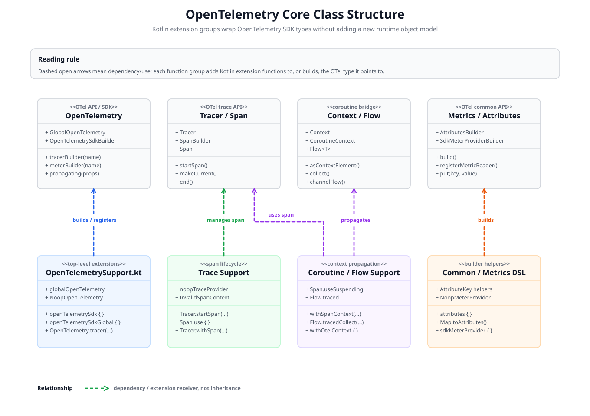
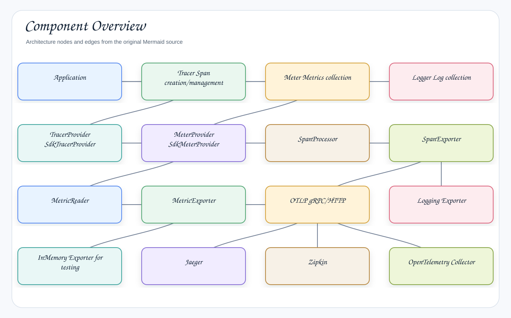
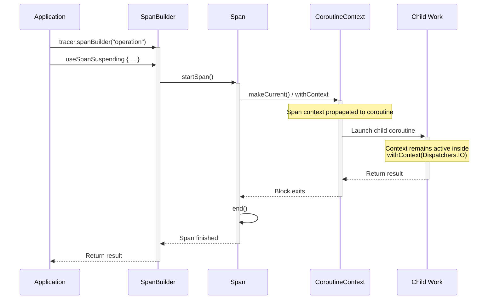
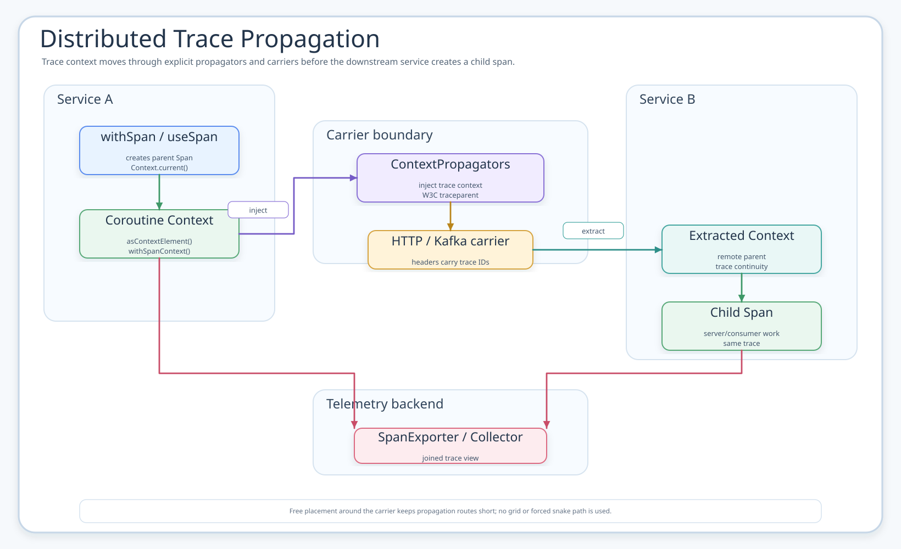

# Module bluetape4k-opentelemetry

English | [한국어](./README.ko.md)

[OpenTelemetry](https://opentelemetry.io/) is an observability framework for cloud-native software. This module provides Kotlin extension functions and utilities that make it easier and more idiomatic to use OpenTelemetry on the JVM.

## Features

- **Kotlin extension functions**: Use the OpenTelemetry Java SDK in a Kotlin-idiomatic way
- **Coroutines support**: Propagate `suspend` function context and coroutine context
- **`Tracer.withSpan()`**: Single-call DSL for suspend and blocking span management
- **Flow tracing**: `Flow.traced()` / `Flow.tracedCollect()` — 1 collect = 1 Span
- **Span management**: `use` pattern for automatic resource cleanup
- **DSL support**: DSLs for configuring Attributes, TracerProvider, and MeterProvider
- **Legacy WebFlux tracing helper**: `createTracingWebFilter()` targets the
  older Spring WebFlux API and is retained for migration reference only
- **Spring Boot Starter support**: Auto-configured OpenTelemetry SDK

## Dependency

```kotlin
dependencies {
  implementation("io.github.bluetape4k:bluetape4k-opentelemetry:${bluetape4kVersion}")
}
```

## Key Features

### 1. OpenTelemetry SDK Setup

```kotlin
import io.bluetape4k.opentelemetry.*
import io.opentelemetry.sdk.trace.SdkTracerProvider
import io.opentelemetry.sdk.metrics.SdkMeterProvider

// Build an OpenTelemetry SDK instance
val openTelemetry = openTelemetrySdk {
  setTracerProvider(tracerProvider)
  setMeterProvider(meterProvider)
  setPropagators(ContextPropagators.create(W3CTraceContextPropagator.getInstance()))
}

// Register as the global OpenTelemetry instance
val globalOtel = openTelemetrySdkGlobal {
  setTracerProvider(tracerProvider)
  setMeterProvider(meterProvider)
}

// Access the global instance
val otel = globalOpenTelemetry
```

### 2. Creating Tracers and Managing Spans

```kotlin
import io.bluetape4k.opentelemetry.trace.*
import io.opentelemetry.api.trace.SpanKind
import java.time.Duration

// Create a Tracer
val tracer = openTelemetry.tracer("my-service") {
  setInstrumentationVersion("1.0.0")
}

// Manually create and manage a Span
val span = tracer.startSpan("my-operation") {
  setSpanKind(SpanKind.INTERNAL)
  setAttribute("custom.attribute", "value")
}

// Automatic lifecycle management via the use pattern (try-finally handled internally)
span.use { currentSpan ->
  // Work inside the Span context
  currentSpan.addEvent("Processing started")
  doWork()
}  // Span ends automatically

// Start and use a Span directly from a SpanBuilder
tracer.spanBuilder("my-operation").useSpan { span ->
  doWork()
}

// Exceptions are recorded on the span; the original exception type is rethrown as-is
tracer.spanBuilder("failing-operation").useSpan { span ->
  runCatching { doWork() }
    .onFailure {
      span.recordException(it)
      throw it
    }
}

// These timeout arguments are kept for backwards compatibility;
// the current implementation does not artificially delay the span end time
span.use(waitTimeout = 5000) { /* work */ }
span.use(Duration.ofSeconds(5)) { /* work */ }
```

### 3. Coroutines Support

```kotlin
import io.bluetape4k.opentelemetry.coroutines.*
import kotlinx.coroutines.delay

suspend fun coroutineExample() {
  val tracer = openTelemetry.getTracer("my-service")

  // Use a Span inside a coroutine
  tracer.spanBuilder("async-operation").useSpanSuspending { span ->
    span.addEvent("Before delay")
    delay(1000)
    span.addEvent("After delay")
  }  // Span ends automatically

  // Use an existing Span in a coroutine context
  val span = tracer.spanBuilder("parent").startSpan()
  span.useSuspending { currentSpan ->
    withContext(Dispatchers.IO) {
      // Span context is propagated
      doAsyncWork()
    }
  }
}

// Explicit Span context propagation
suspend fun withExplicitContext() {
  val span = tracer.spanBuilder("operation").startSpan()
  withSpanContext(span) { currentSpan ->
    // Runs with the Span context active
    doWork()
  }
}

// Prefer useSpanSuspending over the deprecated useSuspendSpan
tracer.spanBuilder("recommended").useSpanSuspending(Dispatchers.IO) { span ->
  doAsyncWork()
}
```

### 3-A. Tracer.withSpan() — Single-Call DSL

`Tracer.withSpan()` wraps a block in a single Span, starts it, sets status, and ends it automatically.
Both suspend and blocking variants are provided.

```kotlin
import io.bluetape4k.opentelemetry.trace.withSpan
import io.bluetape4k.opentelemetry.coroutines.withSpan

// Suspend variant (inside a coroutine)
val result: String = tracer.withSpan("my-op") { span ->
  span.setAttribute(AttributeKey.stringKey("key"), "value")
  "done"
}

// Configure attributes before starting
tracer.withSpan("my-op", configure = {
  setAttribute(AttributeKey.stringKey("env"), "prod")
  setSpanKind(SpanKind.SERVER)
}) { span ->
  doWork()
}

// Nested calls produce parent-child trace
tracer.withSpan("parent") {
  tracer.withSpan("child") { doWork() }
}

// CancellationException → StatusCode.UNSET (not recorded as ERROR)
// Other Throwable     → StatusCode.ERROR + recordException + rethrown
```

**Span lifecycle contracts:**
- Normal completion → `StatusCode.OK`, span ended
- `CancellationException` → `StatusCode.UNSET`, span ended, exception rethrown
- Any other `Throwable` → `StatusCode.ERROR` + `recordException`, span ended, exception rethrown
- `null` exception message → `"unspecified error"` (internal class names never leaked)

### 3-B. Flow Tracing — `traced()` / `tracedCollect()`

**1 collect = 1 Span** (independent of emit count).

```kotlin
import io.bluetape4k.opentelemetry.coroutines.traced
import io.bluetape4k.opentelemetry.coroutines.tracedCollect

// traced() wraps the entire collect in a single Span
flowOf(1, 2, 3)
    .traced(tracer, "my-flow") {
        setAttribute(AttributeKey.stringKey("source"), "db")
    }
    .collect { item -> process(item) }

// Compose with other operators — Span spans the full collect
flowOf(1, 2, 3, 4)
    .traced(tracer, "take-flow")
    .take(2)
    .collect { }

// tracedCollect — action runs inside the Span's OTel context
// Span.current() inside action returns THIS span
flowOf(42).tracedCollect(tracer, "collect-span") { item ->
    val span = Span.current()  // same span created by tracedCollect
    process(item)
}
```

**Contracts:**
- Normal completion → `StatusCode.OK`
- `CancellationException` (timeout, `take()`, cancellation) → `StatusCode.UNSET`
- Other exception → `StatusCode.ERROR` + `recordException`, exception rethrown
- `traced()` vs `tracedCollect()`:
  - `traced()` — returns a new Flow; OTel context active in the **producer** coroutine
  - `tracedCollect()` — terminal operator; OTel context active in **both producer and consumer** (action) coroutines

### 4. Attributes Management

```kotlin
import io.bluetape4k.opentelemetry.common.*

// Create AttributeKeys
val userIdKey = "user.id".toAttributeKey()
val countKey = longAttributeKeyOf("request.count")
val tagsKey = "tags".toStringArrayAttributeKey()

// Build Attributes using the DSL
val attributes = attributes {
  put("service.name", "my-service")
  put("service.version", "1.0.0")
  put("request.count", 100L)
  put("is.active", true)
  put("tags", listOf("tag1", "tag2"))
}

// Concise Attributes creation
val attrs1 = attributesOf("key", "value")
val attrs2 = attributesOf(userIdKey, "user123", countKey, 10L)

// Convert a Map to Attributes
val map = mapOf(
  "key1" to "value1",
  "count" to 42L,
  "enabled" to true
)
val fromMap = map.toAttributes()
```

### 5. Context Management

```kotlin
import io.bluetape4k.opentelemetry.*

// Get the current context
val currentContext = currentOtelContext()

// Get the root context
val rootContext = rootOtelContext()

// Run work within a context
val result = currentContext.withCurrent {
  // Runs with the context active
  doWork()
}

// Retrieve a Span from a context
val span = currentContext.getSpan()
val spanOrNull = currentContext.getSpanOrNull()
```

### 6. TracerProvider Configuration

```kotlin
import io.bluetape4k.opentelemetry.trace.*
import io.opentelemetry.api.common.Attributes
import io.opentelemetry.sdk.resources.Resource
import io.opentelemetry.semconv.ServiceAttributes
import io.opentelemetry.exporter.logging.LoggingSpanExporter

// Create an SdkTracerProvider
val tracerProvider = sdkTracerProvider {
  addSpanProcessor(simpleSpanProcessorOf(LoggingSpanExporter.create()))
  setResource(Resource.create(Attributes.of(ServiceAttributes.SERVICE_NAME, "my-service")))
}

// Create SpanProcessors
val simpleProcessor = simpleSpanProcessorOf(LoggingSpanExporter.create())
val batchProcessor = batchSpanProcessorOf(LoggingSpanExporter.create()) {
  setScheduleDelay(java.time.Duration.ofMillis(250))
}
```

### 7. Metrics Support

```kotlin
import io.bluetape4k.opentelemetry.*
import io.bluetape4k.opentelemetry.metrics.*
import io.opentelemetry.sdk.testing.exporter.InMemoryMetricReader

// Create a Meter
val meter = openTelemetry.meter("my-service") {
  setInstrumentationVersion("1.0.0")
}

// Create an SdkMeterProvider
val meterProvider = sdkMeterProvider {
  registerMetricReader(InMemoryMetricReader.create())
}

// MetricReader / Exporter
val inMemoryReader = inMemoryMetricReaderOf()
val loggingReader = periodicMetricReader(loggingMetricExporterOf()) {
  setInterval(java.time.Duration.ofSeconds(5))
}
```

### 8. SpanExporter Configuration

```kotlin
import io.bluetape4k.opentelemetry.trace.*
import io.opentelemetry.exporter.logging.LoggingSpanExporter
import io.opentelemetry.exporter.otlp.trace.OtlpGrpcSpanExporter

// Logging SpanExporter
val loggingExporter = loggingSpanExporterOf()

// Combine multiple Exporters
val compositeExporter = spanExporterOf(
  LoggingSpanExporter.create(),
  OtlpGrpcSpanExporter.builder().build()
)
```

### 9. Legacy Spring WebFlux Tracing Helper

> **Spring Boot version constraint:**
> `createTracingWebFilter()` uses `opentelemetry-spring-webflux-5.3`, which targets Spring WebFlux 5.3 / 6.x (Spring Boot 3).
> Current bluetape4k Spring integrations support Spring Boot 4.x only. Do not use this helper for new Spring Boot 4 applications until the OTel instrumentation BOM publishes a Spring Framework 7-compatible artifact.

```kotlin
import io.bluetape4k.opentelemetry.webflux.createTracingWebFilter
import io.bluetape4k.opentelemetry.webflux.webfluxServerTelemetry

// Register as a @Bean — call only ONCE per ApplicationContext
@Configuration
class TracingConfig(private val openTelemetry: OpenTelemetry) {

    @Bean
    fun tracingWebFilter(): WebFilter = openTelemetry.createTracingWebFilter()
}
```

**Operational constraints:**
- Call `createTracingWebFilter()` exactly once per `ApplicationContext`. It registers a global Reactor `Hooks.onEachOperator`. Multiple calls nest the hook and cause unpredictable behavior.
- In tests, call `Hooks.resetOnEachOperator()` in `@AfterAll` to prevent hook leakage between test classes.
- Sensitive headers (`Authorization`, etc.) are **not** captured by default. To allow specific headers, set the environment variable `OTEL_INSTRUMENTATION_HTTP_CAPTURE_HEADERS_SERVER_REQUEST`. **Never add headers containing PII.**

## Architecture Diagrams

### Core Class Structure



### Component Overview



### Span Lifecycle in a Coroutine Context


```mermaid
sequenceDiagram
    participant App as Application
    participant Builder as SpanBuilder
    participant Span as Span
    participant Context as CoroutineContext
    participant Child as Child Work

    App->>+Builder: tracer.spanBuilder("operation")
    App->>Builder: useSpanSuspending { ... }
    Builder->>+Span: startSpan()
    Span->>+Context: makeCurrent() / withContext
    Note over Context: Span context propagated to coroutine
    Context->>+Child: Launch child coroutine
    Note over Child: Context remains active inside<br/>withContext(Dispatchers.IO)
    Child-->>-Context: Return result
    Context-->>-Span: Block exits
    Span->>Span: end()
    Span-->>-Builder: Span finished
    Builder-->>-App: Return result
```

### Distributed Trace Propagation



## Testing Strategy

### CI Test Configuration Note

On Linux CI environments (GitHub Actions), Reactor Netty uses **io_uring** as its native transport. When multiple test methods run sequentially and share the same Spring application context, a race condition can occur during io_uring event loop reinitialization:

```
io.netty.channel.ChannelException: eventfd_write(...) failed: Bad file descriptor
```

This is caused by `DefaultLoopResources.cacheNativeClientLoops()` calling `shutdownGracefully()` on the previous server event loop group while its `eventfd` file descriptor has already been closed.

**Fix:** The test task in `build.gradle.kts` disables the native transport via a JVM flag:

```kotlin
tasks {
    test {
        jvmArgs("-Dreactor.netty.native=false")  // applies to test JVM only
    }
}
```

This forces Reactor Netty to use NIO instead of io_uring during tests. It has **no effect on production**, since the application runs in a separate JVM without this flag.

### Unit Tests

```kotlin
import io.bluetape4k.opentelemetry.trace.*
import io.opentelemetry.sdk.trace.SdkTracerProvider
import io.opentelemetry.sdk.trace.export.InMemorySpanExporter
import io.opentelemetry.sdk.trace.export.SimpleSpanProcessor

class MyServiceTest {
  private val spanExporter = InMemorySpanExporter.create()
  private val tracerProvider = sdkTracerProvider {
    addSpanProcessor(SimpleSpanProcessor.create(spanExporter))
  }
  private val tracer = tracerProvider.get("test")

  @AfterEach
  fun tearDown() {
    spanExporter.reset()
  }

  @Test
  fun `verify that a span is created correctly`() {
    // given
    val service = MyService(tracer)

    // when
    service.doWork()

    // then
    val spans = spanExporter.finishedSpanItems
    spans shouldHaveSize 1
    spans.first().name shouldBe "do-work"
  }
}
```

### Recommended Setup by Environment

| Environment            | Agent | Exporter             | Verification Level                   |
|------------------------|-------|----------------------|--------------------------------------|
| Production/Integration | ON    | GlobalOpenTelemetry  | Verify trace linkage                 |
| Unit tests             | OFF   | InMemorySpanExporter | Detailed checks (parentSpanId, etc.) |
| Integration tests      | ON    | Logging/OTLP         | Verify trace creation                |

## OpenTelemetry Java Agent

You can instrument your application automatically using the Java Agent:

```bash
# Download the agent
curl -L -o opentelemetry-javaagent.jar \
  https://github.com/open-telemetry/opentelemetry-java-instrumentation/releases/latest/download/opentelemetry-javaagent.jar

# Run the application
java -javaagent:opentelemetry-javaagent.jar \
  -Dotel.service.name=my-service \
  -Dotel.traces.exporter=otlp \
  -jar my-application.jar
```

Download the agent via a Gradle task:

```kotlin
tasks.register<de.undercouch.gradle.tasks.download.Download>("downloadAgent") {
  src("https://github.com/open-telemetry/.../opentelemetry-javaagent.jar")
  dest("${project.layout.buildDirectory.asFile.get()}/opentelemetry-javaagent.jar")
  onlyIfModified(true)
}
```

## Examples

More examples are available in the `src/test/kotlin/io/bluetape4k/opentelemetry/examples` package:

- `logging/`: Logging Exporter examples
- `metrics/`: Metrics collection examples
- `javaagent/`: Java Agent integration examples (Spring Boot)

## References

- [OpenTelemetry Official Documentation](https://opentelemetry.io/docs/)
- [OpenTelemetry Java SDK](https://github.com/open-telemetry/opentelemetry-java)
- [OpenTelemetry Kotlin Extension](https://github.com/open-telemetry/opentelemetry-java/tree/main/extensions/kotlin)
- [OpenTelemetry Spring Boot Starter](https://github.com/open-telemetry/opentelemetry-java-instrumentation/tree/main/instrumentation/spring/spring-boot-autoconfigure)

## License

MIT License
