한국어 | [English](./README.md)

# bluetape4k-pulsar

Kotlin을 위한 Apache Pulsar 클라이언트 확장 — 코루틴 우선, DSL 친화적, Jackson2/Jackson3 스키마 지원.

## 아키텍처



## 주요 기능

- **코루틴 우선**: 모든 비동기 작업을 `awaitSuspending()`으로 `suspend` 함수로 래핑
- **DSL 빌더**: `withProducer {}`, `withConsumer {}`, `withReader {}`로 생명주기 자동 관리
- **Flow 지원**: `receiveAsFlow()`, `readAsFlow()`, `sendAsFlow()`로 리액티브 파이프라인 구성
- **Jackson2 스키마**: `jacksonSchema<T>()`로 `com.fasterxml.jackson.databind.ObjectMapper` 사용
- **Jackson3 스키마**: `jackson3Schema<T>()`로 `tools.jackson.databind.ObjectMapper` 사용
- **취소 안전**: 코루틴 취소 시 대기 중인 `CompletableFuture`를 `cancel(true)`로 중단

## 의존성

```kotlin
// build.gradle.kts
dependencies {
    implementation(project(":bluetape4k-pulsar"))

    // 선택: jacksonSchema<T>() 사용 시
    implementation(project(":bluetape4k-jackson2"))

    // 선택: jackson3Schema<T>() 사용 시
    implementation(project(":bluetape4k-jackson3"))
}
```

## 사용 예제

### 클라이언트 생명주기

```kotlin
withPulsarClient("pulsar://localhost:6650") {
    // PulsarClient가 this로 제공됨
    withProducer(Schema.STRING, { topic("orders") }) {
        sendSuspend("order-1")
    }
}
```

### Producer

```kotlin
val client = pulsarClient("pulsar://localhost:6650")

// 단순 발행
client.withProducer(Schema.STRING, { topic("events") }) {
    val msgId = sendSuspend("hello")
}

// DSL 메시지 빌더
client.withProducer(Schema.STRING, { topic("events") }) {
    sendSuspend {
        value("주문 완료")
        key("order-42")
        property("version", "1")
    }
}

// Flow 기반 배치 발행
val producer = client.producer(Schema.STRING) { topic("events") }
producer.sendAsFlow(items.asFlow()).collect { msgId -> log.debug { "발행: $msgId" } }
```

### Consumer

```kotlin
client.withConsumer(Schema.STRING, {
    topic("events")
    subscriptionName("my-service")
    subscriptionType(SubscriptionType.Exclusive)
}) {
    // 메시지 1건 수신
    val msg = receiveSuspend()
    acknowledgeSuspend(msg)

    // 무한 스트림 (취소로 종료)
    receiveAsFlow()
        .map { msg -> process(msg.value).also { acknowledgeSuspend(msg) } }
        .collect()
}
```

### Reader (구독·ack 불필요)

```kotlin
client.withReader(Schema.STRING, {
    topic("events")
    startMessageId(MessageId.earliest)
}) {
    // 사용 가능한 메시지 전부 읽기
    readAsFlow().collect { msg -> println(msg.value) }
}
```

### 커스텀 JSON 스키마

```kotlin
data class Order(val id: String, val amount: Int)

// Jackson2
val schema = jacksonSchema<Order>()

// Jackson3
val schema3 = jackson3Schema<Order>()

val producer = client.newProducer(schema).topic("orders").create()
producer.sendSuspend(Order("order-1", 9900))
```

## 압축

Producer 빌더에서 Pulsar 내장 `CompressionType` 사용:

```kotlin
client.withProducer(Schema.STRING, {
    topic("events")
    compressionType(CompressionType.LZ4)
}) {
    sendSuspend("압축 메시지")
}
```

## 주의사항

- `acknowledgeCumulativeSuspend`는 `Exclusive`/`Failover` 구독에서만 유효합니다. `Shared`에서 호출하면 `PulsarClientException`이 발생합니다.
- `receiveAsFlow()`는 무한 스트림 — `take(n)`, `takeWhile {}`, 또는 코루틴 취소로 종료합니다.
- `readAsFlow()`는 `hasMessageAvailable()`이 `false`가 되면 자동 종료됩니다.
- Jackson2/Jackson3는 `compileOnly` 의존성 — 사용 모듈에서 `implementation`으로 선언해야 합니다.
