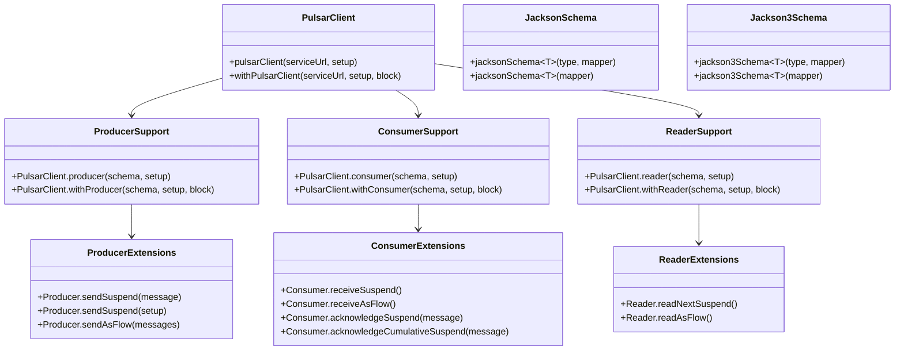

[한국어](./README.ko.md) | English

# bluetape4k-pulsar

Apache Pulsar client extensions for Kotlin — coroutine-first, DSL-friendly, Jackson2/Jackson3 schema support.

## Architecture



## Features

- **Coroutine-first**: All async operations wrapped as `suspend` functions via `awaitSuspending()`
- **DSL builders**: `withProducer {}`, `withConsumer {}`, `withReader {}` for scoped lifecycle management
- **Flow support**: `receiveAsFlow()`, `readAsFlow()`, `sendAsFlow()` for reactive pipelines
- **Jackson2 schema**: `jacksonSchema<T>()` using `com.fasterxml.jackson.databind.ObjectMapper`
- **Jackson3 schema**: `jackson3Schema<T>()` using `tools.jackson.databind.ObjectMapper`
- **Cancellation-safe**: Pending `CompletableFuture` is cancelled on coroutine cancellation

## Dependency

```kotlin
// build.gradle.kts
dependencies {
    implementation(project(":bluetape4k-pulsar"))

    // Optional: for jacksonSchema<T>()
    implementation(project(":bluetape4k-jackson2"))

    // Optional: for jackson3Schema<T>()
    implementation(project(":bluetape4k-jackson3"))
}
```

## Examples

### Client lifecycle

```kotlin
withPulsarClient("pulsar://localhost:6650") {
    // PulsarClient available as `this`
    withProducer(Schema.STRING, { topic("orders") }) {
        sendSuspend("order-1")
    }
}
```

### Producer

```kotlin
val client = pulsarClient("pulsar://localhost:6650")

// Simple send
client.withProducer(Schema.STRING, { topic("events") }) {
    val msgId = sendSuspend("hello")
}

// DSL message builder
client.withProducer(Schema.STRING, { topic("events") }) {
    sendSuspend {
        value("order placed")
        key("order-42")
        property("version", "1")
    }
}

// Flow-based batch send
val producer = client.producer(Schema.STRING) { topic("events") }
producer.sendAsFlow(items.asFlow()).collect { msgId -> log.debug { "sent: $msgId" } }
```

### Consumer

```kotlin
client.withConsumer(Schema.STRING, {
    topic("events")
    subscriptionName("my-service")
    subscriptionType(SubscriptionType.Exclusive)
}) {
    // Receive one message
    val msg = receiveSuspend()
    acknowledgeSuspend(msg)

    // Infinite stream (cancel to stop)
    receiveAsFlow()
        .map { msg -> process(msg.value).also { acknowledgeSuspend(msg) } }
        .collect()
}
```

### Reader (no subscription, no ack)

```kotlin
client.withReader(Schema.STRING, {
    topic("events")
    startMessageId(MessageId.earliest)
}) {
    // Read all available messages
    readAsFlow().collect { msg -> println(msg.value) }
}
```

### Custom JSON Schema

```kotlin
data class Order(val id: String, val amount: Int)

// Jackson2
val schema = jacksonSchema<Order>()

// Jackson3
val schema3 = jackson3Schema<Order>()

val producer = client.newProducer(schema).topic("orders").create()
producer.sendSuspend(Order("order-1", 9900))
```

## Compression

Use Pulsar's native `CompressionType` in the producer builder:

```kotlin
client.withProducer(Schema.STRING, {
    topic("events")
    compressionType(CompressionType.LZ4)
}) {
    sendSuspend("compressed message")
}
```

## Notes

- `acknowledgeCumulativeSuspend` is only valid for `Exclusive`/`Failover` subscriptions. Calling it on `Shared` throws `PulsarClientException`.
- `receiveAsFlow()` is infinite — use `take(n)`, `takeWhile {}`, or coroutine cancellation to stop it.
- `readAsFlow()` terminates when `hasMessageAvailable()` returns `false`.
- Jackson2 and Jackson3 are `compileOnly` dependencies — declare `implementation` in consuming modules.
