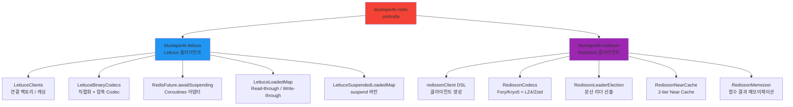
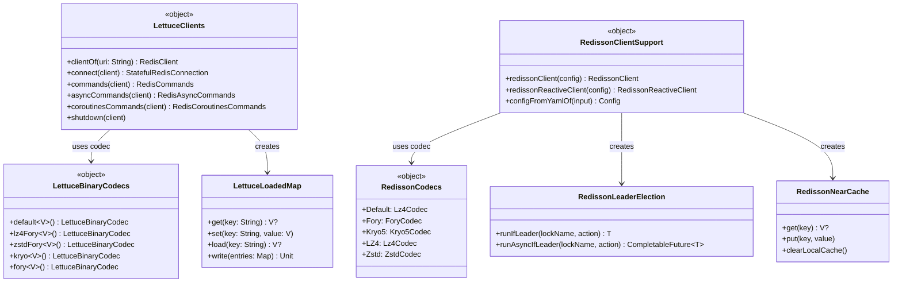

# bluetape4k-redis

[English](./README.md) | 한국어

Lettuce와 Redisson 두 Redis 클라이언트를 함께 제공하는 **umbrella 모듈**입니다. 기존 코드가 `bluetape4k-redis`를 의존하던 경우 변경 없이 계속 사용할 수 있습니다.

## 모듈 구조

```
infra/redis (umbrella)
├── infra/lettuce      — Lettuce 클라이언트, 고성능 Codec, RedisFuture → Coroutines 어댑터
└── infra/redisson     — Redisson 클라이언트, Codec, Memorizer, NearCache, Leader Election
```

Spring Data Redis 직렬화가 필요하면 `spring/data-redis` 모듈을 별도로 사용하세요.

## 의존성

### 전체 포함 (umbrella)

```kotlin
dependencies {
    implementation("io.github.bluetape4k:bluetape4k-redis:$bluetape4kVersion")
}
```

### 필요한 클라이언트만 선택

```kotlin
dependencies {
    // Lettuce만 사용
    implementation("io.github.bluetape4k:bluetape4k-lettuce:$bluetape4kVersion")

    // Redisson만 사용
    implementation("io.github.bluetape4k:bluetape4k-redisson:$bluetape4kVersion")

    // Spring Data Redis Serializer
    implementation("io.github.bluetape4k:bluetape4k-spring-data-redis:$bluetape4kVersion")
}
```

## 하위 모듈 상세

### [bluetape4k-lettuce](../lettuce/README.ko.md)

Lettuce 기반 고성능 Redis 클라이언트 확장입니다.

- `LettuceClients` — `RedisClient` / `StatefulRedisConnection` 팩토리 및 커넥션 캐싱
- `LettuceBinaryCodecs` — 직렬화(Jdk/Kryo/Fory) × 압축(GZip/LZ4/Snappy/Zstd) 조합 Codec
- `LettuceProtobufCodecs` — Protobuf 기반 Codec
- `RedisFuture.awaitSuspending()` — `RedisFuture` → suspend 함수 변환

```kotlin
import io.bluetape4k.redis.lettuce.LettuceClients
import io.bluetape4k.redis.lettuce.codec.LettuceBinaryCodecs
import io.bluetape4k.redis.lettuce.awaitSuspending

val client = LettuceClients.clientOf("redis://localhost:6379")

// Coroutines 명령
val commands = LettuceClients.coroutinesCommands(client)
val value = commands.get("key")

// 고성능 Codec으로 객체 저장
val codec = LettuceBinaryCodecs.lz4Fory<MyData>()
val typedCommands = LettuceClients.commands(client, codec)
typedCommands.set("data:1", MyData(id = 1))

// RedisFuture → suspend
val asyncResult = LettuceClients.asyncCommands(client).get("key").awaitSuspending()

LettuceClients.shutdown(client)
```

### [bluetape4k-redisson](../redisson/README.ko.md)

Redisson 기반 분산 Redis 확장입니다.

- `redissonClient {}` DSL — `RedissonClient` 생성
- `RedissonCodecs` — 직렬화(Kryo5/Fory/Jdk/Protobuf) × 압축(GZip/LZ4/Snappy/Zstd) Codec
- `RFuture.awaitSuspending()` — `RFuture` → suspend 함수 변환
- `RedissonMemorizer` / `AsyncRedissonMemorizer` / `RedissonSuspendMemorizer` — Redis 기반 함수 결과 메모이제이션
- `RedissonNearCache` — `RLocalCachedMap` 기반 2-tier Near Cache
- `RedissonLeaderElection` / `RedissonLeaderGroupElection` — 분산 리더 선출 (Coroutines 지원)

```kotlin
import io.bluetape4k.redis.redisson.redissonClient
import io.bluetape4k.redis.redisson.codec.RedissonCodecs
import io.bluetape4k.redis.redisson.memorizer.memorizer

// 클라이언트 생성
val client = redissonClient {
    useSingleServer().address = "redis://localhost:6379"
    codec = RedissonCodecs.LZ4Fory
}

// Memorizer — 함수 결과를 Redis에 캐싱
val map = client.getMap<Int, Int>("squares")
val memorizer = map.memorizer { key -> key * key }
val result = memorizer(7)   // 49, Redis에 저장

// Leader Election
val election = RedissonLeaderElection(client, "batch-lock")
election.runIfLeader {
    runBatchJob()
}
```

## 모듈 의존성 구조



## 핵심 클래스 다이어그램



## Spring Data Redis

다음 별도 모듈에서 `RedisTemplate` / `ReactiveRedisTemplate` 설정용 고성능 Serializer를 제공합니다.

- [bluetape4k-spring-boot3-redis](../../spring-boot3/redis/README.ko.md)
- [bluetape4k-spring-boot4-redis](../../spring-boot4/redis/README.ko.md)

```kotlin
import io.bluetape4k.redis.spring.serializer.RedisBinarySerializers
import io.bluetape4k.redis.spring.serializer.redisSerializationContext

@Bean
fun reactiveRedisTemplate(
    factory: ReactiveRedisConnectionFactory,
): ReactiveRedisTemplate<String, Any> {
    val context = redisSerializationContext<String, Any> {
        key(RedisSerializer.string())
        value(RedisBinarySerializers.LZ4Fory)
        hashKey(RedisSerializer.string())
        hashValue(RedisBinarySerializers.LZ4Fory)
    }
    return ReactiveRedisTemplate(factory, context)
}
```

## 테스트

```bash
# 전체 redis 모듈 테스트
./gradlew :bluetape4k-redis:test

# 하위 모듈 개별 테스트
./gradlew :bluetape4k-lettuce:test
./gradlew :bluetape4k-redisson:test
```

테스트에는 Redis 서버가 필요하며, [Testcontainers](../../testing/testcontainers)를 통해 자동 구성됩니다.

## 참고 자료

- [Lettuce 공식 문서](https://lettuce.io/core/release/reference/)
- [Redisson Wiki](https://github.com/redisson/redisson/wiki)
- [Spring Data Redis 문서](https://docs.spring.io/spring-data/redis/docs/current/reference/html/)
