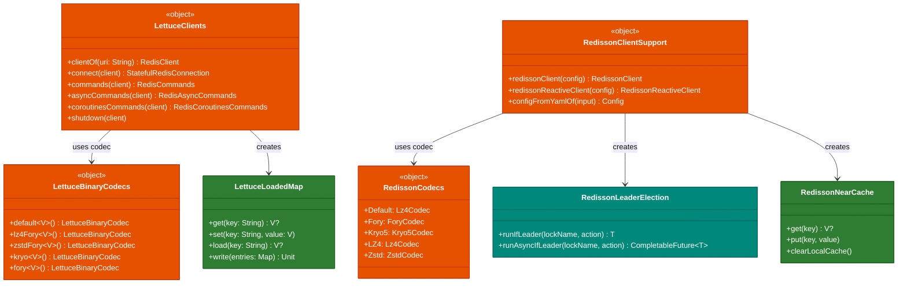

# bluetape4k-redis

English | [한국어](./README.ko.md)

An **umbrella module** that bundles both the Lettuce and Redisson Redis clients. Existing code depending on
`bluetape4k-redis` continues to work without modification.

## Module Structure

```
infra/redis (umbrella)
├── infra/lettuce      — Lettuce client, high-performance codecs, RedisFuture → Coroutines adapter
└── infra/redisson     — Redisson client, codecs, Memorizer, NearCache, Leader Election
```

For Spring Data Redis serialization, use the `spring/data-redis` module separately.

## Dependency

### Full Bundle (umbrella)

```kotlin
dependencies {
    implementation("io.github.bluetape4k:bluetape4k-redis:$bluetape4kVersion")
}
```

### Selective Client Dependencies

```kotlin
dependencies {
    // Lettuce only
    implementation("io.github.bluetape4k:bluetape4k-lettuce:$bluetape4kVersion")

    // Redisson only
    implementation("io.github.bluetape4k:bluetape4k-redisson:$bluetape4kVersion")

    // Spring Data Redis Serializer
    implementation("io.github.bluetape4k:bluetape4k-spring-data-redis:$bluetape4kVersion")
}
```

## Submodule Details

### [bluetape4k-lettuce](../lettuce/README.md)

High-performance Redis client extension based on Lettuce.

- `LettuceClients` — `RedisClient` / `StatefulRedisConnection` factory with connection caching
- `LettuceBinaryCodecs` — Codec combinations: serializers (Jdk/Kryo/Fory) × compression (GZip/LZ4/Snappy/Zstd)
- `LettuceProtobufCodecs` — Protobuf-based codecs
- `RedisFuture.awaitSuspending()` — Converts `RedisFuture` to a suspend function

```kotlin
import io.bluetape4k.redis.lettuce.LettuceClients
import io.bluetape4k.redis.lettuce.codec.LettuceBinaryCodecs
import io.bluetape4k.redis.lettuce.awaitSuspending

val client = LettuceClients.clientOf("redis://localhost:6379")

// Coroutine commands
val commands = LettuceClients.coroutinesCommands(client)
val value = commands.get("key")

// Store objects with high-performance codec
val codec = LettuceBinaryCodecs.lz4Fory<MyData>()
val typedCommands = LettuceClients.commands(client, codec)
typedCommands.set("data:1", MyData(id = 1))

// RedisFuture → suspend
val asyncResult = LettuceClients.asyncCommands(client).get("key").awaitSuspending()

LettuceClients.shutdown(client)
```

### [bluetape4k-redisson](../redisson/README.md)

Distributed Redis extension based on Redisson.

- `redissonClient {}` DSL — Creates a `RedissonClient`
- `RedissonCodecs` — Codec combinations: serializers (Kryo5/Fory/Jdk/Protobuf) × compression (GZip/LZ4/Snappy/Zstd)
- `RFuture.awaitSuspending()` — Converts `RFuture` to a suspend function
- `RedissonMemorizer` / `AsyncRedissonMemorizer` / `RedissonSuspendMemorizer` — Redis-based function result memoization
- `RedissonNearCache` — 2-tier Near Cache based on `RLocalCachedMap`
- `RedissonLeaderElection` / `RedissonLeaderGroupElection` — Distributed leader election (with Coroutines support)

```kotlin
import io.bluetape4k.redis.redisson.redissonClient
import io.bluetape4k.redis.redisson.codec.RedissonCodecs
import io.bluetape4k.redis.redisson.memorizer.memorizer

// Create client
val client = redissonClient {
    useSingleServer().address = "redis://localhost:6379"
    codec = RedissonCodecs.LZ4Fory
}

// Memorizer — caches function results in Redis
val map = client.getMap<Int, Int>("squares")
val memorizer = map.memorizer { key -> key * key }
val result = memorizer(7)   // 49, stored in Redis

// Leader Election
val election = RedissonLeaderElection(client, "batch-lock")
election.runIfLeader {
    runBatchJob()
}
```

## Module Dependency Structure

```mermaid
flowchart TD
    A[bluetape4k-redis<br/>umbrella] --> B[bluetape4k-lettuce<br/>Lettuce client]
    A --> C[bluetape4k-redisson<br/>Redisson client]

    B --> B1[LettuceClients<br/>Connection factory / caching]
    B --> B2["LettuceBinaryCodecs<br/>Serializer × compression codecs"]
    B --> B3[RedisFuture.awaitSuspending<br/>Coroutines adapter]
    B --> B4[LettuceLoadedMap<br/>Read-through / Write-through]
    B --> B5[LettuceSuspendedLoadedMap<br/>Suspend variant]

    C --> C1[redissonClient DSL<br/>Client creation]
    C --> C2["RedissonCodecs<br/>Fory/Kryo5 × LZ4/Zstd"]
    C --> C3[RedissonLeaderElection<br/>Distributed leader election]
    C --> C4[RedissonNearCache<br/>2-tier Near Cache]
    C --> C5[RedissonMemoizer<br/>Function result memoization]

    classDef umbrellaStyle fill:#1565C0,stroke:#0D47A1,color:#FFFFFF
    classDef lettuceStyle fill:#00897B,stroke:#00695C,color:#FFFFFF
    classDef redissonStyle fill:#6A1B9A,stroke:#4A148C,color:#FFFFFF

    style A fill:#1565C0,stroke:#0D47A1,color:#FFFFFF
    style B fill:#00897B,stroke:#00695C,color:#FFFFFF
    style C fill:#6A1B9A,stroke:#4A148C,color:#FFFFFF
    style B1 fill:#00897B,stroke:#00695C,color:#FFFFFF
    style B2 fill:#00897B,stroke:#00695C,color:#FFFFFF
    style B3 fill:#6A1B9A,stroke:#4A148C,color:#FFFFFF
    style B4 fill:#2E7D32,stroke:#1B5E20,color:#FFFFFF
    style B5 fill:#2E7D32,stroke:#1B5E20,color:#FFFFFF
    style C1 fill:#6A1B9A,stroke:#4A148C,color:#FFFFFF
    style C2 fill:#6A1B9A,stroke:#4A148C,color:#FFFFFF
    style C3 fill:#E65100,stroke:#BF360C,color:#FFFFFF
    style C4 fill:#2E7D32,stroke:#1B5E20,color:#FFFFFF
    style C5 fill:#E65100,stroke:#BF360C,color:#FFFFFF
```



## Core Class Diagram



## Spring Data Redis

The following separate modules provide high-performance serializers for configuring
`RedisTemplate` / `ReactiveRedisTemplate`.

- [bluetape4k-spring-boot3-redis](../../spring-boot3/redis/README.md)
- [bluetape4k-spring-boot4-redis](../../spring-boot4/redis/README.md)

```kotlin
import io.bluetape4k.redis.spring.serializer.RedisBinarySerializers
import io.bluetape4k.redis.spring.serializer.redisSerializationContext

@Bean
fun reactiveRedisTemplate(
    factory: ReactiveRedisConnectionFactory,
): ReactiveRedisTemplate<String, Any> {
    val context = redisSerializationContext<String, Any> {
        key(RedisSerializer.string())
        value(RedisBinarySerializers.LZ4Fory)
        hashKey(RedisSerializer.string())
        hashValue(RedisBinarySerializers.LZ4Fory)
    }
    return ReactiveRedisTemplate(factory, context)
}
```

## Testing

```bash
# Run all redis module tests
./gradlew :bluetape4k-redis:test

# Run submodule tests individually
./gradlew :bluetape4k-lettuce:test
./gradlew :bluetape4k-redisson:test
```

Tests require a Redis server, which is automatically provisioned via [Testcontainers](../../testing/testcontainers).

## References

- [Lettuce Official Documentation](https://lettuce.io/core/release/reference/)
- [Redisson Wiki](https://github.com/redisson/redisson/wiki)
- [Spring Data Redis Documentation](https://docs.spring.io/spring-data/redis/docs/current/reference/html/)
