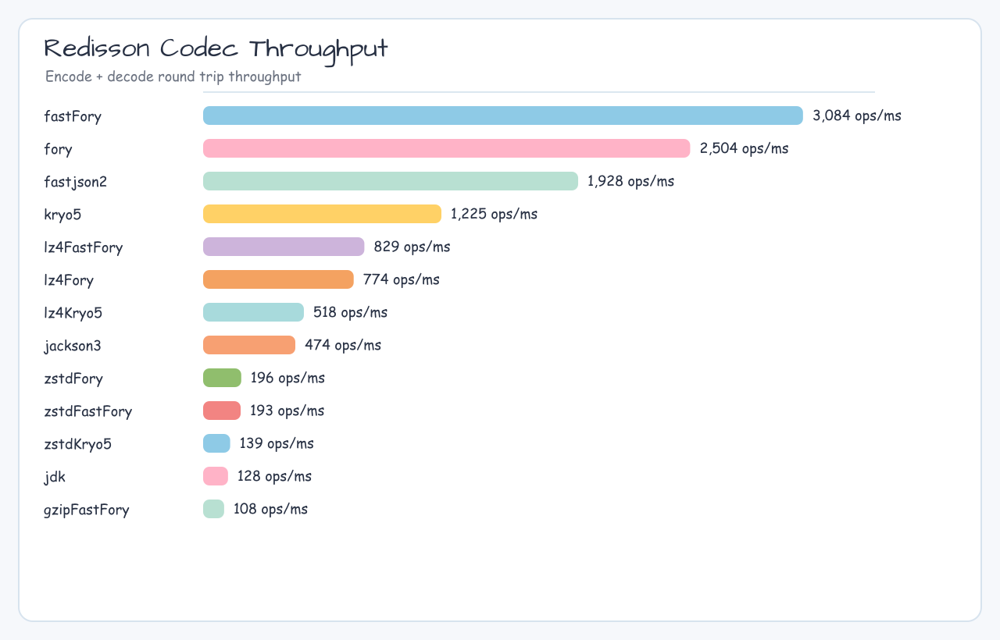

# Redisson 코덱 벤치마크

[English](./Benchmark.md) | 한국어

kotlinx-benchmark(JMH)를 이용한 Redisson Redis 코덱 직렬화/역직렬화 성능 측정 결과입니다.

## 측정 개요

- **대상 코덱**: fastFory, fory, kryo5, fastjson2, jackson3, LZ4+FastFory, LZ4+Fory, LZ4+Kryo5, Zstd+FastFory, Zstd+Fory, Zstd+Kryo5, JDK, Gzip+FastFory
- **측정 지표**: 처리량 — encode + decode 왕복 ops/ms
- **페이로드**: `BenchmarkData` 객체 (ID, 이름, 값, 태그 목록)
- **모드**: `@BenchmarkMode(Mode.Throughput)`, `@OutputTimeUnit(TimeUnit.MILLISECONDS)`

## 실행 방법

```bash
./gradlew :bluetape4k-redisson:benchmark
```

---

## 결과

### 요약 표 (처리량: ops/ms, 높을수록 좋음)

| 순위 | 코덱 | ops/ms | ± 오차 | 비고 |
|------|------|--------|--------|------|
| 🥇 | **fastFory** | **3,084** | ± 287 | |
| 🥈 | **fory** | **2,504** | ± 105 | |
| 🥉 | **fastjson2** | **1,928** | ± 62 | |
| 4 | kryo5 | 1,225 | ± 67 | |
| 5 | lz4FastFory | 829 | ± 71 | |
| 6 | lz4Fory | 774 | ± 42 | |
| 7 | lz4Kryo5 | 518 | ± 114 | ⚠️ 분산 높음 |
| 8 | jackson3 | 474 | ± 25 | |
| 9 | zstdFory | 196 | ± 7 | |
| 10 | zstdFastFory | 193 | ± 62 | ⚠️ 분산 높음 |
| 11 | zstdKryo5 | 139 | ± 5 | |
| 12 | jdk | 128 | ± 14 | |
| 13 | gzipFastFory | 108 | ± 1 | |

### JMH 상세 출력

```
Benchmark                                         Mode  Cnt     Score     Error   Units
RedissonCodecBenchmark.fastForyEncodeDecode      thrpt    5  3084.350 ± 287.457  ops/ms
RedissonCodecBenchmark.foryEncodeDecode          thrpt    5  2503.608 ± 104.512  ops/ms
RedissonCodecBenchmark.fastjson2EncodeDecode     thrpt    5  1928.194 ±  62.493  ops/ms
RedissonCodecBenchmark.kryo5EncodeDecode         thrpt    5  1225.002 ±  67.327  ops/ms
RedissonCodecBenchmark.lz4FastForyEncodeDecode   thrpt    5   829.228 ±  70.682  ops/ms
RedissonCodecBenchmark.lz4ForyEncodeDecode       thrpt    5   773.952 ±  41.811  ops/ms
RedissonCodecBenchmark.lz4Kryo5EncodeDecode      thrpt    5   517.606 ± 113.607  ops/ms
RedissonCodecBenchmark.jackson3EncodeDecode      thrpt    5   473.605 ±  24.813  ops/ms
RedissonCodecBenchmark.zstdForyEncodeDecode      thrpt    5   195.758 ±   6.659  ops/ms
RedissonCodecBenchmark.zstdFastForyEncodeDecode  thrpt    5   192.797 ±  62.447  ops/ms
RedissonCodecBenchmark.zstdKryo5EncodeDecode     thrpt    5   139.149 ±   4.666  ops/ms
RedissonCodecBenchmark.jdkEncodeDecode           thrpt    5   127.715 ±  13.625  ops/ms
RedissonCodecBenchmark.gzipFastForyEncodeDecode  thrpt    5   107.558 ±   0.963  ops/ms
```

### Performance Chart



---

## 분석

### 핵심 발견

#### 1. fastFory — 압도적 1위

- 점수: **3,084 ops/ms** (1위) — 안정적, 낮은 분산 (±287, ~9%)
- Apache Fory의 빠른 JIT 코드 생성 경로 (참조 추적 없음) 사용
- Redisson 배포 시 **기본 코덱으로 권장**

#### 2. fory — 강력한 대안

- 점수: **2,504 ops/ms** (2위), 오차 ±105 (~4%)
- 완전한 참조 추적 변형 — 복잡한 객체 그래프에 더 안전
- 객체 그래프에 순환 참조 또는 공유 참조가 있을 때 fastFory 대신 사용

#### 3. fastjson2 — 예상 밖의 순위

- 점수: **1,928 ops/ms** (3위) — Lettuce 대비 **현저히 낮음** (6,379 ops/ms)
- Redisson은 Netty `ByteBuf` API 사용, Lettuce는 NIO `ByteBuffer` 사용 — 할당/복사 경로 차이
- JSON 상호운용성 시나리오에서는 여전히 유효

#### 4. kryo5 — 레거시 최강자

- 점수: **1,225 ops/ms** (4위), 오차 ±67 (~5%)
- Lettuce 벤치마크의 kryo 대비 향상된 JIT 코드 생성으로 우위
- Java 생태계 직렬화 호환성이 필요한 경우 적합

#### 5. LZ4 압축 변형 (5~8위)

- lz4FastFory(829) > lz4Fory(774) > lz4Kryo5(518) > jackson3(474)
- LZ4는 비압축 대응 코덱 대비 약 350–2,250 ops/ms 오버헤드 추가
- Redis 메모리가 병목일 때 사용

#### 6. Zstd / Gzip — 압축 우선 (~100–200 ops/ms)

- 모든 Zstd 변형: 130–200 ops/ms — fastFory 대비 **15–28배 느림**
- **저빈도 대용량 페이로드** 저장 (>50KB 객체)에 적합

### 비교: Redisson vs Lettuce 코덱

| 코덱 | Redisson (ops/ms) | Lettuce (ops/ms) | 차이 |
|------|------------------|-----------------|------|
| fastFory | **3,084** | 3,286 | −6% |
| fory | **2,504** | 2,551 | −2% |
| fastjson2 | 1,928 | **6,379** | **−70%** |
| kryo/kryo5 | 1,225 | 963 | +27% |
| jackson3 | 474 | 834 | −43% |
| lz4FastFory | 829 | 906 | −8% |
| jdk | 128 | 132 | −3% |

**핵심 관찰**: fastjson2는 Lettuce에서 Redisson 대비 3.3배 빠릅니다. 원인: Lettuce는 NIO `ByteBuffer`, Redisson은 Netty `ByteBuf` 사용 — fastjson2의 내부 다이렉트 버퍼 최적화가 NIO 버퍼에서 더 잘 작동합니다. 바이너리 코덱 (fastFory, fory, kryo)은 두 라이브러리에서 동등한 성능을 보입니다.

### 코덱 선택 가이드

| 시나리오 | 권장 코덱 | 이유 |
|---------|---------|------|
| 최대 처리량 | **fastFory** | Redisson 환경 최고 속도 |
| 복잡한 객체 그래프 | fory | 참조 추적 지원 |
| Kryo 생태계 | kryo5 | 최고의 Kryo 변형 |
| JSON 상호운용성 | jackson3 | JSON — 사람이 읽을 수 있음 |
| Redis 메모리 제약 | lz4FastFory | 압축+속도 균형 |
| 대용량 페이로드 (>10KB) | zstdFory | 최고 압축률 |

---

## 벤치마크 환경

| 항목 | 값 |
|------|---|
| **CPU** | Apple M4 Pro (12코어) |
| **RAM** | 48 GB |
| **OS** | macOS 26.4.1 (Darwin 25.4.0) |
| **JVM** | Oracle GraalVM 21.0.11+9.1 |
| **Kotlin** | 2.3 |
| **kotlinx-benchmark** | 0.4.15 |
| **JMH** | 1.37 |
| **Warmup** | 3회 × 2초 |
| **측정** | 5회 × 3초 |
| **Fork** | 1 |
| **스레드** | 1 |
| **모드** | Throughput (ops/ms) |
| **측정일** | 2026-04-27 |
