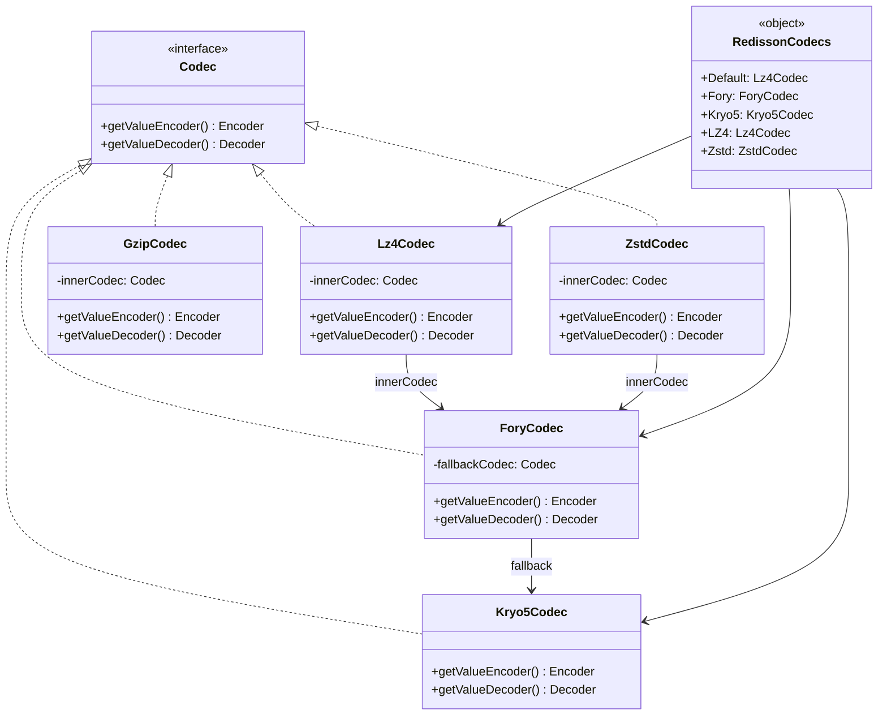
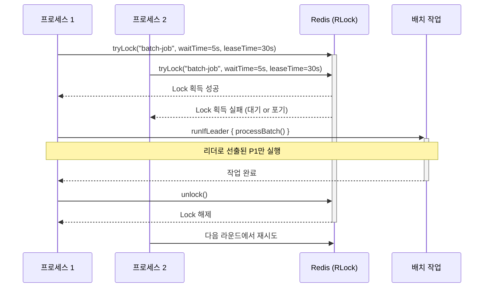
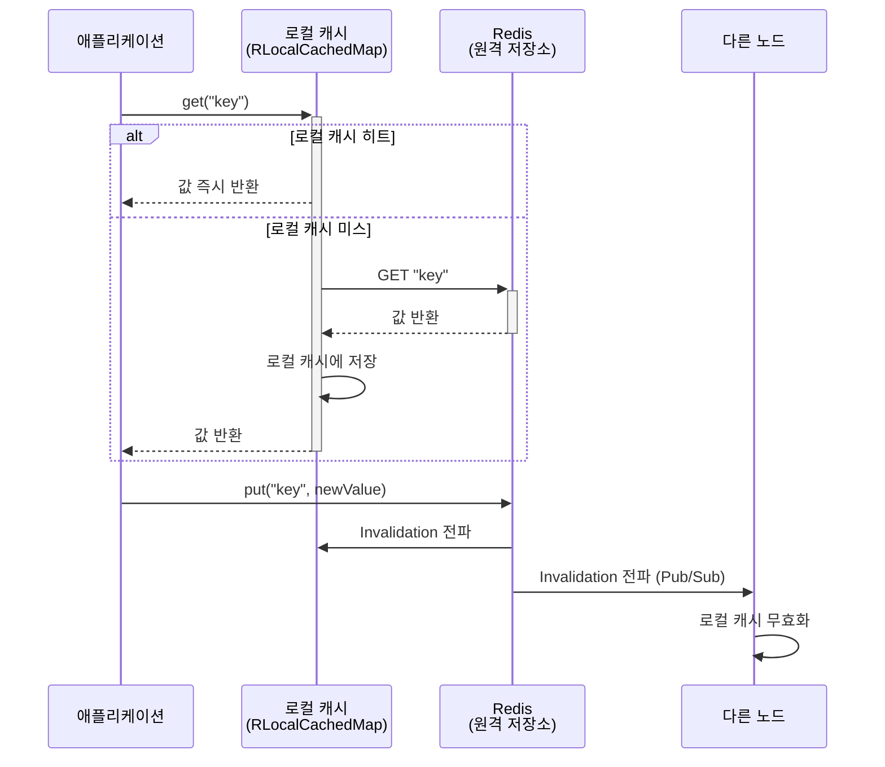
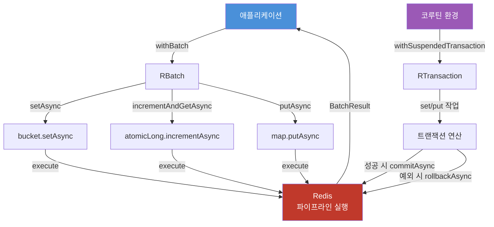

# bluetape4k-redisson

Redisson Redis 클라이언트를 Kotlin에서 편리하게 사용할 수 있도록 확장한 모듈입니다. DSL 방식의 클라이언트 생성, 고성능 Codec, Kotlin Coroutines 지원, 분산 리더 선출, NearCache 기능을 제공합니다.

## 주요 기능

| 기능 | 설명 |
|------|------|
| `RedissonClientSupport` | DSL 기반 `RedissonClient` / `RedissonReactiveClient` 팩토리, YAML 설정 로드 |
| `RedissonClientExtensions` | `withBatch {}`, `withTransaction {}` DSL 확장 함수 |
| `RedissonClientCoroutine` | `withSuspendedBatch {}`, `withSuspendedTransaction {}` suspend 확장 함수 |
| `RFutureSupport` | `Collection<RFuture>.awaitAll()`, `Iterable<RFuture>.sequence()` Coroutines 어댑터 |
| `RedissonCodecs` | 직렬화(Fory/Kryo5) × 압축(LZ4/Zstd/Snappy/GZip) 조합 Codec 목록 |
| `RedissonLeaderElection` | `RLock` 기반 단일 리더 선출 (동기 / 비동기) |
| `RedissonSuspendLeaderElection` | `RLock` 기반 단일 리더 선출 (Coroutines) |
| `RedissonLeaderGroupElection` | `RSemaphore` 기반 복수(N개) 동시 리더 선출 |
| `RedissonNearCache` | `RLocalCachedMap` 기반 2-tier Near Cache |

## 의존성

```kotlin
// build.gradle.kts
dependencies {
    implementation("io.github.bluetape4k:bluetape4k-redisson:$bluetape4kVersion")

    // Codec 선택적 의존성 (사용하는 항목만 추가)
    runtimeOnly("org.apache.fury:fury-kotlin")        // Fory 직렬화
    runtimeOnly("com.esotericsoftware:kryo")           // Kryo5 직렬화
    runtimeOnly("org.lz4:lz4-java")                   // LZ4 압축
    runtimeOnly("com.github.luben:zstd-jni")          // Zstd 압축
    runtimeOnly("org.xerial.snappy:snappy-java")       // Snappy 압축
    runtimeOnly("org.apache.commons:commons-compress") // GZip 압축
}
```

## 사용 예시

### 1. RedissonClient 생성

#### DSL 방식

```kotlin
import io.bluetape4k.redis.redisson.redissonClient
import io.bluetape4k.redis.redisson.redissonReactiveClient

// 단일 서버
val client = redissonClient {
    useSingleServer().address = "redis://localhost:6379"
}

// Reactive 클라이언트
val reactive = redissonReactiveClient {
    useSingleServer().address = "redis://localhost:6379"
}

client.shutdown()
```

#### YAML 설정 파일 방식

```kotlin
import io.bluetape4k.redis.redisson.configFromYamlOf
import io.bluetape4k.redis.redisson.redissonClientOf
import io.bluetape4k.redis.redisson.codec.RedissonCodecs

// InputStream, String, File, URL 모두 지원
val config = configFromYamlOf(
    input = File("redisson.yaml").inputStream(),
    codec = RedissonCodecs.Default,  // 선택적 Codec 지정 (기본: RedissonCodecs.Default)
)
val client = redissonClientOf(config)
```

`redisson.yaml` 예시:

```yaml
singleServerConfig:
  address: "redis://localhost:6379"
  connectionPoolSize: 64
  connectionMinimumIdleSize: 24
```

---

### 2. Codec

`io.bluetape4k.redis.redisson.codec` 패키지에서 고성능 Codec을 제공합니다.

| 상수 | 직렬화 | 압축 | 설명 |
|------|--------|------|------|
| `RedissonCodecs.Default` | Fory (fallback: Kryo5) | LZ4 | 기본값. 빠른 속도와 압축 균형 |
| `RedissonCodecs.Fory` | Fory | 없음 | Fory 직렬화만 사용 |
| `RedissonCodecs.Kryo5` | Kryo5 | 없음 | Kryo5 직렬화만 사용 |
| `RedissonCodecs.LZ4` | Default | LZ4 | LZ4 압축 래핑 |
| `RedissonCodecs.Zstd` | Default | Zstd | 높은 압축률 |

```kotlin
import io.bluetape4k.redis.redisson.codec.RedissonCodecs
import io.bluetape4k.redis.redisson.codec.ForyCodec
import io.bluetape4k.redis.redisson.codec.Lz4Codec

val client = redissonClient {
    useSingleServer().address = "redis://localhost:6379"
    codec = RedissonCodecs.Default   // Fory + LZ4 조합
}

// 직접 조합도 가능
val customCodec = Lz4Codec(innerCodec = ForyCodec())
```

Codec 클래스:

- `ForyCodec` — Apache Fory 직렬화. 직렬화 실패 시 fallback Codec(Kryo5)으로 자동 전환
- `Lz4Codec` — LZ4 압축 래퍼. `innerCodec`으로 감쌈
- `ZstdCodec` — Zstd 압축 래퍼
- `GzipCodec` — GZip 압축 래퍼

---

### 3. Batch / Transaction

#### Batch — 네트워크 왕복 최소화

```kotlin
import io.bluetape4k.redis.redisson.withBatch

val result = client.withBatch {
    getBucket<String>("key1").setAsync("value1")
    getBucket<String>("key2").setAsync("value2")
    getAtomicLong("counter").incrementAndGetAsync()
}
```

#### Transaction — 원자적 실행

```kotlin
import io.bluetape4k.redis.redisson.withTransaction

client.withTransaction {
    getBucket<String>("account:balance").set("1000")
    getMap<String, Int>("ledger").put("tx-001", 500)
    // 블록 정상 종료 시 자동 commit, 예외 발생 시 자동 rollback
}
```

> **주의**: Coroutine 환경에서는 스레드 전환으로 트랜잭션이 깨질 수 있습니다. 아래 Coroutine 버전을 사용하세요.

---

### 4. Coroutine 지원

#### withSuspendedBatch / withSuspendedTransaction

```kotlin
import io.bluetape4k.redis.redisson.coroutines.withSuspendedBatch
import io.bluetape4k.redis.redisson.coroutines.withSuspendedTransaction

// suspend Batch
val result = client.withSuspendedBatch {
    getBucket<String>("key1").setAsync("value1")
    getAtomicLong("counter").incrementAndGetAsync()
}

// suspend Transaction
client.withSuspendedTransaction {
    getBucket<String>("key").set("value")
    // 정상 종료 시 commitAsync().await(), 예외 시 rollbackAsync().await()
}
```

#### RFuture Coroutine 변환

```kotlin
import io.bluetape4k.redis.redisson.coroutines.awaitAll
import io.bluetape4k.redis.redisson.coroutines.sequence

// 여러 RFuture를 suspend로 일괄 대기
val rfutures: List<RFuture<String>> = ids.map { rmap.getAsync(it) }
val results: List<String> = rfutures.awaitAll()   // suspend

// CompletableFuture로 변환 후 일괄 처리 (blocking)
val future: CompletableFuture<List<String>> = rfutures.sequence()
val values: List<String> = future.get()
```

---

### 5. Leader Election — 분산 리더 선출

#### 동기 버전

`RLock`을 기반으로 분산 환경에서 단 하나의 프로세스/스레드만 작업을 수행하도록 리더를 선출합니다.

```kotlin
import io.bluetape4k.redis.redisson.leader.RedissonLeaderElection
import io.bluetape4k.leader.LeaderElectionOptions
import java.time.Duration

val options = LeaderElectionOptions(
    waitTime = Duration.ofSeconds(5),
    leaseTime = Duration.ofSeconds(30),
)
val election = RedissonLeaderElection(client, options)

val result = election.runIfLeader("batch-job") {
    // 리더로 선출된 프로세스만 실행
    processBatch()
}

// RedissonClient 확장 함수로도 사용 가능
val result2 = client.runIfLeader("batch-job") {
    processBatch()
}

// 비동기 (CompletableFuture)
val future = client.runAsyncIfLeader("batch-job") {
    CompletableFuture.supplyAsync { processBatch() }
}
```

#### Coroutine 버전

```kotlin
import io.bluetape4k.redis.redisson.leader.RedissonSuspendLeaderElection

val election = RedissonSuspendLeaderElection(client, options)

val result = election.runIfLeader("batch-job") {
    delay(100)
    processData()
}

// RedissonClient 확장 함수로도 사용 가능
val result2 = client.suspendRunIfLeader("batch-job") {
    processData()
}
```

> **코루틴 Lock ID**: Redisson Lock은 스레드 ID 기반입니다. 코루틴 환경에서는 스레드가 전환되면 락이 깨질 수 있으므로, `RedissonSuspendLeaderElection`은 `RAtomicLong`으로 코루틴 세션마다 고유 ID를 발급하여 이 문제를 해결합니다.

#### 그룹 리더 선출 — 최대 N개 동시 실행

`RSemaphore` 기반으로 최대 N개 프로세스가 동시에 작업을 수행합니다.

```kotlin
import io.bluetape4k.redis.redisson.leader.RedissonLeaderGroupElection
import io.bluetape4k.leader.LeaderGroupElectionOptions

val options = LeaderGroupElectionOptions(
    maxLeaders = 3,                       // 최대 3개 동시 실행
    waitTime = Duration.ofSeconds(5),
)
val groupElection = RedissonLeaderGroupElection(client, options)

// 최대 3개 프로세스/스레드가 동시에 실행
val result = groupElection.runIfLeader("parallel-job") {
    processChunk()
}

// 상태 조회
val state = groupElection.state("parallel-job")
println("active=${state.activeCount}, available=${state.availableSlots}")

// 비동기 실행
val future = groupElection.runAsyncIfLeader("parallel-job") {
    CompletableFuture.supplyAsync { processChunk() }
}
```

---

### 6. NearCache

Redisson `RLocalCachedMap` 기반 2-tier Near Cache입니다. 로컬 캐시 우선 조회 후 없으면 Redis에서 조회합니다.

```kotlin
import io.bluetape4k.redis.redisson.nearcache.RedissonNearCache
import io.bluetape4k.redis.redisson.cache.RedisCacheConfig

val config = RedisCacheConfig()
val nearCache = RedissonNearCache<String, Any>("my-cache", client, config)

nearCache.put("key", "value")
val value = nearCache.get("key")   // 로컬 캐시에서 우선 조회
```

> JCache 기반의 고급 NearCache (RESP3 하이브리드, Resilient write-behind 등)는 `bluetape4k-cache-redisson` 모듈을 사용하세요.

---

## 아키텍처 다이어그램

### Codec 계층 구조



### 분산 리더 선출 시퀀스



### NearCache 2-Tier 캐시 흐름



### Batch / Transaction 처리 흐름



## Redis 버전 요구사항

| 기능 | 최소 Redis 버전 |
|------|----------------|
| 기본 기능 (Client, Batch, Transaction, Leader) | Redis 5.0+ |
| RESP3 / CLIENT TRACKING (`bluetape4k-cache-redisson`) | Redis 6.0+ |

## 빌드 및 테스트

테스트 실행 시 Redis 서버가 필요합니다. Testcontainers를 통해 자동 구성됩니다.

```bash
./gradlew :bluetape4k-redisson:test
```
