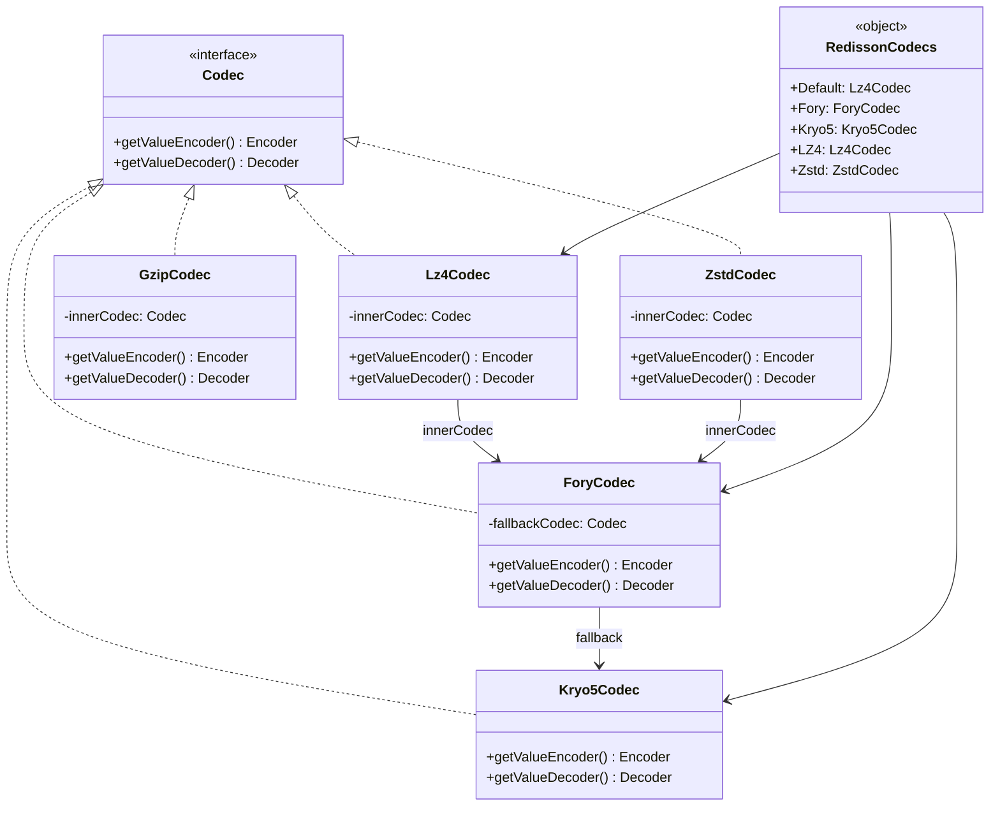
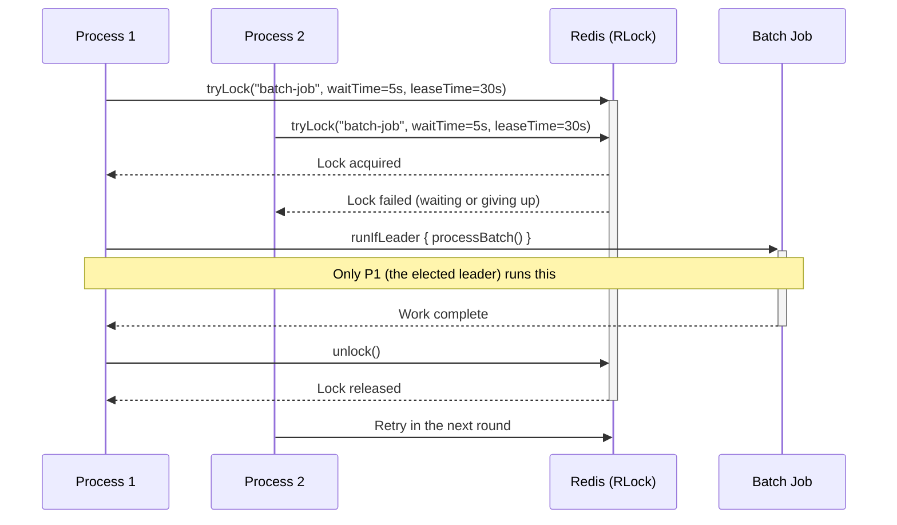
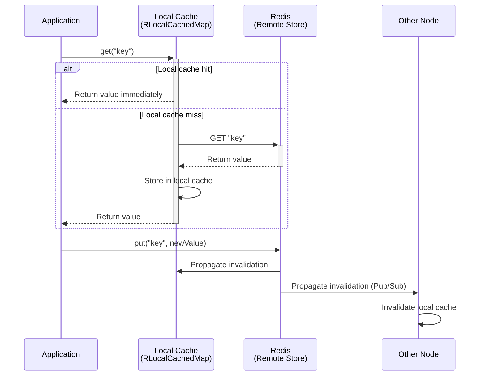
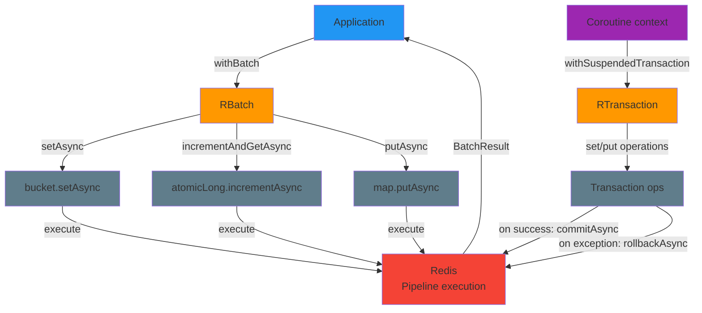

# bluetape4k-redisson

English | [한국어](./README.ko.md)

A Kotlin extension module for the Redisson Redis client, providing DSL-based client creation, high-performance codecs, Kotlin Coroutines support, distributed leader election, and NearCache functionality.

## Features

| Feature | Description |
|---------|-------------|
| `RedissonClientSupport` | DSL-based `RedissonClient` / `RedissonReactiveClient` factory, YAML config loading |
| `RedissonClientExtensions` | `withBatch {}`, `withTransaction {}` DSL extension functions |
| `RedissonClientCoroutine` | `withSuspendedBatch {}`, `withSuspendedTransaction {}` suspend extension functions |
| `RFutureSupport` | `Collection<RFuture>.awaitAll()`, `Iterable<RFuture>.sequence()` coroutine adapters |
| `RedissonCodecs` | Codec combinations: serializers (Fory/Kryo5) × compression (LZ4/Zstd/Snappy/GZip) |
| `RedissonLeaderElection` | `RLock`-based single-leader election (sync / async) |
| `RedissonSuspendLeaderElection` | `RLock`-based single-leader election (Coroutines) |
| `RedissonLeaderGroupElection` | `RSemaphore`-based group election for N concurrent leaders |
| `RedissonNearCache` | 2-tier Near Cache based on `RLocalCachedMap` |

When using `RedissonCacheConfig` / `RedissonNearCacheConfig`:
- `maxSize`, `nearCacheMaxSize`, and `writeBehindBatchSize` must not be negative; batch size must be greater than 0.
- `timeToLive`, `maxIdle`, `nearCacheTtl`, and `nearCacheMaxIdleTime` must not be negative when specified; near cache TTL/idle must be greater than 0.

## Dependency

```kotlin
// build.gradle.kts
dependencies {
    implementation("io.github.bluetape4k:bluetape4k-redisson:$bluetape4kVersion")

    // Optional codec dependencies (add only what you need)
    runtimeOnly("org.apache.fury:fury-kotlin")        // Fory serialization
    runtimeOnly("com.esotericsoftware:kryo")           // Kryo5 serialization
    runtimeOnly("org.lz4:lz4-java")                   // LZ4 compression
    runtimeOnly("com.github.luben:zstd-jni")          // Zstd compression
    runtimeOnly("org.xerial.snappy:snappy-java")       // Snappy compression
    runtimeOnly("org.apache.commons:commons-compress") // GZip compression
}
```

## Usage Examples

### 1. Creating a RedissonClient

#### DSL Style

```kotlin
import io.bluetape4k.redis.redisson.redissonClient
import io.bluetape4k.redis.redisson.redissonReactiveClient

// Single server
val client = redissonClient {
    useSingleServer().address = "redis://localhost:6379"
}

// Reactive client
val reactive = redissonReactiveClient {
    useSingleServer().address = "redis://localhost:6379"
}

client.shutdown()
```

#### YAML Configuration File

```kotlin
import io.bluetape4k.redis.redisson.configFromYamlOf
import io.bluetape4k.redis.redisson.redissonClientOf
import io.bluetape4k.redis.redisson.codec.RedissonCodecs

// Supports InputStream, String, File, and URL
val config = configFromYamlOf(
    input = File("redisson.yaml").inputStream(),
    codec = RedissonCodecs.Default,  // Optional codec (default: RedissonCodecs.Default)
)
val client = redissonClientOf(config)
```

Example `redisson.yaml`:

```yaml
singleServerConfig:
  address: "redis://localhost:6379"
  connectionPoolSize: 64
  connectionMinimumIdleSize: 24
```

---

### 2. Codecs

High-performance codecs are available in the `io.bluetape4k.redis.redisson.codec` package.

| Constant | Serializer | Compression | Description |
|----------|------------|-------------|-------------|
| `RedissonCodecs.Default` | Fory (fallback: Kryo5) | LZ4 | Default. Balances speed and compression |
| `RedissonCodecs.Fory` | Fory | None | Fory serialization only |
| `RedissonCodecs.Kryo5` | Kryo5 | None | Kryo5 serialization only |
| `RedissonCodecs.LZ4` | Default | LZ4 | LZ4 compression wrapper |
| `RedissonCodecs.Zstd` | Default | Zstd | High compression ratio |

```kotlin
import io.bluetape4k.redis.redisson.codec.RedissonCodecs
import io.bluetape4k.redis.redisson.codec.ForyCodec
import io.bluetape4k.redis.redisson.codec.Lz4Codec

val client = redissonClient {
    useSingleServer().address = "redis://localhost:6379"
    codec = RedissonCodecs.Default   // Fory + LZ4 combination
}

// You can also compose codecs manually
val customCodec = Lz4Codec(innerCodec = ForyCodec())
```

Codec classes:

- `ForyCodec` — Apache Fory serialization. Automatically falls back to Kryo5 on serialization failure.
- `Lz4Codec` — LZ4 compression wrapper around an `innerCodec`.
- `ZstdCodec` — Zstd compression wrapper.
- `GzipCodec` — GZip compression wrapper.

---

### 3. Batch / Transaction

#### Batch — Minimizing Network Round-Trips

```kotlin
import io.bluetape4k.redis.redisson.withBatch

val result = client.withBatch {
    getBucket<String>("key1").setAsync("value1")
    getBucket<String>("key2").setAsync("value2")
    getAtomicLong("counter").incrementAndGetAsync()
}
```

#### Transaction — Atomic Execution

```kotlin
import io.bluetape4k.redis.redisson.withTransaction

client.withTransaction {
    getBucket<String>("account:balance").set("1000")
    getMap<String, Int>("ledger").put("tx-001", 500)
    // Auto-commits on normal exit, auto-rollbacks on exception
}
```

> **Note**: Thread switches in coroutine environments can break transactions. Use the coroutine variants below instead.

---

### 4. Coroutine Support

#### withSuspendedBatch / withSuspendedTransaction

```kotlin
import io.bluetape4k.redis.redisson.coroutines.withSuspendedBatch
import io.bluetape4k.redis.redisson.coroutines.withSuspendedTransaction

// Suspend Batch
val result = client.withSuspendedBatch {
    getBucket<String>("key1").setAsync("value1")
    getAtomicLong("counter").incrementAndGetAsync()
}

// Suspend Transaction
client.withSuspendedTransaction {
    getBucket<String>("key").set("value")
    // Calls commitAsync().await() on success, rollbackAsync().await() on exception
}
```

#### Converting RFuture to Coroutines

```kotlin
import io.bluetape4k.redis.redisson.coroutines.awaitAll
import io.bluetape4k.redis.redisson.coroutines.sequence

// Await multiple RFutures as suspend
val rfutures: List<RFuture<String>> = ids.map { rmap.getAsync(it) }
val results: List<String> = rfutures.awaitAll()   // suspend

// Convert to CompletableFuture for batch processing (blocking)
val future: CompletableFuture<List<String>> = rfutures.sequence()
val values: List<String> = future.get()
```

---

### 5. Leader Election — Distributed Leader Election

#### Synchronous Version

Uses `RLock` to ensure that only one process or thread executes a task in a distributed environment.

```kotlin
import io.bluetape4k.redis.redisson.leader.RedissonLeaderElection
import io.bluetape4k.leader.LeaderElectionOptions
import java.time.Duration

val options = LeaderElectionOptions(
    waitTime = Duration.ofSeconds(5),
    leaseTime = Duration.ofSeconds(30),
)
val election = RedissonLeaderElection(client, options)

val result = election.runIfLeader("batch-job") {
    // Only the elected leader runs this
    processBatch()
}

// Also available as a RedissonClient extension function
val result2 = client.runIfLeader("batch-job") {
    processBatch()
}

// Async (CompletableFuture)
val future = client.runAsyncIfLeader("batch-job") {
    CompletableFuture.supplyAsync { processBatch() }
}
```

#### Coroutine Version

```kotlin
import io.bluetape4k.redis.redisson.leader.RedissonSuspendLeaderElection

val election = RedissonSuspendLeaderElection(client, options)

val result = election.runIfLeader("batch-job") {
    delay(100)
    processData()
}

// Also available as a RedissonClient extension function
val result2 = client.suspendRunIfLeader("batch-job") {
    processData()
}
```

> **Coroutine Lock ID**: Redisson Lock is thread-ID-based. In a coroutine environment, thread switches can break the lock. `RedissonSuspendLeaderElection` solves this by issuing a unique ID per coroutine session using `RAtomicLong`.

#### Group Leader Election — Up to N Concurrent Leaders

Uses `RSemaphore` to allow up to N processes to run concurrently.

```kotlin
import io.bluetape4k.redis.redisson.leader.RedissonLeaderGroupElection
import io.bluetape4k.leader.LeaderGroupElectionOptions

val options = LeaderGroupElectionOptions(
    maxLeaders = 3,                       // Up to 3 concurrent leaders
    waitTime = Duration.ofSeconds(5),
)
val groupElection = RedissonLeaderGroupElection(client, options)

// Up to 3 processes/threads run concurrently
val result = groupElection.runIfLeader("parallel-job") {
    processChunk()
}

// Check state
val state = groupElection.state("parallel-job")
println("active=${state.activeCount}, available=${state.availableSlots}")

// Async execution
val future = groupElection.runAsyncIfLeader("parallel-job") {
    CompletableFuture.supplyAsync { processChunk() }
}
```

---

### 6. NearCache

A 2-tier Near Cache based on Redisson's `RLocalCachedMap`. Lookups check the local cache first and fall back to Redis on a miss.

```kotlin
import io.bluetape4k.redis.redisson.nearcache.RedissonNearCache
import io.bluetape4k.redis.redisson.cache.RedisCacheConfig

val config = RedisCacheConfig()
val nearCache = RedissonNearCache<String, Any>("my-cache", client, config)

nearCache.put("key", "value")
val value = nearCache.get("key")   // Checks local cache first
```

> For advanced NearCache features (RESP3 hybrid, resilient write-behind, etc.), use the `bluetape4k-cache-redisson` module.

---

## Architecture Diagrams

### Codec Hierarchy



### Distributed Leader Election Sequence



### NearCache 2-Tier Cache Flow



### Batch / Transaction Processing Flow



## Redis Version Requirements

| Feature | Minimum Redis Version |
|---------|-----------------------|
| Core features (Client, Batch, Transaction, Leader) | Redis 5.0+ |
| RESP3 / CLIENT TRACKING (`bluetape4k-cache-redisson`) | Redis 6.0+ |

## Build and Testing

A Redis server is required to run tests. It is automatically provisioned via Testcontainers.

```bash
./gradlew :bluetape4k-redisson:test
```
