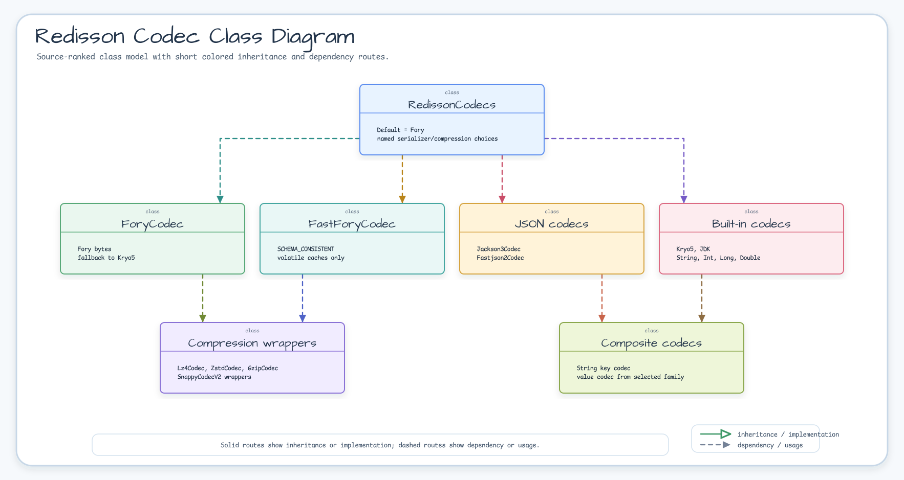
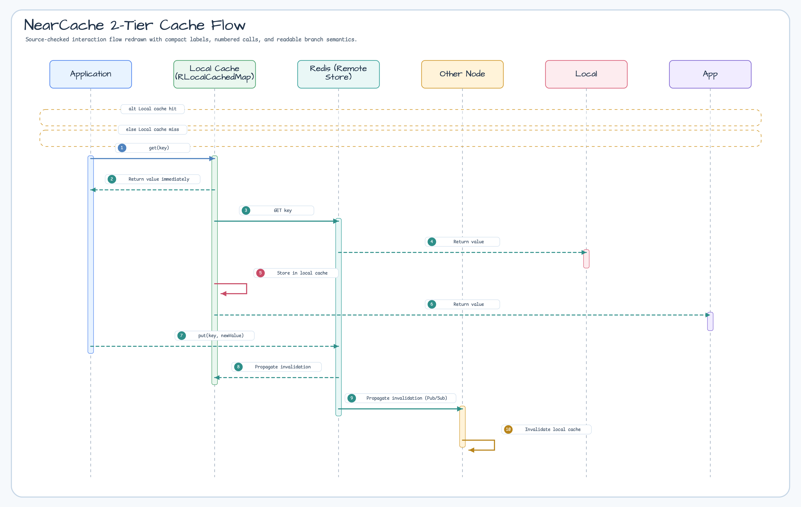
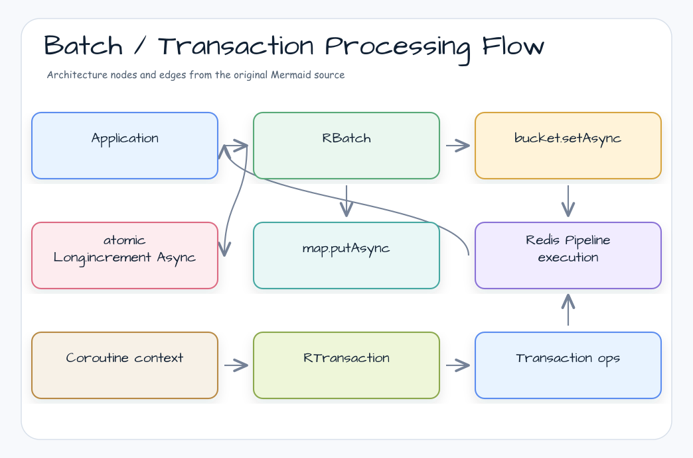
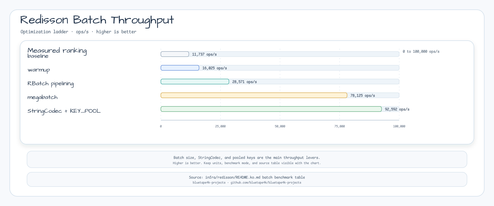

# bluetape4k-redisson

English | [한국어](./README.ko.md)

A Kotlin extension module for the Redisson Redis client, providing DSL-based client creation, high-performance codecs, Kotlin Coroutines support, and NearCache functionality.

## Features

| Feature                         | Description                                                                         |
|---------------------------------|-------------------------------------------------------------------------------------|
| `RedissonClientSupport`         | DSL-based `RedissonClient` / `RedissonReactiveClient` factory, YAML config loading  |
| `RedissonClientExtensions`      | `withBatch {}`, `withTransaction {}` DSL extension functions                        |
| `RedissonClientCoroutine`       | `withSuspendedBatch {}`, `withSuspendedTransaction {}` suspend extension functions  |
| `RFutureSupport`                | `Collection<RFuture>.awaitAll()`, `Iterable<RFuture>.sequence()` coroutine adapters |
| `RedissonCodecs`                | Codec combinations: serializers (Fory/Kryo5/Jackson3/Fastjson2) × compression (LZ4/Zstd/Snappy/GZip) |
| `RedissonNearCache`             | 2-tier Near Cache based on `RLocalCachedMap`                                        |

When using `RedissonCacheConfig` and Redisson near-cache options:

- `maxSize`, `nearCacheMaxSize`, and `writeBehindBatchSize` must not be negative; batch size must be greater than 0.
- `timeToLive`, `maxIdle`, `nearCacheTtl`, and
  `nearCacheMaxIdleTime` must not be negative when specified; near cache TTL/idle must be greater than 0.

## Dependency

```kotlin
// build.gradle.kts
dependencies {
    implementation("io.github.bluetape4k:bluetape4k-redisson:$bluetape4kVersion")

    // Optional codec dependencies (add only what you need)
    runtimeOnly("org.apache.fury:fury-kotlin")        // Fory serialization
    runtimeOnly("com.esotericsoftware:kryo")           // Kryo5 serialization
    runtimeOnly("org.lz4:lz4-java")                   // LZ4 compression
    runtimeOnly("com.github.luben:zstd-jni")          // Zstd compression
    runtimeOnly("org.xerial.snappy:snappy-java")       // Snappy compression
    runtimeOnly("org.apache.commons:commons-compress") // GZip compression
}
```

## Architecture Diagrams

### Codec Selection Map



### NearCache 2-Tier Cache Flow



### Batch / Transaction Processing Flow



## Usage Examples

### 1. Creating a RedissonClient

#### DSL Style

```kotlin
import io.bluetape4k.redis.redisson.redissonClient
import io.bluetape4k.redis.redisson.redissonReactiveClient

// Single server
val client = redissonClient {
    useSingleServer().address = "redis://localhost:6379"
}

// Reactive client
val reactive = redissonReactiveClient {
    useSingleServer().address = "redis://localhost:6379"
}

client.shutdown()
```

#### YAML Configuration File

```kotlin
import io.bluetape4k.redis.redisson.configFromYamlOf
import io.bluetape4k.redis.redisson.redissonClientOf
import io.bluetape4k.redis.redisson.codec.RedissonCodecs

// Supports InputStream, String, File, and URL
val config = configFromYamlOf(
    input = File("redisson.yaml").inputStream(),
    codec = RedissonCodecs.Default,  // Optional codec (default: RedissonCodecs.Default)
)
val client = redissonClientOf(config)
```

Example `redisson.yaml`:

```yaml
singleServerConfig:
  address: "redis://localhost:6379"
  connectionPoolSize: 64
  connectionMinimumIdleSize: 24
```

---

### 2. Codecs

High-performance codecs are available in the `io.bluetape4k.redis.redisson.codec` package.

| Constant                        | Serializer             | Compression | Description                             |
|---------------------------------|------------------------|-------------|-----------------------------------------|
| `RedissonCodecs.Default`        | Fory (fallback: Kryo5) | None        | Default general-purpose codec           |
| `RedissonCodecs.Fory`           | Fory                   | None        | Fory serialization only                 |
| `RedissonCodecs.Kryo5`          | Kryo5                  | None        | Kryo5 serialization only                |
| `RedissonCodecs.LZ4`            | Default                | LZ4         | LZ4 compression wrapper                 |
| `RedissonCodecs.Zstd`           | Default                | Zstd        | High compression ratio                  |
| `RedissonCodecs.Jackson3`       | Jackson3 (JSON)        | None        | Jackson 3.x JSON codec                  |
| `RedissonCodecs.Fastjson2`      | Fastjson2 (JSONB)      | None        | Fastjson2 JSONB codec                   |
| `RedissonCodecs.FastFory`       | FastFory               | None        | FastFory serialization only             |
| `RedissonCodecs.LZ4FastFory`    | FastFory               | LZ4         | FastFory with LZ4 compression           |
| `RedissonCodecs.ZstdFastFory`   | FastFory               | Zstd        | FastFory with Zstd compression          |
| `RedissonCodecs.SnappyFastFory` | FastFory               | Snappy      | FastFory with Snappy compression        |
| `RedissonCodecs.GzipFastFory`   | FastFory               | GZip        | FastFory with GZip compression          |
| `RedissonCodecs.FastForyComposite`       | FastFory (composite)   | None        | FastFory composite serialization        |
| `RedissonCodecs.LZ4FastForyComposite`    | FastFory (composite)   | LZ4         | FastFory composite with LZ4             |
| `RedissonCodecs.ZstdFastForyComposite`   | FastFory (composite)   | Zstd        | FastFory composite with Zstd            |
| `RedissonCodecs.SnappyFastForyComposite` | FastFory (composite)   | Snappy      | FastFory composite with Snappy          |
| `RedissonCodecs.GzipFastForyComposite`   | FastFory (composite)   | GZip        | FastFory composite with GZip            |

> ⚠️ **Wire Format Warning**: FastFory codecs use `CompatibleMode.SCHEMA_CONSISTENT`. `FastForyCodec` can read legacy Fory data via fallback, but `ForyCodec` **cannot** read FastFory data. Use only for volatile caches.

```kotlin
import io.bluetape4k.redis.redisson.codec.RedissonCodecs
import io.bluetape4k.redis.redisson.codec.ForyCodec
import io.bluetape4k.redis.redisson.codec.Jackson3Codec
import io.bluetape4k.redis.redisson.codec.Fastjson2Codec
import io.bluetape4k.redis.redisson.codec.Lz4Codec

val client = redissonClient {
    useSingleServer().address = "redis://localhost:6379"
    codec = RedissonCodecs.Default   // Fory without compression
}

// JSON-based codecs for human-readable storage
val jsonClient = redissonClient {
    useSingleServer().address = "redis://localhost:6379"
    codec = RedissonCodecs.Jackson3   // Jackson 3.x JSON
}

// Fastjson2 JSONB with package-based security restriction
val secureCodec = Fastjson2Codec(
    allowedPackagePrefixes = setOf("com.example.", "io.bluetape4k.")
)

// You can also compose codecs manually
val customCodec = Lz4Codec(innerCodec = ForyCodec())
```

Codec classes:

- `ForyCodec` — Apache Fory serialization. Automatically falls back to Kryo5 on serialization failure.
- `Jackson3Codec` — Jackson 3.x JSON serialization. Stores values as human-readable JSON text.
- `Fastjson2Codec` — Fastjson2 JSONB binary format. Stores class name header + JSONB bytes. Supports `allowedPackagePrefixes` for pre-instantiation security validation.
- `Lz4Codec` — LZ4 compression wrapper around an `innerCodec`.
- `ZstdCodec` — Zstd compression wrapper.
- `GzipCodec` — GZip compression wrapper.

#### Codec Trust Profiles

See [Serialization Trust Profiles](../../docs/security/serialization-trust-profiles.md)
for the shared profile vocabulary.

| Codec family | Default profile | Safer shared-boundary option |
|---|---|---|
| `ForyCodec`, `Kryo5Codec`, and compressed variants | `TrustedInternal` | Use only for private Redis data controlled by one deployment boundary, or choose a secure serializer/factory where available. |
| `Jackson3Codec` / `Fastjson2Codec` with `allowedPackagePrefixes = null` | `TrustedInternal` | Set `allowedPackagePrefixes` for `AllowListedTypes`. |
| `Fastjson2Codec(allowedPackagePrefixes = setOf(...))` | `AllowListedTypes` | Keep prefixes as narrow as the stored DTO packages allow. |

#### Use-Case Factory Functions

`RedissonCodecs` provides use-case-oriented factory functions so you can select the right codec without knowing the internals:

| Factory                                | Returns             | Description                                          |
|----------------------------------------|---------------------|------------------------------------------------------|
| `RedissonCodecs.forCache()`            | `LZ4Fory`           | High-throughput value cache (>1KB objects)           |
| `RedissonCodecs.forHighThroughput()`   | `LZ4FastFory`       | ~27% faster than `forCache()`. Volatile cache only ⚠️ |
| `RedissonCodecs.forCacheMap()`         | `LZ4ForyComposite`  | Map-type cache (RMap, RLocalCachedMap)               |
| `RedissonCodecs.forGeneral()`          | `Fory`              | General mixed read/write workload                    |
| `RedissonCodecs.forSmallValue()`       | `Kryo5`             | Small values (<1KB) — skips compression overhead     |
| `RedissonCodecs.forArchival()`         | `ZstdFory`          | Cold/archival storage — maximum compression          |
| `RedissonCodecs.forCompatibility()`    | `Jdk`               | Interop with non-bluetape4k systems                  |

```kotlin
val config = Config()
// Use the highest-throughput codec for a hot volatile cache
config.codec = RedissonCodecs.forHighThroughput()
val redisson = Redisson.create(config)
```

---

### 3. Batch / Transaction

#### Batch — Minimizing Network Round-Trips

```kotlin
import io.bluetape4k.redis.redisson.withBatch

val result = client.withBatch {
    getBucket<String>("key1").setAsync("value1")
    getBucket<String>("key2").setAsync("value2")
    getAtomicLong("counter").incrementAndGetAsync()
}
```

#### Transaction — Atomic Execution

```kotlin
import io.bluetape4k.redis.redisson.withTransaction

client.withTransaction {
    getBucket<String>("account:balance").set("1000")
    getMap<String, Int>("ledger").put("tx-001", 500)
    // Auto-commits on normal exit, auto-rollbacks on exception
}
```

> **Note**: Thread switches in coroutine environments can break transactions. Use the coroutine variants below instead.

---

### 4. Coroutine Support

#### withSuspendedBatch / withSuspendedTransaction

```kotlin
import io.bluetape4k.redis.redisson.coroutines.withSuspendedBatch
import io.bluetape4k.redis.redisson.coroutines.withSuspendedTransaction

// Suspend Batch
val result = client.withSuspendedBatch {
    getBucket<String>("key1").setAsync("value1")
    getAtomicLong("counter").incrementAndGetAsync()
}

// Suspend Transaction
client.withSuspendedTransaction {
    getBucket<String>("key").set("value")
    // Calls commitAsync().await() on success, rollbackAsync().await() on exception
}
```

#### Converting RFuture to Coroutines

```kotlin
import io.bluetape4k.redis.redisson.coroutines.awaitAll
import io.bluetape4k.redis.redisson.coroutines.sequence

// Await multiple RFutures as suspend
val rfutures: List<RFuture<String>> = ids.map { rmap.getAsync(it) }
val results: List<String> = rfutures.awaitAll()   // suspend
// awaitAll() preserves input order and resumes through the current coroutine dispatcher.

// Convert to CompletableFuture for batch processing (blocking)
val future: CompletableFuture<List<String>> = rfutures.sequence()
val values: List<String> = future.get()
```

---

### 5. NearCache

A 2-tier Near Cache based on Redisson's
`RLocalCachedMap`. Lookups check the local cache first and fall back to Redis on a miss.

```kotlin
import io.bluetape4k.redis.redisson.nearcache.RedissonNearCache

val options = RedissonNearCache.defaultLocalCacheOptions("my-cache")
val nearCache = RedissonNearCache(client, options)

nearCache.put("key", "value")
val value = nearCache.get("key")   // Checks local cache first
```

> For advanced NearCache features (RESP3 hybrid, resilient write-behind, etc.), use the
`bluetape4k-cache-redisson` module.

---

## High-Performance Batch Pattern — Mega-Batch

In coroutine-based workloads, creating **one RBatch per coroutine** (rather than one per operation) reduces Redis round-trips (RTT) by up to 100×.

### Pattern Comparison

| Approach | RTT count (50 coroutines × 100 ops) | Relative throughput |
|----------|-------------------------------------|---------------------|
| Individual RMap op | 10,000 | 1× |
| RBatch per op | 5,000 | ~2× |
| **1 RBatch per coroutine (mega-batch)** | **50** | **~8×** |

### Mega-Batch Example

```kotlin
import org.redisson.client.codec.StringCodec

// Pre-computed key pool — eliminates per-op string interpolation
private val KEY_POOL: Array<Array<String>> = Array(CONCURRENCY + 1) { cid ->
    Array(OPS_PER_COROUTINE) { opIdx -> "c$cid-op$opIdx" }
}

suspend fun processInMegaBatch(redisson: RedissonClient, mapName: String) {
    val jobs = (0 until CONCURRENCY).map { coroutineId ->
        async(Dispatchers.IO) {
            // One RBatch per coroutine — StringCodec removes Jackson overhead
            val batch = redisson.createBatch()
            val batchMap = batch.getMap<String, String>(mapName, StringCodec.INSTANCE)

            repeat(OPS_PER_COROUTINE) { opIdx ->
                val key = KEY_POOL[coroutineId][opIdx]   // pre-computed key
                batchMap.fastPutAsync(key, "value-$coroutineId-$opIdx")
            }

            batch.execute()  // 100 commands → 1 RTT
        }
    }
    jobs.awaitAll()
}
```

### Key Optimization Points

| Optimization | Effect | Notes |
|--------------|--------|-------|
| One `createBatch()` per coroutine | 100× RTT reduction | Largest single gain |
| `StringCodec.INSTANCE` | Eliminates Jackson serialization overhead | Apply only to `Map<String, String>` |
| Pre-computed KEY_POOL | Removes GC pressure from string interpolation | Effective for repetitive key patterns |

---

## Codec Benchmark

Based on `RedissonCodecBenchmark` (JMH, Apple M4 Pro / GraalVM 21 / Warmup 3×2s / Measurement 5×3s / Fork 1 / 2026-04-27):

| Codec | ops/ms | ± Error |
|-------|-------:|--------:|
| **FastFory** | **3,084** | ± 287 |
| Fory | 2,504 | ± 105 |
| fastjson2 | 1,928 | ± 62 |
| Kryo5 | 1,225 | ± 67 |
| LZ4FastFory | 829 | ± 71 |
| LZ4Fory | 774 | ± 42 |
| LZ4Kryo5 | 518 | ± 114 |
| Jackson3 | 474 | ± 25 |
| ZstdFory | 196 | ± 7 |
| ZstdFastFory | 193 | ± 62 |
| ZstdKryo5 | 139 | ± 5 |
| JDK | 128 | ± 14 |
| GzipFastFory | 108 | ± 1 |


> Full results & analysis: [Benchmark.md](./Benchmark.md) · [벤치마크 결과 (한국어)](./Benchmark.ko.md)
> Run: `./gradlew :bluetape4k-redisson:benchmark`

---

## Performance Benchmark

Based on `RedissonConcurrencyBenchmark` (50 coroutines, 100 ops/coroutine):

| Optimization stage | concurrent_ops/sec | Improvement |
|--------------------|--------------------|-------------|
| Baseline (individual op) | ~11,737 | — |
| Warmup stabilization | 16,025 | +36.5% |
| RBatch pipelining | 28,571 | +143% |
| **Mega-batch (1 RBatch per coroutine)** | 78,125 | +566% |
| **StringCodec + KEY_POOL** | **92,592** | **+689%** |



> Run benchmark: `./gradlew :bluetape4k-redisson:test --tests "*.RedissonConcurrencyBenchmark"`

---

## Redis Version Requirements

| Feature                                               | Minimum Redis Version |
|-------------------------------------------------------|-----------------------|
| Core features (Client, Batch, Transaction, NearCache) | Redis 5.0+            |
| RESP3 / CLIENT TRACKING (`bluetape4k-cache-redisson`) | Redis 6.0+            |

## Build and Testing

A Redis server is required to run tests. It is automatically provisioned via Testcontainers.

```bash
./gradlew :bluetape4k-redisson:test
```
