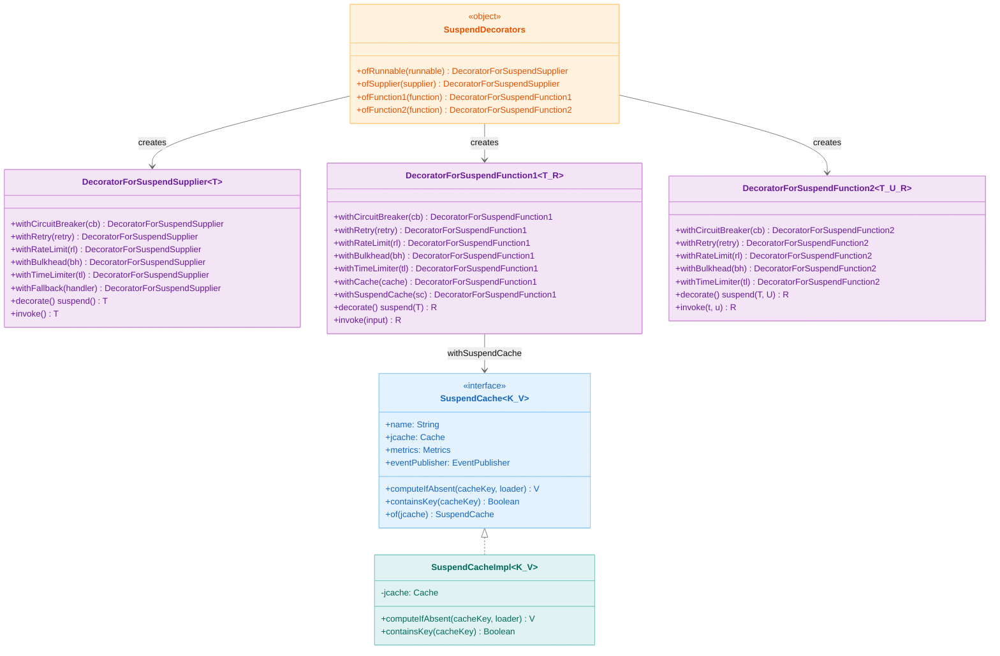
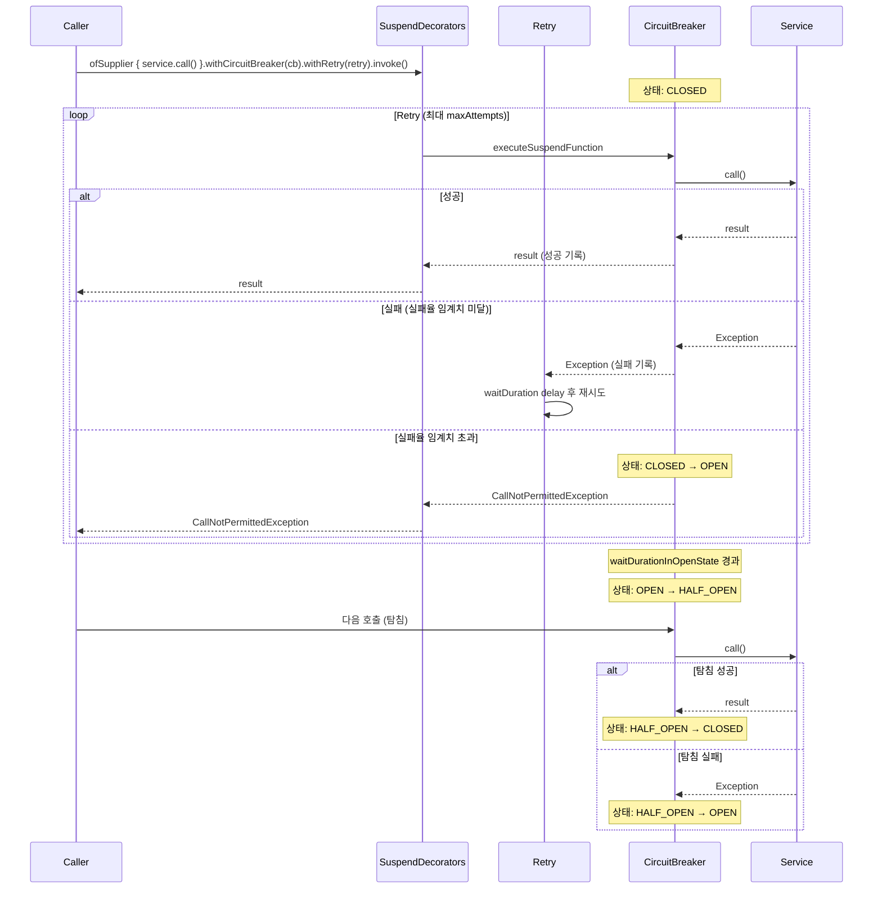
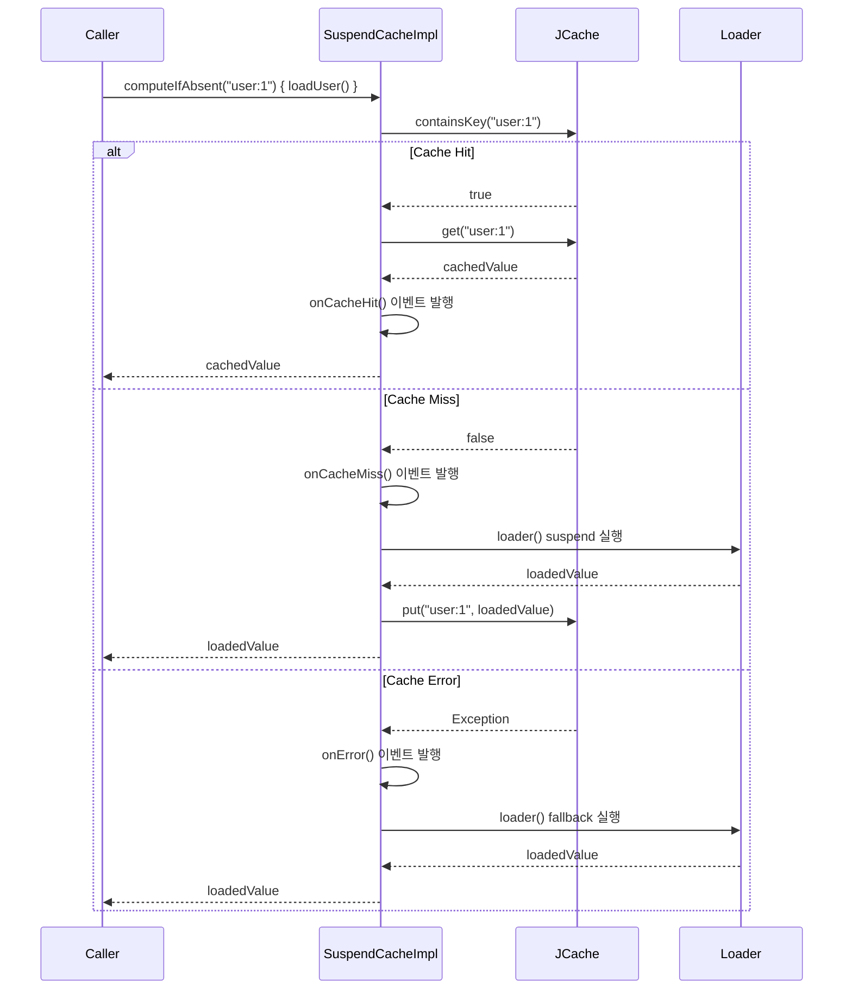

# Module bluetape4k-resilience4j

[English](./README.md) | 한국어

[Resilience4j](https://resilience4j.readme.io/)는 장애 격리와 회복성을 위한 경량 오픈소스 라이브러리입니다.

이 모듈은 Resilience4j를 Kotlin Coroutines 및 Flow 환경에서 사용할 수 있도록 확장 함수와 데코레이터를 제공합니다.

## 클래스 구조

### Resilience4j Coroutines 통합 클래스 다이어그램



### 아키텍처

#### CircuitBreaker + Retry 조합 시퀀스 다이어그램

CLOSED → 실패 누적 → OPEN → Half-Open → 복구 흐름:



#### SuspendCache 동작 시퀀스 다이어그램



## 특징

- **Coroutines 지원**: `suspend` 함수용 Circuit Breaker, Retry, RateLimiter, Bulkhead, TimeLimiter
- **Flow 통합**: Kotlin Flow에 Resilience4j 패턴 적용
- **Decorator 패턴**: 여러 Resilience4j 컴포넌트를 조합하여 사용
- **Cache 지원**: Suspend 함수용 캐시 데코레이터
- **Fallback 처리**: 예외 발생 시 대체 로직 지원

## 의존성

```kotlin
dependencies {
    implementation("io.github.bluetape4k:bluetape4k-resilience4j:${bluetape4kVersion}")
}
```

## 주요 기능

### 1. Circuit Breaker (서킷 브레이커)

장애가 발생하는 서비스를 감지하여 추가 호출을 차단합니다.

```kotlin
import io.bluetape4k.resilience4j.circuitbreaker.*
import io.github.resilience4j.circuitbreaker.CircuitBreaker
import io.github.resilience4j.circuitbreaker.CircuitBreakerConfig

// CircuitBreaker 생성
val circuitBreaker = CircuitBreaker.of("my-cb",
    CircuitBreakerConfig.custom()
        .failureRateThreshold(50f)  // 50% 실패 시 오픈
        .waitDurationInOpenState(Duration.ofSeconds(10))
        .slidingWindowSize(10)
        .build()
)

// suspend 함수에 적용
suspend fun fetchData(): String = withCircuitBreaker(circuitBreaker) {
    // 외부 API 호출
    apiClient.getData()
}

// 파라미터가 있는 함수
suspend fun fetchUser(id: String): User = withCircuitBreaker(circuitBreaker, id) { userId ->
    userRepository.findById(userId)
}

// 데코레이터 패턴
val decorated = circuitBreaker.decorateSuspendFunction1 { id: String ->
    userRepository.findById(id)
}
val user = decorated("user-123")
```

### 2. Retry (재시도)

실패한 작업을 자동으로 재시도합니다.

```kotlin
import io.bluetape4k.resilience4j.retry.*
import io.github.resilience4j.retry.Retry
import io.github.resilience4j.retry.RetryConfig

// Retry 생성
val retry = Retry.of("my-retry",
    RetryConfig.custom<Any>()
        .maxAttempts(3)
        .waitDuration(Duration.ofMillis(500))
        .retryExceptions(IOException::class.java)
        .build()
)

// suspend 함수에 적용
suspend fun fetchWithRetry(): Data = withRetry(retry) {
    // 실패 시 자동 재시도
    unstableApi.fetch()
}

// 파라미터가 있는 함수
suspend fun fetchUserWithRetry(id: String): User = withRetry(retry, id) { userId ->
    userRepository.findById(userId)
}

// 데코레이터 패턴
val decorated = retry.decorateSuspendFunction1 { id: String ->
    apiClient.fetch(id)
}
```

### 3. Rate Limiter (속도 제한)

특정 시간 내에 실행되는 요청 수를 제한합니다.

```kotlin
import io.bluetape4k.resilience4j.ratelimiter.*
import io.github.resilience4j.ratelimiter.RateLimiter
import io.github.resilience4j.ratelimiter.RateLimiterConfig

// RateLimiter 생성
val rateLimiter = RateLimiter.of("my-rl",
    RateLimiterConfig.custom()
        .limitRefreshPeriod(Duration.ofSeconds(1))
        .limitForPeriod(10)  // 초당 10개 요청
        .timeoutDuration(Duration.ofMillis(100))
        .build()
)

// suspend 함수에 적용
suspend fun limitedOperation(): Result = withRateLimiter(rateLimiter) {
    // 속도 제한이 적용된 작업
    apiClient.call()
}

// 데코레이터 패턴
val decorated = rateLimiter.decorateSuspendFunction1 { id: String ->
    apiClient.fetch(id)
}
```

### 4. Bulkhead (격벽)

동시 실행 수를 제한하여 리소스 고갈을 방지합니다.

```kotlin
import io.bluetape4k.resilience4j.bulkhead.*
import io.github.resilience4j.bulkhead.Bulkhead
import io.github.resilience4j.bulkhead.BulkheadConfig

// Semaphore Bulkhead
val bulkhead = Bulkhead.of("my-bh",
    BulkheadConfig.custom()
        .maxConcurrentCalls(10)  // 최대 10개 동시 실행
        .maxWaitDuration(Duration.ofMillis(500))
        .build()
)

// suspend 함수에 적용
suspend fun bulkheadOperation(): Result = withBulkhead(bulkhead) {
    // 동시 실행 수가 제한된 작업
    heavyOperation()
}

// 데코레이터 패턴
val decorated = bulkhead.decorateSuspendFunction1 { input: Int ->
    process(input)
}
```

### 5. Time Limiter (시간 제한)

작업 실행 시간을 제한합니다.

```kotlin
import io.bluetape4k.resilience4j.timelimiter.*
import io.github.resilience4j.timelimiter.TimeLimiter
import io.github.resilience4j.timelimiter.TimeLimiterConfig

// TimeLimiter 생성
val timeLimiter = TimeLimiter.of("my-tl",
    TimeLimiterConfig.custom()
        .timeoutDuration(Duration.ofSeconds(5))  // 5초 제한
        .cancelRunningFuture(true)
        .build()
)

// suspend 함수에 적용
suspend fun timedOperation(): Result = withTimeLimiter(timeLimiter) {
    // 시간 제한이 적용된 작업
    potentiallySlowOperation()
}

// 데코레이터 패턴
val decorated = timeLimiter.decorateSuspendFunction1 { id: String ->
    slowApi.fetch(id)
}
```

### 6. SuspendDecorators (조합 데코레이터)

여러 Resilience4j 컴포넌트를 조합하여 사용합니다.

```kotlin
import io.bluetape4k.resilience4j.SuspendDecorators

// 여러 패턴 조합
val result = SuspendDecorators.ofSupplier {
    // 실행할 작업
    apiClient.fetchData()
}
    .withCircuitBreaker(circuitBreaker)
    .withRetry(retry)
    .withRateLimiter(rateLimiter)
    .withBulkhead(bulkhead)
    .withTimeLimiter(timeLimiter)
    .withFallback { result, throwable ->
        // 실패 시 대체 로직
        defaultData()
    }
    .invoke()

// 파라미터가 있는 함수
val decorated = SuspendDecorators.ofFunction1 { id: String ->
    userService.findById(id)
}
    .withCircuitBreaker(circuitBreaker)
    .withRetry(retry)
    .withCache(cache)  // JCache
    .decorate()

val user = decorated("user-123")

// BiFunction
val adder = SuspendDecorators.ofFunction2 { a: Int, b: Int ->
    calculator.add(a, b)
}
    .withCircuitBreaker(circuitBreaker)
    .withRetry(retry)
    .invoke(10, 20)  // 30
```

### 7. Cache (캐시)

JCache를 사용하여 suspend 함수 결과를 캐싱합니다.

```kotlin
import io.bluetape4k.resilience4j.cache.*
import io.github.resilience4j.cache.Cache
import javax.cache.CacheManager

// Cache 생성
val cache = Cache.of<String, User>(cacheManager.createCache("users"))

// suspend 함수에 적용
suspend fun getUserCached(id: String): User = withSuspendCache(cache, id) {
    userRepository.findById(it)
}

// SuspendCache 인터페이스 사용
val suspendCache = SuspendCache.of<String, User>(jCache)
val user = suspendCache.executeSuspendFunction("user-123") {
    userRepository.findById("user-123")
}
```

### 8. Flow 통합

Resilience4j 패턴을 Kotlin Flow에 적용합니다.

```kotlin
import io.bluetape4k.resilience4j.circuitbreaker.*
import io.bluetape4k.resilience4j.retry.*
import io.bluetape4k.resilience4j.ratelimiter.*
import io.bluetape4k.resilience4j.bulkhead.*
import io.bluetape4k.resilience4j.timelimiter.*
import kotlinx.coroutines.flow.*

// CircuitBreaker + Flow
val flowWithCb = myFlow.circuitBreaker(circuitBreaker)

// Retry + Flow
val flowWithRetry = myFlow.retry(retry)

// RateLimiter + Flow
val flowWithRateLimit = myFlow.rateLimiter(rateLimiter)

// Bulkhead + Flow
val flowWithBulkhead = myFlow.bulkhead(bulkhead)

// TimeLimiter + Flow
val flowWithTimeLimit = myFlow.timeLimiter(timeLimiter)

// 조합 사용
val resilientFlow = dataFlow
    .circuitBreaker(circuitBreaker)
    .retry(retry)
    .rateLimiter(rateLimiter)
    .bulkhead(bulkhead)
```

### 9. Fallback 처리

```kotlin
import io.bluetape4k.resilience4j.SuspendDecorators

// 예외 발생 시 대체 값 반환
val result = SuspendDecorators.ofSupplier {
    riskyOperation()
}
    .withCircuitBreaker(circuitBreaker)
    .withFallback { result, throwable ->
        when (throwable) {
            is ApiException -> cachedValue
            else -> defaultValue
        }
    }
    .invoke()

// 특정 예외 타입에 대한 Fallback
val result2 = SuspendDecorators.ofSupplier {
    riskyOperation()
}
    .withFallback(IOException::class) { ex ->
        // IOException 발생 시 대체 로직
        fallbackForIoError()
    }
    .invoke()

// 결과값 기반 Fallback
val result3 = SuspendDecorators.ofSupplier {
    apiCall()
}
    .withFallback(
        resultPredicate = { it == null || it.isEmpty() },
        resultHandler = { getFromCache() }
    )
    .invoke()
```

### 10. Metrics 및 모니터링

```kotlin
import io.github.resilience4j.micrometer.tagged.*
import io.micrometer.core.instrument.MeterRegistry

// CircuitBreaker Metrics
val taggedCbRegistry = TaggedCircuitBreakerMetrics.ofCircuitBreakerRegistry(
    circuitBreakerRegistry,
    meterRegistry
)

// Retry Metrics
val taggedRetryRegistry = TaggedRetryMetrics.ofRetryRegistry(
    retryRegistry,
    meterRegistry
)

// RateLimiter Metrics
val taggedRlRegistry = TaggedRateLimiterMetrics.ofRateLimiterRegistry(
    rateLimiterRegistry,
    meterRegistry
)

// Bulkhead Metrics
val taggedBhRegistry = TaggedBulkheadMetrics.ofBulkheadRegistry(
    bulkheadRegistry,
    meterRegistry
)
```

## 테스트 예제

```kotlin
import io.bluetape4k.resilience4j.circuitbreaker.*
import io.github.resilience4j.circuitbreaker.CircuitBreaker

class CircuitBreakerTest {
    
    private val circuitBreaker = CircuitBreaker.ofDefaults("test")
    
    @Test
    fun `CircuitBreaker가 열리면 예외가 발생해야 한다`() = runTest {
        // CircuitBreaker 상태 확인
        circuitBreaker.state shouldBe CircuitBreaker.State.CLOSED
        
        // 성공하는 호출
        val result = withCircuitBreaker(circuitBreaker) {
            "success"
        }
        result shouldBeEqualTo "success"
        
        // 실패율 임계치 초과 시 CircuitBreaker 오픈
        repeat(10) {
            runCatching {
                withCircuitBreaker(circuitBreaker) {
                    throw RuntimeException("error")
                }
            }
        }
        
        circuitBreaker.state shouldBe CircuitBreaker.State.OPEN
    }
}
```

## 예제

더 많은 예제는 `src/test/kotlin/io/bluetape4k/resilience4j` 패키지에서 확인할 수 있습니다:

- `circuitbreaker/`: CircuitBreaker 예제
- `retry/`: Retry 예제
- `ratelimiter/`: RateLimiter 예제
- `bulkhead/`: Bulkhead 예제
- `timelimiter/`: TimeLimiter 예제
- `cache/`: Cache 예제

## 참고 자료

- [Resilience4j 문서](https://resilience4j.readme.io/)
- [CircuitBreaker 패턴](https://resilience4j.readme.io/docs/circuitbreaker)
- [Retry 패턴](https://resilience4j.readme.io/docs/retry)
- [RateLimiter 패턴](https://resilience4j.readme.io/docs/ratelimiter)
- [Bulkhead 패턴](https://resilience4j.readme.io/docs/bulkhead)
- [Kotlin Coroutines 지원](https://resilience4j.readme.io/docs/kotlin)

## 라이선스

Apache License 2.0
