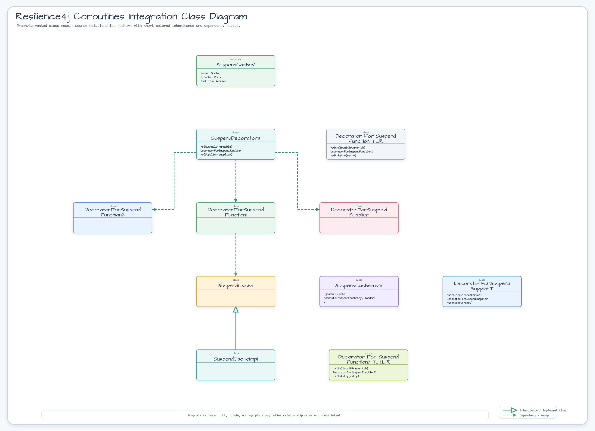
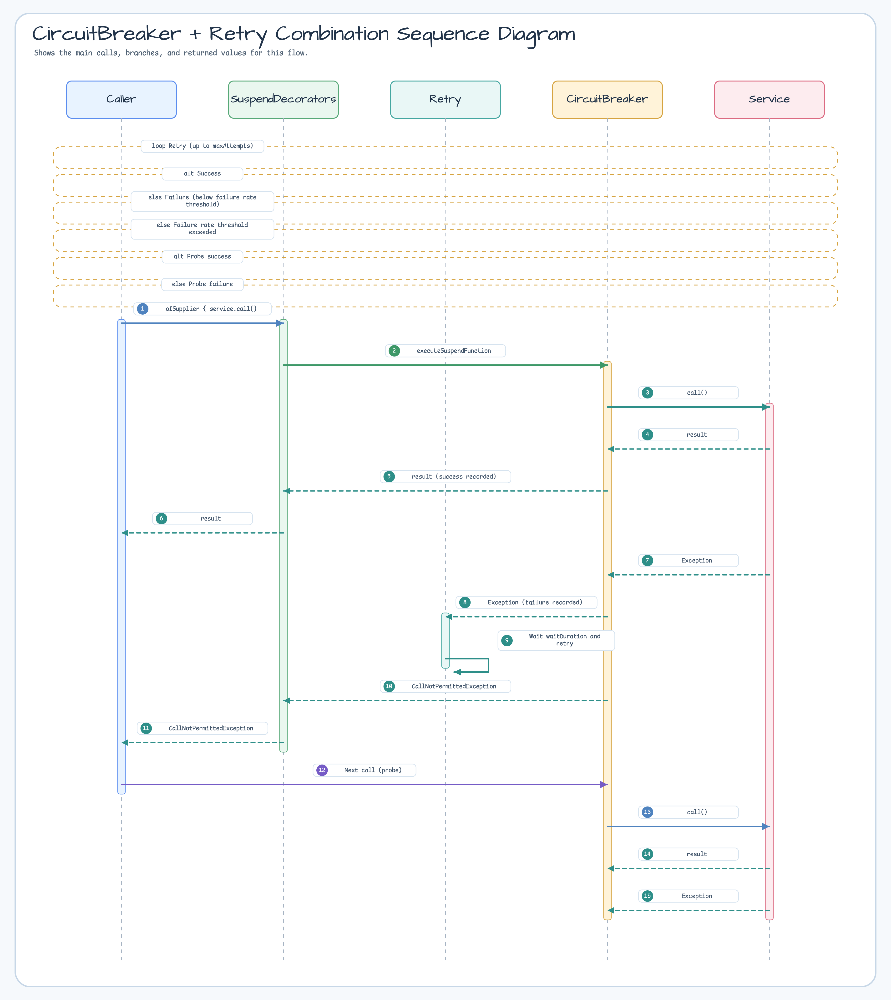
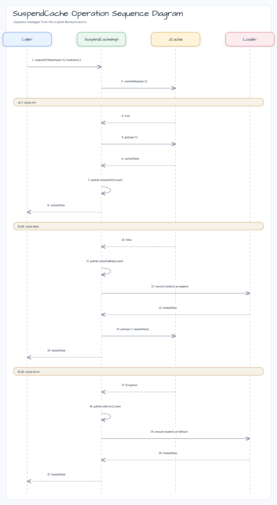

# Module bluetape4k-resilience4j

[English](./README.md) | 한국어

[Resilience4j](https://resilience4j.readme.io/)는 장애 격리와 회복성을 위한 경량 오픈소스 라이브러리입니다.

이 모듈은 Resilience4j를 Kotlin Coroutines 및 Flow 환경에서 사용할 수 있도록 확장 함수와 데코레이터를 제공합니다.

## 클래스 구조

### Resilience4j Coroutine 클래스 구조



### 아키텍처

#### CircuitBreaker + Retry 조합 시퀀스 다이어그램

CLOSED → 실패 누적 → OPEN → Half-Open → 복구 흐름:



#### SuspendCache 동작 시퀀스 다이어그램



## 특징

- **Coroutines 지원**: `suspend` 함수용 Circuit Breaker, Retry, RateLimiter, Bulkhead, TimeLimiter
- **Flow 통합**: Kotlin Flow에 Resilience4j 패턴 적용
- **Decorator 패턴**: 여러 Resilience4j 컴포넌트를 조합하여 사용
- **Cache 지원**: Suspend 함수용 캐시 데코레이터
- **Fallback 처리**: 예외 발생 시 대체 로직 지원

## 모듈 경계

이 모듈은 Resilience4j의 장애 허용 정책 조합을 담당합니다. Circuit breaker, retry, 단순 rate limiter,
bulkhead, time limiter, cache, fallback, events, metrics, Spring 설정 호환성이 이 모듈의 범위입니다.

토큰 버킷 quota, 분산 bucket 상태, 남은 토큰 진단, bucket probe 기반 retry-after가 필요하면
`bluetape4k-bucket4j`를 사용하세요. Resilience4j `RateLimiter`는 정책 데코레이터이고, Bucket4j는
토큰 버킷 엔진입니다.

## 코루틴 계약

- `CancellationException`은 suspend wrapper, fallback helper, cache helper, 조합 데코레이터에서 그대로 전파됩니다.
- `Throwable`처럼 넓은 예외 타입을 fallback에 지정해도 코루틴 취소는 복구하지 않습니다.
- Retry는 코루틴 취소를 재시도하지 않습니다.
- Resilience4j Kotlin `TimeLimiter`는 코루틴 timeout 의미를 사용합니다. Timeout은
  `TimeoutCancellationException`으로 발생하고 코루틴을 취소하며, suspend 함수에서는 `cancelRunningFuture`를
  사용하지 않습니다.
- Resilience4j Kotlin `RateLimiter`와 `Retry`는 대기가 필요할 때 `delay()`로 suspend합니다.
- Semaphore `Bulkhead`의 `maxWaitDuration`이 0보다 크면 permission 획득 중 block될 수 있습니다. 코루틴 중심
  경로에서는 의도적인 bounded blocking이 아니라면 0 wait를 권장합니다.

## 의존성

```kotlin
dependencies {
    implementation("io.github.bluetape4k:bluetape4k-resilience4j:${bluetape4kVersion}")
}
```

## 주요 기능

### 1. Circuit Breaker (서킷 브레이커)

장애가 발생하는 서비스를 감지하여 추가 호출을 차단합니다.

```kotlin
import io.bluetape4k.resilience4j.circuitbreaker.*
import io.github.resilience4j.circuitbreaker.CircuitBreaker
import io.github.resilience4j.circuitbreaker.CircuitBreakerConfig

// CircuitBreaker 생성
val circuitBreaker = CircuitBreaker.of("my-cb",
    CircuitBreakerConfig.custom()
        .failureRateThreshold(50f)  // 50% 실패 시 오픈
        .waitDurationInOpenState(Duration.ofSeconds(10))
        .slidingWindowSize(10)
        .build()
)

// suspend 함수에 적용
suspend fun fetchData(): String = withCircuitBreaker(circuitBreaker) {
    // 외부 API 호출
    apiClient.getData()
}

// 파라미터가 있는 함수
suspend fun fetchUser(id: String): User = withCircuitBreaker(circuitBreaker, id) { userId ->
    userRepository.findById(userId)
}

// 데코레이터 패턴
val decorated = circuitBreaker.decorateSuspendFunction1 { id: String ->
    userRepository.findById(id)
}
val user = decorated("user-123")
```

### 2. Retry (재시도)

실패한 작업을 자동으로 재시도합니다.

```kotlin
import io.bluetape4k.resilience4j.retry.*
import io.github.resilience4j.retry.Retry
import io.github.resilience4j.retry.RetryConfig

// Retry 생성
val retry = Retry.of("my-retry",
    RetryConfig.custom<Any>()
        .maxAttempts(3)
        .waitDuration(Duration.ofMillis(500))
        .retryExceptions(IOException::class.java)
        .build()
)

// suspend 함수에 적용
suspend fun fetchWithRetry(): Data = withRetry(retry) {
    // 실패 시 자동 재시도
    unstableApi.fetch()
}

// 파라미터가 있는 함수
suspend fun fetchUserWithRetry(id: String): User = withRetry(retry, id) { userId ->
    userRepository.findById(userId)
}

// 데코레이터 패턴
val decorated = retry.decorateSuspendFunction1 { id: String ->
    apiClient.fetch(id)
}
```

### 3. Rate Limiter (속도 제한)

특정 시간 내에 실행되는 요청 수를 제한합니다.

```kotlin
import io.bluetape4k.resilience4j.ratelimiter.*
import io.github.resilience4j.ratelimiter.RateLimiter
import io.github.resilience4j.ratelimiter.RateLimiterConfig

// RateLimiter 생성
val rateLimiter = RateLimiter.of("my-rl",
    RateLimiterConfig.custom()
        .limitRefreshPeriod(Duration.ofSeconds(1))
        .limitForPeriod(10)  // 초당 10개 요청
        .timeoutDuration(Duration.ofMillis(100))
        .build()
)

// suspend 함수에 적용
suspend fun limitedOperation(): Result = withRateLimiter(rateLimiter) {
    // 속도 제한이 적용된 작업
    apiClient.call()
}

// 데코레이터 패턴
val decorated = rateLimiter.decorateSuspendFunction1 { id: String ->
    apiClient.fetch(id)
}
```

### 4. Bulkhead (격벽)

동시 실행 수를 제한하여 리소스 고갈을 방지합니다.

```kotlin
import io.bluetape4k.resilience4j.bulkhead.*
import io.github.resilience4j.bulkhead.Bulkhead
import io.github.resilience4j.bulkhead.BulkheadConfig

// Semaphore Bulkhead
val bulkhead = Bulkhead.of("my-bh",
    BulkheadConfig.custom()
        .maxConcurrentCalls(10)  // 최대 10개 동시 실행
        .maxWaitDuration(Duration.ofMillis(500))
        .build()
)

// suspend 함수에 적용
suspend fun bulkheadOperation(): Result = withBulkhead(bulkhead) {
    // 동시 실행 수가 제한된 작업
    heavyOperation()
}

// 데코레이터 패턴
val decorated = bulkhead.decorateSuspendFunction1 { input: Int ->
    process(input)
}
```

### 5. Time Limiter (시간 제한)

작업 실행 시간을 제한합니다.

```kotlin
import io.bluetape4k.resilience4j.timelimiter.*
import io.github.resilience4j.timelimiter.TimeLimiter
import io.github.resilience4j.timelimiter.TimeLimiterConfig

// TimeLimiter 생성
val timeLimiter = TimeLimiter.of("my-tl",
    TimeLimiterConfig.custom()
        .timeoutDuration(Duration.ofSeconds(5))  // 5초 제한
        .cancelRunningFuture(true)
        .build()
)

// suspend 함수에 적용
suspend fun timedOperation(): Result = withTimeLimiter(timeLimiter) {
    // 시간 제한이 적용된 작업
    potentiallySlowOperation()
}

// 데코레이터 패턴
val decorated = timeLimiter.decorateSuspendFunction1 { id: String ->
    slowApi.fetch(id)
}
```

### 비동기 scheduler 소유권

비동기 `Retry` 및 `TimeLimiter` 확장 함수(`completionStage`, `completableFuture`,
`completableFutureFunction`, `withRetry`)는 선택적인 `ScheduledExecutorService`를 받습니다.
스케줄러를 생략하거나 `null`로 전달하면 호출마다 전용 스케줄러를 만들고 terminal completion 후 종료합니다.
스케줄러를 전달하면 성공·실패·timeout을 포함해 데코레이터가 종료하지 않으며 caller가 계속 소유합니다.
따라서 데코레이트한 함수를 반복 호출할 수 있고 여러 데코레이터가 하나의 스케줄러를 공유할 수 있습니다.

```kotlin
import java.util.concurrent.CompletableFuture
import java.util.concurrent.Executors

val scheduler = Executors.newScheduledThreadPool(2)
try {
    val protectedCall = timeLimiter.completableFuture(scheduler) { input: Int ->
        CompletableFuture.completedFuture(input * 2)
    }
    protectedCall(21).get() // 42
    protectedCall(22).get() // 44
} finally {
    scheduler.shutdown()
}
```

전달한 스케줄러의 모든 데코레이트 호출이 끝나면 caller가 직접 종료해야 합니다. 같은 소유권 규칙은
`decorateCompletableFutureFunction(...).withRetry(retry, scheduler)`에도 적용됩니다.

### 6. SuspendDecorators (조합 데코레이터)

여러 Resilience4j 컴포넌트를 조합하여 사용합니다.

`SuspendDecorators`는 `withXxx`를 호출할 때마다 현재 함수를 감쌉니다. 마지막 `withXxx` 호출이 가장 바깥
데코레이터이며 먼저 실행됩니다. 서비스 호출의 일반적인 순서는 다음과 같습니다.

```text
withBulkhead -> withTimeLimiter -> withRateLimit -> withCircuitBreaker -> withRetry -> withFallback
```

실행 구조는 다음과 같습니다.

```text
fallback(retry(circuitBreaker(rateLimiter(timeLimiter(bulkhead(block))))))
```

```kotlin
import io.bluetape4k.resilience4j.SuspendDecorators

// 여러 패턴 조합
val result = SuspendDecorators.ofSupplier {
    // 실행할 작업
    apiClient.fetchData()
}
    .withBulkhead(bulkhead)
    .withTimeLimiter(timeLimiter)
    .withRateLimit(rateLimiter)
    .withCircuitBreaker(circuitBreaker)
    .withRetry(retry)
    .withFallback { result, throwable ->
        // 실패 시 대체 로직
        defaultData()
    }
    .invoke()

// 파라미터가 있는 함수
val decorated = SuspendDecorators.ofFunction1 { id: String ->
    userService.findById(id)
}
    .withBulkhead(bulkhead)
    .withTimeLimiter(timeLimiter)
    .withRateLimit(rateLimiter)
    .withCircuitBreaker(circuitBreaker)
    .withRetry(retry)
    .withCache(cache)  // Resilience4j Cache
    .decorate()

val user = decorated("user-123")

// BiFunction
val adder = SuspendDecorators.ofFunction2 { a: Int, b: Int ->
    calculator.add(a, b)
}
    .withBulkhead(bulkhead)
    .withCircuitBreaker(circuitBreaker)
    .withRetry(retry)
    .invoke(10, 20)  // 30
```

### 7. Cache (캐시)

JCache를 사용하여 suspend 함수 결과를 캐싱합니다.

캐시 표면은 두 가지입니다.

- `SuspendCache.of(jcache)`는 직접 JCache 접근을 소유하는 엄격한 coroutine-first 경로입니다.
- Resilience4j `Cache<K, V>` 확장은 upstream facade 호환 경로입니다. Resilience4j 2.4.0은 public backing
  JCache accessor를 제공하지 않으므로, 이 경로는 two-phase 호환 probe를 유지하고 blocking cache 호출 주변에서
  코루틴 취소를 다시 확인합니다.

`SuspendCache`는 취소가 아닌 실패만 cache error event로 발행합니다. Loader 또는 JCache 접근에서 발생한
취소는 그대로 전파됩니다.

```kotlin
import io.bluetape4k.resilience4j.cache.*
import io.github.resilience4j.cache.Cache

// Caffeine, Cache2k, Redisson 등 provider가 만든 JCache 인스턴스라고 가정
val jCache: javax.cache.Cache<String, User> = existingJCache

// Resilience4j cache facade 생성
val resilienceCache = Cache.of<String, User>(jCache)

// Resilience4j cache 호환 경로를 suspend 함수에 적용
suspend fun getUserCached(id: String): User = withCache(resilienceCache, id) {
    userRepository.findById(it)
}

// 직접 JCache 의미가 필요하면 SuspendCache 사용
val suspendCache = SuspendCache.of<String, User>(jCache)
suspend fun getUserStrictCached(id: String): User = withSuspendCache(suspendCache, id) {
    userRepository.findById(id)
}
```

### 8. Flow 통합

Resilience4j 패턴을 Kotlin Flow에 적용합니다.

Flow decoration은 collection이 실행될 때 적용됩니다. 새 collection마다 정책에 다시 진입하며, operator 자체는
emit된 element를 캐시하지 않습니다. Downstream collector 취소는 그대로 전파됩니다. TimeLimiter timeout은
collecting coroutine을 취소합니다. Bulkhead non-zero wait의 blocking 주의점은 suspend 함수와 동일합니다.

```kotlin
import io.github.resilience4j.kotlin.bulkhead.bulkhead
import io.github.resilience4j.kotlin.circuitbreaker.circuitBreaker
import io.github.resilience4j.kotlin.ratelimiter.rateLimiter
import io.github.resilience4j.kotlin.retry.retry
import io.github.resilience4j.kotlin.timelimiter.timeLimiter
import kotlinx.coroutines.flow.*

// CircuitBreaker + Flow
val flowWithCb = myFlow.circuitBreaker(circuitBreaker)

// Retry + Flow
val flowWithRetry = myFlow.retry(retry)

// RateLimiter + Flow
val flowWithRateLimit = myFlow.rateLimiter(rateLimiter)

// Bulkhead + Flow
val flowWithBulkhead = myFlow.bulkhead(bulkhead)

// TimeLimiter + Flow
val flowWithTimeLimit = myFlow.timeLimiter(timeLimiter)

// 조합 사용
val resilientFlow = dataFlow
    .circuitBreaker(circuitBreaker)
    .retry(retry)
    .rateLimiter(rateLimiter)
    .bulkhead(bulkhead)
```

### 9. Fallback 처리

Fallback handler는 일반 suspend 함수이지만 코루틴 취소를 복구하지 않습니다. 모든 내부 데코레이터의 실패를
관찰해야 하면 fallback을 마지막에 두세요.

```kotlin
import io.bluetape4k.resilience4j.SuspendDecorators

// 예외 발생 시 대체 값 반환
val result = SuspendDecorators.ofSupplier {
    riskyOperation()
}
    .withCircuitBreaker(circuitBreaker)
    .withFallback { result, throwable ->
        when (throwable) {
            is ApiException -> cachedValue
            else -> defaultValue
        }
    }
    .invoke()

// 특정 예외 타입에 대한 Fallback
val result2 = SuspendDecorators.ofSupplier {
    riskyOperation()
}
    .withFallback(IOException::class) { ex ->
        // IOException 발생 시 대체 로직
        fallbackForIoError()
    }
    .invoke()

// 결과값 기반 Fallback
val result3 = SuspendDecorators.ofSupplier {
    apiCall()
}
    .withFallback(
        resultPredicate = { it == null || it.isEmpty() },
        resultHandler = { getFromCache() }
    )
    .invoke()
```

### 10. Metrics 및 모니터링

Upstream Resilience4j registry, event publisher, Spring Boot property, Micrometer 통합을 source of truth로
사용하세요. bluetape4k가 추가하는 observability 표면은 coroutine cache wrapper의 `SuspendCache.metrics`와
`SuspendCache.eventPublisher`뿐입니다.

```kotlin
import io.github.resilience4j.micrometer.tagged.*
import io.micrometer.core.instrument.MeterRegistry

// CircuitBreaker Metrics
val taggedCbRegistry = TaggedCircuitBreakerMetrics.ofCircuitBreakerRegistry(
    circuitBreakerRegistry,
    meterRegistry
)

// Retry Metrics
val taggedRetryRegistry = TaggedRetryMetrics.ofRetryRegistry(
    retryRegistry,
    meterRegistry
)

// RateLimiter Metrics
val taggedRlRegistry = TaggedRateLimiterMetrics.ofRateLimiterRegistry(
    rateLimiterRegistry,
    meterRegistry
)

// Bulkhead Metrics
val taggedBhRegistry = TaggedBulkheadMetrics.ofBulkheadRegistry(
    bulkheadRegistry,
    meterRegistry
)
```

## 테스트 예제

```kotlin
import io.bluetape4k.resilience4j.circuitbreaker.*
import io.github.resilience4j.circuitbreaker.CircuitBreaker

class CircuitBreakerTest {
    
    private val circuitBreaker = CircuitBreaker.ofDefaults("test")
    
    @Test
    fun `CircuitBreaker가 열리면 예외가 발생해야 한다`() = runTest {
        // CircuitBreaker 상태 확인
        circuitBreaker.state shouldBe CircuitBreaker.State.CLOSED
        
        // 성공하는 호출
        val result = withCircuitBreaker(circuitBreaker) {
            "success"
        }
        result shouldBeEqualTo "success"
        
        // 실패율 임계치 초과 시 CircuitBreaker 오픈
        repeat(10) {
            assertFailsWith<RuntimeException> {
                withCircuitBreaker(circuitBreaker) {
                    throw RuntimeException("error")
                }
            }
        }
        
        circuitBreaker.state shouldBe CircuitBreaker.State.OPEN
    }
}
```

## 예제

더 많은 예제는 `src/test/kotlin/io/bluetape4k/resilience4j` 패키지에서 확인할 수 있습니다:

- `circuitbreaker/`: CircuitBreaker 예제
- `retry/`: Retry 예제
- `ratelimiter/`: RateLimiter 예제
- `bulkhead/`: Bulkhead 예제
- `timelimiter/`: TimeLimiter 예제
- `cache/`: Cache 예제

## 참고 자료

- [Resilience4j 문서](https://resilience4j.readme.io/)
- [CircuitBreaker 패턴](https://resilience4j.readme.io/docs/circuitbreaker)
- [Retry 패턴](https://resilience4j.readme.io/docs/retry)
- [RateLimiter 패턴](https://resilience4j.readme.io/docs/ratelimiter)
- [Bulkhead 패턴](https://resilience4j.readme.io/docs/bulkhead)
- [Kotlin Coroutines 지원](https://resilience4j.readme.io/docs/kotlin)

## 라이선스

MIT License
