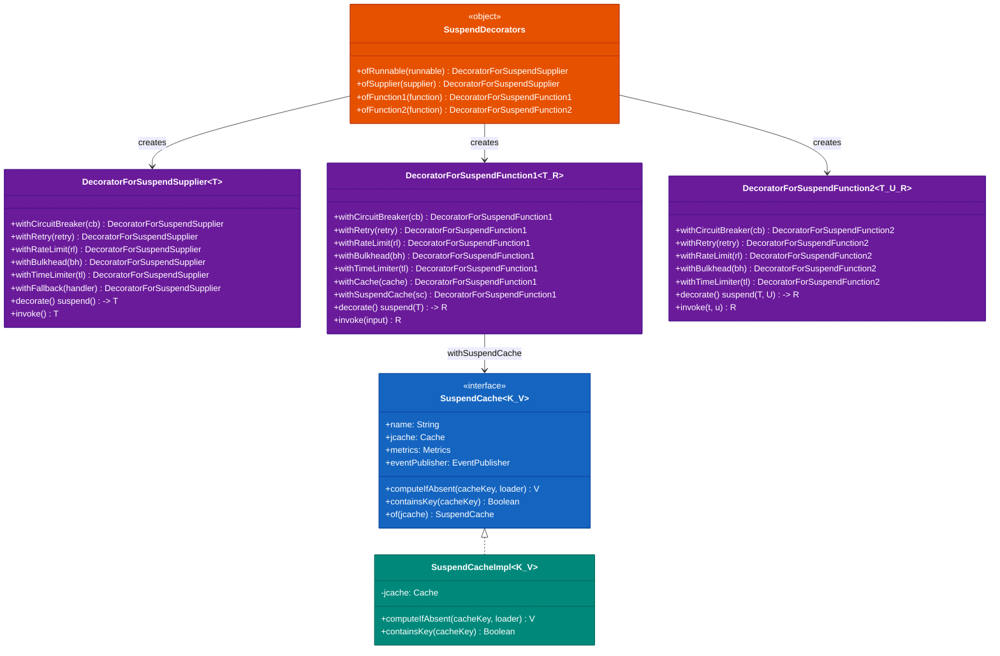
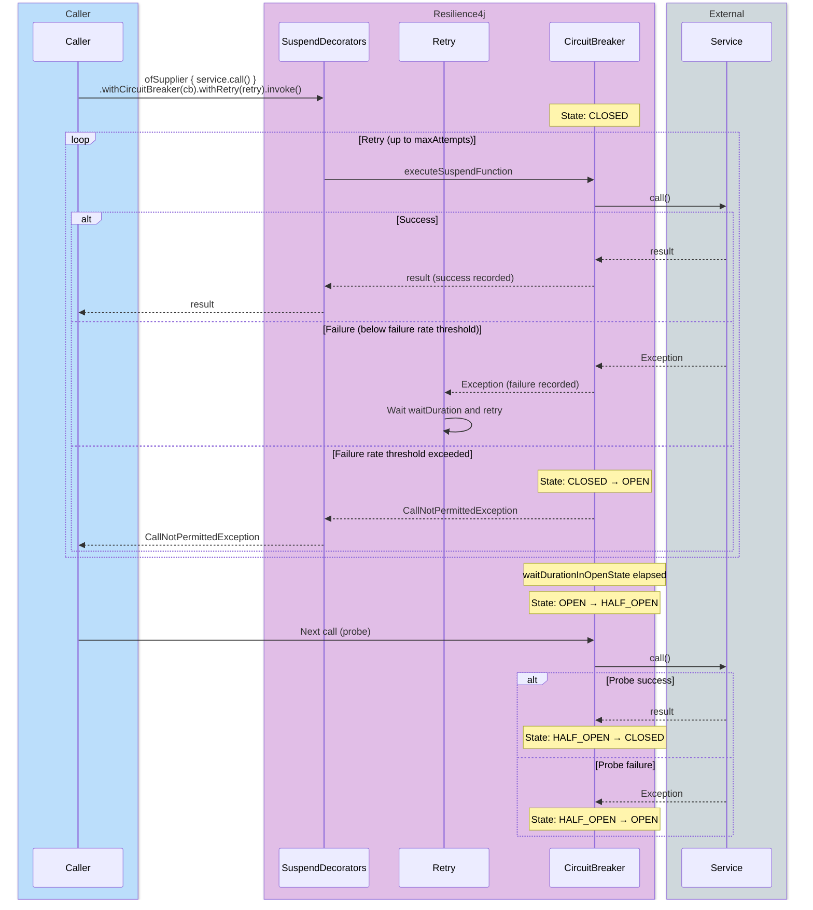
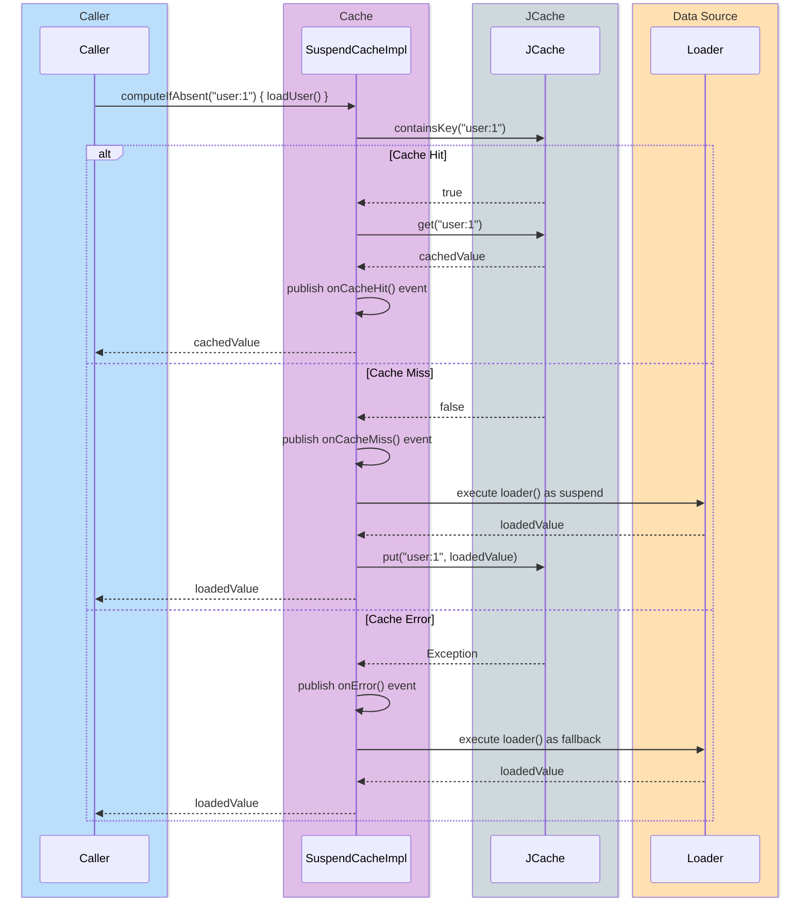

# Module bluetape4k-resilience4j

English | [한국어](./README.ko.md)

[Resilience4j](https://resilience4j.readme.io/) is a lightweight, fault-tolerance library for isolation and recovery.

This module provides extension functions and decorators that make it easy to use Resilience4j with Kotlin Coroutines and Flow.

## Class Structure

### Resilience4j Coroutines Integration Class Diagram



### Architecture

#### CircuitBreaker + Retry Combination Sequence Diagram

CLOSED → failures accumulate → OPEN → Half-Open → Recovery flow:



#### SuspendCache Operation Sequence Diagram



## Features

- **Coroutines support**: Circuit Breaker, Retry, RateLimiter, Bulkhead, and TimeLimiter for `suspend` functions
- **Flow integration**: Apply Resilience4j patterns to Kotlin Flow
- **Decorator pattern**: Compose multiple Resilience4j components together
- **Cache support**: Cache decorator for suspend functions
- **Fallback handling**: Define fallback logic when exceptions occur

## Dependency

```kotlin
dependencies {
    implementation("io.github.bluetape4k:bluetape4k-resilience4j:${bluetape4kVersion}")
}
```

## Key Features

### 1. Circuit Breaker

Detects failing services and stops further calls when failures exceed a threshold.

```kotlin
import io.bluetape4k.resilience4j.circuitbreaker.*
import io.github.resilience4j.circuitbreaker.CircuitBreaker
import io.github.resilience4j.circuitbreaker.CircuitBreakerConfig

// Create a CircuitBreaker
val circuitBreaker = CircuitBreaker.of("my-cb",
    CircuitBreakerConfig.custom()
        .failureRateThreshold(50f)  // Open when 50% of calls fail
        .waitDurationInOpenState(Duration.ofSeconds(10))
        .slidingWindowSize(10)
        .build()
)

// Apply to a suspend function
suspend fun fetchData(): String = withCircuitBreaker(circuitBreaker) {
    // External API call
    apiClient.getData()
}

// Function with a parameter
suspend fun fetchUser(id: String): User = withCircuitBreaker(circuitBreaker, id) { userId ->
    userRepository.findById(userId)
}

// Decorator pattern
val decorated = circuitBreaker.decorateSuspendFunction1 { id: String ->
    userRepository.findById(id)
}
val user = decorated("user-123")
```

### 2. Retry

Automatically retries failed operations.

```kotlin
import io.bluetape4k.resilience4j.retry.*
import io.github.resilience4j.retry.Retry
import io.github.resilience4j.retry.RetryConfig

// Create a Retry
val retry = Retry.of("my-retry",
    RetryConfig.custom<Any>()
        .maxAttempts(3)
        .waitDuration(Duration.ofMillis(500))
        .retryExceptions(IOException::class.java)
        .build()
)

// Apply to a suspend function
suspend fun fetchWithRetry(): Data = withRetry(retry) {
    // Automatically retries on failure
    unstableApi.fetch()
}

// Function with a parameter
suspend fun fetchUserWithRetry(id: String): User = withRetry(retry, id) { userId ->
    userRepository.findById(userId)
}

// Decorator pattern
val decorated = retry.decorateSuspendFunction1 { id: String ->
    apiClient.fetch(id)
}
```

### 3. Rate Limiter

Limits the number of requests executed within a given time period.

```kotlin
import io.bluetape4k.resilience4j.ratelimiter.*
import io.github.resilience4j.ratelimiter.RateLimiter
import io.github.resilience4j.ratelimiter.RateLimiterConfig

// Create a RateLimiter
val rateLimiter = RateLimiter.of("my-rl",
    RateLimiterConfig.custom()
        .limitRefreshPeriod(Duration.ofSeconds(1))
        .limitForPeriod(10)  // 10 requests per second
        .timeoutDuration(Duration.ofMillis(100))
        .build()
)

// Apply to a suspend function
suspend fun limitedOperation(): Result = withRateLimiter(rateLimiter) {
    // Rate-limited operation
    apiClient.call()
}

// Decorator pattern
val decorated = rateLimiter.decorateSuspendFunction1 { id: String ->
    apiClient.fetch(id)
}
```

### 4. Bulkhead

Limits the number of concurrent executions to prevent resource exhaustion.

```kotlin
import io.bluetape4k.resilience4j.bulkhead.*
import io.github.resilience4j.bulkhead.Bulkhead
import io.github.resilience4j.bulkhead.BulkheadConfig

// Semaphore Bulkhead
val bulkhead = Bulkhead.of("my-bh",
    BulkheadConfig.custom()
        .maxConcurrentCalls(10)  // Up to 10 concurrent executions
        .maxWaitDuration(Duration.ofMillis(500))
        .build()
)

// Apply to a suspend function
suspend fun bulkheadOperation(): Result = withBulkhead(bulkhead) {
    // Concurrency-limited operation
    heavyOperation()
}

// Decorator pattern
val decorated = bulkhead.decorateSuspendFunction1 { input: Int ->
    process(input)
}
```

### 5. Time Limiter

Limits the execution time of an operation.

```kotlin
import io.bluetape4k.resilience4j.timelimiter.*
import io.github.resilience4j.timelimiter.TimeLimiter
import io.github.resilience4j.timelimiter.TimeLimiterConfig

// Create a TimeLimiter
val timeLimiter = TimeLimiter.of("my-tl",
    TimeLimiterConfig.custom()
        .timeoutDuration(Duration.ofSeconds(5))  // 5-second limit
        .cancelRunningFuture(true)
        .build()
)

// Apply to a suspend function
suspend fun timedOperation(): Result = withTimeLimiter(timeLimiter) {
    // Time-limited operation
    potentiallySlowOperation()
}

// Decorator pattern
val decorated = timeLimiter.decorateSuspendFunction1 { id: String ->
    slowApi.fetch(id)
}
```

### 6. SuspendDecorators (Composable Decorators)

Compose multiple Resilience4j components together.

```kotlin
import io.bluetape4k.resilience4j.SuspendDecorators

// Combine multiple patterns
val result = SuspendDecorators.ofSupplier {
    // Operation to execute
    apiClient.fetchData()
}
    .withCircuitBreaker(circuitBreaker)
    .withRetry(retry)
    .withRateLimiter(rateLimiter)
    .withBulkhead(bulkhead)
    .withTimeLimiter(timeLimiter)
    .withFallback { result, throwable ->
        // Fallback logic on failure
        defaultData()
    }
    .invoke()

// Function with a parameter
val decorated = SuspendDecorators.ofFunction1 { id: String ->
    userService.findById(id)
}
    .withCircuitBreaker(circuitBreaker)
    .withRetry(retry)
    .withCache(cache)  // JCache
    .decorate()

val user = decorated("user-123")

// BiFunction
val adder = SuspendDecorators.ofFunction2 { a: Int, b: Int ->
    calculator.add(a, b)
}
    .withCircuitBreaker(circuitBreaker)
    .withRetry(retry)
    .invoke(10, 20)  // 30
```

### 7. Cache

Caches suspend function results using JCache.

```kotlin
import io.bluetape4k.resilience4j.cache.*
import io.github.resilience4j.cache.Cache
import javax.cache.CacheManager

// Create a cache
val cache = Cache.of<String, User>(cacheManager.createCache("users"))

// Apply to a suspend function
suspend fun getUserCached(id: String): User = withSuspendCache(cache, id) {
    userRepository.findById(it)
}

// Using the SuspendCache interface
val suspendCache = SuspendCache.of<String, User>(jCache)
val user = suspendCache.executeSuspendFunction("user-123") {
    userRepository.findById("user-123")
}
```

### 8. Flow Integration

Apply Resilience4j patterns to Kotlin Flow.

```kotlin
import io.bluetape4k.resilience4j.circuitbreaker.*
import io.bluetape4k.resilience4j.retry.*
import io.bluetape4k.resilience4j.ratelimiter.*
import io.bluetape4k.resilience4j.bulkhead.*
import io.bluetape4k.resilience4j.timelimiter.*
import kotlinx.coroutines.flow.*

// CircuitBreaker + Flow
val flowWithCb = myFlow.circuitBreaker(circuitBreaker)

// Retry + Flow
val flowWithRetry = myFlow.retry(retry)

// RateLimiter + Flow
val flowWithRateLimit = myFlow.rateLimiter(rateLimiter)

// Bulkhead + Flow
val flowWithBulkhead = myFlow.bulkhead(bulkhead)

// TimeLimiter + Flow
val flowWithTimeLimit = myFlow.timeLimiter(timeLimiter)

// Combined
val resilientFlow = dataFlow
    .circuitBreaker(circuitBreaker)
    .retry(retry)
    .rateLimiter(rateLimiter)
    .bulkhead(bulkhead)
```

### 9. Fallback Handling

```kotlin
import io.bluetape4k.resilience4j.SuspendDecorators

// Return a fallback value on exception
val result = SuspendDecorators.ofSupplier {
    riskyOperation()
}
    .withCircuitBreaker(circuitBreaker)
    .withFallback { result, throwable ->
        when (throwable) {
            is ApiException -> cachedValue
            else -> defaultValue
        }
    }
    .invoke()

// Fallback for a specific exception type
val result2 = SuspendDecorators.ofSupplier {
    riskyOperation()
}
    .withFallback(IOException::class) { ex ->
        // Fallback logic for IOException
        fallbackForIoError()
    }
    .invoke()

// Result-based fallback
val result3 = SuspendDecorators.ofSupplier {
    apiCall()
}
    .withFallback(
        resultPredicate = { it == null || it.isEmpty() },
        resultHandler = { getFromCache() }
    )
    .invoke()
```

### 10. Metrics and Monitoring

```kotlin
import io.github.resilience4j.micrometer.tagged.*
import io.micrometer.core.instrument.MeterRegistry

// CircuitBreaker Metrics
val taggedCbRegistry = TaggedCircuitBreakerMetrics.ofCircuitBreakerRegistry(
    circuitBreakerRegistry,
    meterRegistry
)

// Retry Metrics
val taggedRetryRegistry = TaggedRetryMetrics.ofRetryRegistry(
    retryRegistry,
    meterRegistry
)

// RateLimiter Metrics
val taggedRlRegistry = TaggedRateLimiterMetrics.ofRateLimiterRegistry(
    rateLimiterRegistry,
    meterRegistry
)

// Bulkhead Metrics
val taggedBhRegistry = TaggedBulkheadMetrics.ofBulkheadRegistry(
    bulkheadRegistry,
    meterRegistry
)
```

## Test Example

```kotlin
import io.bluetape4k.resilience4j.circuitbreaker.*
import io.github.resilience4j.circuitbreaker.CircuitBreaker

class CircuitBreakerTest {
    
    private val circuitBreaker = CircuitBreaker.ofDefaults("test")
    
    @Test
    fun `should throw exception when CircuitBreaker is open`() = runTest {
        // Check initial state
        circuitBreaker.state shouldBe CircuitBreaker.State.CLOSED
        
        // Successful call
        val result = withCircuitBreaker(circuitBreaker) {
            "success"
        }
        result shouldBeEqualTo "success"
        
        // Open the CircuitBreaker by exceeding the failure rate threshold
        repeat(10) {
            runCatching {
                withCircuitBreaker(circuitBreaker) {
                    throw RuntimeException("error")
                }
            }
        }
        
        circuitBreaker.state shouldBe CircuitBreaker.State.OPEN
    }
}
```

## Examples

More examples are available in the `src/test/kotlin/io/bluetape4k/resilience4j` package:

- `circuitbreaker/`: CircuitBreaker examples
- `retry/`: Retry examples
- `ratelimiter/`: RateLimiter examples
- `bulkhead/`: Bulkhead examples
- `timelimiter/`: TimeLimiter examples
- `cache/`: Cache examples

## References

- [Resilience4j Documentation](https://resilience4j.readme.io/)
- [CircuitBreaker Pattern](https://resilience4j.readme.io/docs/circuitbreaker)
- [Retry Pattern](https://resilience4j.readme.io/docs/retry)
- [RateLimiter Pattern](https://resilience4j.readme.io/docs/ratelimiter)
- [Bulkhead Pattern](https://resilience4j.readme.io/docs/bulkhead)
- [Kotlin Coroutines Support](https://resilience4j.readme.io/docs/kotlin)

## License

Apache License 2.0
