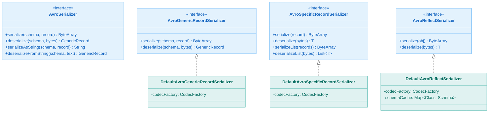
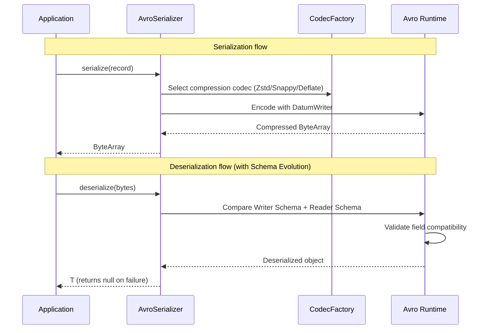
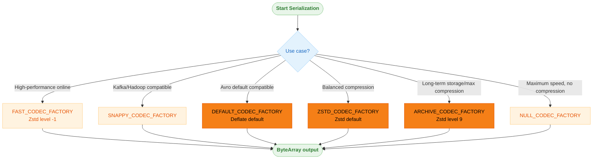

# Module bluetape4k-avro

English | [한국어](./README.ko.md)

## Overview

A module providing a high-level API for Apache Avro serialization and deserialization.

It supports various compression codecs (Zstandard, Snappy, Deflate, etc.) and offers a complete Avro serialization solution including Base64 string conversion, list serialization, and Schema Evolution.

## Serializer Types

Three serializers are available depending on your use case:

### AvroGenericRecordSerializer

- General-purpose serialization based on Avro `GenericRecord`
- Works with schema information alone — no code generation required
- Suitable for dynamic scenarios where the schema is determined at runtime

```kotlin
val serializer = DefaultAvroGenericRecordSerializer()
val schema = Employee.getClassSchema()

val bytes = serializer.serialize(schema, record)
val deserialized = serializer.deserialize(schema, bytes)
```

### AvroSpecificRecordSerializer

- Serialization based on `SpecificRecord` generated from Avro schema files (.avdl, .avsc)
- Guarantees compile-time type safety
- Supports single-object and list serialization/deserialization
- Supports Schema Evolution

```kotlin
val serializer = DefaultAvroSpecificRecordSerializer()

// Single object
val bytes = serializer.serialize(employee)
val deserialized = serializer.deserialize<Employee>(bytes)

// List
val listBytes = serializer.serializeList(employees)
val list = serializer.deserializeList<Employee>(listBytes)
```

### AvroReflectSerializer

- Reflection-based serialization — no code generation required
- Serializes existing POJOs/data classes to Avro without modification
- Uses a per-class schema cache to reduce reflection overhead on repeated serialization
- Convenient but may be slower than SpecificRecord due to reflection overhead

```kotlin
val serializer = DefaultAvroReflectSerializer()

val bytes = serializer.serialize(employee)
val deserialized = serializer.deserialize<Employee>(bytes)
```

`DefaultAvroReflectSerializer` uses
`ReflectDatumReader` for deserialization. When given a corrupted byte array or an invalid Base64 string, it returns
`null` instead of propagating an exception.

## Compression Codec Support

Pre-defined `CodecFactory` constants for easy codec selection:

| Constant                | Algorithm                    | Characteristics                                         |
|-------------------------|------------------------------|---------------------------------------------------------|
| `DEFAULT_CODEC_FACTORY` | Deflate (Avro default level) | Same as Avro default; general-purpose compression       |
| `ZSTD_CODEC_FACTORY`    | Zstandard (default level)    | Balanced Zstd compression                               |
| `FAST_CODEC_FACTORY`    | Zstandard (level -1)         | LZ4/Snappy-level speed                                  |
| `ARCHIVE_CODEC_FACTORY` | Zstandard (level 9)          | Maximum compression ratio for long-term storage         |
| `NULL_CODEC_FACTORY`    | None                         | Maximum speed, no compression                           |
| `DEFLATE_CODEC_FACTORY` | Deflate (level 6)            | Standard compression, high compatibility                |
| `SNAPPY_CODEC_FACTORY`  | Snappy                       | Fast compression/decompression, Hadoop/Kafka compatible |
| `BZIP2_CODEC_FACTORY`   | BZip2                        | High compression ratio, slower processing               |
| `XZ_CODEC_FACTORY`      | XZ (level 6)                 | Archive-oriented compression                            |

You can also create a codec from a string:

```kotlin
val codec = codecFactoryOf("snappy")
val serializer = DefaultAvroSpecificRecordSerializer(codec)
```

## Performance and Reliability Guide

- High-performance online processing: `FAST_CODEC_FACTORY` or `SNAPPY_CODEC_FACTORY`
- Avro default compatibility: `DEFAULT_CODEC_FACTORY`
- Balanced Zstd: `ZSTD_CODEC_FACTORY`
- Storage optimization: `ARCHIVE_CODEC_FACTORY`, `BZIP2_CODEC_FACTORY`, `XZ_CODEC_FACTORY`
- Failure policy: The default serializer implementations in this module fail safely, returning `null` or
  `emptyList()` on deserialization failure.
- For high-traffic paths, prefer `SpecificRecord`; use `Reflect` only where flexibility is required.

## Base64 String Conversion

All serializers support Base64 string conversion:

```kotlin
val text = serializer.serializeAsString(employee)          // Base64 encode
val obj = serializer.deserializeFromString<Employee>(text) // Base64 decode
```

## Schema Evolution

`SpecificRecordSerializer` and
`ReflectSerializer` support Schema Evolution. Even when the writer schema and reader schema differ, deserialization succeeds as long as the schemas are compatible:

```kotlin
// Serialized with V1 -> Deserialized as V2 (new fields use default values)
val bytes = serializer.serialize(itemV1)
val itemV2 = serializer.deserialize<ItemV2>(bytes)

// Serialized with V2 -> Deserialized as V1 (removed fields are ignored)
val bytes = serializer.serialize(itemV2)
val itemV1 = serializer.deserialize<ItemV1>(bytes)
```

## Architecture Diagrams

### Serializer Class Hierarchy



### Avro Serialization/Deserialization Flow



### Compression Codec Selection Guide



## Dependencies

```kotlin
dependencies {
    implementation(project(":bluetape4k-avro"))

    // Additional compression codecs (optional)
    runtimeOnly("org.xerial.snappy:snappy-java")
    runtimeOnly("com.github.luben:zstd-jni")
    runtimeOnly("org.lz4:lz4-java")
    runtimeOnly("org.tukaani:xz")
}
```

## Running Tests

To quickly validate only the `io/avro` module:

```bash
./bin/repo-test-summary -- ./gradlew :bluetape4k-avro:test
```

To validate the module build and tests together:

```bash
./bin/repo-test-summary -- ./gradlew :bluetape4k-avro:build
```
