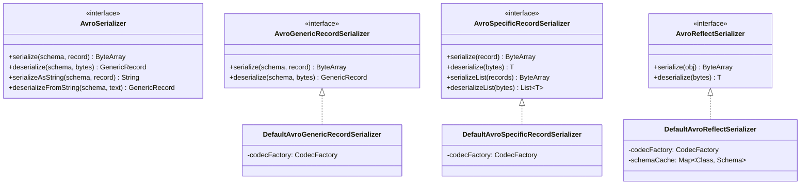
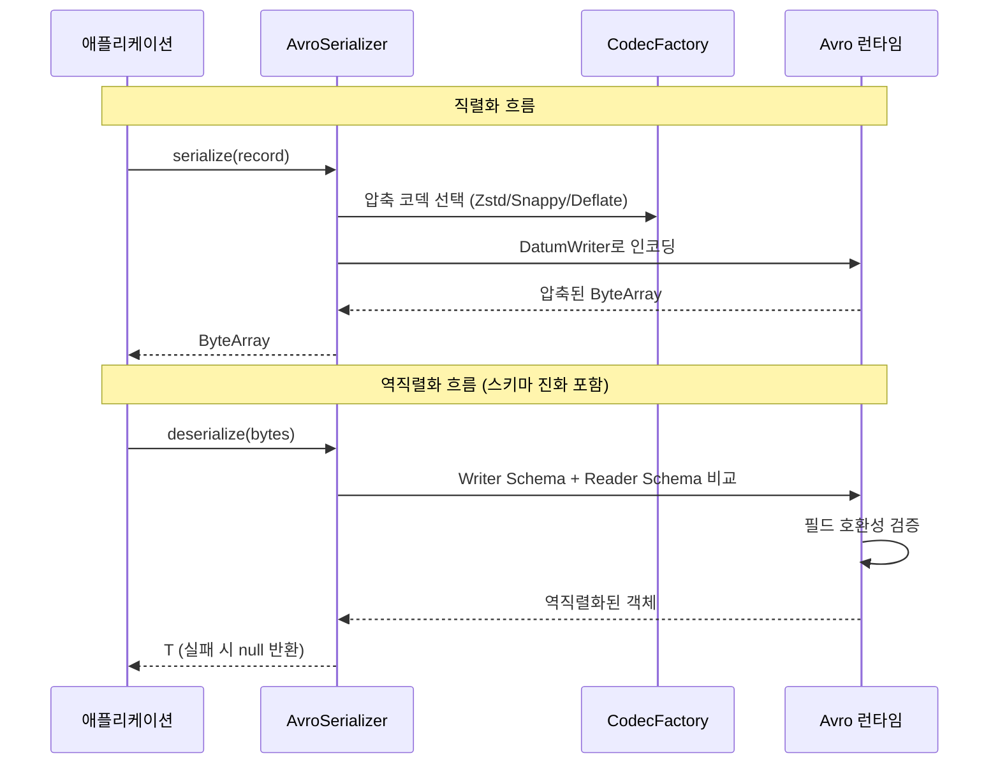
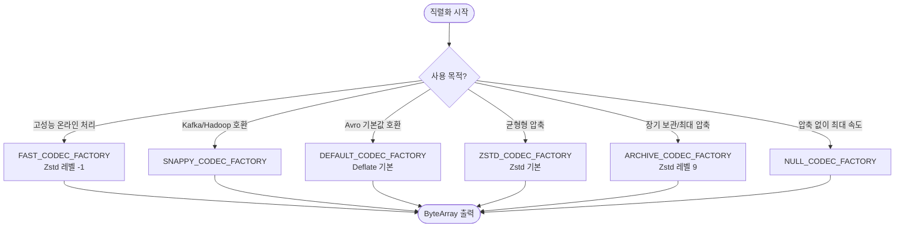

# Module bluetape4k-avro

## 개요

Apache Avro 직렬화/역직렬화를 위한 고수준 API를 제공하는 모듈입니다.

다양한 압축 코덱(Zstandard, Snappy, Deflate 등)을 지원하며, Base64 문자열 변환, 리스트 직렬화, 스키마 진화(Schema Evolution)를 포함한 완전한 Avro 직렬화 솔루션을 제공합니다.

## Serializer 종류

용도에 따라 3가지 Serializer를 제공합니다:

### AvroGenericRecordSerializer

- Avro `GenericRecord` 기반의 범용 직렬화
- 스키마 정보만으로 동작하므로 코드 생성이 필요 없음
- 스키마가 런타임에 결정되는 동적 시나리오에 적합

```kotlin
val serializer = DefaultAvroGenericRecordSerializer()
val schema = Employee.getClassSchema()

val bytes = serializer.serialize(schema, record)
val deserialized = serializer.deserialize(schema, bytes)
```

### AvroSpecificRecordSerializer

- Avro 스키마(.avdl, .avsc)로부터 코드 생성된 `SpecificRecord` 기반 직렬화
- 컴파일 타임 타입 안전성 보장
- 단일 객체 및 리스트 직렬화/역직렬화 지원
- 스키마 진화(Schema Evolution) 지원

```kotlin
val serializer = DefaultAvroSpecificRecordSerializer()

// 단일 객체
val bytes = serializer.serialize(employee)
val deserialized = serializer.deserialize<Employee>(bytes)

// 리스트
val listBytes = serializer.serializeList(employees)
val list = serializer.deserializeList<Employee>(listBytes)
```

### AvroReflectSerializer

- Reflection 기반 직렬화로 코드 생성 없이 사용 가능
- 기존 POJO/데이터 클래스를 변경 없이 Avro로 직렬화
- 클래스별 스키마 캐시를 사용해 반복 직렬화 시 Reflection 오버헤드를 줄임
- 편의성이 높지만 Reflection 오버헤드로 SpecificRecord보다 성능이 낮을 수 있음

```kotlin
val serializer = DefaultAvroReflectSerializer()

val bytes = serializer.serialize(employee)
val deserialized = serializer.deserialize<Employee>(bytes)
```

`DefaultAvroReflectSerializer`는 역직렬화에 `ReflectDatumReader`를 사용합니다.  
손상된 바이트 배열 또는 잘못된 Base64 문자열 입력 시 예외를 외부로 전파하지 않고 `null`을 반환합니다.

## 압축 코덱 지원

미리 정의된 `CodecFactory` 상수를 제공하여 간편하게 압축 방식을 선택할 수 있습니다:

| 상수                      | 알고리즘              | 특성                        |
|-------------------------|-------------------|---------------------------|
| `DEFAULT_CODEC_FACTORY` | Deflate (Avro 기본 레벨) | Avro 기본값과 동일한 범용 압축       |
| `ZSTD_CODEC_FACTORY`    | Zstandard (기본 레벨) | Zstd 균형형 압축               |
| `FAST_CODEC_FACTORY`    | Zstandard (레벨 -1) | LZ4/Snappy 수준의 빠른 속도      |
| `ARCHIVE_CODEC_FACTORY` | Zstandard (레벨 9)  | 최대 압축률, 장기 보관용            |
| `NULL_CODEC_FACTORY`    | 없음                | 압축 없이 최대 속도               |
| `DEFLATE_CODEC_FACTORY` | Deflate (레벨 6)    | 표준 압축, 높은 호환성             |
| `SNAPPY_CODEC_FACTORY`  | Snappy            | 빠른 압축/복원, Hadoop/Kafka 호환 |
| `BZIP2_CODEC_FACTORY`   | BZip2             | 높은 압축률, 느린 처리             |
| `XZ_CODEC_FACTORY`      | XZ (레벨 6)       | 아카이브 지향 압축                 |

문자열 기반으로 코덱을 생성할 수도 있습니다:

```kotlin
val codec = codecFactoryOf("snappy")
val serializer = DefaultAvroSpecificRecordSerializer(codec)
```

## 성능/안정성 운영 가이드

- 고성능 온라인 처리: `FAST_CODEC_FACTORY` 또는 `SNAPPY_CODEC_FACTORY`
- Avro 기본값 호환: `DEFAULT_CODEC_FACTORY`
- 균형형 Zstd: `ZSTD_CODEC_FACTORY`
- 저장 공간 최적화: `ARCHIVE_CODEC_FACTORY`, `BZIP2_CODEC_FACTORY`, `XZ_CODEC_FACTORY`
- 실패 허용 정책: 본 모듈의 serializer 기본 구현은 역직렬화 실패 시 `null` 또는 `emptyList()`로 안전 실패합니다.
- 대규모 트래픽 경로에서는 `SpecificRecord`를 우선 사용하고, `Reflect`는 유연성이 필요한 구간에 제한적으로 적용하는 것을 권장합니다.

## Base64 문자열 변환

모든 Serializer는 Base64 문자열 변환을 지원합니다:

```kotlin
val text = serializer.serializeAsString(employee)       // Base64 인코딩
val obj = serializer.deserializeFromString<Employee>(text) // Base64 디코딩
```

## 스키마 진화 (Schema Evolution)

`SpecificRecordSerializer`와 `ReflectSerializer`는 스키마 진화를 지원합니다. Writer 스키마와 Reader 스키마가 다르더라도, 호환 가능한 경우 정상적으로 역직렬화합니다:

```kotlin
// V1으로 직렬화 -> V2로 역직렬화 (새 필드는 기본값 사용)
val bytes = serializer.serialize(itemV1)
val itemV2 = serializer.deserialize<ItemV2>(bytes)

// V2로 직렬화 -> V1으로 역직렬화 (제거된 필드는 무시)
val bytes = serializer.serialize(itemV2)
val itemV1 = serializer.deserialize<ItemV1>(bytes)
```

## 아키텍처 다이어그램

### Serializer 클래스 계층



### Avro 직렬화/역직렬화 흐름



### 압축 코덱 선택 가이드



## 의존성

```kotlin
dependencies {
    implementation(project(":bluetape4k-avro"))

    // 추가 압축 코덱 (선택)
    runtimeOnly("org.xerial.snappy:snappy-java")
    runtimeOnly("com.github.luben:zstd-jni")
    runtimeOnly("org.lz4:lz4-java")
    runtimeOnly("org.tukaani:xz")
}
```

## 회귀 테스트 실행

`io/avro` 모듈만 빠르게 검증할 때:

```bash
./bin/repo-test-summary -- ./gradlew :bluetape4k-avro:test
```

모듈 빌드/테스트를 함께 검증할 때:

```bash
./bin/repo-test-summary -- ./gradlew :bluetape4k-avro:build
```
