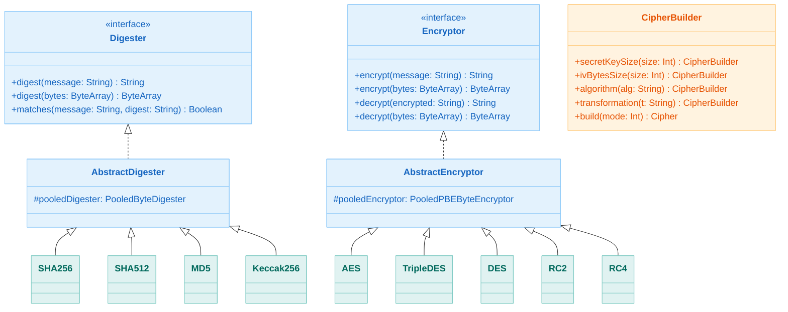
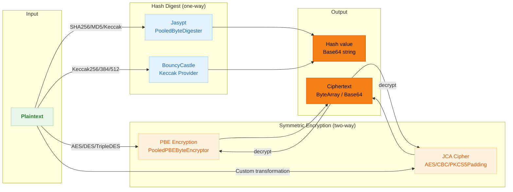

# Module bluetape4k-crypto

English | [한국어](./README.ko.md)

> **⚠️ Deprecated**: This module is deprecated. Use [`bluetape4k-tink`](../tink/README.md) for new development.
>
> | `bluetape4k-crypto` | `bluetape4k-tink` replacement |
> |-----|------|
> | `Digesters.SHA256` | `TinkDigesters.SHA256` |
> | `Encryptors.AES` | `TinkEncryptors.AES256_GCM` |
> | `Encryptors.DeterministicAES` | `TinkEncryptors.DETERMINISTIC_AES256_SIV` |
> | `"data".digest(Digesters.SHA256)` | `"data".tinkDigest(TinkDigesters.SHA256)` |
> | `"data".encrypt(Encryptors.AES)` | `"data".tinkEncrypt(TinkEncryptors.AES256_GCM)` |
> | `CipherBuilder` | Use `TinkAead` or JCA `Cipher` directly |
> | `Keccak256/384/512` | No replacement (BouncyCastle-only) |

## Overview

`bluetape4k-crypto` is an encryption module that wraps [Jasypt](http://www.jasypt.org/) and [BouncyCastle](https://www.bouncycastle.org/) for convenient use in Kotlin.

It provides hash digest, symmetric encryption, and a JCA Cipher builder, all of which are safe for use in multi-threaded environments.

## Key Features

### 1. Hash Digest

Supports various hashing algorithms including SHA-256, SHA-512, MD5, and Keccak.

```kotlin
import io.bluetape4k.crypto.digest.Digesters

// SHA-256 digest
val digest = Digesters.SHA256.digest("Hello, World!")
val matches = Digesters.SHA256.matches("Hello, World!", digest)  // true

// Keccak-256 digest (widely used in blockchain)
val keccakDigest = Digesters.KECCAK256.digest("Hello, World!")
```

### 2. Symmetric Encryption

Supports PBE (Password Based Encryption) algorithms including AES, DES, TripleDES, RC2, and RC4.

```kotlin
import io.bluetape4k.crypto.encrypt.Encryptors

// AES-256 encryption/decryption
val encrypted = Encryptors.AES.encrypt("Hello, World!")
val decrypted = Encryptors.AES.decrypt(encrypted)  // "Hello, World!"

// Using a custom password
val encryptor = AES(password = "my-secret-password-12chars")
val encrypted2 = encryptor.encrypt("Sensitive Data")
```

### 3. Extension Functions

Kotlin-style convenience extension functions.

```kotlin
import io.bluetape4k.crypto.digest.digest
import io.bluetape4k.crypto.digest.matchesDigest
import io.bluetape4k.crypto.encrypt.encrypt
import io.bluetape4k.crypto.encrypt.decrypt

// Digest extension functions
val digest = "Hello".digest(Digesters.SHA256)
"Hello".matchesDigest(digest, Digesters.SHA256)  // true

// Encrypt extension functions
val encrypted = "Hello".encrypt(Encryptors.AES)
val decrypted = encrypted.decrypt(Encryptors.AES)  // "Hello"

// ByteArray extension functions
val bytes = "Hello".toByteArray()
val encryptedBytes = bytes.encrypt(Encryptors.AES)
val decryptedBytes = encryptedBytes.decrypt(Encryptors.AES)
```

### 4. JCA Cipher Builder

Build JCA (Java Cryptography Architecture) Cipher instances using a fluent builder pattern.

```kotlin
import io.bluetape4k.crypto.cipher.CipherBuilder
import io.bluetape4k.crypto.cipher.encrypt
import io.bluetape4k.crypto.cipher.decrypt
import javax.crypto.Cipher

val builder = CipherBuilder()
    .secretKeySize(16)
    .ivBytesSize(16)
    .algorithm("AES")
    .transformation("AES/CBC/PKCS5Padding")

val encryptCipher = builder.build(Cipher.ENCRYPT_MODE)
val decryptCipher = builder.build(Cipher.DECRYPT_MODE)

val encrypted = encryptCipher.encrypt("Hello".toByteArray())
val decrypted = decryptCipher.decrypt(encrypted)
```

## Algorithm Comparison

### Digest Algorithms

| Algorithm  | Hash Size | Security Level | Recommended Use               |
|------------|-----------|----------------|-------------------------------|
| SHA-256    | 256-bit   | High           | General-purpose (recommended) |
| SHA-384    | 384-bit   | High           | High-security requirements    |
| SHA-512    | 512-bit   | High           | Maximum security              |
| KECCAK-256 | 256-bit   | High           | Blockchain, SHA-3 compatible  |
| KECCAK-384 | 384-bit   | High           | SHA-3 compatible              |
| KECCAK-512 | 512-bit   | High           | SHA-3 compatible              |
| SHA-1      | 160-bit   | Low            | Legacy compatibility only     |
| MD5        | 128-bit   | Low            | Checksums (non-security)      |

### Encryption Algorithms

| Algorithm | PBE Algorithm               | Security Level | Recommended Use               |
|-----------|-----------------------------|----------------|-------------------------------|
| AES       | PBEWITHHMACSHA256ANDAES_256 | High           | General-purpose (recommended) |
| TripleDES | PBEWithMD5AndTripleDES      | Moderate       | Legacy compatibility          |
| DES       | PBEWITHMD5ANDDES            | Low            | Legacy compatibility only     |
| RC2       | PBEWITHSHA1ANDRC2_128       | Low            | Legacy compatibility only     |
| RC4       | PBEWITHSHA1ANDRC4_128       | Low            | Legacy compatibility only     |

## Thread Safety

- **Digester**: Uses Jasypt `PooledByteDigester` (pool size: 8)
- **Encryptor**: Uses Jasypt `PooledPBEByteEncryptor` (pool size: 2 × CPU count)
- **CipherBuilder**: Creates a new `Cipher` instance on each call
- BouncyCastle provider registration is protected by `ReentrantLock`

## Architecture Diagrams

### Encryption Class Hierarchy



### Encryption/Decryption Data Flow



## Dependencies

```kotlin
dependencies {
    implementation(project(":bluetape4k-crypto"))
}
```

Internally uses the following libraries:

- [Jasypt](http://www.jasypt.org/) - Java Simplified Encryption
- [BouncyCastle](https://www.bouncycastle.org/) - bcprov, bcpkix

## Module Structure

```
io.bluetape4k.crypto
├── CryptographySupport.kt              # Utilities (randomBytes, BouncyCastle registration)
├── digest/
│   ├── Digester.kt                      # Digester interface
│   ├── AbstractDigester.kt              # Abstract implementation (wraps PooledByteDigester)
│   ├── Digesters.kt                     # Factory singleton
│   ├── DigesterExtensions.kt            # String/ByteArray extension functions
│   ├── SHA256.kt, SHA384.kt, SHA512.kt  # SHA-2 family
│   ├── SHA1.kt, MD5.kt                  # Legacy algorithms
│   └── Keccak256.kt, Keccak384.kt, Keccak512.kt  # Keccak family
├── encrypt/
│   ├── Encryptor.kt                     # Encryptor interface
│   ├── AbstractEncryptor.kt             # Abstract implementation (wraps PooledPBEByteEncryptor)
│   ├── Encryptors.kt                    # Factory singleton
│   ├── EncryptorExtensions.kt           # String/ByteArray extension functions
│   ├── EncryptorSupport.kt              # Default password configuration
│   ├── AES.kt                           # AES-256 (recommended)
│   ├── DES.kt, TripleDES.kt            # DES family
│   └── RC2.kt, RC4.kt                  # RC family
└── cipher/
    ├── CipherBuilder.kt                 # JCA Cipher builder
    └── CipherExtensions.kt             # Cipher extension functions
```

## Testing

```bash
# Run all tests
./gradlew :bluetape4k-crypto:test

# Run specific tests
./gradlew :bluetape4k-crypto:test --tests "io.bluetape4k.crypto.digest.DigesterTest"
./gradlew :bluetape4k-crypto:test --tests "io.bluetape4k.crypto.encrypt.EncryptorTest"
```

## References

- [Jasypt](http://www.jasypt.org/) - Java Simplified Encryption
- [BouncyCastle](https://www.bouncycastle.org/) - Cryptography provider
- [JCA Reference Guide](https://docs.oracle.com/en/java/javase/21/security/java-cryptography-architecture-jca-reference-guide.html) - Java Cryptography Architecture
