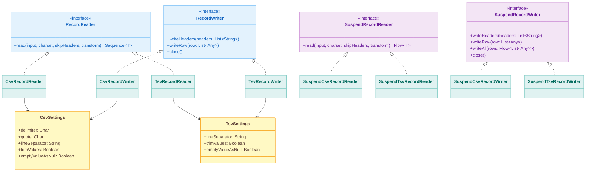
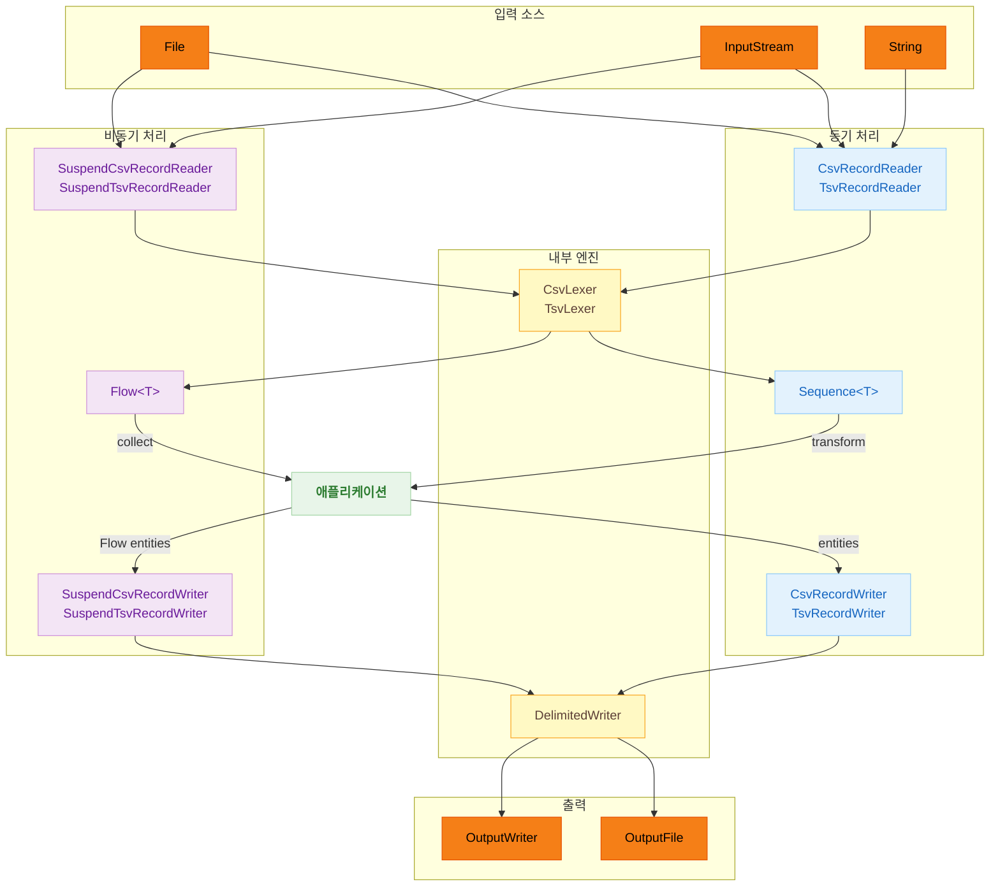

# Module bluetape4k-csv

[English](./README.md) | 한국어

## 개요

`bluetape4k-csv`는 RFC 4180을 준수하는 자체 구현 엔진을 사용하는 Kotlin 네이티브 CSV/TSV 파싱 라이브러리입니다.

CSV와 TSV 포맷의 읽기/쓰기를 위한 `RecordReader`/`RecordWriter` 인터페이스를 제공하며, Kotlin Coroutines 기반의 비동기 버전(`SuspendRecordReader`/`SuspendRecordWriter`)도 지원합니다.

v1.5.0부터 내부 엔진이 univocity-parsers에서 자체 구현 상태 기계로 교체되었습니다. 마이그레이션 방법은 [MIGRATION.md](./MIGRATION.md)를 참조하세요.

## 아키텍처

### 클래스 구조



### CSV/TSV 처리 흐름



## 주요 기능

### 동기 vs 비동기 API 비교

| 기능     | 동기 (Sequence)     | 비동기 (Flow)               |
|--------|-------------------|--------------------------|
| CSV 읽기 | `CsvRecordReader` | `SuspendCsvRecordReader` |
| CSV 쓰기 | `CsvRecordWriter` | `SuspendCsvRecordWriter` |
| TSV 읽기 | `TsvRecordReader` | `SuspendTsvRecordReader` |
| TSV 쓰기 | `TsvRecordWriter` | `SuspendTsvRecordWriter` |
| 반환 타입  | `Sequence<T>`     | `Flow<T>`                |
| 쓰기 함수  | 일반 함수             | `suspend` 함수             |

### 설정 옵션

| 설정                | CSV 기본값  | TSV 기본값  | 설명                               |
|-------------------|---------|---------|----------------------------------|
| `delimiter`       | `,`     | `\t` 고정 | 필드 구분 문자                         |
| `quote`           | `"`     | N/A     | 인용 문자 (CSV 전용)                   |
| `lineSeparator`   | `\r\n`  | `\n`    | 레코드 구분자                          |
| `trimValues`      | `false` | `false` | 앞뒤 공백 제거 여부 (reader 전용)         |
| `emptyValueAsNull`| `true`  | `true`  | 인용 없는 빈 필드 → `null`              |
| `maxCharsPerColumn`| 100,000| 100,000 | 컬럼당 최대 문자 수                      |

### null vs 빈 문자열

- `null` → 쓰기 시 인용 없는 빈 필드; `emptyValueAsNull=true`이면 읽을 때 `null`로 복원
- `""` (빈 문자열) → 쓰기 시 `""` 인용 출력; 읽을 때 `""` (빈 문자열)로 복원

## 사용 예제

### CSV 읽기

```kotlin
import io.bluetape4k.csv.CsvRecordReader

val reader = CsvRecordReader()
val items: Sequence<Item> = reader.read(inputStream, Charsets.UTF_8, skipHeaders = true) { record ->
    Item(record.getString("name"), record.getIntOrNull("age") ?: 0)
}
```

### 커스텀 설정

```kotlin
import io.bluetape4k.csv.CsvSettings
import io.bluetape4k.csv.CsvRecordReader

val settings = CsvSettings(
    delimiter = ';',
    trimValues = true,
    emptyValueAsNull = false,
    maxCharsPerColumn = 500_000,
)
val reader = CsvRecordReader(settings)
```

### CSV 쓰기

```kotlin
import io.bluetape4k.csv.CsvRecordWriter

val writer = CsvRecordWriter(outputWriter)
writer.writeHeaders("name", "age")
writer.writeRow(listOf("Alice", 20))
writer.writeRow(listOf("Bob", 30))
writer.close()
```

### TSV 읽기/쓰기

```kotlin
import io.bluetape4k.csv.TsvRecordReader
import io.bluetape4k.csv.TsvRecordWriter

// 읽기
val reader = TsvRecordReader()
val records = reader.read(inputStream)

// 쓰기
val writer = TsvRecordWriter(outputWriter)
writer.writeHeaders("name", "age")
writer.writeRow(listOf("Alice", 20))
writer.close()
```

### File/InputStream 확장 함수

```kotlin
import io.bluetape4k.csv.readAsCsvRecords
import io.bluetape4k.csv.readAsTsvRecords
import io.bluetape4k.csv.writeCsvRecords
import io.bluetape4k.csv.writeTsvRecords

// File에서 직접 읽기
val csvRecords = File("data.csv").readAsCsvRecords()
val tsvRecords = File("data.tsv").readAsTsvRecords()

// File에서 transform으로 읽기
val items = File("data.csv").readAsCsvRecords(skipHeader = true) { record ->
    Item(record.getString("name"), record.getIntOrNull("age") ?: 0)
}

// File에 직접 쓰기
File("output.csv").writeCsvRecords(
    headers = listOf("name", "age"),
    rows = listOf(listOf("Alice", 20), listOf("Bob", 30))
)

// File에 엔티티를 변환하여 쓰기
File("output.csv").writeCsvRecords(
    headers = listOf("name", "age"),
    entities = people,
) { person -> listOf(person.name, person.age) }
```

### Coroutines 비동기 읽기

```kotlin
import io.bluetape4k.csv.coroutines.SuspendCsvRecordReader

val reader = SuspendCsvRecordReader()
val items: Flow<Item> = reader.read(inputStream, Charsets.UTF_8, skipHeaders = true) { record ->
    Item(record.getString("name"), record.getIntOrNull("age") ?: 0)
}

items.collect { item -> println(item) }
```

### Coroutines 비동기 쓰기

```kotlin
import io.bluetape4k.csv.coroutines.SuspendCsvRecordWriter

val writer = SuspendCsvRecordWriter(outputWriter)
writer.writeHeaders("name", "age")
writer.writeRow(listOf("Alice", 20))

// Flow를 통한 대량 쓰기
val dataFlow: Flow<List<Any>> = flowOf(listOf("Bob", 30), listOf("Charlie", 25))
writer.writeAll(dataFlow)
writer.close()
```

## 모듈 구조

```
io.bluetape4k.csv
├── CsvSettings.kt                    # CSV 파서/라이터 설정
├── TsvSettings.kt                    # TSV 파서/라이터 설정
├── CvsParserDefaults.kt              # 공통 상수 (MAX_CHARS_PER_COLUMN)
├── Record.kt                         # 공개 레코드 인터페이스
├── RecordReader.kt                   # 읽기 인터페이스 (Sequence 기반)
├── RecordWriter.kt                   # 쓰기 인터페이스
├── CsvRecordReader.kt                # CSV 읽기 구현체
├── CsvRecordWriter.kt                # CSV 쓰기 구현체
├── TsvRecordReader.kt                # TSV 읽기 구현체
├── TsvRecordWriter.kt                # TSV 쓰기 구현체
├── RecordReaderSupport.kt            # File/InputStream 읽기 확장 함수
├── RecordWriterSupport.kt            # File 쓰기 확장 함수
├── internal/                         # 내부 엔진 (공개 API 아님)
│   ├── CsvLexer.kt                   # RFC 4180 CSV 상태 기계 렉서
│   ├── TsvLexer.kt                   # TSV 상태 기계 렉서 (백슬래시 이스케이프)
│   ├── DelimitedWriter.kt            # 핵심 구분자 필드 라이터
│   ├── CsvLineWriter.kt              # CSV 전용 라이터
│   ├── TsvLineWriter.kt              # TSV 전용 라이터
│   ├── ArrayRecord.kt                # Record 구현체
│   └── RecordFactory.kt              # Record 생성 헬퍼
└── coroutines/                       # Coroutines 비동기 지원
    ├── SuspendRecordReader.kt        # 비동기 읽기 인터페이스 (Flow 기반)
    ├── SuspendRecordWriter.kt        # 비동기 쓰기 인터페이스
    ├── SuspendCsvRecordReader.kt     # 비동기 CSV 읽기 (channelFlow + ensureActive)
    ├── SuspendCsvRecordWriter.kt     # 비동기 CSV 쓰기 (Mutex 동시성 보호)
    ├── SuspendTsvRecordReader.kt     # 비동기 TSV 읽기 (channelFlow + ensureActive)
    ├── SuspendTsvRecordWriter.kt     # 비동기 TSV 쓰기 (Mutex 동시성 보호)
    └── SuspendRecordReaderSupport.kt # 비동기 File/InputStream 확장 함수
```

## 의존성

```kotlin
dependencies {
    implementation(project(":bluetape4k-csv"))

    // Coroutines 비동기 API 사용 시
    implementation("org.jetbrains.kotlinx:kotlinx-coroutines-core")
}
```

## v1.4.x에서 마이그레이션

univocity-parsers 타입을 직접 사용했다면 [MIGRATION.md](./MIGRATION.md)를 참조하세요.

## 참고

- [CSV (RFC 4180)](https://datatracker.ietf.org/doc/html/rfc4180)
