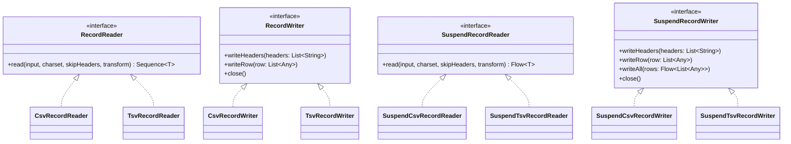
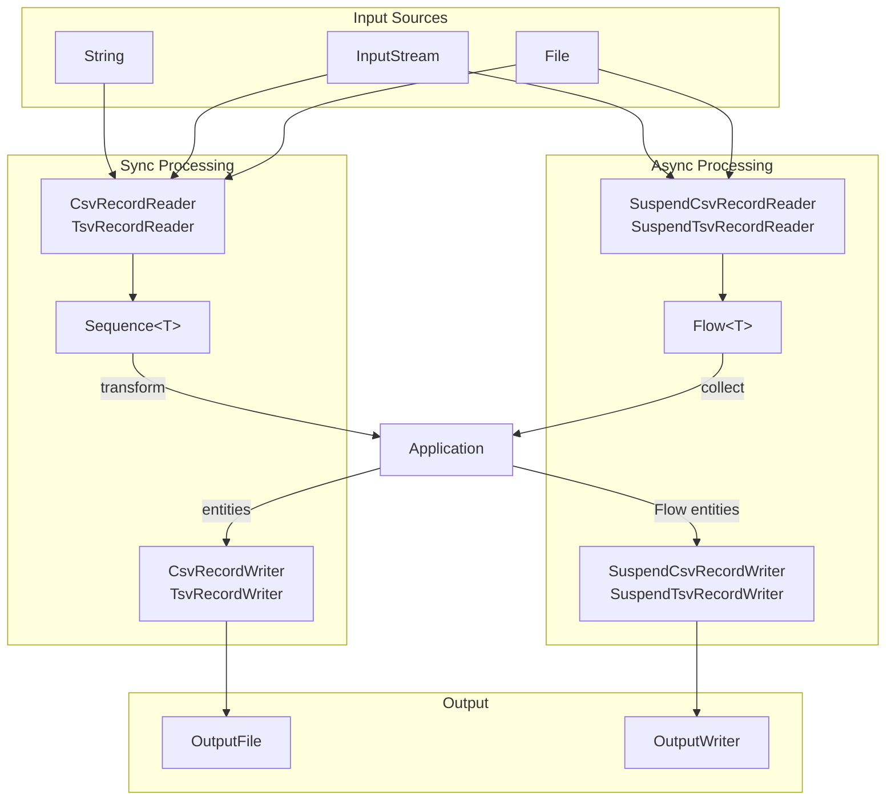

# Module bluetape4k-csv

English | [한국어](./README.ko.md)

## Overview

`bluetape4k-csv` is a Kotlin-friendly wrapper around the [Univocity Parsers](https://github.com/uniVocity/univocity-parsers) library.

It provides `RecordReader`/`RecordWriter` interfaces for reading and writing CSV and TSV formats, along with async versions based on Kotlin Coroutines (`SuspendRecordReader`/`SuspendRecordWriter`).

## Key Features

### 1. Reading CSV

```kotlin
import io.bluetape4k.csv.CsvRecordReader

val reader = CsvRecordReader()
val items: Sequence<Item> = reader.read(inputStream, Charsets.UTF_8, skipHeaders = true) { record ->
    Item(record.getString("name"), record.getInt("age"))
}
```

### 2. Writing CSV

```kotlin
import io.bluetape4k.csv.CsvRecordWriter

val writer = CsvRecordWriter(outputWriter)
writer.writeHeaders("name", "age")
writer.writeRow(listOf("Alice", 20))
writer.writeRow(listOf("Bob", 30))
writer.close()
```

### 3. TSV Reading/Writing

TSV format is supported with the same API as CSV.

```kotlin
import io.bluetape4k.csv.TsvRecordReader
import io.bluetape4k.csv.TsvRecordWriter

// Reading
val reader = TsvRecordReader()
val records = reader.read(inputStream)

// Writing
val writer = TsvRecordWriter(outputWriter)
writer.writeHeaders("name", "age")
writer.writeRow(listOf("Alice", 20))
writer.close()
```

### 4. File/InputStream Extension Functions

```kotlin
import io.bluetape4k.csv.readAsCsvRecords
import io.bluetape4k.csv.readAsTsvRecords
import io.bluetape4k.csv.writeCsvRecords
import io.bluetape4k.csv.writeTsvRecords

// Read directly from a File
val csvRecords = File("data.csv").readAsCsvRecords()
val tsvRecords = File("data.tsv").readAsTsvRecords()

// Read from a File with a transform
val items = File("data.csv").readAsCsvRecords(skipHeader = true) { record ->
    Item(record.getString("name"), record.getInt("age"))
}

// Read from an InputStream
val records = inputStream.readAsCsvRecords(Charsets.UTF_8, skipHeader = true)

// Read from an InputStream with a transform
val items2 = inputStream.readAsCsvRecords(Charsets.UTF_8, skipHeader = true) { record ->
    Item(record.getString("name"), record.getInt("age"))
}

// Write directly to a File
File("output.csv").writeCsvRecords(
    headers = listOf("name", "age"),
    rows = listOf(listOf("Alice", 20), listOf("Bob", 30))
)

// Write entities to a File with a transform
File("output.csv").writeCsvRecords(
    headers = listOf("name", "age"),
    entities = people,
) { person -> listOf(person.name, person.age) }
```

### 5. Coroutines Async Reading

Reads CSV/TSV data asynchronously using Kotlin Flow.

```kotlin
import io.bluetape4k.csv.coroutines.SuspendCsvRecordReader

val reader = SuspendCsvRecordReader()
val items: Flow<Item> = reader.read(inputStream, Charsets.UTF_8, skipHeaders = true) { record ->
    Item(record.getString("name"), record.getInt("age"))
}

items.collect { item -> println(item) }
```

### 6. Coroutines Async Writing

Supports async writing from various data sources including Flow.

```kotlin
import io.bluetape4k.csv.coroutines.SuspendCsvRecordWriter

val writer = SuspendCsvRecordWriter(outputWriter)
writer.writeHeaders("name", "age")
writer.writeRow(listOf("Alice", 20))

// Bulk write via Flow
val dataFlow: Flow<List<Any>> = flowOf(listOf("Bob", 30), listOf("Charlie", 25))
writer.writeAll(dataFlow)
writer.close()
```

## Sync vs Async API Comparison

| Feature | Sync (Sequence) | Async (Flow) |
|---------|-----------------|--------------|
| CSV reading | `CsvRecordReader` | `SuspendCsvRecordReader` |
| CSV writing | `CsvRecordWriter` | `SuspendCsvRecordWriter` |
| TSV reading | `TsvRecordReader` | `SuspendTsvRecordReader` |
| TSV writing | `TsvRecordWriter` | `SuspendTsvRecordWriter` |
| Return type | `Sequence<T>` | `Flow<T>` |
| Write functions | Regular functions | `suspend` functions |

## Default Parser Settings

All parsers and writers use the following defaults:

- **Max characters per column**: 100,000
- **Value trimming**: Enabled (parsers only)

You can pass custom `CsvParserSettings`/`TsvParserSettings` when needed:

```kotlin
val customSettings = CsvParserSettings().apply {
    trimValues(false)
    maxCharsPerColumn = 500_000
}
val reader = CsvRecordReader(customSettings)
```

## Architecture Diagrams

### Class Structure



### CSV/TSV Processing Flow



## Dependencies

```kotlin
dependencies {
    implementation(project(":bluetape4k-csv"))

    // Required for Coroutines async API
    implementation("org.jetbrains.kotlinx:kotlinx-coroutines-core")
}
```

## Module Structure

```
io.bluetape4k.csv
├── CvsParserDefaults.kt              # Default CSV/TSV parser settings
├── RecordReader.kt                   # Read interface (Sequence-based)
├── RecordWriter.kt                   # Write interface
├── CsvRecordReader.kt                # CSV reader implementation
├── CsvRecordWriter.kt                # CSV writer implementation
├── TsvRecordReader.kt                # TSV reader implementation
├── TsvRecordWriter.kt                # TSV writer implementation
├── RecordReaderSupport.kt            # File/InputStream read extension functions
├── RecordWriterSupport.kt            # File write extension functions
└── coroutines/                       # Coroutines async support
    ├── SuspendRecordReader.kt        # Async read interface (Flow-based)
    ├── SuspendRecordWriter.kt        # Async write interface
    ├── SuspendCsvRecordReader.kt     # Async CSV reader implementation
    ├── SuspendCsvRecordWriter.kt     # Async CSV writer implementation
    ├── SuspendTsvRecordReader.kt     # Async TSV reader implementation
    └── SuspendTsvRecordWriter.kt     # Async TSV writer implementation
```

## Testing

```bash
./gradlew :bluetape4k-csv:test
```

## References

- [Univocity Parsers](https://github.com/uniVocity/univocity-parsers)
- [CSV (RFC 4180)](https://datatracker.ietf.org/doc/html/rfc4180)
