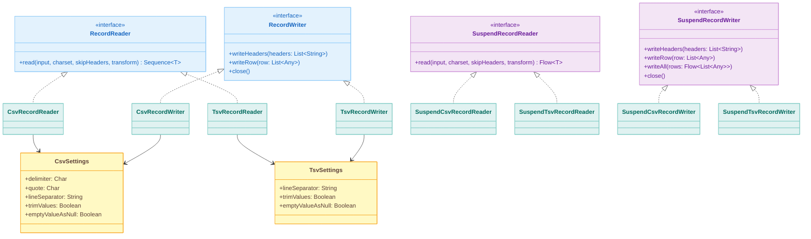
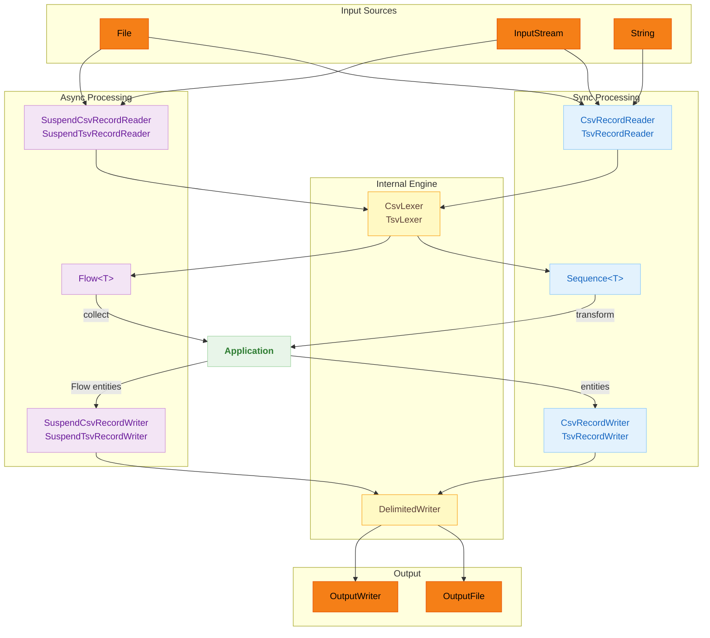

# Module bluetape4k-csv

English | [한국어](./README.ko.md)

## Overview

`bluetape4k-csv` is a Kotlin-native CSV/TSV parsing library with a self-implemented RFC 4180 compliant engine.

It provides `RecordReader`/`RecordWriter` interfaces for reading and writing CSV and TSV formats, along with async versions based on Kotlin Coroutines (`SuspendRecordReader`/`SuspendRecordWriter`).

Since v1.5.0 the internal engine has been replaced from univocity-parsers to a self-implemented state machine. See [MIGRATION.md](./MIGRATION.md) for migration details.

## Architecture

### Class Structure



### CSV/TSV Processing Flow



## Key Features

### Sync vs Async API

| Feature         | Sync (Sequence)   | Async (Flow)             |
|-----------------|-------------------|--------------------------|
| CSV reading     | `CsvRecordReader` | `SuspendCsvRecordReader` |
| CSV writing     | `CsvRecordWriter` | `SuspendCsvRecordWriter` |
| TSV reading     | `TsvRecordReader` | `SuspendTsvRecordReader` |
| TSV writing     | `TsvRecordWriter` | `SuspendTsvRecordWriter` |
| Return type     | `Sequence<T>`     | `Flow<T>`                |
| Write functions | Regular functions | `suspend` functions      |

### Settings

| Setting           | CSV default | TSV default | Description                              |
|-------------------|-------------|-------------|------------------------------------------|
| `delimiter`       | `,`         | `\t` (fixed)| Field separator                          |
| `quote`           | `"`         | N/A         | Quote character (CSV only)               |
| `lineSeparator`   | `\r\n`      | `\n`        | Record separator                         |
| `trimValues`      | `false`     | `false`     | Trim leading/trailing whitespace (reader)|
| `emptyValueAsNull`| `true`      | `true`      | Empty unquoted field → `null`            |
| `maxCharsPerColumn`| 100,000    | 100,000     | Per-column character limit               |

### null vs Empty String

- `null` → unquoted empty field on write; read back as `null` when `emptyValueAsNull=true`
- `""` (empty string) → `""` quoted field on write; read back as `""` (empty string)

## Usage Examples

### Reading CSV

```kotlin
import io.bluetape4k.csv.CsvRecordReader

val reader = CsvRecordReader()
val items: Sequence<Item> = reader.read(inputStream, Charsets.UTF_8, skipHeaders = true) { record ->
    Item(record.getString("name"), record.getIntOrNull("age") ?: 0)
}
```

### Custom Settings

```kotlin
import io.bluetape4k.csv.CsvSettings
import io.bluetape4k.csv.CsvRecordReader

val settings = CsvSettings(
    delimiter = ';',
    trimValues = true,
    emptyValueAsNull = false,
    maxCharsPerColumn = 500_000,
)
val reader = CsvRecordReader(settings)
```

### Writing CSV

```kotlin
import io.bluetape4k.csv.CsvRecordWriter

val writer = CsvRecordWriter(outputWriter)
writer.writeHeaders("name", "age")
writer.writeRow(listOf("Alice", 20))
writer.writeRow(listOf("Bob", 30))
writer.close()
```

### TSV Reading/Writing

```kotlin
import io.bluetape4k.csv.TsvRecordReader
import io.bluetape4k.csv.TsvRecordWriter

// Reading
val reader = TsvRecordReader()
val records = reader.read(inputStream)

// Writing
val writer = TsvRecordWriter(outputWriter)
writer.writeHeaders("name", "age")
writer.writeRow(listOf("Alice", 20))
writer.close()
```

### File/InputStream Extension Functions

```kotlin
import io.bluetape4k.csv.readAsCsvRecords
import io.bluetape4k.csv.readAsTsvRecords
import io.bluetape4k.csv.writeCsvRecords
import io.bluetape4k.csv.writeTsvRecords

// Read directly from a File
val csvRecords = File("data.csv").readAsCsvRecords()
val tsvRecords = File("data.tsv").readAsTsvRecords()

// Read from a File with a transform
val items = File("data.csv").readAsCsvRecords(skipHeader = true) { record ->
    Item(record.getString("name"), record.getIntOrNull("age") ?: 0)
}

// Write directly to a File
File("output.csv").writeCsvRecords(
    headers = listOf("name", "age"),
    rows = listOf(listOf("Alice", 20), listOf("Bob", 30))
)

// Write entities to a File with a transform
File("output.csv").writeCsvRecords(
    headers = listOf("name", "age"),
    entities = people,
) { person -> listOf(person.name, person.age) }
```

### Coroutines Async Reading

```kotlin
import io.bluetape4k.csv.coroutines.SuspendCsvRecordReader

val reader = SuspendCsvRecordReader()
val items: Flow<Item> = reader.read(inputStream, Charsets.UTF_8, skipHeaders = true) { record ->
    Item(record.getString("name"), record.getIntOrNull("age") ?: 0)
}

items.collect { item -> println(item) }
```

### Coroutines Async Writing

```kotlin
import io.bluetape4k.csv.coroutines.SuspendCsvRecordWriter

val writer = SuspendCsvRecordWriter(outputWriter)
writer.writeHeaders("name", "age")
writer.writeRow(listOf("Alice", 20))

// Bulk write via Flow
val dataFlow: Flow<List<Any>> = flowOf(listOf("Bob", 30), listOf("Charlie", 25))
writer.writeAll(dataFlow)
writer.close()
```

## Module Structure

```
io.bluetape4k.csv
├── CsvSettings.kt                    # CSV parser/writer settings
├── TsvSettings.kt                    # TSV parser/writer settings
├── CvsParserDefaults.kt              # Shared constants (MAX_CHARS_PER_COLUMN)
├── Record.kt                         # Public record interface
├── RecordReader.kt                   # Read interface (Sequence-based)
├── RecordWriter.kt                   # Write interface
├── CsvRecordReader.kt                # CSV reader implementation
├── CsvRecordWriter.kt                # CSV writer implementation
├── TsvRecordReader.kt                # TSV reader implementation
├── TsvRecordWriter.kt                # TSV writer implementation
├── RecordReaderSupport.kt            # File/InputStream read extension functions
├── RecordWriterSupport.kt            # File write extension functions
├── internal/                         # Internal engine (not public API)
│   ├── CsvLexer.kt                   # RFC 4180 CSV state machine lexer
│   ├── TsvLexer.kt                   # TSV state machine lexer (backslash escape)
│   ├── DelimitedWriter.kt            # Core delimited field writer
│   ├── CsvLineWriter.kt              # CSV-specific writer
│   ├── TsvLineWriter.kt              # TSV-specific writer
│   ├── ArrayRecord.kt                # Record implementation
│   └── RecordFactory.kt              # Record construction helpers
└── coroutines/                       # Coroutines async support
    ├── SuspendRecordReader.kt        # Async read interface (Flow-based)
    ├── SuspendRecordWriter.kt        # Async write interface
    ├── SuspendCsvRecordReader.kt     # Async CSV reader (channelFlow + ensureActive)
    ├── SuspendCsvRecordWriter.kt     # Async CSV writer (Mutex protected)
    ├── SuspendTsvRecordReader.kt     # Async TSV reader (channelFlow + ensureActive)
    ├── SuspendTsvRecordWriter.kt     # Async TSV writer (Mutex protected)
    └── SuspendRecordReaderSupport.kt # Async File/InputStream extension functions
```

## Dependencies

```kotlin
dependencies {
    implementation(project(":bluetape4k-csv"))

    // Required for Coroutines async API
    implementation("org.jetbrains.kotlinx:kotlinx-coroutines-core")
}
```

## Migration from v1.4.x

If you were using univocity-parsers types directly, see [MIGRATION.md](./MIGRATION.md).

## References

- [CSV (RFC 4180)](https://datatracker.ietf.org/doc/html/rfc4180)
