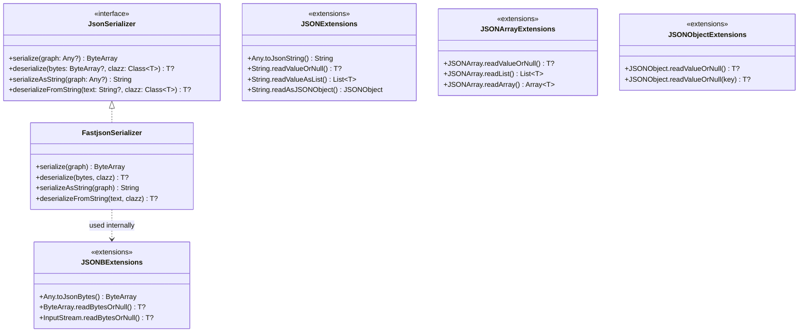
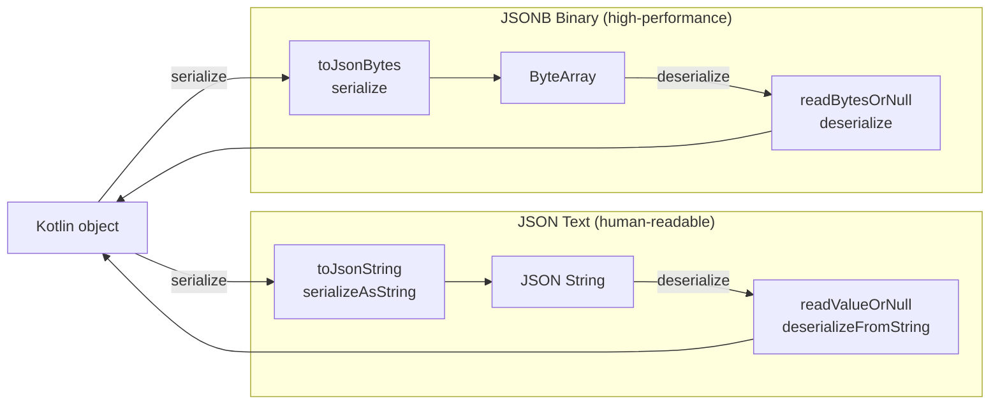

# Module bluetape4k-fastjson2

English | [한국어](./README.ko.md)

## Overview

`bluetape4k-fastjson2` is a module that wraps the [Fastjson2](https://github.com/alibaba/fastjson2) library as Kotlin extension functions.

It provides high-performance serialization using JSONB (binary JSON) format, as well as type-safe deserialization extension functions for various data sources including JSON strings,
`InputStream`, `JSONObject`, and `JSONArray`.

## Key Features

### 1. FastjsonSerializer

Implements the `JsonSerializer` interface, using JSONB for byte arrays and standard JSON for strings.

```kotlin
import io.bluetape4k.fastjson2.FastjsonSerializer

val serializer = FastjsonSerializer()

// JSONB binary serialization/deserialization (high-performance)
val bytes = serializer.serialize(user)
val restored = serializer.deserialize<User>(bytes)

// JSON string serialization/deserialization
val jsonText = serializer.serializeAsString(user)
val restored2 = serializer.deserializeFromString<User>(jsonText)

// Throws JsonSerializationException on failure
try {
    serializer.deserialize<User>(byteArrayOf(1, 2, 3))
} catch (e: JsonSerializationException) {
    // handle
}
```

`FastjsonSerializer` failure policy:

- `serialize(null)` returns an empty `ByteArray`; `serializeAsString(null)` returns an empty string.
- `deserialize(null)` / `deserializeFromString(null)` returns `null`.
- All other serialization/deserialization failures throw `JsonSerializationException`.

### 2. JSON String Extension Functions

Extension functions to convert JSON strings to various types.

```kotlin
import io.bluetape4k.fastjson2.extensions.*

// Object → JSON string
val json = user.toJsonString()

// JSON string → object
val user = json.readValueOrNull<User>()

// JSON array string → List
val users = jsonArrayString.readValueAsList<User>()

// JSON string → JSONObject
val jsonObject = json.readAsJSONObject()
```

### 3. JSONB Binary Extension Functions

Serializes/deserializes using Fastjson2's JSONB (binary JSON) format, which offers better performance and compression than text JSON.

```kotlin
import io.bluetape4k.fastjson2.extensions.*

// Object → JSONB byte array
val bytes = user.toJsonBytes()

// JSONB byte array → object
val restored = bytes.readBytesOrNull<User>()

// InputStream → object
val user = inputStream.readBytesOrNull<User>()
```

### 4. JSONArray Extension Functions

Type-safe data extraction from `JSONArray`.

```kotlin
import io.bluetape4k.fastjson2.extensions.*

val jsonArray: JSONArray = JSONArray()

// Convert entire array to a specific type
val data = jsonArray.readValueOrNull<MyData>()

// Convert element at a specific index
val user = jsonArray.readValueOrNull<User>(0)

// Convert to List or Array
val users = jsonArray.readList<User>()
val userArray = jsonArray.readArray<User>()
```

### 5. JSONObject Extension Functions

Type-safe data extraction from `JSONObject`.

```kotlin
import io.bluetape4k.fastjson2.extensions.*

val jsonObject: JSONObject = JSONObject()

// Convert entire object to a specific type
val user = jsonObject.readValueOrNull<User>()

// Convert value at a specific key
val user = jsonObject.readValueOrNull<User>("key")
```

## JSONB vs JSON Comparison

| Format         | Speed    | Size   | Readability | Use Case                           |
|----------------|----------|--------|-------------|------------------------------------|
| JSONB (binary) | Fast     | Small  | No          | Internal serialization, cache, RPC |
| JSON (text)    | Moderate | Medium | Yes         | API responses, logging, debugging  |

## Architecture Diagrams

### Class Structure



### JSON vs JSONB Serialization Flow



## Dependencies

```kotlin
dependencies {
    implementation(project(":bluetape4k-fastjson2"))

    // Included automatically
    // api("com.alibaba.fastjson2:fastjson2")
    // api("com.alibaba.fastjson2:fastjson2-kotlin")
}
```

## Module Structure

```
io.bluetape4k.fastjson2
├── FastjsonSerializer.kt              # JsonSerializer implementation
└── extensions/
    ├── JSONExtensions.kt              # String, InputStream extension functions
    ├── JSONBExtensions.kt             # JSONB binary extension functions
    ├── JSONArrayExtensions.kt         # JSONArray extension functions
    └── JSONObjectExtensions.kt        # JSONObject extension functions
```

## Testing

```bash
./gradlew :bluetape4k-fastjson2:test
```

## References

- [Fastjson2](https://github.com/alibaba/fastjson2)
- [JSONB Specification](https://github.com/alibaba/fastjson2/wiki/jsonb_format_cn)
