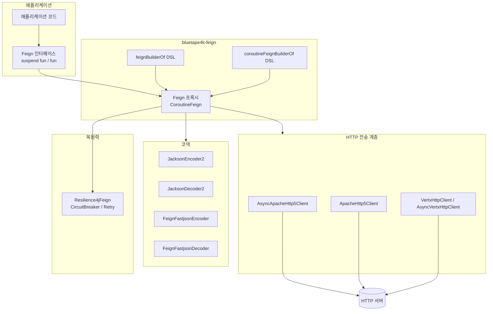
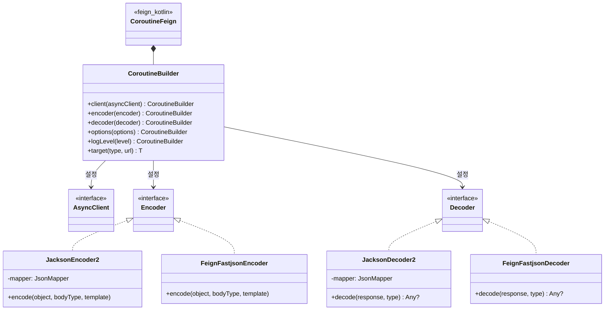
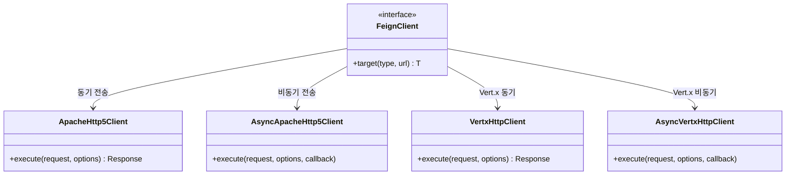
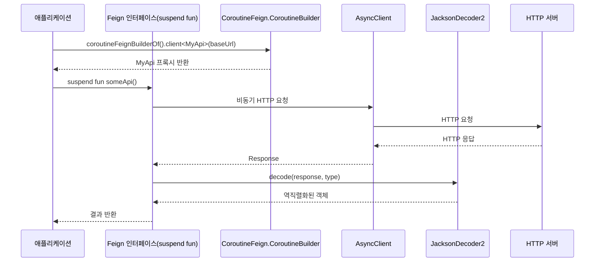

# Module bluetape4k-feign

[English](./README.md) | 한국어

## 개요

`bluetape4k-feign`은 [OpenFeign](https://github.com/OpenFeign/feign)을 Kotlin DSL과 Coroutines로 확장하여 제공하는 모듈입니다.

선언적 HTTP 클라이언트 정의를 통해 REST API 호출을 인터페이스 메서드처럼 사용할 수 있으며, Apache HC5, Vert.x 등 다양한 HTTP 전송 계층을 플러그인 방식으로 교체할 수 있습니다.

## 아키텍처

### 전체 아키텍처: Feign + Coroutines 통합



### 클래스 계층: Feign + Coroutines 통합 구조



### HTTP 전송 계층 옵션



### suspend 함수 기반 HTTP 요청 흐름



## 주요 기능

### 1. Feign Builder DSL

Kotlin DSL로 간편하게 Feign 클라이언트를 구성합니다.

```kotlin
import io.bluetape4k.feign.*

// DSL 방식
val api = feignBuilder {
    client(ApacheHttp5Client())
    encoder(JacksonEncoder())
    decoder(JacksonDecoder())
    logLevel(Logger.Level.BASIC)
}.client<GitHubApi>("https://api.github.com")

// 팩토리 함수 방식 (기본 사용)
val api = feignBuilderOf(
    client = ApacheHttp5Client(),
    encoder = JacksonEncoder(),
    decoder = JacksonDecoder(),
).client<GitHubApi>("https://api.github.com")

// 팩토리 함수 방식 + 추가 설정 (builder 람다 활용)
val api = feignBuilderOf(
    client = ApacheHttp5Client(),
    encoder = JacksonEncoder(),
    decoder = JacksonDecoder(),
) {
    // 추가 Feign.Builder 설정 적용
    retryer(Retryer.Default())
    errorDecoder(MyErrorDecoder())
}.client<GitHubApi>("https://api.github.com")
```

`feignBuilderOf` 계약:
- 기본값으로 `Encoder.Default()`와 `Decoder.Default()`를 적용합니다.
- `builder: Feign.Builder.() -> Unit = {}` 파라미터로 추가 설정을 인라인으로 지정할 수 있습니다.
- `inline fun`으로 구현되어 람다 호출 오버헤드가 없습니다.
- 기존에 오탈자로 제공되던 `feingBuilderOf`는 제거되었습니다. `feignBuilderOf`를 사용하세요.

### 2. Coroutines 지원

`CoroutineFeign`을 활용하여 suspend 함수 기반의 비동기 API 호출을 지원합니다.

```kotlin
import io.bluetape4k.feign.coroutines.*

// Coroutine Feign 클라이언트 생성
val api = coroutineFeignBuilderOf<Unit>(
    asyncClient = AsyncApacheHttp5Client(httpAsyncClientOf()),
    encoder = JacksonEncoder(),
    decoder = JacksonDecoder(),
).client<GitHubApi>("https://api.github.com")

// suspend 함수로 호출
suspend fun getUser(username: String): User {
    return api.getUser(username)
}
```

**동적 URL 지원:**

```kotlin
interface GitHubApi {
    // 첫 번째 인자로 URI를 전달하면 동적 URL 사용 가능
    @RequestLine("GET /users/{username}")
    fun getUser(host: URI, @Param("username") username: String): User
}

val api = feignBuilderOf(client = ApacheHttp5Client()).client<GitHubApi>()
val user = api.getUser(URI("https://api.github.com"), "octocat")
```

`bodyAsReader()` 계약:
- 응답 body가 없으면 `IllegalStateException("Response body is null.")`를 던집니다.

### 3. 다양한 HTTP 전송 계층

| 클라이언트                  | 특성                 | 용도            |
|------------------------|--------------------|---------------|
| ApacheHttp5Client      | 안정적, 풍부한 설정        | 동기 API 호출     |
| AsyncApacheHttp5Client | 비동기, Coroutines 통합 | 고성능 비동기 통신    |
| VertxHttpClient        | 이벤트 루프 기반, 경량      | Vert.x 생태계 통합 |
| AsyncVertxHttpClient   | Vert.x 비동기 클라이언트   | Vert.x 비동기 통신 |

```kotlin
// Vert.x 기반 Feign 클라이언트
val api = feignBuilderOf(
    client = VertxHttpClient(vertx),
).client<MyApi>("https://api.example.com")
```

### 4. 커스텀 Encoder/Decoder

Jackson, Fastjson2 등 다양한 직렬화 라이브러리를 Encoder/Decoder로 사용할 수 있습니다.

```kotlin
// Jackson (기본 권장)
val builder = feignBuilderOf(
    client = ApacheHttp5Client(),
    encoder = JacksonEncoder(),
    decoder = JacksonDecoder(),
)

// Fastjson2
val builder = feignBuilderOf(
    client = ApacheHttp5Client(),
    encoder = FeignFastjsonEncoder(),
    decoder = FeignFastjsonDecoder(),
)
```

### 5. Resilience4j 통합

Feign 클라이언트에 Circuit Breaker, Retry 등 Resilience4j 패턴을 적용할 수 있습니다.

```kotlin
import io.github.resilience4j.feign.Resilience4jFeign

val decoratedBuilder = Resilience4jFeign.builder(feignBuilderOf(
    client = ApacheHttp5Client(),
    encoder = JacksonEncoder(),
    decoder = JacksonDecoder(),
))
```

## 사용 예시

### API 정의

```kotlin
interface HttpbinApi {
    @RequestLine("GET /get")
    fun get(): HttpbinResponse

    @RequestLine("POST /post")
    @Headers("Content-Type: application/json")
    fun post(body: Map<String, Any>): HttpbinResponse

    @RequestLine("GET /status/{code}")
    fun status(@Param("code") code: Int): feign.Response
}

// Coroutine API
interface HttpbinCoroutineApi {
    @RequestLine("GET /get")
    suspend fun get(): HttpbinResponse

    @RequestLine("POST /post")
    @Headers("Content-Type: application/json")
    suspend fun post(body: Map<String, Any>): HttpbinResponse
}
```

## 모듈 구조

```
io.bluetape4k.feign
├── FeignBuilderSupport.kt           # Feign Builder DSL 및 팩토리 함수
├── FeignRequestSupport.kt           # Request 유틸리티
├── FeignResponseSupport.kt          # Response 유틸리티
├── clients/                         # HTTP 전송 계층
│   └── vertx/                       # Vert.x 기반 클라이언트
│       ├── VertxHttpClient.kt       # 동기 Vert.x 클라이언트
│       ├── AsyncVertxHttpClient.kt  # 비동기 Vert.x 클라이언트
│       └── VertxFeignSupport.kt     # Vert.x 유틸리티
├── codec/                           # Encoder/Decoder
│   ├── JacksonEncoder2.kt           # 개선된 Jackson Encoder
│   ├── JacksonDecoder2.kt           # 개선된 Jackson Decoder
│   ├── FeignFastjsonEncoder.kt      # Fastjson2 Encoder
│   └── FeignFastjsonDecoder.kt      # Fastjson2 Decoder
└── coroutines/                      # Coroutines 지원
    └── FeignCoroutineBuilderSupport.kt  # CoroutineFeign Builder DSL
```

## 의존성

```kotlin
dependencies {
    implementation(project(":bluetape4k-feign"))

    // 선택적 의존성
    implementation("io.github.openfeign:feign-jackson")      // Jackson Encoder/Decoder
    implementation("io.github.openfeign:feign-hc5")          // Apache HC5 클라이언트
    implementation("io.github.resilience4j:resilience4j-feign") // Resilience4j 통합
}
```

## 테스트

```bash
# Feign 모듈 테스트 실행
./gradlew :bluetape4k-feign:test
```

## 참고

- [OpenFeign/feign](https://github.com/OpenFeign/feign)
- [Feign Kotlin](https://github.com/OpenFeign/feign/tree/master/kotlin)
- [Apache HttpComponents 5](https://hc.apache.org/httpcomponents-client-5.4.x/)
- [Resilience4j Feign](https://resilience4j.readme.io/docs/feign)
