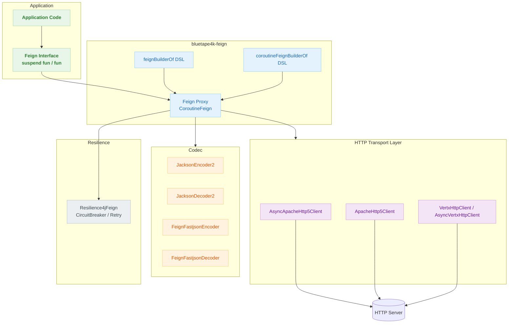
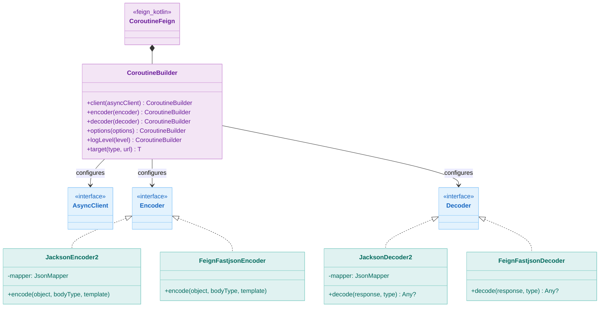
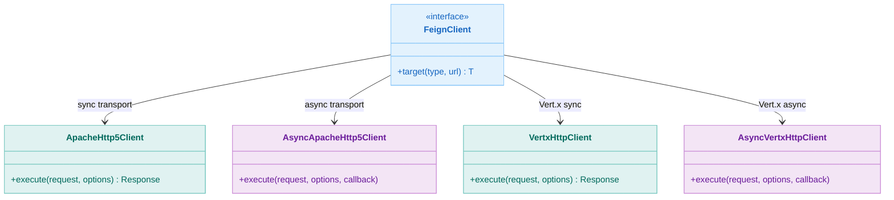
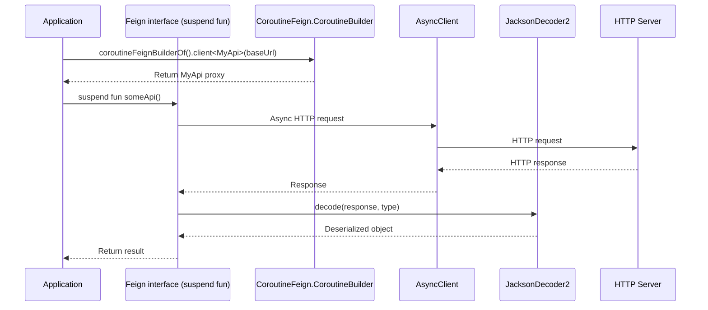

# Module bluetape4k-feign

English | [한국어](./README.ko.md)

## Overview

`bluetape4k-feign` extends [OpenFeign](https://github.com/OpenFeign/feign) with a Kotlin DSL and Coroutines support.

It allows REST API calls to be declared as interface methods, and supports pluggable HTTP transport layers including Apache HC5 and Vert.x.

## Architecture

### Overall Architecture: Feign + Coroutines Integration



### Class Hierarchy: Feign + Coroutines



### HTTP Transport Layer Options



### Suspend Function HTTP Request Flow



## Key Features

### 1. Feign Builder DSL

Configure Feign clients easily using a Kotlin DSL.

```kotlin
import io.bluetape4k.feign.*

// DSL style
val api = feignBuilder {
    client(ApacheHttp5Client())
    encoder(JacksonEncoder())
    decoder(JacksonDecoder())
    logLevel(Logger.Level.BASIC)
}.client<GitHubApi>("https://api.github.com")

// Factory function style (basic usage)
val api = feignBuilderOf(
    client = ApacheHttp5Client(),
    encoder = JacksonEncoder(),
    decoder = JacksonDecoder(),
).client<GitHubApi>("https://api.github.com")

// Factory function + additional configuration (using builder lambda)
val api = feignBuilderOf(
    client = ApacheHttp5Client(),
    encoder = JacksonEncoder(),
    decoder = JacksonDecoder(),
) {
    // Apply additional Feign.Builder settings
    retryer(Retryer.Default())
    errorDecoder(MyErrorDecoder())
}.client<GitHubApi>("https://api.github.com")
```

`feignBuilderOf` contract:

- Applies `Encoder.Default()` and `Decoder.Default()` as defaults.
- The `builder: Feign.Builder.() -> Unit = {}` parameter allows inline additional configuration.
- Implemented as an `inline fun` to eliminate lambda call overhead.
- The previously misspelled `feingBuilderOf` has been removed. Use `feignBuilderOf`.

### 2. Coroutines Support

Supports async API calls via `suspend` functions using `CoroutineFeign`.

```kotlin
import io.bluetape4k.feign.coroutines.*

// Create a Coroutine Feign client
val api = coroutineFeignBuilderOf<Unit>(
    asyncClient = AsyncApacheHttp5Client(httpAsyncClientOf()),
    encoder = JacksonEncoder(),
    decoder = JacksonDecoder(),
).client<GitHubApi>("https://api.github.com")

// Call using suspend function
suspend fun getUser(username: String): User {
    return api.getUser(username)
}
```

**Dynamic URL support:**

```kotlin
interface GitHubApi {
    // Pass URI as the first argument to use a dynamic URL
    @RequestLine("GET /users/{username}")
    fun getUser(host: URI, @Param("username") username: String): User
}

val api = feignBuilderOf(client = ApacheHttp5Client()).client<GitHubApi>()
val user = api.getUser(URI("https://api.github.com"), "octocat")
```

`bodyAsReader()` contract:

- Throws `IllegalStateException("Response body is null.")` when the response body is absent.

### 3. HTTP Transport Layer Options

| Client                 | Characteristics               | Use Case                             |
|------------------------|-------------------------------|--------------------------------------|
| ApacheHttp5Client      | Stable, rich configuration    | Synchronous API calls                |
| AsyncApacheHttp5Client | Async, Coroutines integration | High-performance async communication |
| VertxHttpClient        | Event loop-based, lightweight | Vert.x ecosystem integration         |
| AsyncVertxHttpClient   | Vert.x async client           | Vert.x async communication           |

```kotlin
// Vert.x-based Feign client
val api = feignBuilderOf(
    client = VertxHttpClient(vertx),
).client<MyApi>("https://api.example.com")
```

### 4. Custom Encoder/Decoder

Use various serialization libraries such as Jackson and Fastjson2 as Encoder/Decoder.

```kotlin
// Jackson (recommended default)
val builder = feignBuilderOf(
    client = ApacheHttp5Client(),
    encoder = JacksonEncoder(),
    decoder = JacksonDecoder(),
)

// Fastjson2
val builder = feignBuilderOf(
    client = ApacheHttp5Client(),
    encoder = FeignFastjsonEncoder(),
    decoder = FeignFastjsonDecoder(),
)
```

### 5. Resilience4j Integration

Apply Resilience4j patterns such as Circuit Breaker and Retry to Feign clients.

```kotlin
import io.github.resilience4j.feign.Resilience4jFeign

val decoratedBuilder = Resilience4jFeign.builder(feignBuilderOf(
    client = ApacheHttp5Client(),
    encoder = JacksonEncoder(),
    decoder = JacksonDecoder(),
))
```

## Usage Examples

### API Definition

```kotlin
interface HttpbinApi {
    @RequestLine("GET /get")
    fun get(): HttpbinResponse

    @RequestLine("POST /post")
    @Headers("Content-Type: application/json")
    fun post(body: Map<String, Any>): HttpbinResponse

    @RequestLine("GET /status/{code}")
    fun status(@Param("code") code: Int): feign.Response
}

// Coroutine API
interface HttpbinCoroutineApi {
    @RequestLine("GET /get")
    suspend fun get(): HttpbinResponse

    @RequestLine("POST /post")
    @Headers("Content-Type: application/json")
    suspend fun post(body: Map<String, Any>): HttpbinResponse
}
```

## Module Structure

```
io.bluetape4k.feign
├── FeignBuilderSupport.kt           # Feign Builder DSL and factory functions
├── FeignRequestSupport.kt           # Request utilities
├── FeignResponseSupport.kt          # Response utilities
├── clients/                         # HTTP transport layer
│   └── vertx/                       # Vert.x-based clients
│       ├── VertxHttpClient.kt       # Sync Vert.x client
│       ├── AsyncVertxHttpClient.kt  # Async Vert.x client
│       └── VertxFeignSupport.kt     # Vert.x utilities
├── codec/                           # Encoder/Decoder
│   ├── JacksonEncoder2.kt           # Enhanced Jackson Encoder
│   ├── JacksonDecoder2.kt           # Enhanced Jackson Decoder
│   ├── FeignFastjsonEncoder.kt      # Fastjson2 Encoder
│   └── FeignFastjsonDecoder.kt      # Fastjson2 Decoder
└── coroutines/                      # Coroutines support
    └── FeignCoroutineBuilderSupport.kt  # CoroutineFeign Builder DSL
```

## Dependencies

```kotlin
dependencies {
    implementation(project(":bluetape4k-feign"))

    // Optional dependencies
    implementation("io.github.openfeign:feign-jackson")      // Jackson Encoder/Decoder
    implementation("io.github.openfeign:feign-hc5")          // Apache HC5 client
    implementation("io.github.resilience4j:resilience4j-feign") // Resilience4j integration
}
```

## Testing

```bash
# Run Feign module tests
./gradlew :bluetape4k-feign:test
```

## References

- [OpenFeign/feign](https://github.com/OpenFeign/feign)
- [Feign Kotlin](https://github.com/OpenFeign/feign/tree/master/kotlin)
- [Apache HttpComponents 5](https://hc.apache.org/httpcomponents-client-5.4.x/)
- [Resilience4j Feign](https://resilience4j.readme.io/docs/feign)
