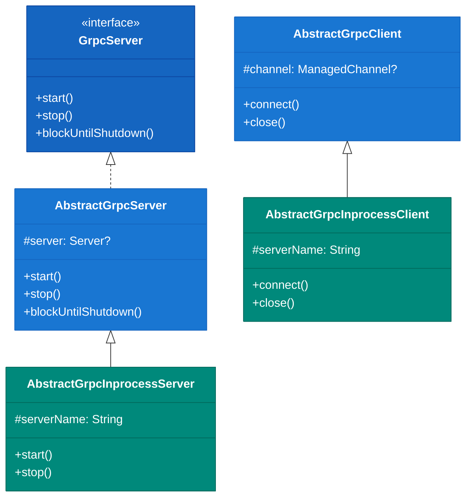
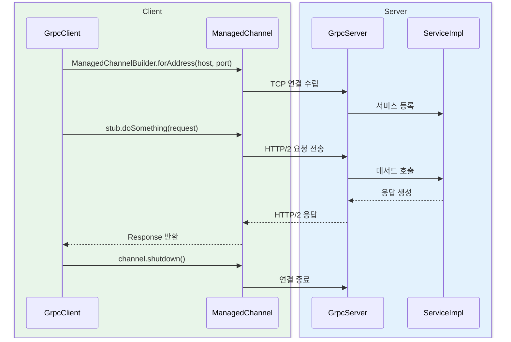
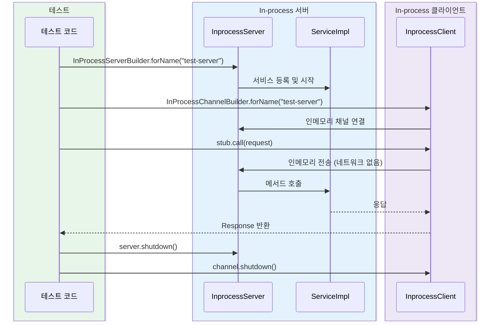

# Module bluetape4k-grpc

[English](./README.md) | 한국어

gRPC 서버/클라이언트 구현을 위한 Kotlin 확장 라이브러리입니다.

## 개요

`bluetape4k-grpc`는 [gRPC](https://grpc.io/) 서버와 클라이언트를 Kotlin 환경에서 쉽게 구현할 수 있도록 추상 클래스와 확장 함수를 제공합니다. Protobuf 유틸리티는 [
`bluetape4k-protobuf`](../protobuf/README.ko.md) 모듈로 분리되었습니다.

## 아키텍처

### 클래스 계층



### 컴포넌트 개요

```mermaid
flowchart TD
    subgraph bluetape4k-grpc
        subgraph Server["서버 측"]
            GS[GrpcServer 인터페이스]
            AGS[AbstractGrpcServer]
            AGIS[AbstractGrpcInprocessServer]
            SI[ServerInterceptorSupport]
            SS[ServerSupport]
        end

        subgraph Client["클라이언트 측"]
            AGC[AbstractGrpcClient]
            AGIC[AbstractGrpcInprocessClient]
            MCS[ManagedChannelSupport]
        end
    end

    subgraph External["외부 / gRPC 런타임"]
        SB[ServerBuilder]
        MCB[ManagedChannelBuilder]
        IPSB[InProcessServerBuilder]
        IPCB[InProcessChannelBuilder]
    end

    GS <|.. AGS
    AGS <|-- AGIS
    AGC <|-- AGIC
    AGS --> SB
    AGIS --> IPSB
    AGC --> MCB
    AGIC --> IPCB

    classDef coreStyle fill:#1B5E20,stroke:#1B5E20,color:#FFFFFF,font-weight:bold
    classDef serviceStyle fill:#1565C0,stroke:#1565C0,color:#FFFFFF
    classDef utilStyle fill:#E65100,stroke:#E65100,color:#FFFFFF
    classDef extStyle fill:#37474F,stroke:#37474F,color:#FFFFFF

    class GS serviceStyle
    class AGS,AGC serviceStyle
    class AGIS,AGIC coreStyle
    class SB,MCB,IPSB,IPCB extStyle
```

### gRPC 서버-클라이언트 통신 시퀀스



### In-process 테스트 시퀀스



## 주요 기능

- **gRPC 서버 추상화**: 서버 시작/중지/상태 관리
- **gRPC 클라이언트 추상화**: 채널 관리 및 호출
- **In-process 서버/클라이언트**: 테스트용 인메모리 통신
- **인터셉터 지원**: 서버 인터셉터 보조
- **입력 검증**: host/target/name 은 blank를 허용하지 않고 port 는 `1..65535` 범위를 즉시 검증

## 사용 예시

### 1. gRPC 서버 구현

```kotlin
import io.bluetape4k.grpc.AbstractGrpcServer

class MyGrpcServer(
    private val port: Int = 50051
): AbstractGrpcServer() {

    override fun start() {
        // 서버 시작 로직
        server = ServerBuilder.forPort(port)
            .addService(MyService())
            .build()
            .start()
    }

    override fun stop() {
        server?.shutdown()
    }

    override fun blockUntilShutdown() {
        server?.awaitTermination()
    }
}

// 사용
val server = MyGrpcServer(50051)
server.start()
server.blockUntilShutdown()
```

### 2. gRPC 클라이언트 구현

```kotlin
import io.bluetape4k.grpc.AbstractGrpcClient

class MyGrpcClient(
    private val host: String = "localhost",
    private val port: Int = 50051
): AbstractGrpcClient() {

    private lateinit var channel: ManagedChannel
    private lateinit var stub: MyServiceGrpc.MyServiceBlockingStub

    override fun connect() {
        channel = ManagedChannelBuilder.forAddress(host, port)
            .usePlaintext()
            .build()
        stub = MyServiceGrpc.newBlockingStub(channel)
    }

    override fun close() {
        channel.shutdown()
    }

    fun doSomething(request: Request): Response {
        return stub.doSomething(request)
    }
}
```

### 3. In-process 서버/클라이언트 (테스트용)

```kotlin
import io.bluetape4k.grpc.inprocess.AbstractGrpcInprocessServer
import io.bluetape4k.grpc.inprocess.AbstractGrpcInprocessClient

// 테스트용 서버
class TestGrpcServer: AbstractGrpcInprocessServer("test-server") {
    override fun start() {
        server = InProcessServerBuilder.forName(serverName)
            .addService(MyService())
            .build()
            .start()
    }
}

// 테스트용 클라이언트
class TestGrpcClient: AbstractGrpcInprocessClient("test-server") {
    override fun connect() {
        channel = InProcessChannelBuilder.forName(serverName).build()
        stub = MyServiceGrpc.newBlockingStub(channel)
    }
}
```

## 주요 파일/클래스 목록

### gRPC Core

| 파일                         | 설명                |
|----------------------------|-------------------|
| `GrpcServer.kt`            | gRPC 서버 인터페이스     |
| `AbstractGrpcServer.kt`    | gRPC 서버 추상 클래스    |
| `AbstractGrpcClient.kt`    | gRPC 클라이언트 추상 클래스 |
| `ServerSupport.kt`         | 서버 확장 함수          |
| `ManagedChannelSupport.kt` | 채널 확장 함수          |

### In-process (inprocess/)

| 파일                               | 설명         |
|----------------------------------|------------|
| `AbstractGrpcInprocessServer.kt` | 인메모리 서버    |
| `AbstractGrpcInprocessClient.kt` | 인메모리 클라이언트 |

### Interceptor (interceptor/)

| 파일                            | 설명         |
|-------------------------------|------------|
| `ServerInterceptorSupport.kt` | 서버 인터셉터 확장 |

## 관련 모듈

- **[bluetape4k-protobuf](../protobuf/README.ko.md)**: Protobuf 유틸리티 (Timestamp/Duration/Money 변환, ProtobufSerializer)

## 의존성 추가

```kotlin
dependencies {
    implementation("io.github.bluetape4k:bluetape4k-grpc:${version}")
    // bluetape4k-protobuf가 전이적으로 포함됩니다
}
```

## 테스트

```bash
./gradlew :bluetape4k-grpc:test
```

## 참고

- [gRPC](https://grpc.io/)
- [gRPC Kotlin](https://grpc.io/docs/languages/kotlin/)
- [Protocol Buffers](https://protobuf.dev/)
