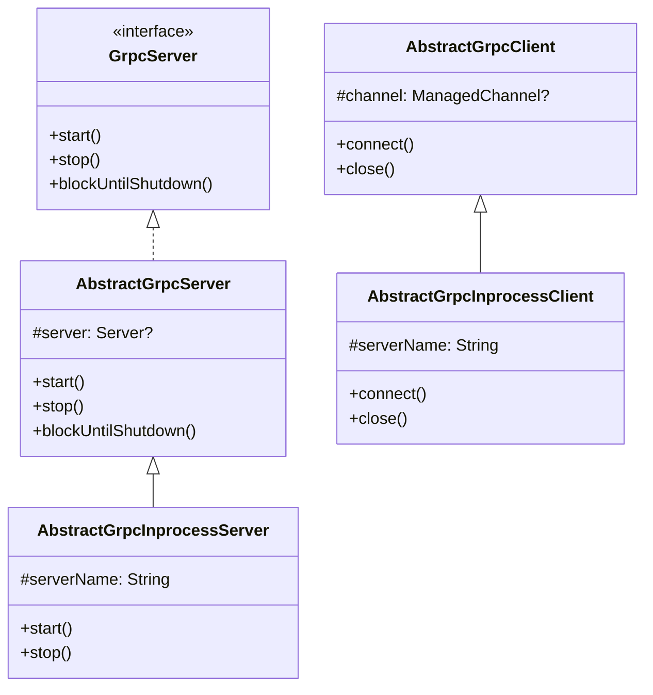
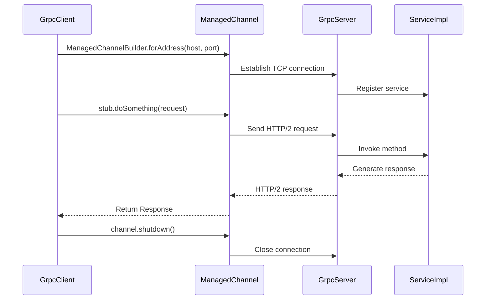
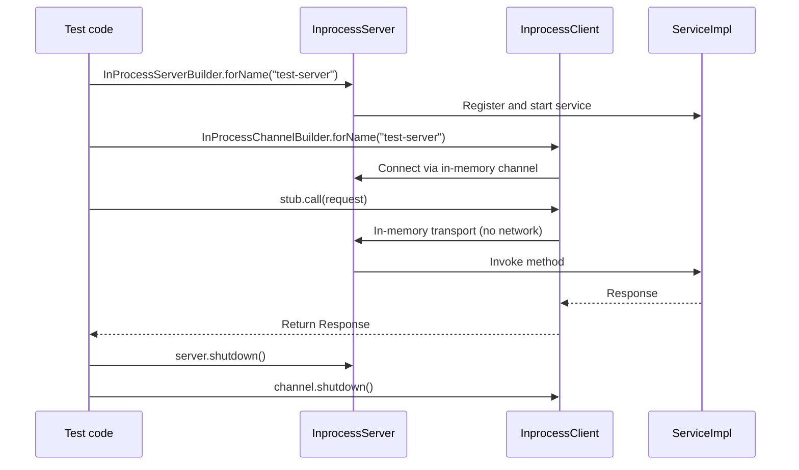

# Module bluetape4k-grpc

English | [한국어](./README.ko.md)

A Kotlin extension library for implementing gRPC servers and clients.

## Overview

`bluetape4k-grpc` provides abstract classes and extension functions that make it easy to implement [gRPC](https://grpc.io/) servers and clients in Kotlin. Protobuf utilities are split into the separate [`bluetape4k-protobuf`](../protobuf/README.md) module.

## Architecture

### Class Hierarchy



### Component Overview

```mermaid
flowchart TD
    subgraph bluetape4k-grpc
        subgraph Server["Server Side"]
            GS[GrpcServer interface]
            AGS[AbstractGrpcServer]
            AGIS[AbstractGrpcInprocessServer]
            SI[ServerInterceptorSupport]
            SS[ServerSupport]
        end

        subgraph Client["Client Side"]
            AGC[AbstractGrpcClient]
            AGIC[AbstractGrpcInprocessClient]
            MCS[ManagedChannelSupport]
        end
    end

    subgraph External["External / gRPC Runtime"]
        SB[ServerBuilder]
        MCB[ManagedChannelBuilder]
        IPSB[InProcessServerBuilder]
        IPCB[InProcessChannelBuilder]
    end

    GS <|.. AGS
    AGS <|-- AGIS
    AGC <|-- AGIC
    AGS --> SB
    AGIS --> IPSB
    AGC --> MCB
    AGIC --> IPCB
```

### gRPC Server-Client Communication Sequence



### In-process Test Sequence



## Key Features

- **gRPC server abstraction**: Start/stop/status management
- **gRPC client abstraction**: Channel management and calls
- **In-process server/client**: In-memory communication for testing
- **Interceptor support**: Server interceptor helpers
- **Input validation**: host/target/name must be non-blank; port must be in the `1..65535` range — validated immediately

## Usage Examples

### 1. Implementing a gRPC Server

```kotlin
import io.bluetape4k.grpc.AbstractGrpcServer

class MyGrpcServer(
    private val port: Int = 50051
): AbstractGrpcServer() {

    override fun start() {
        // Server start logic
        server = ServerBuilder.forPort(port)
            .addService(MyService())
            .build()
            .start()
    }

    override fun stop() {
        server?.shutdown()
    }

    override fun blockUntilShutdown() {
        server?.awaitTermination()
    }
}

// Usage
val server = MyGrpcServer(50051)
server.start()
server.blockUntilShutdown()
```

### 2. Implementing a gRPC Client

```kotlin
import io.bluetape4k.grpc.AbstractGrpcClient

class MyGrpcClient(
    private val host: String = "localhost",
    private val port: Int = 50051
): AbstractGrpcClient() {

    private lateinit var channel: ManagedChannel
    private lateinit var stub: MyServiceGrpc.MyServiceBlockingStub

    override fun connect() {
        channel = ManagedChannelBuilder.forAddress(host, port)
            .usePlaintext()
            .build()
        stub = MyServiceGrpc.newBlockingStub(channel)
    }

    override fun close() {
        channel.shutdown()
    }

    fun doSomething(request: Request): Response {
        return stub.doSomething(request)
    }
}
```

### 3. In-process Server/Client (for Testing)

```kotlin
import io.bluetape4k.grpc.inprocess.AbstractGrpcInprocessServer
import io.bluetape4k.grpc.inprocess.AbstractGrpcInprocessClient

// Test server
class TestGrpcServer: AbstractGrpcInprocessServer("test-server") {
    override fun start() {
        server = InProcessServerBuilder.forName(serverName)
            .addService(MyService())
            .build()
            .start()
    }
}

// Test client
class TestGrpcClient: AbstractGrpcInprocessClient("test-server") {
    override fun connect() {
        channel = InProcessChannelBuilder.forName(serverName).build()
        stub = MyServiceGrpc.newBlockingStub(channel)
    }
}
```

## Key Files / Classes

### gRPC Core

| File | Description |
|------|-------------|
| `GrpcServer.kt` | gRPC server interface |
| `AbstractGrpcServer.kt` | gRPC server abstract class |
| `AbstractGrpcClient.kt` | gRPC client abstract class |
| `ServerSupport.kt` | Server extension functions |
| `ManagedChannelSupport.kt` | Channel extension functions |

### In-process (inprocess/)

| File | Description |
|------|-------------|
| `AbstractGrpcInprocessServer.kt` | In-memory server |
| `AbstractGrpcInprocessClient.kt` | In-memory client |

### Interceptor (interceptor/)

| File | Description |
|------|-------------|
| `ServerInterceptorSupport.kt` | Server interceptor extensions |

## Related Modules

- **[bluetape4k-protobuf](../protobuf/README.md)**: Protobuf utilities (Timestamp/Duration/Money conversion, ProtobufSerializer)

## Dependencies

```kotlin
dependencies {
    implementation("io.github.bluetape4k:bluetape4k-grpc:${version}")
    // bluetape4k-protobuf is included transitively
}
```

## Testing

```bash
./gradlew :bluetape4k-grpc:test
```

## References

- [gRPC](https://grpc.io/)
- [gRPC Kotlin](https://grpc.io/docs/languages/kotlin/)
- [Protocol Buffers](https://protobuf.dev/)
