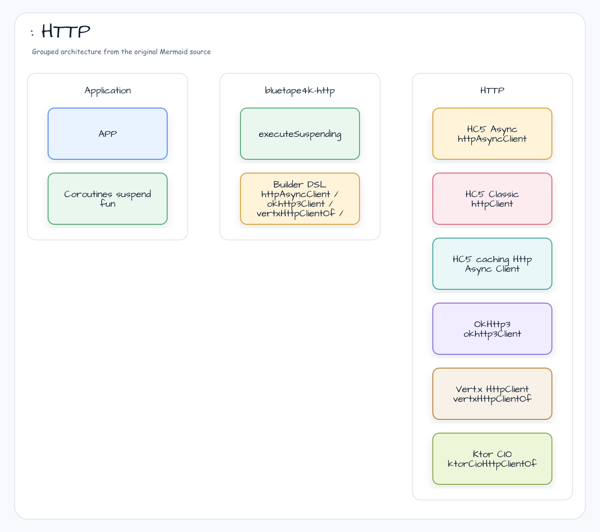
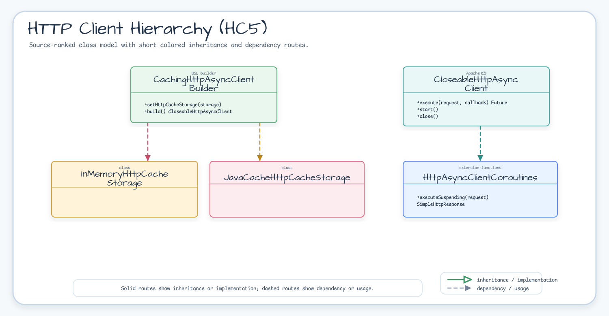
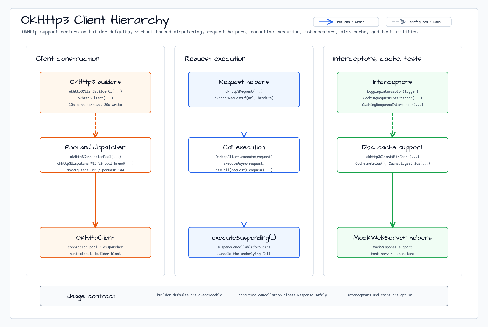
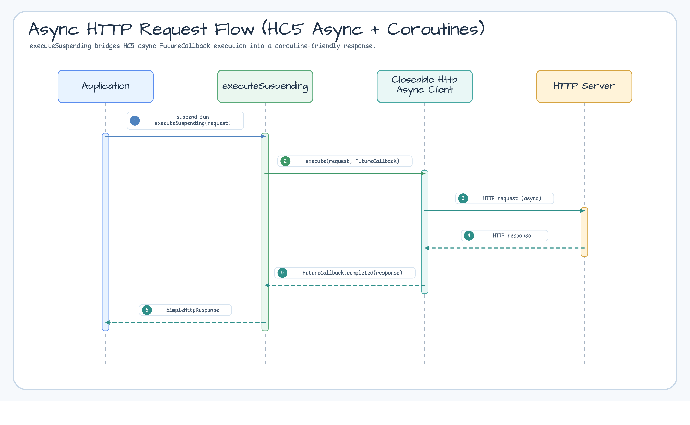
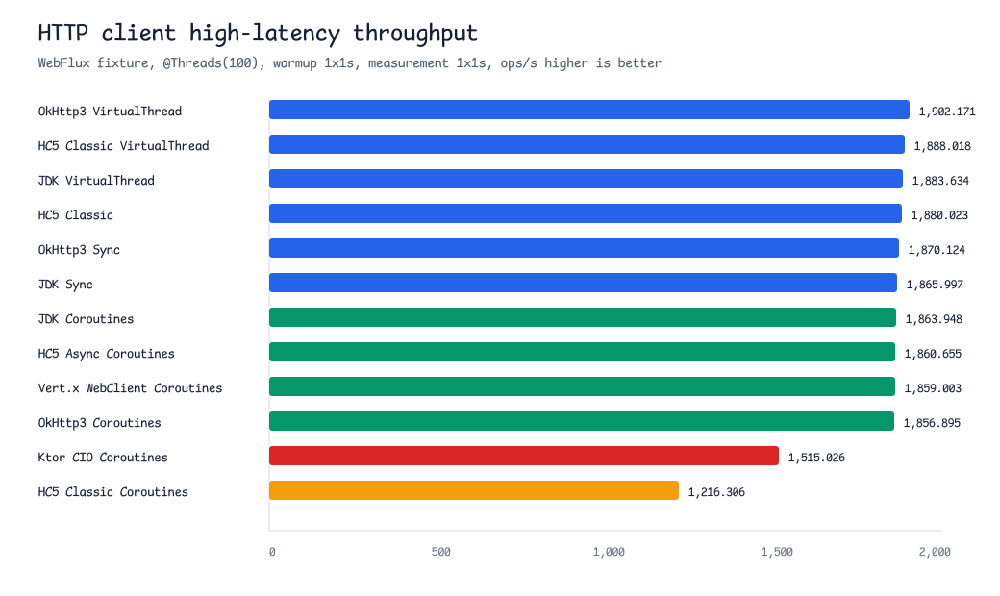
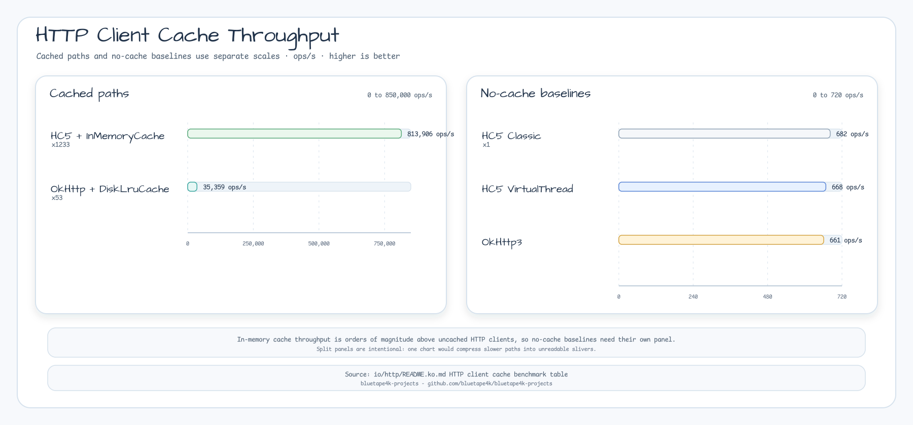

# Module bluetape4k-http

[English](./README.md) | 한국어

## 개요

`bluetape4k-http`는 다양한 HTTP 클라이언트 라이브러리를 Kotlin 확장 함수와 DSL로 통합하여 제공하는 모듈입니다.

Apache HttpComponents 5, OkHttp3, Vert.x HttpClient, Ktor Client 등을 일관된 방식으로 사용할 수 있으며, Kotlin Coroutines와 Virtual Threads를 기본 지원합니다.

## 아키텍처

### 전체 아키텍처: 다중 백엔드 HTTP 클라이언트



### HTTP 클라이언트 계층 (HC5)



### OkHttp3 클라이언트 계층



### 비동기 HTTP 요청 흐름 (HC5 Async + Coroutines)



## 주요 기능

### 1. Apache HttpComponents 5 (HC5)

Apache HttpClient 5를 Kotlin DSL과 Coroutines로 래핑하여 동기/비동기 HTTP 통신을 지원합니다.

**지원 기능:**

- Classic HttpClient (동기 방식)
- Async HttpClient (비동기, Coroutines 통합)
- HTTP/2 지원 (httpcore5-h2)
- 캐싱 HttpClient (In-Memory, JCache)
- Connection Pool 관리
- SSL/TLS 설정
- Fluent API

```kotlin
import io.bluetape4k.http.hc5.async.*

// Async HttpClient 생성
val client = httpAsyncClient {
    setConnectionManager(cm)
    setMaxConnTotal(100)
    setMaxConnPerRoute(10)
}

// Coroutines 환경에서 비동기 요청
val request = SimpleHttpRequest.get("https://httpbin.org/get")
val response: SimpleHttpResponse = client.executeSuspending(request)
```

**Classic HttpClient:**

```kotlin
import io.bluetape4k.http.hc5.classic.*

// Classic HttpClient 생성
val client = httpClient {
    setConnectionManager(poolingConnectionManager())
}

// 동기 요청
val response = client.execute(classicRequestOf(Method.GET, "https://httpbin.org/get"))
```

**Virtual Thread Classic HttpClient:**

```kotlin
import io.bluetape4k.http.hc5.classic.virtualThreadHttpClientOf

// Virtual Thread 기반 커넥션 풀을 사용하는 HC5 Classic 클라이언트
val client = virtualThreadHttpClientOf(maxConnTotal = 200, maxConnPerRoute = 100)

client.use {
    val response = it.execute(classicRequestOf(Method.GET, "https://httpbin.org/get"))
    println(response.code)
}
```

**운영 환경용 HttpClient (Production-tuned):**

권장 설정이 모두 적용된 클라이언트를 한 번에 생성합니다: 커넥션 풀, 만료/유휴 커넥션 자동 제거,
`Keep-Alive` 헤더가 없는 서버를 위한 폴백, 일시적 장애 재시도, 보수적 요청 타임아웃.

```kotlin
import io.bluetape4k.http.hc5.classic.*
import io.bluetape4k.http.hc5.http.*

// 기본 설정: pool 200/100, eviction 60초, keep-alive 60초 폴백, 재시도 3회, 타임아웃 5/10/30초
val client = productionHttpClientOf()

// 커넥션 풀 크기 및 응답 타임아웃 커스터마이징
val client = productionHttpClientOf(
    maxConnTotal = 500,
    maxConnPerRoute = 200,
    requestConfig = productionRequestConfigOf(responseTimeout = Timeout.ofSeconds(60)),
)

// Virtual Thread 변형 (동일 설정, Virtual Thread 커넥션 풀)
val client = productionVirtualThreadHttpClientOf()
```

| 파라미터 | 기본값 | 설명 |
|---------|--------|------|
| `maxConnTotal` | 200 | 전체 풀 커넥션 수 |
| `maxConnPerRoute` | 100 | 라우트별 풀 커넥션 수 |
| `connectionRequestTimeout` | 5초 | 풀에서 커넥션 획득 대기 시간 |
| `connectTimeout` | 10초 | TCP 연결 시간 |
| `responseTimeout` | 30초 | 첫 응답 바이트 수신 시간 |
| `maxIdleTime` | 60초 | 유휴 커넥션 제거 임계값 |
| keep-alive 폴백 | 60초 | `Keep-Alive` 헤더 없는 서버에 적용 |
| `maxRetries` | 3 | 일시적 장애 재시도 횟수 |

**비동기 운영 환경용 클라이언트:**

```kotlin
import io.bluetape4k.http.hc5.async.*

val asyncClient = productionHttpAsyncClientOf()

// 커스터마이징
val asyncClient = productionHttpAsyncClientOf(
    maxConnTotal = 500,
    retryStrategy = defaultRetryStrategy(maxRetries = 5),
)
```

**캐싱 HttpClient:**

```kotlin
import io.bluetape4k.http.hc5.cache.*

// In-Memory 캐시를 사용하는 HttpClient
val cacheStorage = InMemoryHttpCacheStorage.createObjectCache()
val cachingClient = cachingHttpClient(cacheStorage)

// Async 캐싱 클라이언트 (JCache 기반)
val asyncCachingClient = cachingHttpAsyncClient {
    setHttpCacheStorage(JavaCacheHttpCacheStorage.createObjectCache(jcache))
}
```

### 2. OkHttp3

Square의 OkHttp3 클라이언트를 Kotlin DSL로 간편하게 생성하고 사용할 수 있습니다.

**지원 기능:**

- Virtual Thread 기반 Dispatcher 기본 사용
- Connection Pool 관리
- 로깅/캐싱 Interceptor
- MockWebServer 유틸리티
- Coroutines 확장

**DSL 빌더 함수 (`OkHttp3Support.kt`):**

| 함수 | 설명 |
|-----|------|
| `okhttp3Client(connectionPool, dispatcher, block)` | `OkHttpClient` 생성 (pool/dispatcher 선택 설정) |
| `okHttp3ConnectionPool(maxIdleConnections, keepAliveDuration)` | `ConnectionPool` 생성 |
| `okhttp3DispatcherWithVirtualThread(maxRequests, maxRequestsPerHost)` | Virtual Thread 기반 `Dispatcher` 생성 |
| `okhttp3DispatcherOf(executor, maxRequests, maxRequestsPerHost)` | 커스텀 `ExecutorService` 기반 `Dispatcher` 생성 |
| `okhttp3ClientBuilderOf(connectionPool, dispatcher, block)` | 사전 구성된 `OkHttpClient.Builder` 반환 |
| `okhttp3RequestOf(url, block)` | `okhttp3.Request` DSL 생성 |
| `okhttp3CacheControl(block)` | `CacheControl` DSL 생성 |
| `okhttp3CacheControlOf(maxAge, maxStale, minFresh)` | 기간 파라미터 기반 `CacheControl` 생성 |

```kotlin
import io.bluetape4k.http.okhttp3.*

// Connection Pool + Virtual Thread Dispatcher
val pool = okHttp3ConnectionPool(maxIdleConnections = 50)
val dispatcher = okhttp3DispatcherWithVirtualThread(maxRequests = 200)

val client = okhttp3Client(
    connectionPool = pool,
    dispatcher = dispatcher,
) {
    addInterceptor(LoggingInterceptor(log))
    addNetworkInterceptor(CachingResponseInterceptor())
}

// Request DSL
val request = okhttp3RequestOf("https://httpbin.org/get") {
    get()
    header("Accept", "application/json")
}

// 동기 호출
client.newCall(request).execute().use { response ->
    println(response.body.string())
}

// Coroutines 환경에서 비동기 요청
val response = client.executeSuspending(request)
```

`executeSuspending` 계약:

- 코루틴이 취소되면 내부 OkHttp `Call`도 함께 취소됩니다.
- 성공 시 `Response`를 그대로 반환하고, 실패 시 원인 예외를 전파합니다.

### 3. Vert.x HttpClient

Eclipse Vert.x의 비동기 HttpClient를 Kotlin Coroutines와 통합합니다.

```kotlin
import io.bluetape4k.http.vertx.*
import io.vertx.kotlin.core.http.httpClientOptionsOf

val options = httpClientOptionsOf(
    maxPoolSize = 20,
    keepAlive = true,
)
val vertxClient = vertxHttpClientOf(options)
```

## 주요 권장 클라이언트

> 전체 설계 근거: [`docs/design/2026-05-24-hc5-first-http-client-recommendation.md`](../../docs/design/2026-05-24-hc5-first-http-client-recommendation.md)

**Apache HttpComponents 5 (HC5)** 가 `bluetape4k-http`의 **1순위 권장 프로덕션 HTTP 클라이언트**입니다. 프로덕션 튜닝 팩토리, RFC 7234 인메모리 캐싱, Virtual Thread 지원, Coroutines 통합 등 가장 풍부한 기능을 제공합니다.

| 시나리오 | 권장 클라이언트 | 팩토리 함수 |
|---------|--------------|-----------|
| 고처리량 동기 백엔드 호출 | HC5 Classic + VirtualThread | `productionVirtualThreadHttpClientOf()` |
| 코루틴 기반 비동기 호출 | HC5 Async + Coroutines | `productionHttpAsyncClientOf()` |
| 캐싱 가능한 GET 최고 처리량 | HC5 CachingHttpClient (인메모리) | `memoryCachingHttpClientOf()` |
| 재시작 간 캐시 유지 | OkHttp3 + DiskLruCache | `okhttp3ClientWithCache()` |
| Ktor 기반 앱 | Ktor CIO | — |
| Vert.x 기반 앱 | Vert.x WebClient | — |
| 의존성 없는 JVM 서비스 | JDK HttpClient | — |

비-HC5 백엔드는 해당 생태계에서 **완전 지원**되는 1등급 옵션입니다. 기존 코드나 API는 deprecated 되지 않습니다.

## HTTP 클라이언트 비교

| 클라이언트             | 역할       | 프로토콜             | 특성                                 | 용도                  |
|-------------------|----------|------------------|------------------------------------|---------------------|
| HC5 Classic       | **주요**   | HTTP/1.1         | 프로덕션 튜닝, 재시도, keep-alive          | 동기 백엔드 호출           |
| HC5 Async         | **주요**   | HTTP/1.1, HTTP/2 | 비동기, Coroutines 통합                 | 고성능 비동기 통신          |
| HC5 CachingClient | **주요**   | HTTP/1.1         | RFC 7234 인메모리 캐시 (813K ops/s)     | 캐싱 가능한 GET 집중 워크로드  |
| OkHttp3           | 호환성      | HTTP/1.1, HTTP/2 | 디스크 캐시, 인터셉터, Android 호환          | 캐시 영속성, Android     |
| JDK HttpClient    | 호환성      | HTTP/1.1, HTTP/2 | 추가 의존성 없음                          | 의존성 최소화 서비스         |
| Vert.x HttpClient | 생태계 전용   | HTTP/1.1, HTTP/2 | 이벤트 루프 기반                          | Vert.x 생태계          |
| Ktor CIO          | 생태계 전용   | HTTP/1.x         | suspend-native, Ktor 플러그인 생태계     | Ktor 기반 앱           |

> **참고**: Ktor CIO는 HTTP/2를 지원하지 않습니다. HTTP/2가 필요한 경우 HC5 Async, JDK, 또는 OkHttp3를 사용하세요.

## 성능 벤치마크

JMH(Java Microbenchmark Harness) 기반 벤치마크 3종으로 클라이언트별 처리량을 측정합니다.
모든 벤치마크는 별도의 Docker 컨테이너 서버에 요청하여 서버 JVM과 클라이언트 JVM을 분리합니다.

```bash
# 전체 벤치마크 실행
./gradlew :bluetape4k-http:testBenchmark

# 특정 벤치마크만 실행
./gradlew :bluetape4k-http:testBenchmark -PbenchmarkInclude="HttpClientBenchmark"
./gradlew :bluetape4k-http:testBenchmark -PbenchmarkInclude="HttpClientLatencyBenchmark"
./gradlew :bluetape4k-http:testBenchmark -PbenchmarkInclude="HttpClientCompressionCacheBenchmark"
```

### 1. HttpClientBenchmark — 기본 처리량 (`GET /ping`)

**환경**: `BluetapeWebfluxServer` (Docker) · `@Threads(8)` · warmup 1×1s · measurement 1×1s

경량 `/ping` 응답으로 순수 연결 처리량을 측정합니다.

| 클라이언트 | 방식 | 특징 |
|-----------|------|------|
| OkHttp3 Sync | 동기 | 플랫폼 스레드 |
| OkHttp3 VirtualThread | 동기 | Virtual Thread Dispatcher |
| OkHttp3 Coroutines | 비동기 | `Call.executeAsync()` (공식 okhttp-coroutines) |
| Java HttpClient Sync | 동기 | JDK 내장 |
| Java HttpClient VirtualThread | 동기 | Virtual Thread executor |
| Java HttpClient H2 Sync | 동기 | HTTP/2 |
| HC5 Classic | 동기 | Apache HttpComponents 5 |
| HC5 Classic VirtualThread | 동기 | VT 기반 커넥션 매니저 |
| HC5 Classic Coroutines | 코루틴 | `Dispatchers.IO` |
| HC5 Async Coroutines | 비동기 | `executeSuspending()` |
| Vert.x WebClient Coroutines | 비동기 | 이벤트 루프 |
| Ktor CIO Coroutines | 코루틴 | CIO 3.5는 pipelining 비활성 시 dedicated HTTP/1 request를 생성 |

> **참고**: 지연 없는 경량 응답이므로 동기/비동기 방식 모두 유사한 처리량을 냅니다.
> 차이는 주로 커넥션 풀 설정과 스레드 모델에서 발생합니다.

### 2. HttpClientLatencyBenchmark — 고지연 환경 처리량 (`GET /httpbin/delay/0.05`)

**환경**: `BluetapeWebfluxServer` (Docker, 50ms 지연) · `@Threads(100)` · warmup 1×1s · measurement 1×1s

**이론값**: 100 threads × (1000ms / 50ms) = **2,000 ops/s** (동기 상한)
비동기/코루틴 방식은 스레드 블로킹 없이 이 상한을 초과합니다.

| 클라이언트 | 방식 | 비고 |
|-----------|------|------|
| OkHttp3 Sync | 동기 | 100 플랫폼 스레드 차단 |
| OkHttp3 VirtualThread | 동기 | VT로 차단 비용 감소 |
| OkHttp3 Coroutines | 비동기 | `Dispatchers.IO` + `executeAsync()` |
| Java HttpClient Sync | 동기 | — |
| Java HttpClient VirtualThread | 동기 | — |
| Java HttpClient Coroutines | 비동기 | `sendAwait()` |
| HC5 Classic | 동기 | — |
| HC5 Classic VirtualThread | 동기 | — |
| HC5 Classic Coroutines | 코루틴 | `Dispatchers.IO` |
| HC5 Async Coroutines | 비동기 | `executeSuspending()` |
| Vert.x WebClient Coroutines | 비동기 | — |
| Ktor CIO Coroutines | 코루틴 | 동일 `@Threads(100)` 조건으로 측정 |

### 2026-05-21 HTTP 클라이언트 벤치마크 스냅샷

환경: 로컬 Colima Docker, `bluetape4k/mock-webflux-server:latest`, Docker server 29.2.1, JMH via `:bluetape4k-http:testBenchmark`.
명령, 실패한 접근, 원시 근거는 [벤치마크 리포트](../../docs/benchmarks/2026-05-21-io-http-client-benchmark.md)에 기록했습니다.

각 벤치마크 안의 모든 행은 같은 JMH thread 수로 측정했습니다.
Ktor CIO만 1 thread로 낮춘 예외 행이 아니며, CIO 3.5가 pipelining 비활성 시 dedicated HTTP/1 connection을 열기 때문에 전체 행을 짧은 동일 조건 window로 맞췄습니다.

#### 기본 처리량 스냅샷

| 벤치마크 행 | ops/s |
|-------------|------:|
| `HttpClientBenchmark.javaHttpSync` | 7,276.492 |
| `HttpClientBenchmark.hc5ClassicVirtualThread` | 7,246.690 |
| `HttpClientBenchmark.okhttp3VirtualThread` | 6,955.796 |
| `HttpClientBenchmark.javaHttpVirtualThread` | 6,562.497 |
| `HttpClientBenchmark.hc5Classic` | 6,490.422 |
| `HttpClientBenchmark.javaHttpH2VirtualThread` | 6,275.262 |
| `HttpClientBenchmark.hc5ClassicCoroutines` | 6,230.735 |
| `HttpClientBenchmark.vertxWebClientCoroutines` | 6,043.906 |
| `HttpClientBenchmark.javaHttpH2Sync` | 6,027.618 |
| `HttpClientBenchmark.okhttp3Sync` | 5,771.310 |
| `HttpClientBenchmark.okhttp3Coroutines` | 5,752.350 |
| `HttpClientBenchmark.hc5AsyncCoroutines` | 5,520.183 |
| `HttpClientBenchmark.javaHttpH2Coroutines` | 5,481.592 |
| `HttpClientBenchmark.javaHttpCoroutines` | 4,739.894 |
| `HttpClientBenchmark.ktorCioCoroutines` | 2,052.281 |

#### 고지연 처리량 스냅샷

| 벤치마크 행 | ops/s |
|-------------|------:|
| `HttpClientLatencyBenchmark.okhttp3VirtualThread` | 1,902.171 |
| `HttpClientLatencyBenchmark.hc5ClassicVirtualThread` | 1,888.018 |
| `HttpClientLatencyBenchmark.javaHttpVirtualThread` | 1,883.634 |
| `HttpClientLatencyBenchmark.hc5Classic` | 1,880.023 |
| `HttpClientLatencyBenchmark.okhttp3Sync` | 1,870.124 |
| `HttpClientLatencyBenchmark.javaHttpSync` | 1,865.997 |
| `HttpClientLatencyBenchmark.javaHttpCoroutines` | 1,863.948 |
| `HttpClientLatencyBenchmark.hc5AsyncCoroutines` | 1,860.655 |
| `HttpClientLatencyBenchmark.vertxWebClientCoroutines` | 1,859.003 |
| `HttpClientLatencyBenchmark.okhttp3Coroutines` | 1,856.895 |
| `HttpClientLatencyBenchmark.ktorCioCoroutines` | 1,515.026 |
| `HttpClientLatencyBenchmark.hc5ClassicCoroutines` | 1,216.306 |



**메모**:
- 이전 Vert.x 결과는 주로 Vert.x 5 기본 HTTP/1 pool cap을 측정했습니다. 이제 `PoolOptions`를 명시해 다른 클라이언트와 조건을 맞췄습니다.
- Ktor CIO 기본 경로는 `/ping`에서 여전히 느립니다. CIO pipelining을 강제하면 mock fixture에서 EOF 또는 hang이 발생했으므로, 비교 가능한 실행은 기본 CIO 동작을 유지하고 모든 행의 측정 window를 동일하게 짧게 둡니다.
- `/ping` 기본 처리량은 로컬 Docker 환경에서 분산이 큽니다. 결정 근거로는 고지연 표가 더 강합니다.

### 3. HttpClientCompressionCacheBenchmark — 캐시 + gzip 효과

**환경**: `WireMockServer` (Docker, 10ms 고정 지연) · gzip 1KB 응답 · `Cache-Control: public, max-age=3600` · `@Threads(8)` · warmup 2×3s · measurement 3×5s

**이론값(캐시 없음)**: 8 threads × (1000ms / 10ms) = **800 ops/s**

| 클라이언트 | 캐시 | ops/s | 배율 |
|-----------|------|------:|------|
| HC5 Classic + InMemoryCache | 인메모리 (Heap) | **813,906** | ×1,233 |
| OkHttp3 + DiskLruCache | 디스크 (OS 페이지 캐시) | **35,359** | ×53 |
| HC5 Classic (캐시 없음) | — | 682 | ×1 |
| HC5 Classic VirtualThread (캐시 없음) | — | 668 | — |
| OkHttp3 (캐시 없음) | — | 661 | — |



**인사이트**:
- **캐시 효과**: 10ms 네트워크 지연 제거만으로 35K–813K ops/s 달성
- **HC5 MemCache vs OkHttp DiskCache (23배 차이)**:
  - HC5: `ConcurrentHashMap` 직접 조회 → ~1–10 μs/op
  - OkHttp: `DiskLruCache` `synchronized` + journal write + gzip 재해제 → ~200–230 μs/op
- OkHttp 캐시 파일(1KB)은 워밍업 후 OS 페이지 캐시(RAM)에 올라가므로 실제 디스크 I/O는 없으나, 파일 시스템 계층 오버헤드가 남음

**권장 선택** ([주요 권장 클라이언트](#주요-권장-클라이언트) 전체 표 참조):

| 상황 | 권장 | 팩토리 |
|------|------|--------|
| 반복 GET + 캐시 최우선 | **HC5 CachingHttpClient (MemCache)** | `memoryCachingHttpClientOf()` |
| 재시작 후 캐시 유지 필요 | OkHttp3 + DiskLruCache | `okhttp3ClientWithCache()` |
| 범용 고성능 동기 | **HC5 Classic VirtualThread** | `productionVirtualThreadHttpClientOf()` |
| 고지연 비동기 대량 요청 | **HC5 Async Coroutines** | `productionHttpAsyncClientOf()` |

## Coroutines 지원

모든 비동기 HTTP 클라이언트는 `executeSuspending` 확장 함수를 통해 Coroutines 환경에서 자연스럽게 사용할 수 있습니다.

```kotlin
import kotlinx.coroutines.*

suspend fun fetchData() = coroutineScope {
    val client = httpAsyncClient { /* 설정 */ }

    // 병렬 요청
    val response1 = async { client.executeSuspending(request1) }
    val response2 = async { client.executeSuspending(request2) }

    val results = awaitAll(response1, response2)
}
```

## 모듈 구조

```
io.bluetape4k.http
├── hc5/                    # Apache HttpComponents 5
│   ├── async/              # 비동기 클라이언트, Coroutines 통합
│   ├── cache/              # 캐싱 클라이언트 (In-Memory, JCache)
│   ├── classic/            # 동기 클라이언트
│   ├── entity/             # Entity/Multipart 빌더
│   ├── fluent/             # Fluent API 확장
│   ├── http/               # Request/Response 빌더, Config
│   ├── http2/              # HTTP/2 설정
│   ├── protocol/           # HttpClientContext 확장
│   ├── reactor/            # IOReactor 설정
│   ├── routing/            # 라우팅 유틸리티
│   └── ssl/                # SSL/TLS 설정
├── okhttp3/                # OkHttp3
│   ├── OkHttp3Support.kt   # 클라이언트/Request/Response DSL
│   ├── LoggingInterceptor.kt
│   ├── CachingRequestInterceptor.kt
│   ├── CachingResponseInterceptor.kt
│   └── mock/               # MockWebServer 유틸리티
├── vertx/                  # Vert.x HttpClient
│   └── VertxHttpClientSupport.kt
└── ktor/                   # Ktor Client (선택적, suspend-native)
    └── KtorHttpClientSupport.kt
```

## 의존성

```kotlin
dependencies {
    implementation(project(":bluetape4k-http"))

    // 사용할 백엔드만 compileOnly로 추가.
    // 애플리케이션 프로젝트에서 런타임에 필요한 경우 implementation으로 변경하세요.
    compileOnly("org.apache.httpcomponents.client5:httpclient5") // HC5
    compileOnly("com.squareup.okhttp3:okhttp")                   // OkHttp3
    compileOnly("io.vertx:vertx-core")                           // Vert.x
    compileOnly("io.ktor:ktor-client-core")                      // Ktor Client (엔진 선택)
    compileOnly("io.ktor:ktor-client-cio")                       // Ktor CIO 엔진 (HTTP/1.x)
}
```

## 테스트

```bash
# HTTP 모듈 테스트 실행
./gradlew :bluetape4k-http:test

# 라인 커버리지 확인
./gradlew :bluetape4k-http:koverLog
```

### 테스트 커버리지

라인 커버리지: **72%** (목표: ≥ 70%)

| 패키지 | 커버리지 | 테스트 클래스 |
|--------|----------|---------------|
| `hc5/async` | ✅ | `AsyncHttpClientTest`, `AsyncHttpClientCoroutinesTest`, `MinimalHttpAsyncClientTest` |
| `hc5/async/methods` | ✅ | `SimpleHttpRequestTest`, `SimpleHttpResponseTest`, `AsyncMethodsTest` |
| `hc5/cache` | ✅ | `CachingHttpClientBuilderTest`, `CachingHttpAsyncClientBuilderTest` |
| `hc5/classic` | ✅ | `ClassicHttpClientTest`, `MinimalAndVirtualThreadHttpClientTest` |
| `hc5/fluent` | ✅ | `RequestTest` |
| `hc5/http` | ✅ | `ContextBuilderTest`, `CookieSpecSupportTest`, `PoolingHttpClientConnectionManagerBuilderTest`, `BasicRequestProducerTest` |
| `hc5/protocol` | ✅ | `HttpClientContextTest` |
| `hc5/routing` | ✅ | `RoutingSupportTest` |
| `hc5/ssl` | ✅ | `SslSupportTest` |
| `jdk` | ✅ | `JdkHttpClientSupportTest`, `JdkHttpClientCoroutinesTest` |
| `okhttp3` | ✅ | 다수의 테스트 |
| `ktor` | ✅ | `KtorHttpClientSupportTest` |

## 참고

- [Apache HttpComponents 5](https://hc.apache.org/httpcomponents-client-5.4.x/)
- [OkHttp](https://square.github.io/okhttp/)
- [Vert.x HttpClient](https://vertx.io/docs/vertx-core/kotlin/)
- [Ktor Client](https://ktor.io/docs/client-create-and-configure.html)
- [httpbin.org](https://httpbin.org/) - HTTP 테스트용 API
