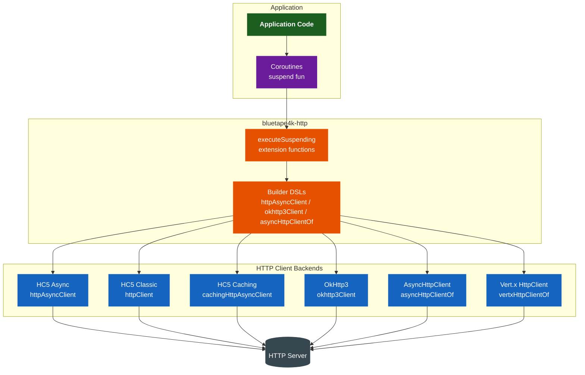
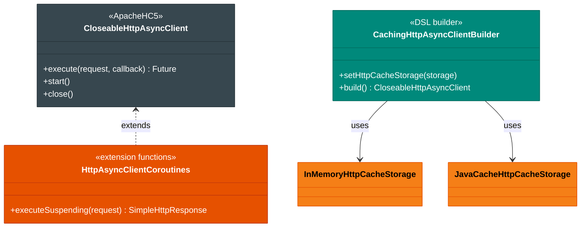
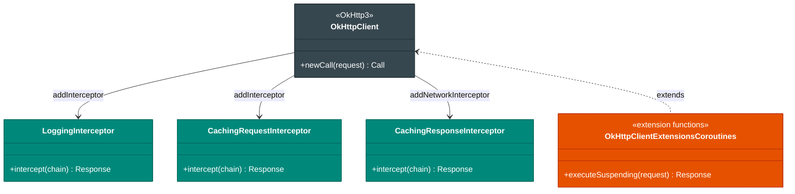
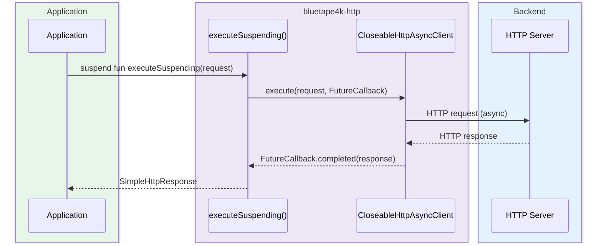

# Module bluetape4k-http

English | [한국어](./README.ko.md)

## Overview

`bluetape4k-http` integrates multiple HTTP client libraries through Kotlin extension functions and DSLs.

It provides a consistent interface for Apache HttpComponents 5, OkHttp3, Vert.x HttpClient, and AsyncHttpClient, with built-in support for Kotlin Coroutines and Virtual Threads.

## Architecture

### Overall Architecture: Multi-Backend HTTP Client



### HTTP Client Hierarchy (HC5)



### OkHttp3 Client Hierarchy



### Async HTTP Request Flow (HC5 Async + Coroutines)



## Key Features

### 1. Apache HttpComponents 5 (HC5)

Wraps Apache HttpClient 5 with Kotlin DSL and Coroutines for both synchronous and asynchronous HTTP communication.

**Supported features:**

- Classic HttpClient (synchronous)
- Async HttpClient (asynchronous, Coroutines integration)
- HTTP/2 support (httpcore5-h2)
- Caching HttpClient (In-Memory, JCache)
- Connection pool management
- SSL/TLS configuration
- Fluent API

```kotlin
import io.bluetape4k.http.hc5.async.*

// Create an async HttpClient
val client = httpAsyncClient {
    setConnectionManager(cm)
    setMaxConnTotal(100)
    setMaxConnPerRoute(10)
}

// Async request in a Coroutines context
val request = SimpleHttpRequest.get("https://httpbin.org/get")
val response: SimpleHttpResponse = client.executeSuspending(request)
```

**Classic HttpClient:**

```kotlin
import io.bluetape4k.http.hc5.classic.*

// Create a classic HttpClient
val client = httpClient {
    setConnectionManager(poolingConnectionManager())
}

// Synchronous request
val response = client.execute(classicRequestOf(Method.GET, "https://httpbin.org/get"))
```

**Caching HttpClient:**

```kotlin
import io.bluetape4k.http.hc5.cache.*

// HttpClient with in-memory cache
val cacheStorage = InMemoryHttpCacheStorage.createObjectCache()
val cachingClient = cachingHttpClient(cacheStorage)

// Async caching client (JCache-based)
val asyncCachingClient = cachingHttpAsyncClient {
    setHttpCacheStorage(JavaCacheHttpCacheStorage.createObjectCache(jcache))
}
```

### 2. OkHttp3

Square's OkHttp3 client made convenient with a Kotlin DSL.

**Supported features:**

- Virtual Thread-based Dispatcher by default
- Connection pool management
- Logging/caching interceptors
- MockWebServer utilities
- Coroutines extensions

```kotlin
import io.bluetape4k.http.okhttp3.*
import io.bluetape4k.logging.KotlinLogging

private val log = KotlinLogging.logger {}

// Create a Virtual Thread-based OkHttpClient
val client = okhttp3Client {
    addInterceptor(LoggingInterceptor(log))
    addNetworkInterceptor(CachingResponseInterceptor())
}

// Request DSL
val request = okhttp3RequestOf("https://httpbin.org/get") {
    get()
    header("Accept", "application/json")
}

// Async request in a Coroutines context
val response = client.executeSuspending(request)
```

`executeSuspending` contract:

- When the coroutine is cancelled, the underlying OkHttp `Call` is also cancelled.
- Returns `Response` on success and propagates the cause exception on failure.

### 3. Vert.x HttpClient

Integrates Eclipse Vert.x's async HttpClient with Kotlin Coroutines.

```kotlin
import io.bluetape4k.http.vertx.*
import io.vertx.kotlin.core.http.httpClientOptionsOf

val options = httpClientOptionsOf(
    maxPoolSize = 20,
    keepAlive = true,
)
val vertxClient = vertxHttpClientOf(options)
```

### 4. AsyncHttpClient (AHC)

Wraps Netty-based AsyncHttpClient with Kotlin Coroutines.

```kotlin
import io.bluetape4k.http.ahc.*

val client = asyncHttpClientOf {
    setMaxConnections(100)
    setMaxConnectionsPerHost(10)
}

// Async request in a Coroutines context
val response = client.prepareGet("https://httpbin.org/get").executeSuspending()
```

## HTTP Client Comparison

| Client            | Protocol         | Characteristics                     | Use Case                     |
|-------------------|------------------|-------------------------------------|------------------------------|
| HC5 Classic       | HTTP/1.1         | Stable, rich configuration          | Synchronous API calls        |
| HC5 Async         | HTTP/1.1, HTTP/2 | Async, Coroutines integration       | High-performance async       |
| OkHttp3           | HTTP/1.1, HTTP/2 | Lightweight, Virtual Thread default | General-purpose HTTP client  |
| Vert.x HttpClient | HTTP/1.1, HTTP/2 | Event loop-based                    | Vert.x ecosystem integration |
| AsyncHttpClient   | HTTP/1.1, HTTP/2 | Netty-based, high-performance       | High-volume async requests   |

## Coroutines Support

All async HTTP clients support natural use in Coroutines contexts via the `executeSuspending` extension function.

```kotlin
import kotlinx.coroutines.*

suspend fun fetchData() = coroutineScope {
    val client = httpAsyncClient { /* configuration */ }

    // Parallel requests
    val response1 = async { client.executeSuspending(request1) }
    val response2 = async { client.executeSuspending(request2) }

    val results = awaitAll(response1, response2)
}
```

## Module Structure

```
io.bluetape4k.http
├── hc5/                    # Apache HttpComponents 5
│   ├── async/              # Async client, Coroutines integration
│   ├── cache/              # Caching client (In-Memory, JCache)
│   ├── classic/            # Sync client
│   ├── entity/             # Entity/Multipart builders
│   ├── fluent/             # Fluent API extensions
│   ├── http/               # Request/Response builder, config
│   ├── http2/              # HTTP/2 configuration
│   ├── protocol/           # HttpClientContext extensions
│   ├── reactor/            # IOReactor configuration
│   ├── routing/            # Routing utilities
│   └── ssl/                # SSL/TLS configuration
├── okhttp3/                # OkHttp3
│   ├── OkHttp3Support.kt   # Client/Request/Response DSL
│   ├── LoggingInterceptor.kt
│   ├── CachingRequestInterceptor.kt
│   ├── CachingResponseInterceptor.kt
│   └── mock/               # MockWebServer utilities
├── ahc/                    # AsyncHttpClient
│   ├── AsyncHttpClientSupport.kt
│   └── CoroutineSupport.kt
└── vertx/                  # Vert.x HttpClient
    └── VertxHttpClientSupport.kt
```

## Dependencies

```kotlin
dependencies {
    implementation(project(":bluetape4k-http"))

    // Optional (add only what you need)
    implementation("com.squareup.okhttp3:okhttp")           // OkHttp3
    implementation("org.asynchttpclient:async-http-client")  // AsyncHttpClient
    implementation("io.vertx:vertx-core")                    // Vert.x
}
```

## Testing

```bash
# Run HTTP module tests
./gradlew :bluetape4k-http:test
```

## References

- [Apache HttpComponents 5](https://hc.apache.org/httpcomponents-client-5.4.x/)
- [OkHttp](https://square.github.io/okhttp/)
- [Vert.x HttpClient](https://vertx.io/docs/vertx-core/kotlin/)
- [AsyncHttpClient](https://github.com/AsyncHttpClient/async-http-client)
- [httpbin.org](https://httpbin.org/) - HTTP testing API
