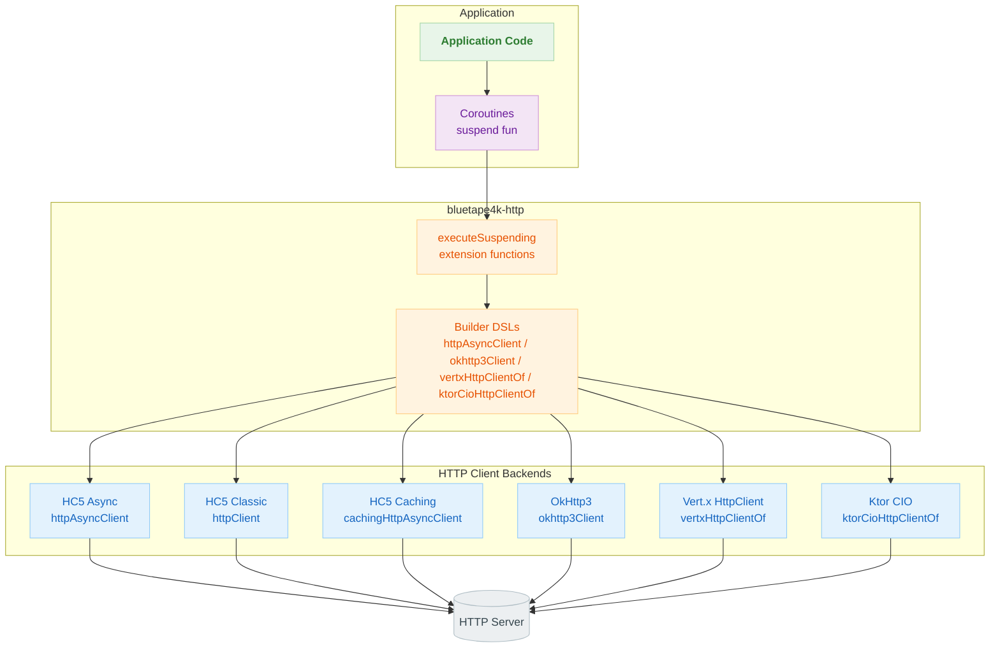
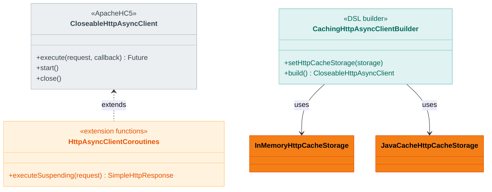
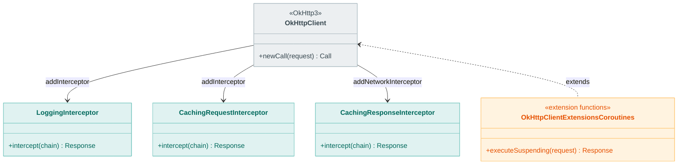
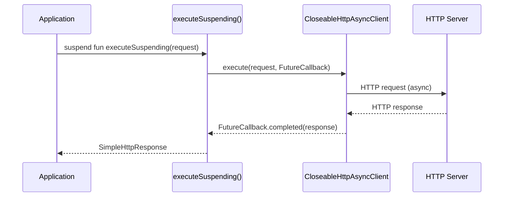

# Module bluetape4k-http

English | [한국어](./README.ko.md)

## Overview

`bluetape4k-http` integrates multiple HTTP client libraries through Kotlin extension functions and DSLs.

It provides a consistent interface for Apache HttpComponents 5, OkHttp3, Vert.x HttpClient, and Ktor Client, with built-in support for Kotlin Coroutines and Virtual Threads.

## Architecture

### Overall Architecture: Multi-Backend HTTP Client


```mermaid
flowchart TD
    subgraph Application["Application"]
        APP[Application Code]
        CO[Coroutines\nsuspend fun]
    end

    subgraph bluetape4k-http
        EXT[executeSuspending\nextension functions]
        DSL[Builder DSLs\nhttpAsyncClient / okhttp3Client / vertxHttpClientOf / ktorCioHttpClientOf]
    end

    subgraph Backends["HTTP Client Backends"]
        HC5A[HC5 Async\nhttpAsyncClient]
        HC5C[HC5 Classic\nhttpClient]
        HC5CA[HC5 Caching\ncachingHttpAsyncClient]
        OKH[OkHttp3\nokhttp3Client]
        VTX[Vert.x HttpClient\nvertxHttpClientOf]
        KTOR[Ktor CIO\nktorCioHttpClientOf]
    end

    APP --> CO
    CO --> EXT
    EXT --> DSL
    DSL --> HC5A
    DSL --> HC5C
    DSL --> HC5CA
    DSL --> OKH
    DSL --> VTX
    DSL --> KTOR
    HC5A --> SERVER[(HTTP Server)]
    HC5C --> SERVER
    HC5CA --> SERVER
    OKH --> SERVER
    VTX --> SERVER
    KTOR --> SERVER

    classDef coreStyle fill:#E8F5E9,stroke:#A5D6A7,color:#2E7D32,font-weight:bold
    classDef asyncStyle fill:#F3E5F5,stroke:#CE93D8,color:#6A1B9A
    classDef serviceStyle fill:#E3F2FD,stroke:#90CAF9,color:#1565C0
    classDef utilStyle fill:#FFF3E0,stroke:#FFCC80,color:#E65100
    classDef extStyle fill:#ECEFF1,stroke:#B0BEC5,color:#37474F

    class APP coreStyle
    class CO asyncStyle
    class EXT,DSL utilStyle
    class HC5A,HC5C,HC5CA,OKH,VTX,KTOR serviceStyle
    class SERVER extStyle
```

### HTTP Client Hierarchy (HC5)


```mermaid
classDiagram
    class CloseableHttpAsyncClient {
        <<ApacheHC5>>
        +execute(request, callback) Future
        +start()
        +close()
    }

    class HttpAsyncClientCoroutines {
        <<extension functions>>
        +executeSuspending(request) SimpleHttpResponse
    }

    class CachingHttpAsyncClientBuilder {
        <<DSL builder>>
        +setHttpCacheStorage(storage)
        +build() CloseableHttpAsyncClient
    }

    CachingHttpAsyncClientBuilder --> InMemoryHttpCacheStorage : uses
    CachingHttpAsyncClientBuilder --> JavaCacheHttpCacheStorage : uses
    CloseableHttpAsyncClient <.. HttpAsyncClientCoroutines : extends

    style CloseableHttpAsyncClient fill:#ECEFF1,stroke:#B0BEC5,color:#37474F
    style HttpAsyncClientCoroutines fill:#FFF3E0,stroke:#FFCC80,color:#E65100
    style CachingHttpAsyncClientBuilder fill:#E0F2F1,stroke:#80CBC4,color:#00695C
    style InMemoryHttpCacheStorage fill:#F57F17,stroke:#E65100,color:#000000
    style JavaCacheHttpCacheStorage fill:#F57F17,stroke:#E65100,color:#000000
```

### OkHttp3 Client Hierarchy


```mermaid
classDiagram
    class OkHttpClient {
        <<OkHttp3>>
        +newCall(request) Call
    }

    class LoggingInterceptor {
        +intercept(chain) Response
    }

    class CachingRequestInterceptor {
        +intercept(chain) Response
    }

    class CachingResponseInterceptor {
        +intercept(chain) Response
    }

    class OkHttpClientExtensionsCoroutines {
        <<extension functions>>
        +executeSuspending(request) Response
    }

    OkHttpClient --> LoggingInterceptor : addInterceptor
    OkHttpClient --> CachingRequestInterceptor : addInterceptor
    OkHttpClient --> CachingResponseInterceptor : addNetworkInterceptor
    OkHttpClient <.. OkHttpClientExtensionsCoroutines : extends

    style OkHttpClient fill:#ECEFF1,stroke:#B0BEC5,color:#37474F
    style LoggingInterceptor fill:#E0F2F1,stroke:#80CBC4,color:#00695C
    style CachingRequestInterceptor fill:#E0F2F1,stroke:#80CBC4,color:#00695C
    style CachingResponseInterceptor fill:#E0F2F1,stroke:#80CBC4,color:#00695C
    style OkHttpClientExtensionsCoroutines fill:#FFF3E0,stroke:#FFCC80,color:#E65100
```

### Async HTTP Request Flow (HC5 Async + Coroutines)


```mermaid
sequenceDiagram
        participant App as Application
        participant Ext as executeSuspending()
        participant HC5 as CloseableHttpAsyncClient
        participant Server as HTTP Server

    App->>Ext: suspend fun executeSuspending(request)
    Ext->>HC5: execute(request, FutureCallback)
    HC5->>Server: HTTP request (async)
    Server-->>HC5: HTTP response
    HC5-->>Ext: FutureCallback.completed(response)
    Ext-->>App: SimpleHttpResponse
```

## Key Features

### 1. Apache HttpComponents 5 (HC5)

Wraps Apache HttpClient 5 with Kotlin DSL and Coroutines for both synchronous and asynchronous HTTP communication.

**Supported features:**

- Classic HttpClient (synchronous)
- Async HttpClient (asynchronous, Coroutines integration)
- HTTP/2 support (httpcore5-h2)
- Caching HttpClient (In-Memory, JCache)
- Connection pool management
- SSL/TLS configuration
- Fluent API

```kotlin
import io.bluetape4k.http.hc5.async.*

// Create an async HttpClient
val client = httpAsyncClient {
    setConnectionManager(cm)
    setMaxConnTotal(100)
    setMaxConnPerRoute(10)
}

// Async request in a Coroutines context
val request = SimpleHttpRequest.get("https://httpbin.org/get")
val response: SimpleHttpResponse = client.executeSuspending(request)
```

**Classic HttpClient:**

```kotlin
import io.bluetape4k.http.hc5.classic.*

// Create a classic HttpClient
val client = httpClient {
    setConnectionManager(poolingConnectionManager())
}

// Synchronous request
val response = client.execute(classicRequestOf(Method.GET, "https://httpbin.org/get"))
```

**Virtual Thread Classic HttpClient:**

```kotlin
import io.bluetape4k.http.hc5.classic.virtualThreadHttpClientOf

// HC5 Classic client backed by a Virtual Thread connection pool
val client = virtualThreadHttpClientOf(maxConnTotal = 200, maxConnPerRoute = 100)

client.use {
    val response = it.execute(classicRequestOf(Method.GET, "https://httpbin.org/get"))
    println(response.code)
}
```

**Caching HttpClient:**

```kotlin
import io.bluetape4k.http.hc5.cache.*

// HttpClient with in-memory cache
val cacheStorage = InMemoryHttpCacheStorage.createObjectCache()
val cachingClient = cachingHttpClient(cacheStorage)

// Async caching client (JCache-based)
val asyncCachingClient = cachingHttpAsyncClient {
    setHttpCacheStorage(JavaCacheHttpCacheStorage.createObjectCache(jcache))
}
```

### 2. OkHttp3

Square's OkHttp3 client made convenient with a Kotlin DSL.

**Supported features:**

- Virtual Thread-based Dispatcher by default
- Connection pool management
- Logging/caching interceptors
- MockWebServer utilities
- Coroutines extensions

**DSL Builder Functions (`OkHttp3Support.kt`):**

| Function | Description |
|----------|-------------|
| `okhttp3Client(connectionPool, dispatcher, block)` | Create an `OkHttpClient` with optional pool/dispatcher |
| `okHttp3ConnectionPool(maxIdleConnections, keepAliveDuration)` | Create a `ConnectionPool` |
| `okhttp3DispatcherWithVirtualThread(maxRequests, maxRequestsPerHost)` | Create a `Dispatcher` backed by Virtual Threads |
| `okhttp3DispatcherOf(executor, maxRequests, maxRequestsPerHost)` | Create a `Dispatcher` with a custom `ExecutorService` |
| `okhttp3ClientBuilderOf(connectionPool, dispatcher, block)` | Get a pre-configured `OkHttpClient.Builder` |
| `okhttp3RequestOf(url, block)` | Create an `okhttp3.Request` |
| `okhttp3CacheControl(block)` | Create a `CacheControl` via DSL |
| `okhttp3CacheControlOf(maxAge, maxStale, minFresh)` | Create a `CacheControl` with duration parameters |

```kotlin
import io.bluetape4k.http.okhttp3.*

// Connection pool + Virtual Thread Dispatcher
val pool = okHttp3ConnectionPool(maxIdleConnections = 50)
val dispatcher = okhttp3DispatcherWithVirtualThread(maxRequests = 200)

val client = okhttp3Client(
    connectionPool = pool,
    dispatcher = dispatcher,
) {
    addInterceptor(LoggingInterceptor(log))
    addNetworkInterceptor(CachingResponseInterceptor())
}

// Request DSL
val request = okhttp3RequestOf("https://httpbin.org/get") {
    get()
    header("Accept", "application/json")
}

// Sync call
client.newCall(request).execute().use { response ->
    println(response.body.string())
}

// Async call in a Coroutines context
val response = client.executeSuspending(request)
```

`executeSuspending` contract:

- When the coroutine is cancelled, the underlying OkHttp `Call` is also cancelled.
- Returns `Response` on success and propagates the cause exception on failure.

### 3. Vert.x HttpClient

Integrates Eclipse Vert.x's async HttpClient with Kotlin Coroutines.

```kotlin
import io.bluetape4k.http.vertx.*
import io.vertx.kotlin.core.http.httpClientOptionsOf

val options = httpClientOptionsOf(
    maxPoolSize = 20,
    keepAlive = true,
)
val vertxClient = vertxHttpClientOf(options)
```

## HTTP Client Comparison

| Client            | Protocol         | Characteristics                     | Use Case                     |
|-------------------|------------------|-------------------------------------|------------------------------|
| HC5 Classic       | HTTP/1.1         | Stable, rich configuration          | Synchronous API calls        |
| HC5 Async         | HTTP/1.1, HTTP/2 | Async, Coroutines integration       | High-performance async       |
| OkHttp3           | HTTP/1.1, HTTP/2 | Lightweight, Virtual Thread default | General-purpose HTTP client  |
| Vert.x HttpClient | HTTP/1.1, HTTP/2 | Event loop-based                    | Vert.x ecosystem integration |

## Performance Benchmark

Three JMH (Java Microbenchmark Harness) benchmarks compare client throughput.
All benchmarks target a separate Docker container server, isolating the server JVM from the client JVM.

```bash
# Run all benchmarks
./gradlew :bluetape4k-http:testBenchmark

# Run a specific benchmark
./gradlew :bluetape4k-http:testBenchmark -Pbenchmark.include="HttpClientBenchmark"
./gradlew :bluetape4k-http:testBenchmark -Pbenchmark.include="HttpClientLatencyBenchmark"
./gradlew :bluetape4k-http:testBenchmark -Pbenchmark.include="HttpClientCompressionCacheBenchmark"
```

### 1. HttpClientBenchmark — Base Throughput (`GET /ping`)

**Setup**: `BluetapeHttpServer` (Docker) · `@Threads(8)` · warmup 1×2s · measurement 3×3s

Lightweight `/ping` responses to measure pure connection throughput.

| Client | Mode | Notes |
|--------|------|-------|
| OkHttp3 Sync | sync | Platform thread |
| OkHttp3 VirtualThread | sync | Virtual Thread Dispatcher |
| OkHttp3 Coroutines | async | `Call.executeAsync()` (official okhttp-coroutines) |
| Java HttpClient Sync | sync | JDK built-in |
| Java HttpClient VirtualThread | sync | Virtual Thread executor |
| Java HttpClient H2 Sync | sync | HTTP/2 |
| HC5 Classic | sync | Apache HttpComponents 5 |
| HC5 Classic VirtualThread | sync | VT-based connection manager |
| HC5 Classic Coroutines | coroutine | `Dispatchers.IO` |
| HC5 Async Coroutines | async | `executeSuspending()` |
| Vert.x WebClient Coroutines | async | Event loop |

> **Note**: With no simulated latency all modes produce similar throughput.
> Differences arise mainly from connection pool configuration and thread model.

### 2. HttpClientLatencyBenchmark — High-Latency Throughput (`GET /httpbin/delay/0.05`)

**Setup**: `BluetapeHttpServer` (Docker, 50 ms delay) · `@Threads(100)` · warmup 1×3s · measurement 3×5s

**Theoretical sync ceiling**: 100 threads × (1000 ms / 50 ms) = **2,000 ops/s**
Async / coroutine modes can exceed this ceiling without blocking threads.

### 3. HttpClientCompressionCacheBenchmark — Cache + gzip Effect

**Setup**: `WireMockServer` (Docker, 10 ms fixed delay) · gzip 1 KB response · `Cache-Control: public, max-age=3600` · `@Threads(8)` · warmup 2×3s · measurement 3×5s

**Theoretical baseline (no cache)**: 8 threads × (1000 ms / 10 ms) = **800 ops/s**

| Client | Cache | ops/s | vs baseline |
|--------|-------|------:|-------------|
| HC5 Classic + InMemoryCache | In-memory (Heap) | **813,906** | ×1,233 |
| OkHttp3 + DiskLruCache | Disk (OS page cache) | **35,359** | ×53 |
| HC5 Classic (no cache) | — | 682 | ×1 |
| HC5 Classic VirtualThread (no cache) | — | 668 | — |
| OkHttp3 (no cache) | — | 661 | — |

**Key Insights**:
- **Cache effect**: Eliminating a 10 ms network RTT alone achieves 35K–813K ops/s
- **HC5 MemCache vs OkHttp DiskCache (23× gap)**:
  - HC5: `ConcurrentHashMap` direct lookup → ~1–10 μs/op
  - OkHttp: `DiskLruCache` `synchronized` + journal write + per-hit gzip decompression → ~200–230 μs/op
  - The 1 KB cache file fits in a single 4 KB OS page, so after warmup reads are purely from page cache (RAM), not real disk I/O — but the filesystem call overhead remains
- **OkHttp DiskCache at 35K ops/s is correct**: test-verified with `networkResponse == null` and `cacheResponse != null` on every cache hit

**Recommended client by use case**:

| Scenario | Recommendation |
|----------|----------------|
| Repeated GET + maximum cache throughput | HC5 CachingHttpClient (MemCache) |
| Cache persistence across restarts | OkHttp3 + DiskLruCache |
| General high-throughput (no caching needed) | HC5 Classic VirtualThread or OkHttp3 |
| High-latency async bulk requests | HC5 Async Coroutines or Vert.x WebClient |
| Ktor-based apps / coroutine-first calls | Ktor CIO |

## Backend Comparison

| Client | Protocol | Characteristics | Use case |
|--------|----------|-----------------|----------|
| HC5 Async | HTTP/1.x, HTTP/2 | Full-featured, caching, SSL, Virtual Thread | Enterprise backend, high-throughput |
| HC5 Classic | HTTP/1.x, HTTP/2 | Synchronous, VirtualThread support | Legacy code, blocking I/O |
| OkHttp3 | HTTP/1.x, HTTP/2 | Interceptors, DiskLruCache, MockWebServer | General-purpose, Android-compatible |
| JDK | HTTP/1.x, HTTP/2 | Standard library, no extra dependency | Minimal footprint, Java-native |
| Vert.x | HTTP/1.x, HTTP/2 | Event-loop, reactive, ALPN | Vert.x-based applications |
| Ktor CIO | HTTP/1.x | Suspend-native, Ktor plugin ecosystem, lightweight | Ktor-based apps/libraries and coroutine-first calls |

> **Note**: Ktor CIO does not support HTTP/2. For HTTP/2 use cases, prefer HC5 Async, JDK, or OkHttp3.

## Coroutines Support

All async HTTP clients support natural use in Coroutines contexts via the `executeSuspending` extension function.

```kotlin
import kotlinx.coroutines.*

suspend fun fetchData() = coroutineScope {
    val client = httpAsyncClient { /* configuration */ }

    // Parallel requests
    val response1 = async { client.executeSuspending(request1) }
    val response2 = async { client.executeSuspending(request2) }

    val results = awaitAll(response1, response2)
}
```

## Module Structure

```
io.bluetape4k.http
├── hc5/                    # Apache HttpComponents 5
│   ├── async/              # Async client, Coroutines integration
│   ├── cache/              # Caching client (In-Memory, JCache)
│   ├── classic/            # Sync client
│   ├── entity/             # Entity/Multipart builders
│   ├── fluent/             # Fluent API extensions
│   ├── http/               # Request/Response builder, config
│   ├── http2/              # HTTP/2 configuration
│   ├── protocol/           # HttpClientContext extensions
│   ├── reactor/            # IOReactor configuration
│   ├── routing/            # Routing utilities
│   └── ssl/                # SSL/TLS configuration
├── okhttp3/                # OkHttp3
│   ├── OkHttp3Support.kt   # Client/Request/Response DSL
│   ├── LoggingInterceptor.kt
│   ├── CachingRequestInterceptor.kt
│   ├── CachingResponseInterceptor.kt
│   └── mock/               # MockWebServer utilities
├── vertx/                  # Vert.x HttpClient
│   └── VertxHttpClientSupport.kt
└── ktor/                   # Ktor Client (optional, suspend-native)
    └── KtorHttpClientSupport.kt
```

## Dependencies

```kotlin
dependencies {
    implementation(project(":bluetape4k-http"))

    // Apache HttpComponents 5 (primary backend)
    implementation("org.apache.httpcomponents.client5:httpclient5")

    // Optional backends — add compileOnly for each backend you use
    compileOnly("com.squareup.okhttp3:okhttp")               // OkHttp3
    compileOnly("io.vertx:vertx-core")                       // Vert.x
    compileOnly("io.ktor:ktor-client-core")                  // Ktor Client (any engine)
    compileOnly("io.ktor:ktor-client-cio")                   // Ktor CIO engine (HTTP/1.x)
}
```

## Testing

```bash
# Run HTTP module tests
./gradlew :bluetape4k-http:test

# Check line coverage
./gradlew :bluetape4k-http:koverLog
```

### Test Coverage

Line coverage: **72%** (target: ≥ 70%)

Covered packages:

| Package | Coverage | Tests |
|---------|----------|-------|
| `hc5/async` | ✅ | `AsyncHttpClientTest`, `AsyncHttpClientCoroutinesTest`, `MinimalHttpAsyncClientTest` |
| `hc5/async/methods` | ✅ | `SimpleHttpRequestTest`, `SimpleHttpResponseTest`, `AsyncMethodsTest` |
| `hc5/cache` | ✅ | `CachingHttpClientBuilderTest`, `CachingHttpAsyncClientBuilderTest` |
| `hc5/classic` | ✅ | `ClassicHttpClientTest`, `MinimalAndVirtualThreadHttpClientTest` |
| `hc5/fluent` | ✅ | `RequestTest` |
| `hc5/http` | ✅ | `ContextBuilderTest`, `CookieSpecSupportTest`, `PoolingHttpClientConnectionManagerBuilderTest`, `BasicRequestProducerTest` |
| `hc5/protocol` | ✅ | `HttpClientContextTest` |
| `hc5/routing` | ✅ | `RoutingSupportTest` |
| `hc5/ssl` | ✅ | `SslSupportTest` |
| `jdk` | ✅ | `JdkHttpClientSupportTest`, `JdkHttpClientCoroutinesTest` |
| `okhttp3` | ✅ | Multiple tests |
| `ktor` | ✅ | `KtorHttpClientSupportTest` |

## References

- [Apache HttpComponents 5](https://hc.apache.org/httpcomponents-client-5.4.x/)
- [OkHttp](https://square.github.io/okhttp/)
- [Vert.x HttpClient](https://vertx.io/docs/vertx-core/kotlin/)
- [Ktor Client](https://ktor.io/docs/client-create-and-configure.html)
- [httpbin.org](https://httpbin.org/) - HTTP testing API
