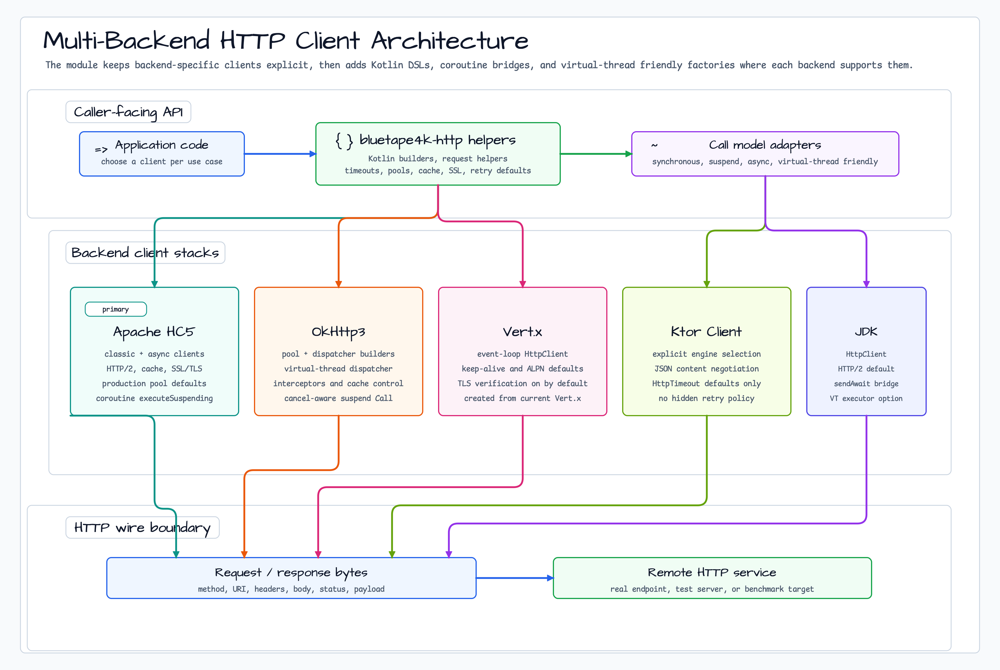
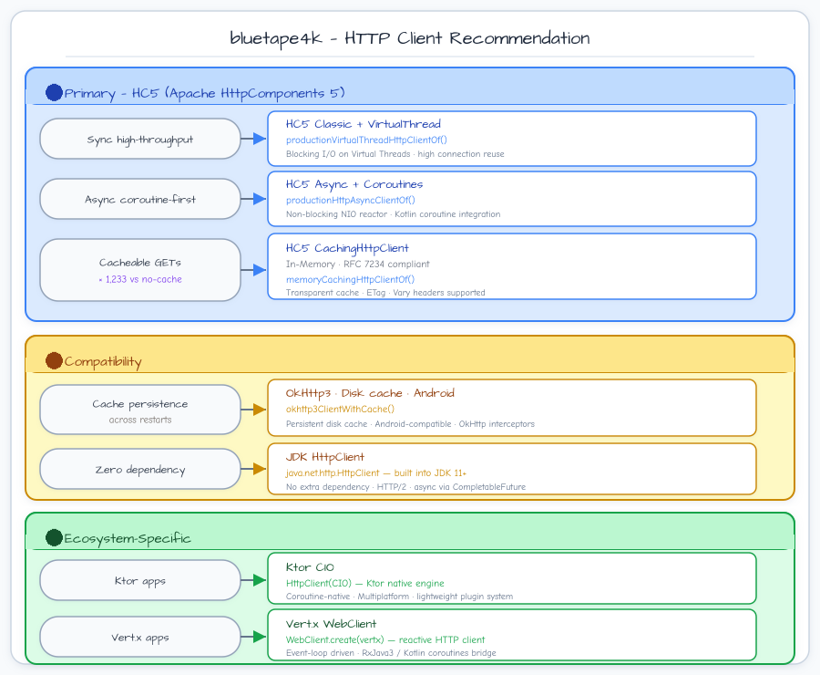
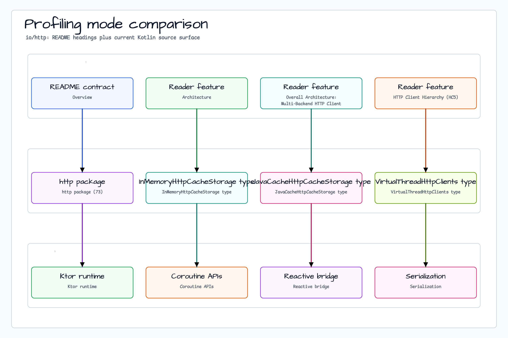
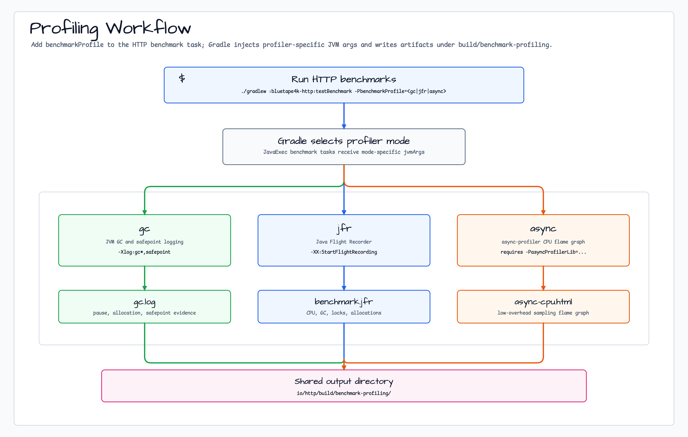
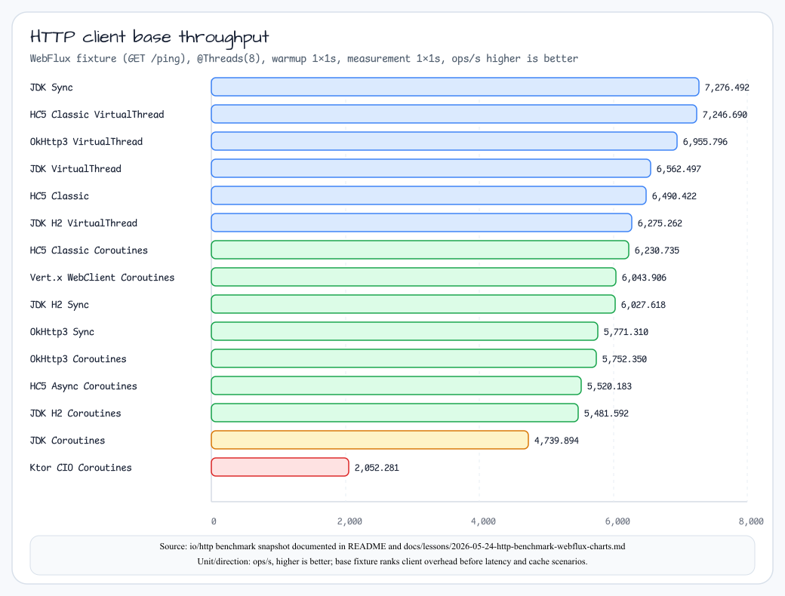

# Module bluetape4k-http

English | [한국어](./README.ko.md)

## Overview

`bluetape4k-http` integrates multiple HTTP client libraries through Kotlin extension functions and DSLs.

It provides a consistent interface for Apache HttpComponents 5, OkHttp3, Vert.x HttpClient, and Ktor Client, with built-in support for Kotlin Coroutines and Virtual Threads.

## Strictly bounded complete response bodies

Use the bounded adapters when a complete body is required and an oversized body
must fail instead of returning a prefix.

```kotlin
import io.bluetape4k.http.hc5.entity.readBodyBytes

httpClient.execute(request).use { response ->
    val body = response.entity.readBodyBytes(maxBytes = 64 * 1024)
}
```

```kotlin
import io.bluetape4k.http.jdk.readBodyBytes
import java.io.InputStream
import java.net.http.HttpResponse

val response: HttpResponse<InputStream> =
    jdkClient.send(request, HttpResponse.BodyHandlers.ofInputStream())
val body = response.readBodyBytes(maxBytes = 64 * 1024)
```

The HC5 adapter closes the acquired entity stream, while the caller still closes
the enclosing response. A null HC5 entity becomes an empty body; preserve null
with `response.entity?.let { it.readBodyBytes(maxBytes = 64 * 1024) }`. The JDK
adapter closes only `HttpResponse.body()` and does not close the client or its
executor. Neither adapter interprets the status code.

| Need | API |
|---|---|
| Complete JSON/schema body; reject overflow | `readBodyBytes` / `readBodyString` |
| Diagnostic or preview prefix | existing HC5 `toByteArrayOrNull` / `toStringOrNull` |
| Preserve a null HC5 entity | `entity?.let { ... }` |
| General caller-owned stream | `inputStream.use { it.readAllBytes(maxBytes) }` |

These calls, the one-byte EOF check, and `close()` are blocking and are not made
cancellable by coroutine cancellation. Configure connect, response, and read
timeouts, call them at a blocking-I/O boundary rather than on an event loop, and
let a supervisor close the stream or enclosing response to abort stalled work.
Transport-specific abort behavior is outside this helper.

The limit applies to bytes exposed by the adapter. Apply a separate decoded-byte
limit after decompression. Budget temporary heap as approximately
`concurrent reads * (2 * maxBytes + segment overhead)`. The library emits no logs
or metrics; applications may record low-cardinality endpoint/operation, max, and
overflow/read/close categories, but must not record payloads or exception messages.

Adoption sequence: publish library `2.1.0`, select it through the central catalog
or an allowed repository-local override, run compile and targeted smoke tests, and
then migrate each consumer in its own PR. Until that finishes, retain the manual
strict read loop. Roll back to the previous dependency plus that loop; the
truncating preview APIs are not a strict-read fallback.

## Persisted outbound HTTP error sanitization

Use `sanitizeOutboundHttpError(statusCode, rawMessage)` before storing an external
HTTP failure in a bounded database field or similar persistence boundary.

The sanitizer returns at most 240 characters including the status prefix and
inspects only that bounded source prefix. It drops later stack-trace lines and
the remainder after `Authorization`, `Cookie`, `Token`, `Secret`, or `API-Key`
style labels.

```kotlin
import io.bluetape4k.http.sanitizeOutboundHttpError

val storedError = sanitizeOutboundHttpError(
    statusCode = 503,
    rawMessage = "Authorization: Bearer opaque-secret upstream unavailable",
)
// HTTP 503 Authorization:[redacted]
```

The result always starts with `HTTP <statusCode>` and is capped at 240 characters.
A null or blank message produces only the status, and multiline input keeps only
the first line. After the first `Authorization`, `Cookie`, `Token`, `Secret`, or
`API-Key`-like label, the remainder of that line is removed fail-closed so malformed,
quoted, or whitespace-containing credentials cannot leak. This is a persisted-error
contract, not a header-logging redaction API.

The caller still owns HTTP status classification, retry/permanent-failure policy,
database persistence, logging, transactions, and coroutine cancellation. Do not
re-log or rethrow the unsanitized message.

## Architecture

### Overall Architecture: Multi-Backend HTTP Client



### HTTP Client Hierarchy (HC5)


### OkHttp3 Client Hierarchy


### Async HTTP Request Flow (HC5 Async + Coroutines)


## Key Features

### 1. Apache HttpComponents 5 (HC5)

Wraps Apache HttpClient 5 with Kotlin DSL and Coroutines for both synchronous and asynchronous HTTP communication.

**Supported features:**

- Classic HttpClient (synchronous)
- Async HttpClient (asynchronous, Coroutines integration)
- HTTP/2 support (httpcore5-h2)
- Caching HttpClient (In-Memory, JCache)
- Connection pool management
- SSL/TLS configuration
- Fluent API

```kotlin
import io.bluetape4k.http.hc5.async.*

// Create an async HttpClient
val client = httpAsyncClient {
    setConnectionManager(cm)
    setMaxConnTotal(100)
    setMaxConnPerRoute(10)
}

// Async request in a Coroutines context
val request = SimpleHttpRequest.get("https://httpbin.org/get")
val response: SimpleHttpResponse = client.executeSuspending(request)
```

**Classic HttpClient:**

```kotlin
import io.bluetape4k.http.hc5.classic.*

// Create a classic HttpClient
val client = httpClient {
    setConnectionManager(poolingConnectionManager())
}

// Synchronous request
val response = client.execute(classicRequestOf(Method.GET, "https://httpbin.org/get"))
```

**Virtual Thread Classic HttpClient:**

```kotlin
import io.bluetape4k.http.hc5.classic.virtualThreadHttpClientOf

// HC5 Classic client backed by a Virtual Thread connection pool
val client = virtualThreadHttpClientOf(maxConnTotal = 200, maxConnPerRoute = 100)

client.use {
    val response = it.execute(classicRequestOf(Method.GET, "https://httpbin.org/get"))
    println(response.code)
}
```

**Production-tuned HttpClient:**

One-call factory that applies all recommended defaults: pooled connections, eviction of
expired/idle connections, keep-alive fallback for servers that omit the `Keep-Alive` header,
retry on transient failures, and conservative request timeouts.

```kotlin
import io.bluetape4k.http.hc5.classic.*
import io.bluetape4k.http.hc5.http.*

// All defaults: pool 200/100, eviction 60 s, keep-alive 60 s fallback, 3 retries, timeouts 5/10/30 s
val client = productionHttpClientOf()

// Custom pool size + longer response timeout
val client = productionHttpClientOf(
    maxConnTotal = 500,
    maxConnPerRoute = 200,
    requestConfig = productionRequestConfigOf(responseTimeout = Timeout.ofSeconds(60)),
)

// Virtual Thread variant (same tuning, virtual-thread connection pool)
val client = productionVirtualThreadHttpClientOf()
```

| Parameter | Default | Description |
|-----------|---------|-------------|
| `maxConnTotal` | 200 | Total pooled connections |
| `maxConnPerRoute` | 100 | Pooled connections per route |
| `connectionRequestTimeout` | 5 s | Wait for connection from pool |
| `connectTimeout` | 10 s | TCP connect handshake |
| `responseTimeout` | 30 s | First response byte deadline |
| `maxIdleTime` | 60 s | Idle connection eviction threshold |
| keep-alive fallback | 60 s | Used when server omits `Keep-Alive` |
| `maxRetries` | 3 | Retry count on transient failures |

**Async production-tuned client:**

```kotlin
import io.bluetape4k.http.hc5.async.*

val asyncClient = productionHttpAsyncClientOf()

// Customised
val asyncClient = productionHttpAsyncClientOf(
    maxConnTotal = 500,
    retryStrategy = defaultRetryStrategy(maxRetries = 5),
)
```

**Caching HttpClient:**

```kotlin
import io.bluetape4k.http.hc5.cache.*

// HttpClient with in-memory cache
val cacheStorage = InMemoryHttpCacheStorage.createObjectCache()
val cachingClient = cachingHttpClient(cacheStorage)

// Async caching client (JCache-based)
val asyncCachingClient = cachingHttpAsyncClient {
    setHttpCacheStorage(JavaCacheHttpCacheStorage.createObjectCache(jcache))
}
```

### 2. OkHttp3

Square's OkHttp3 client made convenient with a Kotlin DSL.

**Supported features:**

- Virtual Thread-based Dispatcher by default
- Connection pool management
- Logging/caching interceptors
- MockWebServer utilities
- Coroutines extensions

**DSL Builder Functions (`OkHttp3Support.kt`):**

| Function | Description |
|----------|-------------|
| `okhttp3Client(connectionPool, dispatcher, block)` | Create an `OkHttpClient` with optional pool/dispatcher |
| `okHttp3ConnectionPool(maxIdleConnections, keepAliveDuration)` | Create a `ConnectionPool` |
| `okhttp3DispatcherWithVirtualThread(maxRequests, maxRequestsPerHost)` | Create a `Dispatcher` backed by Virtual Threads |
| `okhttp3DispatcherOf(executor, maxRequests, maxRequestsPerHost)` | Create a `Dispatcher` with a custom `ExecutorService` |
| `okhttp3ClientBuilderOf(connectionPool, dispatcher, block)` | Get a pre-configured `OkHttpClient.Builder` |
| `okhttp3RequestOf(url, block)` | Create an `okhttp3.Request` |
| `okhttp3CacheControl(block)` | Create a `CacheControl` via DSL |
| `okhttp3CacheControlOf(maxAge, maxStale, minFresh)` | Create a `CacheControl` with duration parameters |

```kotlin
import io.bluetape4k.http.okhttp3.*

// Connection pool + Virtual Thread Dispatcher
val pool = okHttp3ConnectionPool(maxIdleConnections = 50)
val dispatcher = okhttp3DispatcherWithVirtualThread(maxRequests = 200)

val client = okhttp3Client(
    connectionPool = pool,
    dispatcher = dispatcher,
) {
    addInterceptor(LoggingInterceptor(log))
    addNetworkInterceptor(CachingResponseInterceptor())
}

// LoggingInterceptor redacts Authorization, Cookie, Set-Cookie,
// API-key, and token-like headers by default.
val clientWithCustomRedaction = okhttp3Client {
    addInterceptor(LoggingInterceptor(log, setOf("X-Internal-Secret")))
}

// Request DSL
val request = okhttp3RequestOf("https://httpbin.org/get") {
    get()
    header("Accept", "application/json")
}

// Sync call
client.newCall(request).execute().use { response ->
    println(response.body.string())
}

// Async call in a Coroutines context
val response = client.executeSuspending(request)
```

`executeSuspending` contract:

- When the coroutine is cancelled, the underlying OkHttp `Call` is also cancelled.
- Returns `Response` on success and propagates the cause exception on failure.

### 3. Vert.x HttpClient

Integrates Eclipse Vert.x's async HttpClient with Kotlin Coroutines.

```kotlin
import io.bluetape4k.http.vertx.*
import io.vertx.core.Vertx
import io.vertx.kotlin.core.http.httpClientOptionsOf

val vertx = Vertx.vertx()
val options = httpClientOptionsOf(
    maxPoolSize = 20,
    keepAlive = true,
)
val vertxClient = vertxHttpClientOf(vertx, options)
```

The `defaultVertxHttpClient` uses the managed default Vert.x instance from `bluetape4k-vertx`. Close the managed client
before closing the default Vert.x instance during application shutdown or test cleanup.

```kotlin
import io.bluetape4k.http.vertx.closeDefaultVertxHttpClient
import io.bluetape4k.vertx.closeDefaultVertx

closeDefaultVertxHttpClient()
closeDefaultVertx()
```

### 4. Ktor Client

Ktor client support stays in `bluetape4k-http` rather than a separate module. The helpers are intentionally thin: choose the engine explicitly, then opt into common JSON and timeout defaults.

```kotlin
import io.bluetape4k.http.ktor.*
import io.ktor.client.call.body
import io.ktor.client.engine.cio.CIO
import io.ktor.client.request.get
import kotlinx.serialization.Serializable
import java.time.Duration

@Serializable
data class HealthResponse(val status: String)

val client = ktorJsonHttpClientOf(
    engineFactory = CIO,
    timeouts = KtorClientTimeouts(
        requestTimeout = Duration.ofSeconds(15),
        connectTimeout = Duration.ofSeconds(5),
        socketTimeout = Duration.ofSeconds(15),
    ),
)

val response: HealthResponse = client.get("https://example.com/health").body()
```

`ktorJsonHttpClientOf` and `ktorCioJsonHttpClientOf` install only Kotlinx JSON content negotiation and `HttpTimeout`. Retry, resilience, authentication, logging, and service-specific plugins remain application-level concerns or belong in their existing dedicated modules.

## Primary Recommendations

> See the full design rationale: [`docs/design/2026-05-24-hc5-first-http-client-recommendation.md`](../../docs/design/2026-05-24-hc5-first-http-client-recommendation.md)



**Apache HttpComponents 5 (HC5) is the primary recommended production HTTP client** in `bluetape4k-http`. It provides the deepest feature set: production-tuned factories, in-memory RFC 7234 caching, virtual-thread support, and coroutine integration.

| Scenario | Recommended client | Factory |
|----------|--------------------|---------|
| Sync backend calls (high-throughput) | HC5 Classic + VirtualThread | `productionVirtualThreadHttpClientOf()` |
| Async backend calls (coroutine-first) | HC5 Async + Coroutines | `productionHttpAsyncClientOf()` |
| Repeated cacheable GETs (max throughput) | HC5 CachingHttpClient (in-memory) | `memoryCachingHttpClientOf()` |
| Cache persistence across restarts | OkHttp3 + DiskLruCache | `okhttp3ClientWithCache()` |
| Ktor-based applications | Ktor CIO | — |
| Vert.x-based applications | Vert.x WebClient | — |
| Zero-dependency JVM services | JDK HttpClient | — |

All non-HC5 backends are **fully supported** as first-class options for their target ecosystems. No existing code or API is deprecated.

## HTTP Client Comparison

| Client            | Role             | Protocol         | Characteristics                     | Use Case                     |
|-------------------|------------------|------------------|-------------------------------------|------------------------------|
| HC5 Classic       | **Primary**      | HTTP/1.1         | Production-tuned, retry, keep-alive | Sync backend calls           |
| HC5 Async         | **Primary**      | HTTP/1.1, HTTP/2 | Async, Coroutines integration       | High-performance async       |
| HC5 CachingClient | **Primary**      | HTTP/1.1         | RFC 7234 in-memory cache (813K ops/s) | Cacheable GET-heavy workloads |
| OkHttp3           | Compatibility    | HTTP/1.1, HTTP/2 | Disk cache, interceptors, Android   | Cache persistence, Android   |
| JDK HttpClient    | Compatibility    | HTTP/1.1, HTTP/2 | No extra dependency                 | Zero-dependency services     |
| Vert.x HttpClient | Ecosystem        | HTTP/1.1, HTTP/2 | Event loop-based                    | Vert.x ecosystem             |
| Ktor CIO          | Ecosystem        | HTTP/1.x         | Suspend-native, Ktor plugins        | Ktor-based apps              |

## Performance Benchmark

Three JMH (Java Microbenchmark Harness) benchmarks compare client throughput.
All benchmarks target a separate Docker container server, isolating the server JVM from the client JVM.

```bash
# Run all benchmarks
./gradlew :bluetape4k-http:testBenchmark

# Run a specific benchmark
./gradlew :bluetape4k-http:testBenchmark -PbenchmarkInclude="HttpClientBenchmark"
./gradlew :bluetape4k-http:testBenchmark -PbenchmarkInclude="HttpClientLatencyBenchmark"
./gradlew :bluetape4k-http:testBenchmark -PbenchmarkInclude="HttpClientCompressionCacheBenchmark"
```

### CPU and GC Profiling



Add `-PbenchmarkProfile=<profiler>` to enable profiling during the benchmark run.
Output files are written to `build/benchmark-profiling/`.

| Property value | Mechanism | Output | What it measures |
|---|---|---|---|
| `gc` | JVM GC logging (`-Xlog:gc*`) | `gc.log` | GC pause time, allocation events, safepoints |
| `jfr` | Java Flight Recorder (`-XX:StartFlightRecording`) | `benchmark.jfr` | CPU flame graph, GC events, lock contention, allocations |
| `async` | async-profiler agent (requires `-PasyncProfilerLib=`) | `async-cpu.html` | CPU flame graph (low-overhead sampling) |

```bash
# GC logging for all benchmarks
./gradlew :bluetape4k-http:testBenchmark -PbenchmarkProfile=gc

# JFR CPU + GC recording for a single benchmark class
./gradlew :bluetape4k-http:testBenchmark \
  -PbenchmarkProfile=jfr \
  -PbenchmarkInclude="HttpClientBenchmark"

# async-profiler CPU flame graph (requires the native agent library)
./gradlew :bluetape4k-http:testBenchmark \
  -PbenchmarkProfile=async \
  -PasyncProfilerLib=/path/to/libasyncProfiler.so \
  -PbenchmarkInclude="HttpClientBenchmark"
```

> **JFR**: Open `build/benchmark-profiling/benchmark.jfr` with JDK Mission Control (`jmc`)
> or IntelliJ IDEA's built-in JFR viewer for a CPU flame graph and memory allocation analysis.

> **async-profiler**: Download from [async-profiler releases](https://github.com/async-profiler/async-profiler/releases)
> and point `-PasyncProfilerLib` at the native `libasyncProfiler.so` / `libasyncProfiler.dylib`.
> The kotlinx-benchmark runtime detects the agent and automatically sets JMH forks to 0.

> **Requirements**: All profilers run on JDK 25 (the project toolchain). No extra Gradle dependencies needed.



### 1. HttpClientBenchmark — Base Throughput (`GET /ping`)

**Setup**: `BluetapeWebfluxServer` (Docker) · `@Threads(8)` · warmup 1×1s · measurement 1×1s

Lightweight `/ping` responses to measure pure connection throughput.

| Client | Mode | Notes |
|--------|------|-------|
| OkHttp3 Sync | sync | Platform thread |
| OkHttp3 VirtualThread | sync | Virtual Thread Dispatcher |
| OkHttp3 Coroutines | async | `Call.executeAsync()` (official okhttp-coroutines) |
| Java HttpClient Sync | sync | JDK built-in |
| Java HttpClient VirtualThread | sync | Virtual Thread executor |
| Java HttpClient H2 Sync | sync | HTTP/2 |
| HC5 Classic | sync | Apache HttpComponents 5 |
| HC5 Classic VirtualThread | sync | VT-based connection manager |
| HC5 Classic Coroutines | coroutine | `Dispatchers.IO` |
| HC5 Async Coroutines | async | `executeSuspending()` |
| Vert.x WebClient Coroutines | async | Event loop |
| Ktor CIO Coroutines | coroutine | CIO 3.5 opens dedicated HTTP/1 requests when pipelining is disabled |

> **Note**: With no simulated latency all modes produce similar throughput.
> Differences arise mainly from connection pool configuration and thread model.

### 2. HttpClientLatencyBenchmark — High-Latency Throughput (`GET /httpbin/delay/0.05`)

**Setup**: `BluetapeWebfluxServer` (Docker, 50 ms delay) · `@Threads(100)` · warmup 1×1s · measurement 1×1s

**Theoretical sync ceiling**: 100 threads × (1000 ms / 50 ms) = **2,000 ops/s**
Async / coroutine modes can exceed this ceiling without blocking threads.

### 2026-05-21 HTTP client benchmark snapshot

Environment: local Colima Docker, `bluetape4k/mock-webflux-server:latest`, Docker server 29.2.1, JMH via `:bluetape4k-http:testBenchmark`.
See [the benchmark report](../../docs/benchmarks/2026-05-21-io-http-client-benchmark.md) for commands, rejected approaches, and raw evidence notes.

The snapshot uses the same JMH thread count for every row in each benchmark.
Ktor CIO is no longer a one-thread exception, but the whole benchmark uses a short equal-thread window because CIO 3.5 opens dedicated HTTP/1 connections unless its pipeline path is enabled.

#### Base throughput snapshot

| Benchmark row | ops/s |
|---------------|------:|
| `HttpClientBenchmark.javaHttpSync` | 7,276.492 |
| `HttpClientBenchmark.hc5ClassicVirtualThread` | 7,246.690 |
| `HttpClientBenchmark.okhttp3VirtualThread` | 6,955.796 |
| `HttpClientBenchmark.javaHttpVirtualThread` | 6,562.497 |
| `HttpClientBenchmark.hc5Classic` | 6,490.422 |
| `HttpClientBenchmark.javaHttpH2VirtualThread` | 6,275.262 |
| `HttpClientBenchmark.hc5ClassicCoroutines` | 6,230.735 |
| `HttpClientBenchmark.vertxWebClientCoroutines` | 6,043.906 |
| `HttpClientBenchmark.javaHttpH2Sync` | 6,027.618 |
| `HttpClientBenchmark.okhttp3Sync` | 5,771.310 |
| `HttpClientBenchmark.okhttp3Coroutines` | 5,752.350 |
| `HttpClientBenchmark.hc5AsyncCoroutines` | 5,520.183 |
| `HttpClientBenchmark.javaHttpH2Coroutines` | 5,481.592 |
| `HttpClientBenchmark.javaHttpCoroutines` | 4,739.894 |
| `HttpClientBenchmark.ktorCioCoroutines` | 2,052.281 |



#### High-latency snapshot

| Benchmark row | ops/s |
|---------------|------:|
| `HttpClientLatencyBenchmark.okhttp3VirtualThread` | 1,902.171 |
| `HttpClientLatencyBenchmark.hc5ClassicVirtualThread` | 1,888.018 |
| `HttpClientLatencyBenchmark.javaHttpVirtualThread` | 1,883.634 |
| `HttpClientLatencyBenchmark.hc5Classic` | 1,880.023 |
| `HttpClientLatencyBenchmark.okhttp3Sync` | 1,870.124 |
| `HttpClientLatencyBenchmark.javaHttpSync` | 1,865.997 |
| `HttpClientLatencyBenchmark.javaHttpCoroutines` | 1,863.948 |
| `HttpClientLatencyBenchmark.hc5AsyncCoroutines` | 1,860.655 |
| `HttpClientLatencyBenchmark.vertxWebClientCoroutines` | 1,859.003 |
| `HttpClientLatencyBenchmark.okhttp3Coroutines` | 1,856.895 |
| `HttpClientLatencyBenchmark.ktorCioCoroutines` | 1,515.026 |
| `HttpClientLatencyBenchmark.hc5ClassicCoroutines` | 1,216.306 |


**Notes**:
- The previous Vert.x result mainly measured the Vert.x 5 default HTTP/1 pool cap. The benchmark now configures `PoolOptions` to match peer clients.
- Ktor CIO's default path remains slower on `/ping` because it uses dedicated HTTP/1 connections. Forcing CIO pipelining produced EOFs or hangs against the mock fixtures, so the comparable run keeps default CIO behavior and shortens the window for every row.
- Base `/ping` measurements have high variance on this local Docker setup. Treat the high-latency table as the stronger comparison signal.

### 3. HttpClientCompressionCacheBenchmark — Cache + gzip Effect

**Setup**: `WireMockServer` (Docker, 10 ms fixed delay) · gzip 1 KB response · `Cache-Control: public, max-age=3600` · `@Threads(8)` · warmup 2×3s · measurement 3×5s

**Theoretical baseline (no cache)**: 8 threads × (1000 ms / 10 ms) = **800 ops/s**

| Client | Cache | ops/s | vs baseline |
|--------|-------|------:|-------------|
| HC5 Classic + InMemoryCache | In-memory (Heap) | **813,906** | ×1,233 |
| OkHttp3 + DiskLruCache | Disk (OS page cache) | **35,359** | ×53 |
| HC5 Classic (no cache) | — | 682 | ×1 |
| HC5 Classic VirtualThread (no cache) | — | 668 | — |
| OkHttp3 (no cache) | — | 661 | — |


**Key Insights**:
- **Cache effect**: Eliminating a 10 ms network RTT alone achieves 35K–813K ops/s
- **HC5 MemCache vs OkHttp DiskCache (23× gap)**:
  - HC5: `ConcurrentHashMap` direct lookup → ~1–10 μs/op
  - OkHttp: `DiskLruCache` `synchronized` + journal write + per-hit gzip decompression → ~200–230 μs/op
  - The 1 KB cache file fits in a single 4 KB OS page, so after warmup reads are purely from page cache (RAM), not real disk I/O — but the filesystem call overhead remains
- **OkHttp DiskCache at 35K ops/s is correct**: test-verified with `networkResponse == null` and `cacheResponse != null` on every cache hit

**Recommended client by use case** (see [Primary Recommendations](#primary-recommendations) for the full table):

| Scenario | Recommendation |
|----------|----------------|
| Repeated GET + maximum cache throughput | **HC5 CachingHttpClient (MemCache)** — `memoryCachingHttpClientOf()` |
| Cache persistence across restarts | OkHttp3 + DiskLruCache — `okhttp3ClientWithCache()` |
| General high-throughput (sync) | **HC5 Classic VirtualThread** — `productionVirtualThreadHttpClientOf()` |
| High-latency async bulk requests | **HC5 Async Coroutines** — `productionHttpAsyncClientOf()` |
| Ktor-based apps / coroutine-first calls | Ktor CIO |

## Outbound Error Sanitization

`sanitizeOutboundError` is a framework-neutral pure function for storing or
logging a bounded outbound failure summary. It always keeps the `HTTP <status>`
prefix, uses only the trimmed first line, and returns the prefix alone for
null, blank, or malformed credential markers. `Authorization`, `Cookie`,
`Token`, `Secret`, and `API-Key`/`API_Key`/`API Key` markers are redacted to
`[redacted]`, including `:`/`=` separators, optional `Bearer`, and quoted or
escaped values. The final result is at most 240 UTF-16 code units and does not
split a surrogate pair.

```kotlin
import io.bluetape4k.http.sanitizeOutboundError

val summary = sanitizeOutboundError(
    503,
    "Authorization: Bearer secret-token temporary outage",
)
// HTTP 503 Authorization:[redacted] temporary outage

val statusOnly = sanitizeOutboundError(422, "Authorization: Bearer")
// HTTP 422
```

The caller owns retry, status classification, transaction, and cancellation
behavior. Do not pass the original `Throwable` to logging or persistence; use
the returned summary instead.

## Backend Comparison

| Client | Protocol | Characteristics | Use case |
|--------|----------|-----------------|----------|
| HC5 Async | HTTP/1.x, HTTP/2 | Full-featured, caching, SSL, Virtual Thread | Enterprise backend, high-throughput |
| HC5 Classic | HTTP/1.x, HTTP/2 | Synchronous, VirtualThread support | Legacy code, blocking I/O |
| OkHttp3 | HTTP/1.x, HTTP/2 | Interceptors, DiskLruCache, MockWebServer | General-purpose, Android-compatible |
| JDK | HTTP/1.x, HTTP/2 | Standard library, no extra dependency | Minimal footprint, Java-native |
| Vert.x | HTTP/1.x, HTTP/2 | Event-loop, reactive, ALPN | Vert.x-based applications |
| Ktor CIO | HTTP/1.x | Suspend-native, Ktor plugin ecosystem, lightweight | Ktor-based apps/libraries and coroutine-first calls |

> **Note**: Ktor CIO does not support HTTP/2. For HTTP/2 use cases, prefer HC5 Async, JDK, or OkHttp3.

## Coroutines Support

All async HTTP clients support natural use in Coroutines contexts via the `executeSuspending` extension function.

```kotlin
import kotlinx.coroutines.*

suspend fun fetchData() = coroutineScope {
    val client = httpAsyncClient { /* configuration */ }

    // Parallel requests
    val response1 = async { client.executeSuspending(request1) }
    val response2 = async { client.executeSuspending(request2) }

    val results = awaitAll(response1, response2)
}
```

## Module Structure

```
io.bluetape4k.http
├── hc5/                    # Apache HttpComponents 5
│   ├── async/              # Async client, Coroutines integration
│   ├── cache/              # Caching client (In-Memory, JCache)
│   ├── classic/            # Sync client
│   ├── entity/             # Entity/Multipart builders
│   ├── fluent/             # Fluent API extensions
│   ├── http/               # Request/Response builder, config
│   ├── http2/              # HTTP/2 configuration
│   ├── protocol/           # HttpClientContext extensions
│   ├── reactor/            # IOReactor configuration
│   ├── routing/            # Routing utilities
│   └── ssl/                # SSL/TLS configuration
├── okhttp3/                # OkHttp3
│   ├── OkHttp3Support.kt   # Client/Request/Response DSL
│   ├── LoggingInterceptor.kt
│   ├── CachingRequestInterceptor.kt
│   ├── CachingResponseInterceptor.kt
│   └── mock/               # MockWebServer utilities
├── vertx/                  # Vert.x HttpClient
│   └── VertxHttpClientSupport.kt
└── ktor/                   # Ktor Client (optional, suspend-native)
    └── KtorHttpClientSupport.kt
```

## Dependencies

```kotlin
dependencies {
    implementation("io.github.bluetape4k:bluetape4k-http:${bluetape4kVersion}")

    // Add compileOnly for each backend you use.
    // Change to implementation in application projects where runtime availability is required.
    compileOnly("org.apache.httpcomponents.client5:httpclient5") // HC5
    compileOnly("com.squareup.okhttp3:okhttp")                   // OkHttp3
    compileOnly("io.vertx:vertx-core")                           // Vert.x
    compileOnly("io.ktor:ktor-client-core")                      // Ktor Client (any engine)
    compileOnly("io.ktor:ktor-client-cio")                       // Ktor CIO engine (HTTP/1.x)
    compileOnly("io.ktor:ktor-client-content-negotiation")       // Ktor JSON helper
    compileOnly("io.ktor:ktor-serialization-kotlinx-json")       // Kotlinx JSON bridge
    compileOnly("org.jetbrains.kotlinx:kotlinx-serialization-json")
}
```

## Testing

```bash
# Run HTTP module tests
./gradlew :bluetape4k-http:test

# Check line coverage
./gradlew :bluetape4k-http:koverLog
```

### Test Coverage

Line coverage: **72%** (target: ≥ 70%)

Covered packages:

| Package | Coverage | Tests |
|---------|----------|-------|
| `hc5/async` | ✅ | `AsyncHttpClientTest`, `AsyncHttpClientCoroutinesTest`, `MinimalHttpAsyncClientTest` |
| `hc5/async/methods` | ✅ | `SimpleHttpRequestTest`, `SimpleHttpResponseTest`, `AsyncMethodsTest` |
| `hc5/cache` | ✅ | `CachingHttpClientBuilderTest`, `CachingHttpAsyncClientBuilderTest` |
| `hc5/classic` | ✅ | `ClassicHttpClientTest`, `MinimalAndVirtualThreadHttpClientTest` |
| `hc5/fluent` | ✅ | `RequestTest` |
| `hc5/http` | ✅ | `ContextBuilderTest`, `CookieSpecSupportTest`, `PoolingHttpClientConnectionManagerBuilderTest`, `BasicRequestProducerTest` |
| `hc5/protocol` | ✅ | `HttpClientContextTest` |
| `hc5/routing` | ✅ | `RoutingSupportTest` |
| `hc5/ssl` | ✅ | `SslSupportTest` |
| `jdk` | ✅ | `JdkHttpClientSupportTest`, `JdkHttpClientCoroutinesTest` |
| `okhttp3` | ✅ | Multiple tests |
| `ktor` | ✅ | `KtorHttpClientSupportTest` |

## References

- [Apache HttpComponents 5](https://hc.apache.org/httpcomponents-client-5.4.x/)
- [OkHttp](https://square.github.io/okhttp/)
- [Vert.x HttpClient](https://vertx.io/docs/vertx-core/kotlin/)
- [Ktor Client](https://ktor.io/docs/client-create-and-configure.html)
- [httpbin.org](https://httpbin.org/) - HTTP testing API
