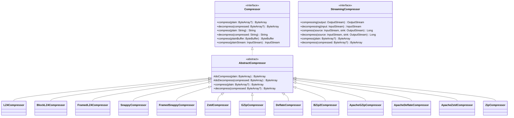
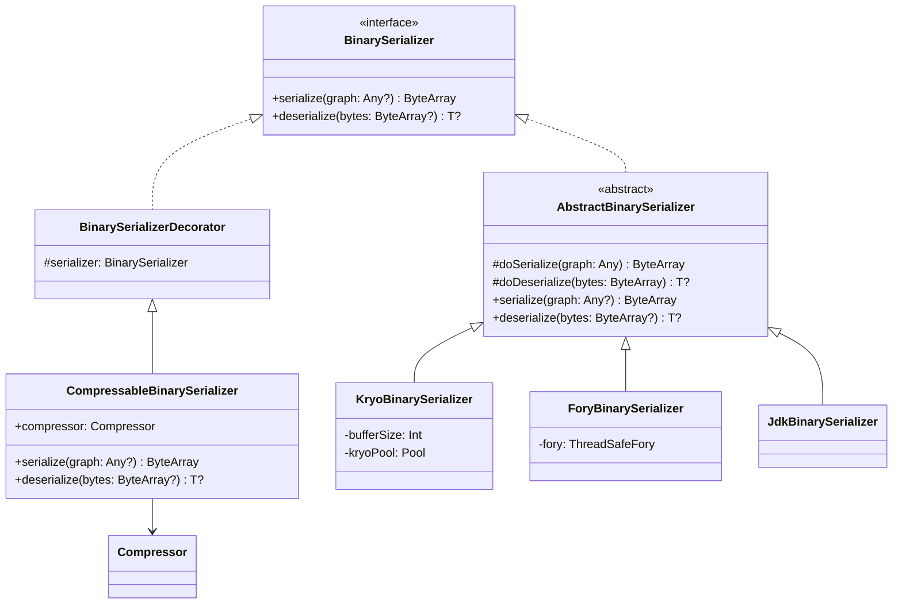
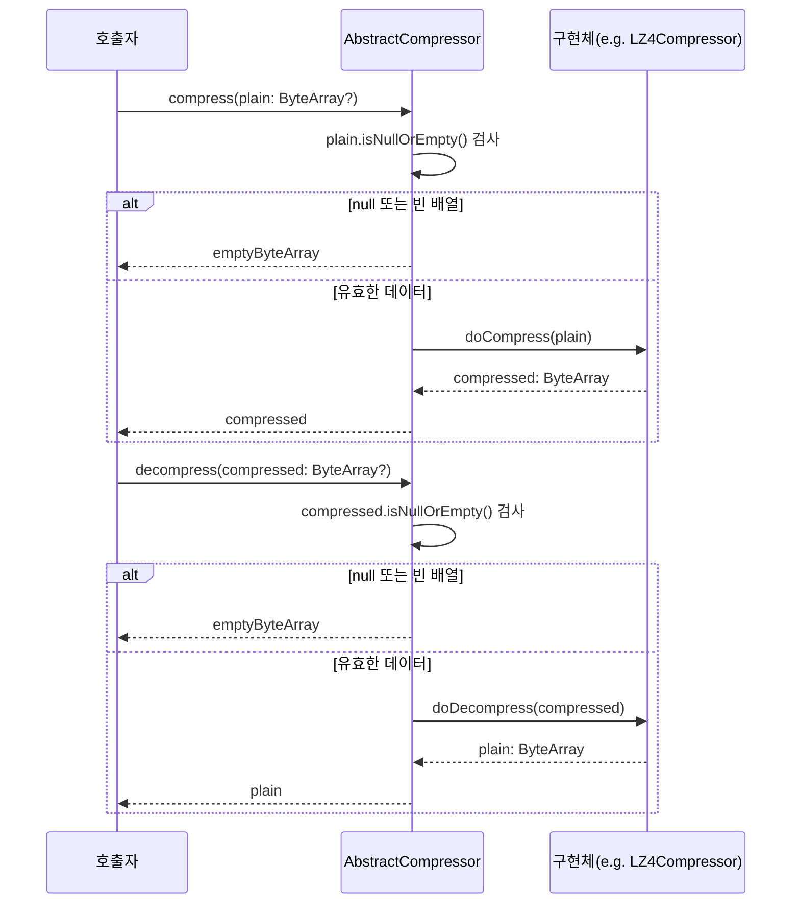
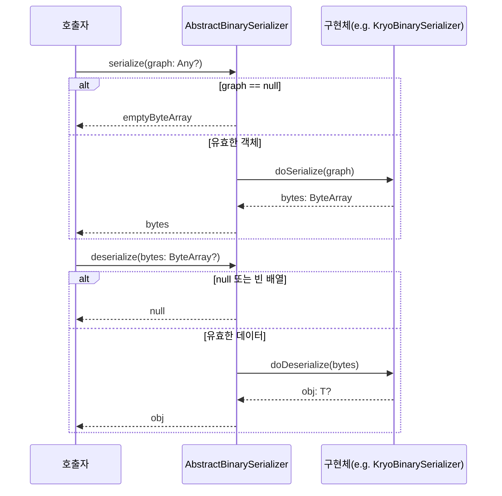

# Module bluetape4k-io

[English](./README.md) | 한국어

## 개요

`bluetape4k-io`는 Kotlin 기반의 고성능 I/O 유틸리티 라이브러리입니다. 파일 처리, 압축, 직렬화, 비동기 I/O 등 다양한 I/O 작업을 간편하고 효율적으로 처리할 수 있는 기능을 제공합니다.

## 주요 기능

### 1. 압축 (Compressor)

다양한 압축 알고리즘을 통일된 인터페이스로 제공합니다.

**지원 알고리즘:**

- **LZ4**: 초고속 압축/해제 (실시간 처리에 적합)
- **Snappy**: 빠른 압축 속도 (Google 개발)
- **Zstd**: 높은 압축률과 빠른 속도의 균형
- **GZip**: 범용적인 압축 (호환성 우수)
- **Deflate**: GZip의 기반 알고리즘
- **BZip2**: 높은 압축률 (속도는 느림)
- **Zip**: ZIP 포맷 압축/해제 (파일 아카이브에 적합)

```kotlin
import io.bluetape4k.io.compressor.Compressors

// 기본 사용
val plainData = "Hello, World!".toByteArray()
val compressed = Compressors.LZ4.compress(plainData)
val decompressed = Compressors.LZ4.decompress(compressed)

// 문자열 직접 압축 (Base64 인코딩됨)
val compressedStr = Compressors.Zstd.compress("Large text data...")
val originalStr = Compressors.Zstd.decompress(compressedStr)

// ByteBuffer 지원
val buffer = ByteBuffer.wrap(plainData)
val compressedBuffer = Compressors.Snappy.compress(buffer)

// InputStream 지원
val inputStream = File("large-file.txt").inputStream()
val compressedStream = Compressors.GZip.compress(inputStream)
```

**StreamingCompressor (대용량 스트리밍 처리):**

```kotlin
import io.bluetape4k.io.compressor.Compressors

val source = File("large-file.txt").inputStream()
val compressedOut = File("large-file.txt.zst").outputStream()

// 스트림 기반 압축/복원
Compressors.Streaming.Zstd.compress(source, compressedOut)

val restoredOut = File("large-file-restored.txt").outputStream()
Compressors.Streaming.Zstd.decompress(
    File("large-file.txt.zst").inputStream(),
    restoredOut
)
```

**압축 알고리즘 선택 가이드:**

- **실시간 처리**: LZ4, Snappy (압축률 < 속도)
- **네트워크 전송**: Zstd, GZip (속도 + 압축률 균형)
- **저장 공간 최적화**: BZip2, Zstd (압축률 > 속도)
- **파일 아카이브**: Zip (디렉토리 구조 보존)

**ZIP 파일 빌더 (ZipBuilder):**

인메모리 또는 파일 기반 ZIP 아카이브를 빌더 패턴으로 생성합니다.

```kotlin
import io.bluetape4k.io.compressor.ZipBuilder

// 인메모리 ZIP 생성
val zipBytes = ZipBuilder()
    .addContent("hello.txt", "Hello, World!")
    .addContent("data/config.json", """{"key": "value"}""")
    .toBytes()

// 파일 기반 ZIP 생성
val zipFile = ZipBuilder()
    .addFile(File("document.pdf"))
    .addFolder(File("images/"))
    .toZipFile(File("archive.zip"))
```

**ZIP 파일 유틸리티 (ZipFileSupport):**

gzip, zlib, zip/unzip 등 파일 압축 관련 톱레벨 함수를 제공합니다. Zip Slip 보안 방어가 내장되어 있습니다.

```kotlin
import io.bluetape4k.io.compressor.*

// gzip/ungzip
val gzipped = gzip(File("data.txt"))       // data.txt.gz 생성
val original = ungzip(gzipped)              // data.txt 복원

// zip/unzip (디렉토리 지원)
zip(File("project/"), File("project.zip"))
unzip(File("project.zip"), File("output/"))

// 패턴 필터링 unzip (Wildcard 지원)
unzip(File("project.zip"), File("output/"), "*.kt", "*.xml")
```

### 2. 직렬화 (BinarySerializer)

객체를 바이너리로 직렬화/역직렬화하는 다양한 구현체를 제공합니다.

`BinarySerializer` 실패 정책:

- `serialize(null)`은 빈 바이트 배열을 반환합니다.
- `deserialize(null/empty)`는 `null`을 반환합니다.
- 그 외 직렬화/역직렬화 실패는 `BinarySerializationException` 예외를 던집니다.

**지원 직렬화:**

- **Jdk**: Java 표준 직렬화 (호환성 최고)
- **Kryo**: 빠르고 효율적인 바이너리 직렬화
- **Fory**: Apache Fory 기반 Kotlin 최적화 직렬화
- **Compressable**: 직렬화 + 압축 조합 (예: LZ4Kryo, ZstdFory)

```kotlin
import io.bluetape4k.io.serializer.BinarySerializers

data class User(val id: Long, val name: String, val email: String)

// Kryo 직렬화 (빠른 속도)
val serializer = BinarySerializers.Kryo
val user = User(1L, "John Doe", "john@example.com")
val bytes = serializer.serialize(user)
val restored = serializer.deserialize<User>(bytes)

// 실패 시 BinarySerializationException
try {
    serializer.deserialize<User>(byteArrayOf(1, 2, 3))
} catch (e: BinarySerializationException) {
    // handle
}

// 직렬화 + 압축 (저장 공간 절약)
val compressedSerializer = BinarySerializers.LZ4Kryo
val compressedBytes = compressedSerializer.serialize(user)
// 원본보다 50-70% 작은 크기

// Fory 직렬화 (최신, 고성능)
val forySerializer = BinarySerializers.Fory
val foryBytes = forySerializer.serialize(user)
```

`BinarySerializerSupport.deserialize(ByteBuffer)`는 `ByteBuffer`의 현재 `position`부터 `remaining` 범위만 읽습니다.
따라서 헤더를 건너뛴 슬라이스/부분 버퍼도 그대로 역직렬화할 수 있습니다.

**직렬화 방식 선택 가이드:**

- **호환성 우선**: Jdk (모든 Java 환경)
- **성능 우선**: Kryo, Fory (3-10배 빠름)
- **저장 공간 절약**: LZ4Kryo, ZstdFory (압축 포함)

### 3. Okio 통합

Okio 기반 I/O 기능(Source/Sink, 압축 스트림, 암호화 스트림, Coroutines 비동기 I/O 등)은
별도의 [`bluetape4k-okio`](../okio/README.ko.md) 모듈로 분리되어 있습니다.

```kotlin
dependencies {
    implementation("io.github.bluetape4k:bluetape4k-okio:${version}")
}
```

### 4. 파일 유틸리티 (FileSupport)

파일 처리를 위한 편리한 확장 함수들을 제공합니다.

```kotlin
import io.bluetape4k.io.*
import java.io.File
import java.nio.file.Paths

// 비동기 파일 복사
val source = File("source.txt")
val target = File("target.txt")
source.copyToAsync(target).thenAccept {
    println("Copy completed: ${it.absolutePath}")
}

// 비동기 파일 이동
source.moveAsync(target).thenAccept {
    println("Move completed")
}

// 비동기 파일 읽기
val path = Paths.get("large-file.txt")
path.readAllBytesAsync().thenAccept { bytes ->
    println("Read ${bytes.size} bytes")
}

// 비동기 파일 쓰기
val lines = listOf("Line 1", "Line 2", "Line 3")
path.writeLinesAsync(lines).thenAccept { bytesWritten ->
    println("Wrote $bytesWritten bytes")
}

// 라인 단위 스트리밍 (메모리 효율적)
File("huge-file.txt").readLineSequence().forEach { line ->
    processLine(line)
}

// 디렉토리 생성
val dir = createDirectory("temp/sub/folder")

// 임시 디렉토리 (자동 삭제)
val tempDir = createTempDirectory(deleteAtExit = true)

// 디렉토리 재귀 삭제
File("temp").deleteDirectoryRecursively()
```

### 5. Result 패턴 파일 유틸리티 (FileSupportResult)

예외 대신 `Result<T>`를 반환하는 안전한 파일 처리 API를 제공합니다. `tryXXXX` 패턴으로 명명되어 있습니다.

```kotlin
import io.bluetape4k.io.*
import java.io.File
import java.nio.file.Paths

// 디렉토리 생성 (Result 반환)
tryCreateDirectory("/tmp/mydir").fold(
    onSuccess = { dir -> println("Created: ${dir.absolutePath}") },
    onFailure = { error -> logger.error("Failed", error) }
)

// 파일 생성 (Result 반환)
val result = tryCreateFile("/tmp/mydir/file.txt")
if (result.isSuccess) {
    println("File created: ${result.getOrThrow().absolutePath}")
}

// 파일 읽기 (Result 반환)
val path = Paths.get("data.bin")
path.tryReadAllBytes().onSuccess { bytes ->
    println("Read ${bytes.size} bytes")
}

// 파일 쓰기 (Result 반환)
path.tryWriteBytes("Hello".toByteArray()).onSuccess { size ->
    println("Wrote $size bytes")
}

// 비동기 복사 (CompletableFuture<Result<File>>)
val source = File("source.txt")
source.tryCopyToAsync(File("target.txt")).thenAccept { result ->
    result.onSuccess { copied -> println("Copied: ${copied.name}") }
    result.onFailure { error -> println("Failed: ${error.message}") }
}

// 비동기 이동 (CompletableFuture<Result<File>>)
source.tryMoveAsync(File("target.txt")).thenAccept { result ->
    result.fold(
        onSuccess = { println("Moved successfully") },
        onFailure = { println("Move failed: ${it.message}") }
    )
}

// 비동기 읽기 (CompletableFuture<Result<ByteArray>>)
path.tryReadAllBytesAsync().thenAccept { result ->
    result.onSuccess { bytes -> println("Read ${bytes.size} bytes") }
}
```

**Result 패턴 API 목록:**

| 함수 | 반환 타입 | 설명 |
|------|----------|------|
| `tryCreateDirectory(path)` | `Result<File>` | 디렉토리 생성 |
| `tryCreateFile(path)` | `Result<File>` | 파일 생성 |
| `File.tryDeleteRecursively()` | `Result<Boolean>` | 재귀 삭제 |
| `File.tryDeleteIfExists()` | `Result<Boolean>` | 파일 삭제 |
| `Path.tryReadAllBytes()` | `Result<ByteArray>` | 바이트 읽기 |
| `Path.tryWriteBytes(bytes)` | `Result<Long>` | 바이트 쓰기 |
| `Path.tryReadAllLines()` | `Result<List<String>>` | 라인 읽기 |
| `Path.tryWriteLines(lines)` | `Result<Long>` | 라인 쓰기 |
| `File.tryCopyToAsync(target)` | `CompletableFuture<Result<File>>` | 비동기 복사 |
| `File.tryMoveAsync(target)` | `CompletableFuture<Result<File>>` | 비동기 이동 |
| `Path.tryReadAllBytesAsync()` | `CompletableFuture<Result<ByteArray>>` | 비동기 읽기 |
| `Path.tryWriteAsync(bytes)` | `CompletableFuture<Result<Long>>` | 비동기 쓰기 |

## 의존성 추가

### Gradle (Kotlin DSL)

```kotlin
dependencies {
    implementation("io.github.bluetape4k:bluetape4k-io:${version}")

    // 선택적 의존성 (필요한 것만 추가)

    // 압축 알고리즘
    implementation("org.lz4:lz4-java:1.8.0")              // LZ4
    implementation("org.xerial.snappy:snappy-java:1.1.10.8") // Snappy
    implementation("com.github.luben:zstd-jni:1.5.7-6")     // Zstd
    implementation("org.apache.commons:commons-compress:1.26.0") // BZip2, GZip

    // 직렬화
    implementation("com.esotericsoftware:kryo:5.6.2")     // Kryo
    implementation("org.apache.fury:fury-kotlin:0.14.1")     // Fory
}
```

### Maven

```xml

<dependency>
    <groupId>io.github.bluetape4k</groupId>
    <artifactId>bluetape4k-io</artifactId>
    <version>${bluetape4k.version}</version>
</dependency>

        <!-- 선택적 의존성 -->
<dependency>
<groupId>org.lz4</groupId>
<artifactId>lz4-java</artifactId>
<version>1.8.0</version>
</dependency>
```

## 벤치마크 결과

### 직렬화 성능 비교

`SimpleData` 객체 20개 컬렉션의 직렬화/역직렬화 처리량입니다.

**Byte Array 속성이 없는 경우:**

| 라이브러리 | ops/s   | 비고 |
|---------|---------|------|
| Fory    | 305,821 | 최고 성능 |
| Kryo    | 81,823  | 범용 추천 |
| Jackson | 39,510  | JSON 기반 |
| Jdk     | 22,249  | Java 표준 |

**Byte Array (4096 bytes) 포함 시:**

| 라이브러리 | ops/s  | 비고 |
|---------|--------|------|
| Fory    | 59,192 | 최고 성능 |
| Kryo    | 29,329 | 범용 추천 |
| Jdk     | 8,431  | Java 표준 |
| Jackson | 4,323  | 바이너리 데이터에 불리 |

> Fory는 Kryo 대비 약 3배 이상 빠릅니다.
> ByteArray가 포함된 경우, Jackson이 가장 느립니다.

### 압축 성능 비교

40KB UTF-8 텍스트 파일(`Utf8Samples.txt`) 기준 압축/복원 처리량입니다.

| 알고리즘 | ops/s | 특성 |
|---------|-------|------|
| Snappy  | 8,073 | 최고 속도 |
| LZ4     | 6,769 | 실시간 처리 적합 |
| Zstd    | 5,103 | 속도 + 압축률 균형 (추천) |
| GZip    | 1,195 | 호환성 우수 |
| Deflate | 1,084 | GZip 기반 |

**직렬화 선택 가이드:**

| 방식 | 속도 | 크기 | 호환성 | 추천 용도 |
|------|------|------|-------|----------|
| Fory | 5-10x | 40% | 보통 | 최고 성능이 필요한 내부 시스템 |
| Kryo | 3-5x | 50% | 좋음 | 범용 (가장 추천) |
| Jdk | 1x | 100% | 최고 | 외부 호환이 필요한 경우 |

**압축 선택 가이드:**

- **실시간 처리**: LZ4, Snappy (압축률 < 속도)
- **네트워크 전송**: Zstd, GZip (속도 + 압축률 균형)
- **저장 공간 최적화**: BZip2, Zstd (압축률 > 속도)

## Virtual Threads 지원 (Java 21+)

Virtual Threads를 활용한 경량 스레드 기반 비동기 처리를 지원합니다.

```kotlin
import io.bluetape4k.io.*

// Virtual Thread로 비동기 실행
val future = file.copyToAsync(target)
future.thenAccept { copiedFile ->
    println("Copied: ${copiedFile.name}")
}

// CompletableFuture 조합
val readFuture = path.readAllBytesAsync()
val writeFuture = readFuture.thenCompose { bytes ->
    processedPath.writeAsync(bytes)
}
```

## 테스트

프로젝트는 포괄적인 테스트를 포함합니다:

```bash
# 모든 테스트 실행
./gradlew :bluetape4k-io:test

# 벤치마크 실행 (압축/직렬화 성능 측정)
./gradlew :bluetape4k-io:benchmark
```

## 클래스 구조

### Compressor 계층



### BinarySerializer 계층



### compress/decompress 흐름



### serialize/deserialize 흐름



## 모듈 구조

```
io.bluetape4k.io
├── compressor/          # 압축 알고리즘
│   ├── Compressor.kt
│   ├── StreamingCompressor.kt
│   ├── StreamingCompressors.kt
│   ├── Compressors.kt
│   ├── ZipCompressor.kt     # ZIP 압축/해제
│   ├── ZipBuilder.kt        # ZIP 파일 빌더
│   ├── ZipFileSupport.kt    # gzip/zlib/zip/unzip 유틸리티
│   └── [각종 구현체]
├── serializer/          # 직렬화
│   ├── BinarySerializer.kt
│   ├── BinarySerializers.kt
│   └── [각종 구현체]
├── FileSupport.kt          # 파일 유틸리티 (비동기 복사/이동/읽기/쓰기)
├── FileSupportResult.kt    # Result 패턴 파일 유틸리티 (tryXXXX API)
├── FileCoroutineSupport.kt # Coroutine 기반 파일 I/O (readAllBytesSuspending 등)
├── PathSupport.kt          # Path 유틸리티
└── [기타 확장 함수들]
```

## KDoc 예제 커버리지

> 기준일: 2026-04-04

| 상태 | 파일 수 |
|------|---------|
| 예제 있음 | 45 / 47 (96%) |
| 예제 없음 | 2 |

**파일럿 적용 완료 (2026-04-04)**: `Compressors`, `BinarySerializers`, `ZipFileSupport` — 총 3개 파일, 64개 `kotlin` 코드 블록 추가.

### KDoc 예제 작성 가이드라인

- 코드 블록: ` ```kotlin ` 언어 태그 필수
- import 생략 (사용법에 집중)
- 결과는 주석으로 표시
- object/레지스트리: 압축기/직렬화기 선택 가이드 + compress→decompress 왕복 예제
- 개별 프로퍼티: 단일 사용 예시

## 라이선스

Apache License 2.0

## 참고

- [bluetape4k-okio](../okio/README.ko.md) (Okio 기반 I/O 모듈)
- [Kryo Documentation](https://github.com/EsotericSoftware/kryo)
- [Apache Fory](https://fory.apache.org/)
- [LZ4 for Java](https://github.com/lz4/lz4-java)
