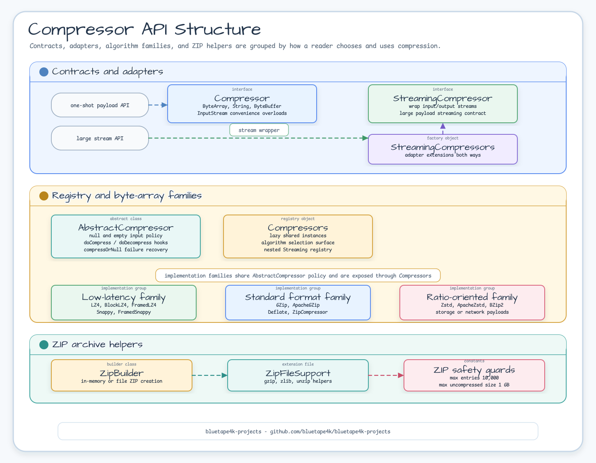
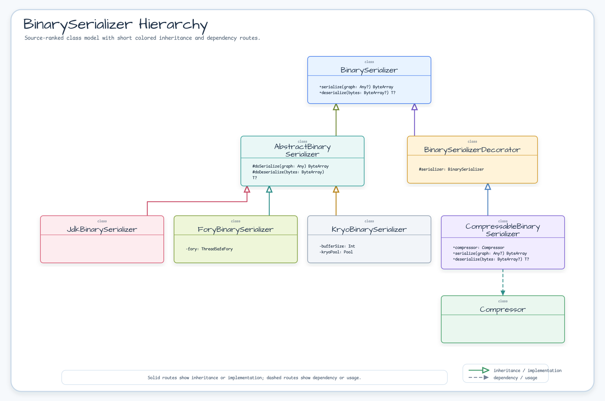
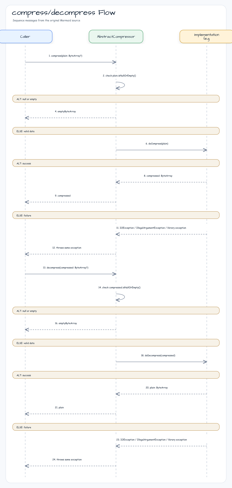
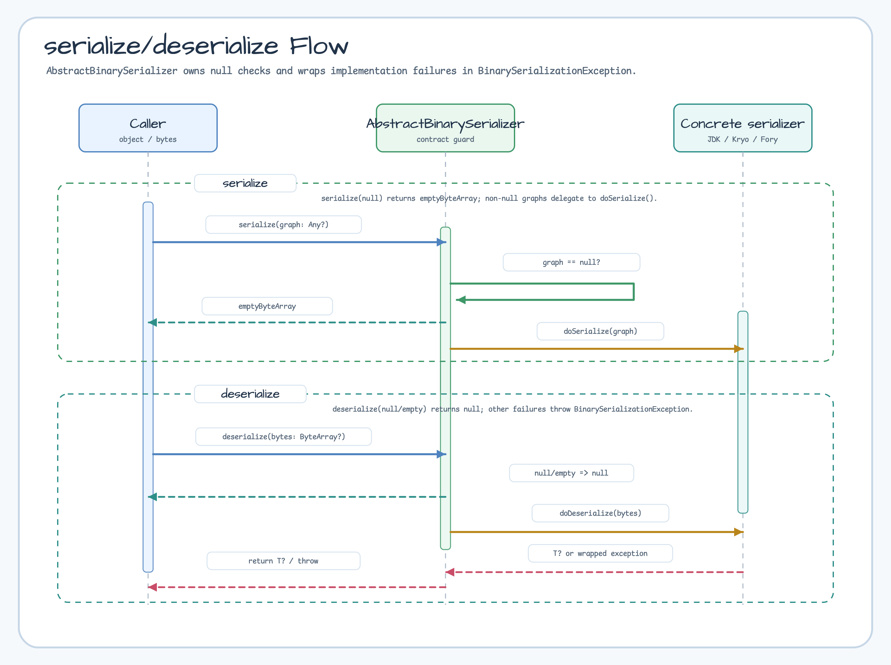
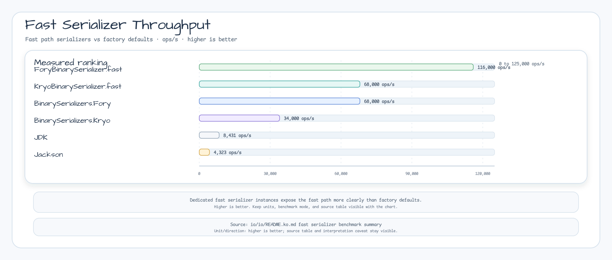
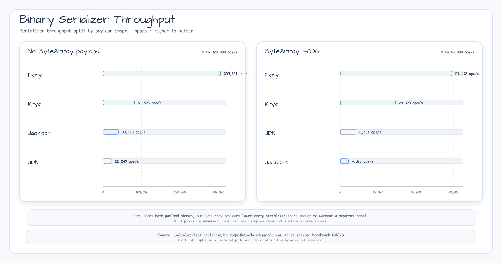
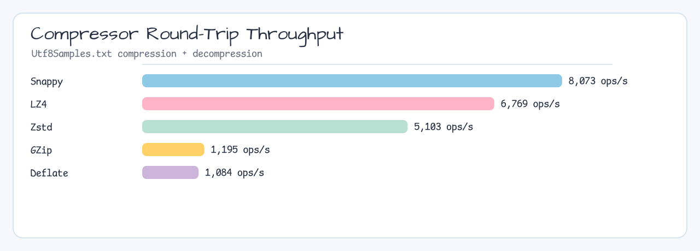

# Module bluetape4k-io

[English](./README.md) | 한국어

## 개요

`bluetape4k-io`는 Kotlin 기반의 고성능 I/O 유틸리티 라이브러리입니다. 파일 처리, 압축, 직렬화, 비동기 I/O 등 다양한 I/O 작업을 간편하고 효율적으로 처리할 수 있는 기능을 제공합니다.

## 아키텍처

### Compressor 계층



### BinarySerializer 계층



### compress/decompress 흐름



`compress()`와 `decompress()`는 예외 전파 API입니다. null 또는 empty 입력은
`emptyByteArray`를 반환하지만, 구현체 압축/복원 실패는 호출자에게 그대로 전파됩니다.
손상 입력이나 압축 실패를 예외 대신 `null`로 표현하려면
`compressOrNull()` / `decompressOrNull()`을 사용하세요.

### serialize/deserialize 흐름



## 주요 기능

### 1. 압축 (Compressor)

다양한 압축 알고리즘을 통일된 인터페이스로 제공합니다.

**지원 알고리즘:**

- **LZ4**: 초고속 압축/해제 (실시간 처리에 적합)
- **Snappy**: 빠른 압축 속도 (Google 개발)
- **Zstd**: 높은 압축률과 빠른 속도의 균형
- **GZip**: 범용적인 압축 (호환성 우수)
- **Deflate**: GZip의 기반 알고리즘
- **BZip2**: 높은 압축률 (속도는 느림)
- **Zip**: ZIP 포맷 압축/해제 (파일 아카이브에 적합)

**압축 알고리즘 선택 가이드:**

- **실시간 처리**: LZ4, Snappy (압축률 < 속도)
- **네트워크 전송**: Zstd, GZip (속도 + 압축률 균형)
- **저장 공간 최적화**: BZip2, Zstd (압축률 > 속도)
- **파일 아카이브**: Zip (디렉토리 구조 보존)

`Compressors.GZip`은 gzip 확장으로 인한 메모리 과다 사용을 막기 위해
기본적으로 256 MiB를 초과하는 압축 해제 출력을 거부합니다. 신뢰 경계에 맞는
다른 한도가 필요하면 `GZipCompressor(maxDecompressedSize = bytes)`를 직접 생성하세요.

### 2. 직렬화 (BinarySerializer)

객체를 바이너리로 직렬화/역직렬화하는 다양한 구현체를 제공합니다.

`BinarySerializer` 실패 정책:

- `serialize(null)`은 빈 바이트 배열을 반환합니다.
- `deserialize(null/empty)`는 `null`을 반환합니다.
- 그 외 직렬화/역직렬화 실패는 `BinarySerializationException` 예외를 던집니다.

**지원 직렬화:**

- **Jdk**: Java 표준 직렬화 (호환성 최고)
- **Kryo**: 빠르고 효율적인 바이너리 직렬화
- **Fory**: Apache Fory 기반 Kotlin 최적화 직렬화
- **Compressable**: 직렬화 + 압축 조합 (예: LZ4Kryo, ZstdFory)

**직렬화 방식 선택 가이드:**

- **호환성 우선**: Jdk (모든 Java 환경)
- **최고 성능**: `ForyBinarySerializer.fast()` (nullable 지원, +71%), `KryoBinarySerializer.fast()` (non-null only, +97%)
- **범용 성능**: `BinarySerializers.Kryo`, `BinarySerializers.Fory`
- **저장 공간 절약**: LZ4Kryo, ZstdFory (압축 포함)

**fast() API — 고성능 모드:**

`ForyBinarySerializer`와 `KryoBinarySerializer` 모두 `fast()` 팩토리를 제공하여 적합한 환경에서 고처리량 직렬화를 지원합니다.

| 직렬화기 | 모드 | 처리량 | Nullable 지원 | 사용 환경 |
|---|---|---|---|---|
| `ForyBinarySerializer.fast()` | SCHEMA_CONSISTENT, refTracking 비활성 | ~116K ops/s (+71%) | ✅ 지원 | 휘발성 캐시, 고정 스키마 DTO, DAG 그래프 |
| `KryoBinarySerializer.fast()` | FieldSerializer, 청크 헤더 없음 | ~68K ops/s (+97%) | ❌ 미지원 | non-null 고정 스키마 DTO 전용 |
| `BinarySerializers.Fory` | COMPATIBLE, refTracking | ~68K ops/s | ✅ 지원 | 스키마 진화, 영속 저장소 |
| `BinarySerializers.Kryo` | CompatibleFieldSerializer | ~34K ops/s | ✅ 지원 | 범용, nullable 필드 포함 |

> ⚠️ **와이어 포맷 경고**: FastFory는 `CompatibleMode.SCHEMA_CONSISTENT`를 사용하며, 기본 Fory codec과 **호환되지 않습니다**. 휘발성 캐시(Redis, 메모리) 전용. 스키마 진화 불가.

**FastFory 직렬화기 (압축 조합):**

FastFory 성능에 압축을 결합하여 휘발성 캐시에서 최대 저장 공간 절약.

| 직렬화기 | 압축 | 처리량 | 크기 감소 | 사용 환경 |
|---|---|---|---|---|
| `BinarySerializers.FastFory` | 없음 | ~116K ops/s | — | 빠른 휘발성 캐시, 압축 미적용 |
| `BinarySerializers.LZ4FastFory` | LZ4 | ~25K ops/s | 40-60% | 속도와 크기 균형 |
| `BinarySerializers.ZstdFastFory` | Zstd | ~18K ops/s | 50-70% | 최고 압축률 (추천) |
| `BinarySerializers.SnappyFastFory` | Snappy | ~30K ops/s | 30-50% | 빠른 압축, 중간 크기 |
| `BinarySerializers.GZipFastFory` | GZip | ~12K ops/s | 60-80% | 최고 압축률 (가장 느림) |

> 벤치마크: 4096바이트 `ByteArray` 필드를 포함한 `SimpleData` 객체 20개. JMH 처리량 모드, 3초 측정, 4회 워밍업.

**`ForyBinarySerializer.fast()`가 최선의 선택인 이유:**
- nullable 타입(`ByteArray?`, `String?`)을 올바르게 처리합니다.
- 기본 Fory 대비 +71% 처리량 향상.
- 주의: 기존 `BinarySerializers.Fory`(COMPATIBLE 모드)로 직렬화한 데이터와 포맷이 달라 함께 사용할 수 없습니다.

### 3. 파일 유틸리티 (FileSupport)

파일 처리를 위한 편리한 확장 함수들을 제공합니다.

### 4. Result 패턴 파일 유틸리티 (FileSupportResult)

예외 대신 `Result<T>`를 반환하는 안전한 파일 처리 API를 제공합니다. `tryXXXX` 패턴으로 명명되어 있습니다.

### 5. Virtual Threads 지원 (Java 21+)

Virtual Threads를 활용한 경량 스레드 기반 비동기 처리를 지원합니다.

### 6. 보안 기능

#### 직렬화 신뢰 프로필

Codec 문서는 `SerializationTrustProfile` 이름으로 역직렬화 신뢰 경계를 설명합니다:

| 프로필 | 의미 |
|---|---|
| `TrustedInternal` | 완전히 신뢰하는 내부 경계에서 쓴 데이터만 읽습니다. |
| `AllowListedTypes` | 동적 클래스/타입 로딩을 패키지 접두사, 클래스명, object input filter로 제한합니다. |
| `NoDynamicTypeLoading` | 호출자가 대상 타입을 정적으로 제공하며, 직렬화 데이터가 클래스를 선택하지 않습니다. |
| `UnsafeLegacyCompatibility` | 명시적인 unsafe 이름으로만 레거시 허용-전체 동작을 켭니다. |

Codec 기본값과 마이그레이션 지침은 [Serialization Trust Profiles](../../docs/security/serialization-trust-profiles.md)를
참고하세요.

#### JDK 직렬화 필터 (JEP 290)

`JdkBinarySerializer`는 이제 기본적으로 `JDK_DEFAULT_OBJECT_INPUT_FILTER`를 적용합니다.
다음 패키지만 역직렬화를 허용하며, 그 외는 모두 차단합니다:

- `io.bluetape4k.**`
- `java.lang.*`, `java.util.**`, `java.io.*`, `java.math.**`, `java.time.**`, `java.net.*`, `java.sql.*`
- `kotlin.**`

> **브레이킹 변경**: `BinarySerializers.Default`가 `Kryo`로 변경되었습니다 (이전: `Jdk`).
> `BinarySerializers.Jdk`는 보안 경고와 함께 `@Deprecated` 처리되었습니다. `Kryo` 또는 `Fory`를 사용하세요.

허용 목록을 확장하거나 좁히려면 커스텀 필터를 제공하세요:

```kotlin
val customFilter = ObjectInputFilter.Config.createFilter("com.mycompany.**;io.bluetape4k.**;kotlin.**;!*")
val serializer = JdkBinarySerializer(objectInputFilter = customFilter)
```

#### ZIP Bomb 방어

`unzip()`은 이제 두 가지 하드 한도를 적용합니다:

| 상수 | 값 | 설명 |
|---|---|---|
| `ZIP_MAX_ENTRIES` | 10,000 | 최대 ZIP 엔트리 수 |
| `ZIP_MAX_UNCOMPRESSED_SIZE` | 1 GB | 최대 비압축 총 바이트 |

어느 한도라도 초과하면 `IllegalArgumentException`이 발생합니다. 한도는 ZIP 메타데이터 기준으로
먼저 확인하고, 실제 추출 중 읽힌 바이트 수로 다시 확인합니다.

#### 안전한 경로 결합

신뢰할 수 있는 기준 디렉토리 아래에 사용자 입력 상대 경로를 붙일 때는 `combineSafe`를 사용합니다.
`..` 상위 경로 탈출과 절대 경로 입력을 거부합니다.

```kotlin
import io.bluetape4k.io.combineSafe
import java.nio.file.Paths

val base = Paths.get("/srv/app/data")
val report = base.combineSafe("reports/2026.csv")

// InvalidPathException 발생
base.combineSafe("../secret.txt")
base.combineSafe("/etc/passwd")
```

#### Nullable 압축기 API

`AbstractCompressor`는 실패 시 예외나 `emptyByteArray` 대신 `null`을 반환하는 안전한 nullable 변형을 제공합니다:

```kotlin
val compressed = compressor.compressOrNull(input)      // null 입력/empty 시 null 반환
val restored = compressor.decompressOrNull(compressed) // 손상/null/empty 시 null 반환
```

이를 통해 "손상된 입력"(`null` 반환)과 "빈 입력"(`compress()`가 `emptyByteArray` 반환)을
호출자가 구별할 수 있습니다.

## 사용 예제

### 압축

```kotlin
import io.bluetape4k.io.compressor.Compressors
import io.bluetape4k.io.compressor.GZipCompressor

// 기본 사용
val plainData = "Hello, World!".toByteArray()
val compressed = Compressors.LZ4.compress(plainData)
val decompressed = Compressors.LZ4.decompress(compressed)

// 문자열 직접 압축 (Base64 인코딩됨)
val compressedStr = Compressors.Zstd.compress("Large text data...")
val originalStr = Compressors.Zstd.decompress(compressedStr)

// ByteBuffer 지원
val buffer = ByteBuffer.wrap(plainData)
val compressedBuffer = Compressors.Snappy.compress(buffer)

// InputStream 지원
val inputStream = File("large-file.txt").inputStream()
val compressedStream = Compressors.GZip.compress(inputStream)

// 더 작은 신뢰 경계에 맞춘 GZip 압축 해제 한도
val boundedGzip = GZipCompressor(maxDecompressedSize = 64 * 1024 * 1024)
val restored = boundedGzip.decompress(compressed)
```

#### 호출자 소유 Compressor ByteBuffer API

<!-- issue-755-contract:start -->
`compress(source, target)`와 `decompress(source, target)`는 기존 구현체도 사용할 수 있는 JVM default
메서드입니다. 호출 전후에 source의 `position`, `limit`, mark, byte order를 보존하고, target의
`limit`, `capacity`, mark, byte order도 바꾸지 않습니다. 성공하면 반환한 기록량만큼 target
`position`만 이동하며, 실패하면 target `position`을 원래 값으로 되돌립니다. 실패 전에 이미
덮어쓴 byte의 내용은 보장하지 않습니다.

Read-only target은 `ReadOnlyBufferException`으로 거부하고, 동일한 buffer 객체나 확인 가능한 heap
backing-array overlap은 `IllegalArgumentException`으로 거부합니다. direct 또는 read-only view의
alias는 안전하게 판별할 수 없으므로 source와 target이 겹치지 않게 만드는 것은 호출자 책임입니다.
각 mutable buffer는 호출이 끝날 때까지 한 thread 안에서만 사용해야 합니다.

기존 one-argument `ByteBuffer` API는 source `position`을 소비할 수 있지만, 신규 two-argument API는
source 상태를 보존합니다. 다른 interface에서 erased signature가 같은 default를 함께 상속하는 외부
구현체는 Java interface evolution 규칙에 따라 명시적 override가 필요할 수 있습니다. 기존 호출자는
마이그레이션할 필요가 없습니다. 재사용 가능한 target과 검증된 optimized storage 조합을 모두 가진
호출자만 opt-in하고, fallback 조합은 correctness-only 경로로 취급하세요.
<!-- issue-755-contract:end -->

<!-- issue-755-storage-matrix:start -->
| Codec | heap -> heap | direct -> direct | mixed storage | Allocation claim |
|---|---|---|---|---|
| LZ4 | compatibility fallback | compatibility fallback | compatibility fallback | none in the core slice |
| Deflate | compatibility fallback | compatibility fallback | compatibility fallback | none in the core slice |
| Snappy | compatibility fallback | compatibility fallback | compatibility fallback | none in the core slice |
| Zstd | compatibility fallback | compatibility fallback | compatibility fallback | none in the core slice |
| Other codecs | compatibility fallback | compatibility fallback | compatibility fallback | ineligible |
<!-- issue-755-storage-matrix:end -->

<!-- issue-755-kotlin-example:start -->
Kotlin에서는 호출자가 writable target을 준비하고 반환된 기록량으로 결과 범위를 읽습니다.

```kotlin
val source = ByteBuffer.wrap(plainData)
val target = ByteBuffer.allocate(4096)
val written = Compressors.LZ4.compress(source, target)
val compressed = ByteArray(written).also { bytes ->
    target.duplicate().flip().get(bytes)
}
```
<!-- issue-755-kotlin-example:end -->

<!-- issue-755-java-example:start -->
Java에서도 같은 two-argument JVM default를 호출할 수 있습니다.

```java
Compressor compressor = Compressors.INSTANCE.getLZ4();
ByteBuffer source = ByteBuffer.wrap(plainData);
ByteBuffer target = ByteBuffer.allocate(4096);
int written = compressor.compress(source, target);
```
<!-- issue-755-java-example:end -->

<!-- issue-755-sizing-retry:start -->
target에 남은 공간이 부족하면 raw `BufferOverflowException`이 발생하며 예외에는 required size가
포함되지 않습니다. source 상태와 target `position`은 보존되므로 호출자는 애플리케이션 상한 안에서
더 큰 target을 준비해 전체 작업을 재시도할 수 있습니다. 성공 전 target byte는 재사용하지 마세요.
<!-- issue-755-sizing-retry:end -->

<!-- issue-755-resource-bound:start -->
현재 compatibility fallback은 입력과 변환 결과를 payload-sized `ByteArray`로 staging할 수 있습니다.
특히 fallback decompression의 target은 결과를 쓰는 final-write bound일 뿐, 신뢰할 수 없는 압축
입력의 메모리 사용을 제한하는 resource bound가 아닙니다. 신뢰 경계에서는 codec별 decompressed-size
한도나 streaming API를 별도로 적용해야 합니다.
<!-- issue-755-resource-bound:end -->

<!-- issue-755-telemetry:start -->
이 API는 runtime dispatch telemetry, logging, feature flag를 제공하지 않습니다. 필요한 경우 payload
내용을 남기지 말고 codec, storage 조합, 입력/출력 size, overflow 횟수 같은 privacy-safe diagnostics를
호출자 측에서 기록하세요. native override에 결함이 발견되면 patch에서는 public default와 wire
contract를 유지하고 해당 override만 compatibility fallback으로 되돌립니다. patch 적용 전에는 기존
allocating API 또는 문서에 표시된 fallback storage 조합으로 우회하세요.
<!-- issue-755-telemetry:end -->

**StreamingCompressor (대용량 스트리밍 처리):**

```kotlin
import io.bluetape4k.io.compressor.Compressors

val source = File("large-file.txt").inputStream()
val compressedOut = File("large-file.txt.zst").outputStream()

// 스트림 기반 압축/복원
Compressors.Streaming.Zstd.compress(source, compressedOut)

val restoredOut = File("large-file-restored.txt").outputStream()
Compressors.Streaming.Zstd.decompress(
    File("large-file.txt.zst").inputStream(),
    restoredOut
)
```

**ZIP 파일 빌더 (ZipBuilder):**

```kotlin
import io.bluetape4k.io.compressor.ZipBuilder

// 인메모리 ZIP 생성
val zipBytes = ZipBuilder.ofInMemory()
    .add("Hello, World!").path("hello.txt").save()
    .add("""{"key": "value"}""").path("data/config.json").save()
    .toBytes()

// 파일 기반 ZIP 생성
val zipFile = ZipBuilder.of(File("archive.zip"))
    .add(File("document.pdf")).path("docs/document.pdf").save()
    .addFolder("images/")
    .toZipFile()
```

**ZIP 파일 유틸리티 (ZipFileSupport):**

```kotlin
import io.bluetape4k.io.compressor.*

// gzip/ungzip
val gzipped = gzip(File("data.txt"))       // data.txt.gz 생성
val original = ungzip(gzipped)              // data.txt 복원

// zip/unzip (디렉토리 지원)
ZipBuilder.of(File("project.zip"))
    .add(File("project/"))
    .recursive(true)
    .save()
    .toZipFile()
unzip(File("project.zip"), File("output/"))

// 패턴 필터링 unzip (Wildcard 지원)
unzip(File("project.zip"), File("output/"), "*.kt", "*.xml")
```

### 직렬화

```kotlin
import io.bluetape4k.io.serializer.BinarySerializers

data class User(val id: Long, val name: String, val email: String)

// Kryo 직렬화 (빠른 속도)
val serializer = BinarySerializers.Kryo
val user = User(1L, "John Doe", "john@example.com")
val bytes = serializer.serialize(user)
val restored = serializer.deserialize<User>(bytes)

// 실패 시 BinarySerializationException
try {
    serializer.deserialize<User>(byteArrayOf(1, 2, 3))
} catch (e: BinarySerializationException) {
    // handle
}

// 직렬화 + 압축 (저장 공간 절약)
val compressedSerializer = BinarySerializers.LZ4Kryo
val compressedBytes = compressedSerializer.serialize(user)
// 원본보다 50-70% 작은 크기

// Fory 직렬화 (최신, 고성능)
val forySerializer = BinarySerializers.Fory
val foryBytes = forySerializer.serialize(user)
```

**fast() API — 고성능 직렬화:**

```kotlin
import io.bluetape4k.io.serializer.ForyBinarySerializer
import io.bluetape4k.io.serializer.KryoBinarySerializer

// ✅ ForyBinarySerializer.fast() — 기본 Fory 대비 약 +71% 빠름
// nullable 타입 지원. 휘발성 캐시와 고정 스키마 DTO에 사용.
// 주의: BinarySerializers.Fory(COMPATIBLE)와 포맷이 달라 함께 사용 불가.
val foryFast = ForyBinarySerializer.fast()
val bytes = foryFast.serialize(user)             // 직렬화
val restored = foryFast.deserialize<User>(bytes) // 역직렬화 (동일 직렬화기만 사용)

// ✅ nullable 타입도 올바르게 처리됨
data class CacheEntry(val id: Long, val payload: ByteArray?, val tag: String?)
val entry = CacheEntry(1L, byteArrayOf(1, 2, 3), "v1")
val cached = foryFast.serialize(entry)           // 정상 동작

// ❌ COMPATIBLE 포맷 데이터와 혼용 불가
val standard = BinarySerializers.Fory.serialize(user)
foryFast.deserialize<User>(standard)             // 오류 — 포맷 불일치

// ❌ 순환 참조 객체 사용 불가 (refTracking=false)
// data class Node(val id: Int, var next: Node?)  // 순환 참조 → 무한 루프

// ✅ KryoBinarySerializer.fast() — 기본 Kryo 대비 약 +97% 빠름
// 주의: Kotlin nullable 타입(ByteArray?, String?) 미지원 → 역직렬화 오류 발생.
// 순수 non-null 필드 DTO에만 사용하세요.
data class NonNullItem(val id: Long, val name: String, val price: Double) // 모두 non-null
val kryoFast = KryoBinarySerializer.fast()
val itemBytes = kryoFast.serialize(NonNullItem(1L, "book", 9.99))
val item = kryoFast.deserialize<NonNullItem>(itemBytes)  // 정상

// ❌ nullable 필드 포함 클래스에 사용 불가
data class Order(val id: Long, val note: String?)  // String? → 역직렬화 오류!
val orderBytes = kryoFast.serialize(Order(1L, null))
kryoFast.deserialize<Order>(orderBytes)            // 오류 또는 잘못된 결과
```

### 파일 유틸리티

```kotlin
import io.bluetape4k.io.*
import java.io.File
import java.nio.file.Paths

// 비동기 파일 복사
val source = File("source.txt")
val target = File("target.txt")
source.copyToAsync(target).thenAccept {
    println("Copy completed: ${it.absolutePath}")
}

// 비동기 파일 읽기
val path = Paths.get("large-file.txt")
path.readAllBytesAsync().thenAccept { bytes ->
    println("Read ${bytes.size} bytes")
}

// 라인 단위 스트리밍 (메모리 효율적)
File("huge-file.txt").readLineSequence().forEach { line ->
    processLine(line)
}
```

### Result 패턴 파일 유틸리티

```kotlin
import io.bluetape4k.io.*
import java.io.File
import java.nio.file.Paths

// 디렉토리 생성 (Result 반환)
tryCreateDirectory("/tmp/mydir").fold(
    onSuccess = { dir -> println("Created: ${dir.absolutePath}") },
    onFailure = { error -> logger.error("Failed", error) }
)

// 파일 읽기 (Result 반환)
val path = Paths.get("data.bin")
path.tryReadAllBytes().onSuccess { bytes ->
    println("Read ${bytes.size} bytes")
}
```

**Result 패턴 API 목록:**

| 함수                            | 반환 타입                                  | 설명      |
|-------------------------------|----------------------------------------|---------|
| `tryCreateDirectory(path)`    | `Result<File>`                         | 디렉토리 생성 |
| `tryCreateFile(path)`         | `Result<File>`                         | 파일 생성   |
| `File.tryDeleteRecursively()` | `Result<Boolean>`                      | 재귀 삭제   |
| `File.tryDeleteIfExists()`    | `Result<Boolean>`                      | 파일 삭제   |
| `Path.tryReadAllBytes()`      | `Result<ByteArray>`                    | 바이트 읽기  |
| `Path.tryWriteBytes(bytes)`   | `Result<Long>`                         | 바이트 쓰기  |
| `Path.tryReadAllLines()`      | `Result<List<String>>`                 | 라인 읽기   |
| `Path.tryWriteLines(lines)`   | `Result<Long>`                         | 라인 쓰기   |
| `File.tryCopyToAsync(target)` | `CompletableFuture<Result<File>>`      | 비동기 복사  |
| `File.tryMoveAsync(target)`   | `CompletableFuture<Result<File>>`      | 비동기 이동  |
| `Path.tryReadAllBytesAsync()` | `CompletableFuture<Result<ByteArray>>` | 비동기 읽기  |
| `Path.tryWriteAsync(bytes)`   | `CompletableFuture<Result<Long>>`      | 비동기 쓰기  |

## 벤치마크 결과

### 직렬화 성능 비교

`SimpleData` 객체 20개 컬렉션의 직렬화/역직렬화 처리량입니다.
JMH 처리량 모드, 3초 측정 구간, 4회 워밍업.

**Byte Array (4096 bytes) 포함 시 — 표준 vs fast() 비교:**

| 직렬화기 | ops/s | 기준 대비 | Nullable | 비고 |
|---|---|---|---|---|
| `ForyBinarySerializer.fast()` | ~116,000 | +71% | ✅ | SCHEMA_CONSISTENT, refTracking 비활성 |
| `KryoBinarySerializer.fast()` | ~68,000 | +97% | ❌ | FieldSerializer, outputPool 재사용 |
| `BinarySerializers.Fory` | ~68,000 | 기준 | ✅ | COMPATIBLE 모드, 영속 저장 적합 |
| `BinarySerializers.Kryo` | ~34,000 | 기준 | ✅ | CompatibleFieldSerializer, 범용 |
| Jdk | ~8,431 | — | ✅ | Java 표준 |
| Jackson | ~4,323 | — | ✅ | 바이너리 데이터에 불리 |



> `ForyBinarySerializer.fast()`는 nullable 타입을 지원하며 기본 Fory 대비 +71% 빠릅니다.
> `KryoBinarySerializer.fast()`는 +97% 빠르지만 Kotlin nullable 필드(`Type?`)를 **지원하지 않습니다**.

**Byte Array 속성이 없는 경우:**

| 라이브러리   | ops/s   | 비고      |
|---------|---------|---------|
| Fory    | 305,821 | 최고 성능   |
| Kryo    | 81,823  | 범용 추천   |
| Jackson | 39,510  | JSON 기반 |
| Jdk     | 22,249  | Java 표준 |



### 압축 성능 비교

40KB UTF-8 텍스트 파일(`Utf8Samples.txt`) 기준 압축/복원 처리량입니다.

| 알고리즘    | ops/s | 특성               |
|---------|-------|------------------|
| Snappy  | 8,073 | 최고 속도            |
| LZ4     | 6,769 | 실시간 처리 적합        |
| Zstd    | 5,103 | 속도 + 압축률 균형 (추천) |
| GZip    | 1,195 | 호환성 우수           |
| Deflate | 1,084 | GZip 기반          |



## 모듈 구조

```
io.bluetape4k.io
├── compressor/          # 압축 알고리즘
│   ├── Compressor.kt
│   ├── StreamingCompressor.kt
│   ├── StreamingCompressors.kt
│   ├── Compressors.kt
│   ├── ZipCompressor.kt     # ZIP 압축/해제
│   ├── ZipBuilder.kt        # ZIP 파일 빌더
│   ├── ZipFileSupport.kt    # gzip/zlib/zip/unzip 유틸리티
│   └── [각종 구현체]
├── serializer/          # 직렬화
│   ├── BinarySerializer.kt
│   ├── BinarySerializers.kt
│   └── [각종 구현체]
├── FileSupport.kt          # 파일 유틸리티 (비동기 복사/이동/읽기/쓰기)
├── FileSupportResult.kt    # Result 패턴 파일 유틸리티 (tryXXXX API)
├── FileCoroutineSupport.kt # Coroutine 기반 파일 I/O (readAllBytesSuspending 등)
├── PathSupport.kt          # Path 유틸리티
└── [기타 확장 함수들]
```

## 의존성 추가

### Gradle (Kotlin DSL)

```kotlin
dependencies {
    implementation("io.github.bluetape4k:bluetape4k-io:${version}")

    // 선택적 의존성 (필요한 것만 추가)

    // 압축 알고리즘
    implementation("org.lz4:lz4-java:1.8.0")              // LZ4
    implementation("org.xerial.snappy:snappy-java:1.1.10.8") // Snappy
    implementation("com.github.luben:zstd-jni:1.5.7-6")     // Zstd
    implementation("org.apache.commons:commons-compress:1.26.0") // BZip2, GZip

    // 직렬화
    implementation("com.esotericsoftware:kryo:5.6.2")     // Kryo
    implementation("org.apache.fury:fury-kotlin:0.14.1")     // Fory
}
```

### Maven

```xml
<dependency>
    <groupId>io.github.bluetape4k</groupId>
    <artifactId>bluetape4k-io</artifactId>
    <version>${bluetape4k.version}</version>
</dependency>

<!-- 선택적 의존성 -->
<dependency>
    <groupId>org.lz4</groupId>
    <artifactId>lz4-java</artifactId>
    <version>1.8.0</version>
</dependency>
```

## 라이선스

MIT License

## 참고

### ByteBuffer 할당 근거

[이슈 #1039 할당 보고서](../../docs/benchmarks/2026-07-18-bytebuffer-serializer-allocation.md)는 JDK 직렬화와 Kryo 직렬화/역직렬화에서 낮은 할당 결과를 accepted로 판정했습니다. JDK 역직렬화와 Fory 역직렬화는 inconclusive이며 Fory 출력은 사용 편의성용 fallback입니다.

| Serializer | `serializeTo` | `deserializeFrom` |
|---|---|---|
| JDK | 최적화, accepted | 최적화, inconclusive |
| Kryo | 최적화, accepted | 최적화, accepted |
| Fory | 호환 fallback | 최적화, inconclusive |

Kotlin: `serializer.serializeTo(value, target)` / `serializer.deserializeFrom<Value>(source)`. Java: `serializer.serializeTo(value, target)` / `serializer.deserializeFrom(source)`. 호출자는 남은 용량이 충분한 writable target을 소유합니다. 성공하면 출력 `position`만 이동하고 `limit`은 넓어지지 않으며 overflow/read-only 실패는 상태를 rollback합니다. 입력은 duplicate로 읽어 source `position`/`limit`을 보존합니다. 근거는 측정 payload와 기본 설정에만 적용됩니다.

- [bluetape4k-okio](../okio/README.ko.md) (Okio 기반 I/O 모듈)
- [Kryo Documentation](https://github.com/EsotericSoftware/kryo)
- [Apache Fory](https://fory.apache.org/)
- [LZ4 for Java](https://github.com/lz4/lz4-java)
