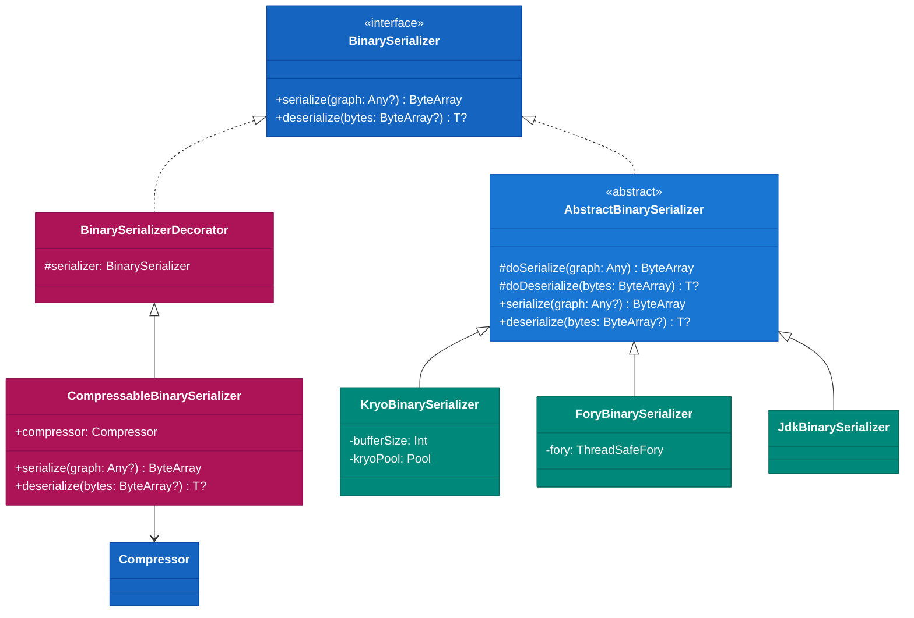
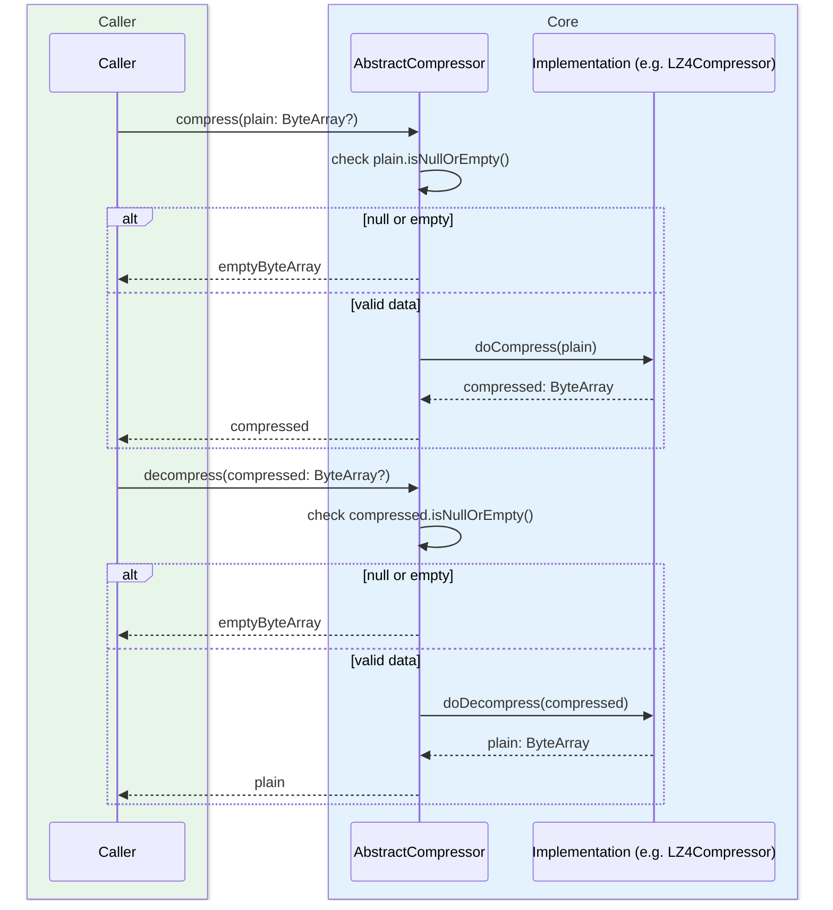
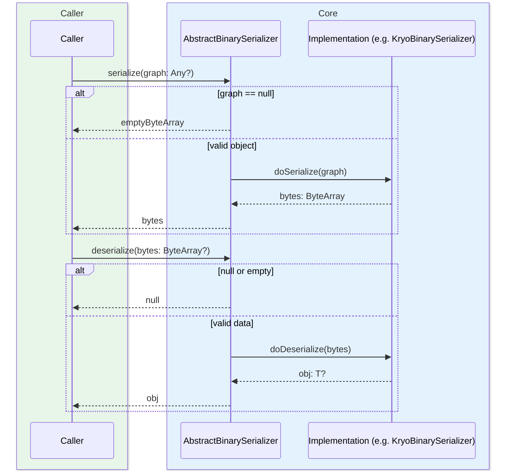
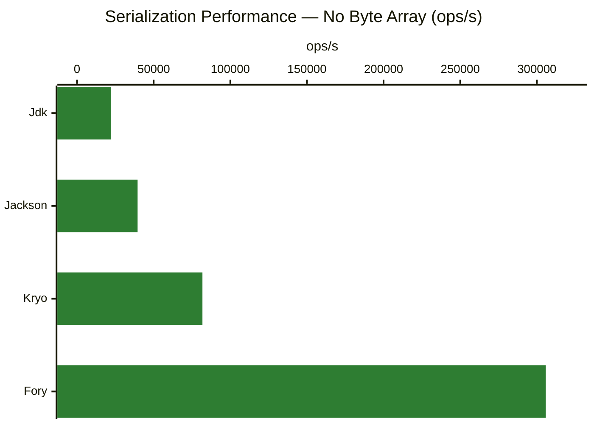
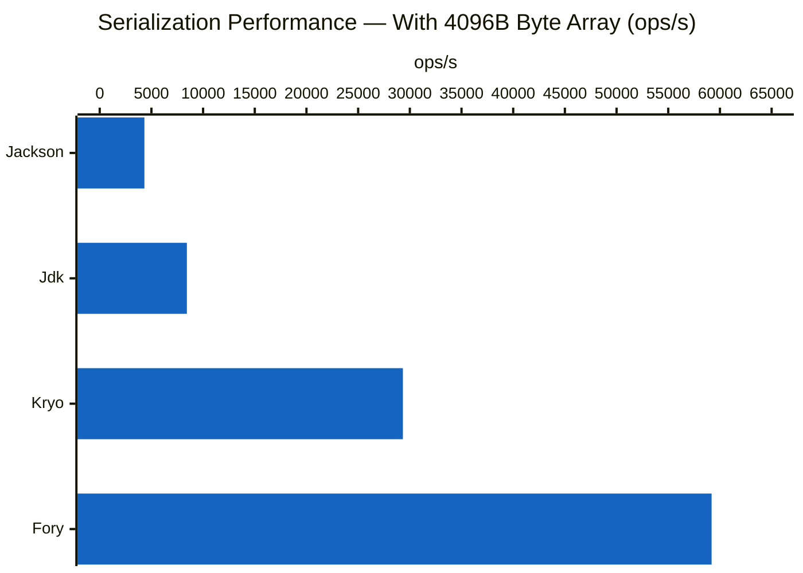
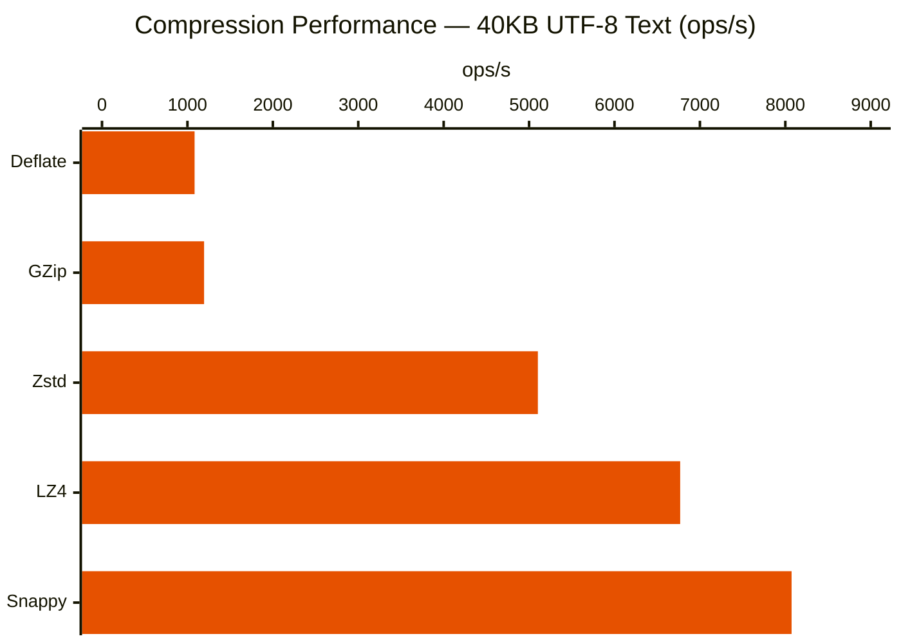

# Module bluetape4k-io

English | [한국어](./README.ko.md)

## Overview

`bluetape4k-io` is a high-performance I/O utility library for Kotlin. It provides simple and efficient tools for file handling, compression, serialization, async I/O, and more.

## Architecture

### Compressor Hierarchy

```mermaid
classDiagram
    class Compressor {
        <<interface>>
        +compress(plain: ByteArray?) ByteArray
        +decompress(compressed: ByteArray?) ByteArray
        +compress(plain: String) String
        +decompress(compressed: String) String
        +compress(plainBuffer: ByteBuffer) ByteBuffer
        +compress(plainStream: InputStream) InputStream
    }

    class AbstractCompressor {
        <<abstract>>
        #doCompress(plain: ByteArray) ByteArray
        #doDecompress(compressed: ByteArray) ByteArray
        +compress(plain: ByteArray?) ByteArray
        +decompress(compressed: ByteArray?) ByteArray
    }


    class StreamingCompressor {
        <<interface>>
        +compressing(output: OutputStream) OutputStream
        +decompressing(input: InputStream) InputStream
        +compress(source: InputStream, sink: OutputStream) Long
        +decompress(source: InputStream, sink: OutputStream) Long
        +compress(plain: ByteArray?) ByteArray
        +decompress(compressed: ByteArray?) ByteArray
    }

    Compressor <|.. AbstractCompressor
    AbstractCompressor <|-- LZ4Compressor
    AbstractCompressor <|-- BlockLZ4Compressor
    AbstractCompressor <|-- FramedLZ4Compressor
    AbstractCompressor <|-- SnappyCompressor
    AbstractCompressor <|-- FramedSnappyCompressor
    AbstractCompressor <|-- ZstdCompressor
    AbstractCompressor <|-- GZipCompressor
    AbstractCompressor <|-- DeflateCompressor
    AbstractCompressor <|-- BZip2Compressor
    AbstractCompressor <|-- ApacheGZipCompressor
    AbstractCompressor <|-- ApacheDeflateCompressor
    AbstractCompressor <|-- ApacheZstdCompressor
    AbstractCompressor <|-- ZipCompressor

    style Compressor fill:#1565C0,stroke:#0D47A1,color:#FFFFFF
    style StreamingCompressor fill:#1565C0,stroke:#0D47A1,color:#FFFFFF
    style AbstractCompressor fill:#1976D2,stroke:#1565C0,color:#FFFFFF
    style LZ4Compressor fill:#00897B,stroke:#00695C,color:#FFFFFF
    style BlockLZ4Compressor fill:#00897B,stroke:#00695C,color:#FFFFFF
    style FramedLZ4Compressor fill:#00897B,stroke:#00695C,color:#FFFFFF
    style SnappyCompressor fill:#00897B,stroke:#00695C,color:#FFFFFF
    style FramedSnappyCompressor fill:#00897B,stroke:#00695C,color:#FFFFFF
    style ZstdCompressor fill:#00897B,stroke:#00695C,color:#FFFFFF
    style GZipCompressor fill:#00897B,stroke:#00695C,color:#FFFFFF
    style DeflateCompressor fill:#00897B,stroke:#00695C,color:#FFFFFF
    style BZip2Compressor fill:#00897B,stroke:#00695C,color:#FFFFFF
    style ApacheGZipCompressor fill:#00897B,stroke:#00695C,color:#FFFFFF
    style ApacheDeflateCompressor fill:#00897B,stroke:#00695C,color:#FFFFFF
    style ApacheZstdCompressor fill:#00897B,stroke:#00695C,color:#FFFFFF
    style ZipCompressor fill:#00897B,stroke:#00695C,color:#FFFFFF
```



### BinarySerializer Hierarchy



### compress/decompress Flow



### serialize/deserialize Flow



## Key Features

### 1. Compression (Compressor)

A unified interface for multiple compression algorithms.

**Supported Algorithms:**

- **LZ4**: Ultra-fast compression/decompression (ideal for real-time processing)
- **Snappy**: High-speed compression (developed by Google)
- **Zstd**: Balanced compression ratio and speed
- **GZip**: General-purpose compression (excellent compatibility)
- **Deflate**: The algorithm underlying GZip
- **BZip2**: High compression ratio (slower speed)
- **Zip**: ZIP format compression/decompression (suited for file archives)

**Algorithm Selection Guide:**

- **Real-time processing**: LZ4, Snappy (speed over ratio)
- **Network transfer**: Zstd, GZip (balanced speed and ratio)
- **Storage optimization**: BZip2, Zstd (ratio over speed)
- **File archives**: Zip (preserves directory structure)

### 2. Serialization (BinarySerializer)

Multiple implementations for serializing and deserializing objects to/from binary.

`BinarySerializer` failure policy:

- `serialize(null)` returns an empty byte array.
- `deserialize(null/empty)` returns `null`.
- All other serialization/deserialization failures throw `BinarySerializationException`.

**Supported Serializers:**

- **Jdk**: Java standard serialization (best compatibility)
- **Kryo**: Fast and efficient binary serialization
- **Fory**: Kotlin-optimized serialization based on Apache Fory
- **Compressable**: Serialization combined with compression (e.g., LZ4Kryo, ZstdFory)

**Serializer Selection Guide:**

- **Compatibility first**: Jdk (works in all Java environments)
- **Performance first**: Kryo, Fory (3–10x faster)
- **Storage savings**: LZ4Kryo, ZstdFory (with compression)

### 3. File Utilities (FileSupport)

Convenient extension functions for file handling.

### 4. Result-Pattern File Utilities (FileSupportResult)

A safe file API that returns `Result<T>` instead of throwing exceptions. Functions follow the
`tryXXXX` naming convention.

### 5. Virtual Threads Support (Java 21+)

Supports lightweight async processing using Virtual Threads.

## Usage Examples

### Compression

```kotlin
import io.bluetape4k.io.compressor.Compressors

// Basic usage
val plainData = "Hello, World!".toByteArray()
val compressed = Compressors.LZ4.compress(plainData)
val decompressed = Compressors.LZ4.decompress(compressed)

// Direct string compression (Base64-encoded output)
val compressedStr = Compressors.Zstd.compress("Large text data...")
val originalStr = Compressors.Zstd.decompress(compressedStr)

// ByteBuffer support
val buffer = ByteBuffer.wrap(plainData)
val compressedBuffer = Compressors.Snappy.compress(buffer)

// InputStream support
val inputStream = File("large-file.txt").inputStream()
val compressedStream = Compressors.GZip.compress(inputStream)
```

**StreamingCompressor (for large-scale streaming):**

```kotlin
import io.bluetape4k.io.compressor.Compressors

val source = File("large-file.txt").inputStream()
val compressedOut = File("large-file.txt.zst").outputStream()

// Stream-based compression/decompression
Compressors.Streaming.Zstd.compress(source, compressedOut)

val restoredOut = File("large-file-restored.txt").outputStream()
Compressors.Streaming.Zstd.decompress(
    File("large-file.txt.zst").inputStream(),
    restoredOut
)
```

**ZIP File Builder (ZipBuilder):**

```kotlin
import io.bluetape4k.io.compressor.ZipBuilder

// In-memory ZIP
val zipBytes = ZipBuilder()
    .addContent("hello.txt", "Hello, World!")
    .addContent("data/config.json", """{"key": "value"}""")
    .toBytes()

// File-based ZIP
val zipFile = ZipBuilder()
    .addFile(File("document.pdf"))
    .addFolder(File("images/"))
    .toZipFile(File("archive.zip"))
```

**ZIP File Utilities (ZipFileSupport):**

```kotlin
import io.bluetape4k.io.compressor.*

// gzip/ungzip
val gzipped = gzip(File("data.txt"))       // creates data.txt.gz
val original = ungzip(gzipped)              // restores data.txt

// zip/unzip (with directory support)
zip(File("project/"), File("project.zip"))
unzip(File("project.zip"), File("output/"))

// Pattern-filtered unzip (wildcard support)
unzip(File("project.zip"), File("output/"), "*.kt", "*.xml")
```

### Serialization

```kotlin
import io.bluetape4k.io.serializer.BinarySerializers

data class User(val id: Long, val name: String, val email: String)

// Kryo serialization (fast)
val serializer = BinarySerializers.Kryo
val user = User(1L, "John Doe", "john@example.com")
val bytes = serializer.serialize(user)
val restored = serializer.deserialize<User>(bytes)

// Throws BinarySerializationException on failure
try {
    serializer.deserialize<User>(byteArrayOf(1, 2, 3))
} catch (e: BinarySerializationException) {
    // handle
}

// Serialization + compression (saves storage space)
val compressedSerializer = BinarySerializers.LZ4Kryo
val compressedBytes = compressedSerializer.serialize(user)
// 50-70% smaller than uncompressed

// Fory serialization (modern, high-performance)
val forySerializer = BinarySerializers.Fory
val foryBytes = forySerializer.serialize(user)
```

### File Utilities

```kotlin
import io.bluetape4k.io.*
import java.io.File
import java.nio.file.Paths

// Async file copy
val source = File("source.txt")
val target = File("target.txt")
source.copyToAsync(target).thenAccept {
    println("Copy completed: ${it.absolutePath}")
}

// Async file read
val path = Paths.get("large-file.txt")
path.readAllBytesAsync().thenAccept { bytes ->
    println("Read ${bytes.size} bytes")
}

// Line-by-line streaming (memory efficient)
File("huge-file.txt").readLineSequence().forEach { line ->
    processLine(line)
}
```

### Result-Pattern File Utilities

```kotlin
import io.bluetape4k.io.*
import java.io.File
import java.nio.file.Paths

// Create directory (returns Result)
tryCreateDirectory("/tmp/mydir").fold(
    onSuccess = { dir -> println("Created: ${dir.absolutePath}") },
    onFailure = { error -> logger.error("Failed", error) }
)

// Read file (returns Result)
val path = Paths.get("data.bin")
path.tryReadAllBytes().onSuccess { bytes ->
    println("Read ${bytes.size} bytes")
}
```

**Result Pattern API Reference:**

| Function                      | Return Type                            | Description      |
|-------------------------------|----------------------------------------|------------------|
| `tryCreateDirectory(path)`    | `Result<File>`                         | Create directory |
| `tryCreateFile(path)`         | `Result<File>`                         | Create file      |
| `File.tryDeleteRecursively()` | `Result<Boolean>`                      | Recursive delete |
| `File.tryDeleteIfExists()`    | `Result<Boolean>`                      | Delete file      |
| `Path.tryReadAllBytes()`      | `Result<ByteArray>`                    | Read bytes       |
| `Path.tryWriteBytes(bytes)`   | `Result<Long>`                         | Write bytes      |
| `Path.tryReadAllLines()`      | `Result<List<String>>`                 | Read lines       |
| `Path.tryWriteLines(lines)`   | `Result<Long>`                         | Write lines      |
| `File.tryCopyToAsync(target)` | `CompletableFuture<Result<File>>`      | Async copy       |
| `File.tryMoveAsync(target)`   | `CompletableFuture<Result<File>>`      | Async move       |
| `Path.tryReadAllBytesAsync()` | `CompletableFuture<Result<ByteArray>>` | Async read       |
| `Path.tryWriteAsync(bytes)`   | `CompletableFuture<Result<Long>>`      | Async write      |

## Benchmark Results

### Serialization Performance Comparison

Throughput for serializing/deserializing a collection of 20 `SimpleData` objects.

**Without byte array fields:**

| Library | ops/s   | Notes                       |
|---------|---------|-----------------------------|
| Fory    | 305,821 | Best performance            |
| Kryo    | 81,823  | Recommended for general use |
| Jackson | 39,510  | JSON-based                  |
| Jdk     | 22,249  | Java standard               |



**With byte array fields (4096 bytes):**

| Library | ops/s  | Notes                         |
|---------|--------|-------------------------------|
| Fory    | 59,192 | Best performance              |
| Kryo    | 29,329 | Recommended for general use   |
| Jdk     | 8,431  | Java standard                 |
| Jackson | 4,323  | Disadvantaged for binary data |



> Fory is approximately 3x faster than Kryo.
> Jackson is the slowest when byte arrays are involved.

### Compression Performance Comparison

Throughput for compressing/decompressing a 40KB UTF-8 text file (`Utf8Samples.txt`).

| Algorithm | ops/s | Characteristics                        |
|-----------|-------|----------------------------------------|
| Snappy    | 8,073 | Fastest speed                          |
| LZ4       | 6,769 | Great for real-time processing         |
| Zstd      | 5,103 | Balanced speed and ratio (recommended) |
| GZip      | 1,195 | Excellent compatibility                |
| Deflate   | 1,084 | GZip-based                             |



## Module Structure

```
io.bluetape4k.io
├── compressor/          # Compression algorithms
│   ├── Compressor.kt
│   ├── StreamingCompressor.kt
│   ├── StreamingCompressors.kt
│   ├── Compressors.kt
│   ├── ZipCompressor.kt     # ZIP compression/decompression
│   ├── ZipBuilder.kt        # ZIP file builder
│   ├── ZipFileSupport.kt    # gzip/zlib/zip/unzip utilities
│   └── [various implementations]
├── serializer/          # Serialization
│   ├── BinarySerializer.kt
│   ├── BinarySerializers.kt
│   └── [various implementations]
├── FileSupport.kt          # File utilities (async copy/move/read/write)
├── FileSupportResult.kt    # Result-pattern file utilities (tryXXXX API)
├── FileCoroutineSupport.kt # Coroutine-based file I/O (readAllBytesSuspending, etc.)
├── PathSupport.kt          # Path utilities
└── [other extension functions]
```

## Adding the Dependency

### Gradle (Kotlin DSL)

```kotlin
dependencies {
    implementation("io.github.bluetape4k:bluetape4k-io:${version}")

    // Optional dependencies (add only what you need)

    // Compression algorithms
    implementation("org.lz4:lz4-java:1.8.0")              // LZ4
    implementation("org.xerial.snappy:snappy-java:1.1.10.8") // Snappy
    implementation("com.github.luben:zstd-jni:1.5.7-6")     // Zstd
    implementation("org.apache.commons:commons-compress:1.26.0") // BZip2, GZip

    // Serialization
    implementation("com.esotericsoftware:kryo:5.6.2")     // Kryo
    implementation("org.apache.fury:fury-kotlin:0.14.1")     // Fory
}
```

### Maven

```xml
<dependency>
    <groupId>io.github.bluetape4k</groupId>
    <artifactId>bluetape4k-io</artifactId>
    <version>${bluetape4k.version}</version>
</dependency>

<!-- Optional dependencies -->
<dependency>
    <groupId>org.lz4</groupId>
    <artifactId>lz4-java</artifactId>
    <version>1.8.0</version>
</dependency>
```

## License

Apache License 2.0

## References

- [bluetape4k-okio](../okio/README.md) (Okio-based I/O module)
- [Kryo Documentation](https://github.com/EsotericSoftware/kryo)
- [Apache Fory](https://fory.apache.org/)
- [LZ4 for Java](https://github.com/lz4/lz4-java)
