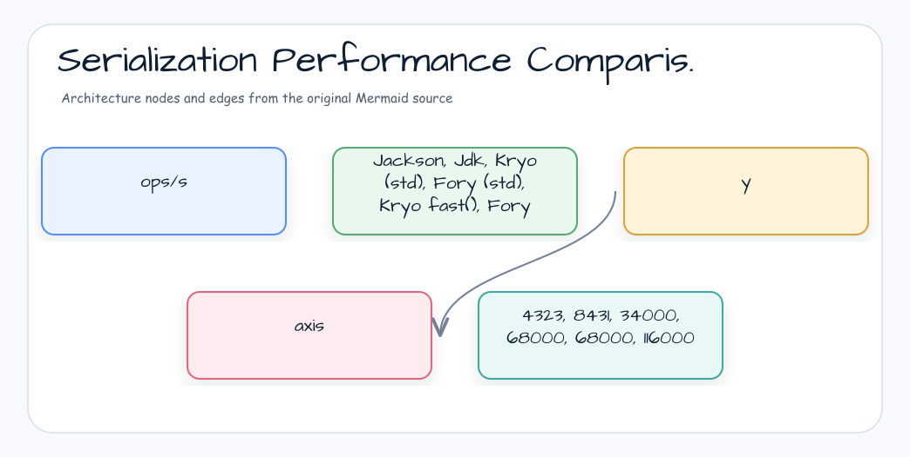
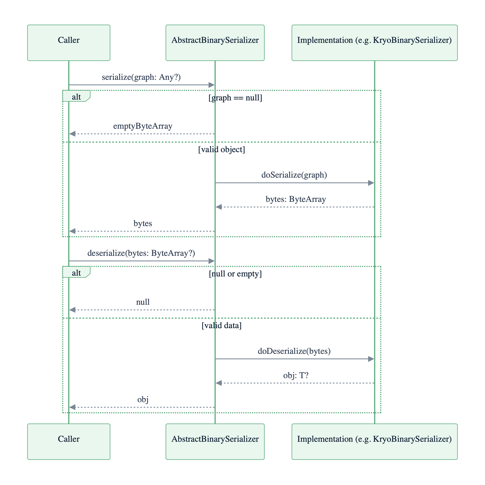
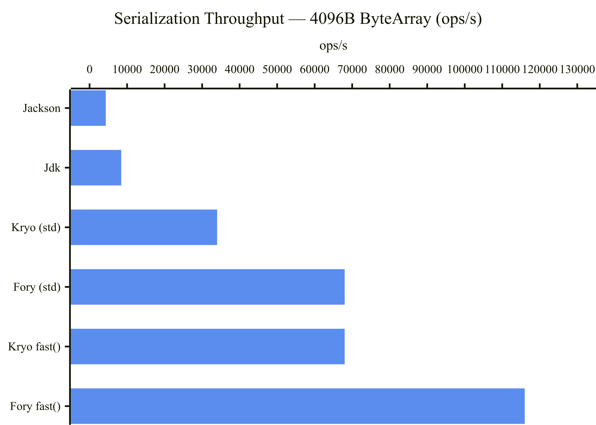
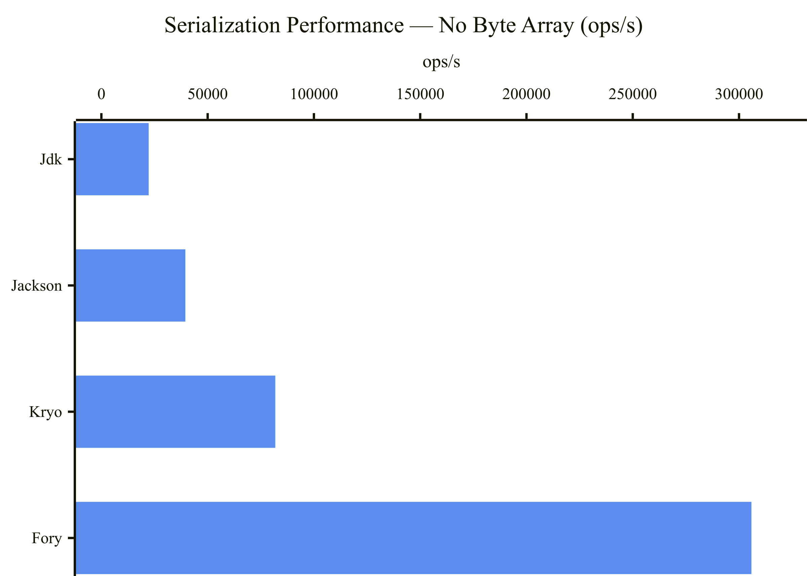
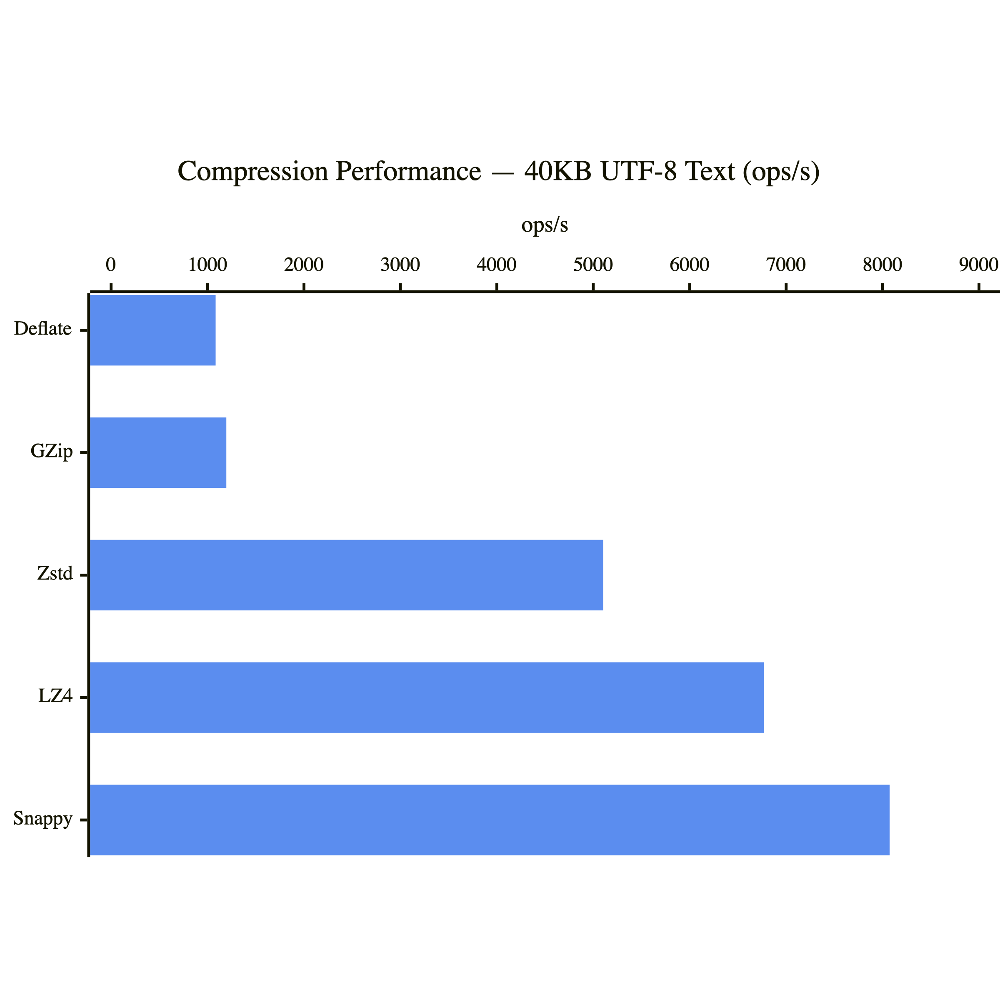

# Module bluetape4k-io

English | [한국어](./README.ko.md)

## Overview

`bluetape4k-io` is a high-performance I/O utility library for Kotlin. It provides simple and efficient tools for file handling, compression, serialization, async I/O, and more.

## Architecture

### Compressor Hierarchy


### BinarySerializer Hierarchy


### compress/decompress Flow



`compress()` and `decompress()` are throwing APIs: null or empty input returns
`emptyByteArray`, but implementation failures are propagated to the caller. Use
`compressOrNull()` / `decompressOrNull()` when corrupt input or compression
failure should be represented as `null` instead of an exception.

### serialize/deserialize Flow



## Key Features

### 1. Compression (Compressor)

A unified interface for multiple compression algorithms.

**Supported Algorithms:**

- **LZ4**: Ultra-fast compression/decompression (ideal for real-time processing)
- **Snappy**: High-speed compression (developed by Google)
- **Zstd**: Balanced compression ratio and speed
- **GZip**: General-purpose compression (excellent compatibility)
- **Deflate**: The algorithm underlying GZip
- **BZip2**: High compression ratio (slower speed)
- **Zip**: ZIP format compression/decompression (suited for file archives)

**Algorithm Selection Guide:**

- **Real-time processing**: LZ4, Snappy (speed over ratio)
- **Network transfer**: Zstd, GZip (balanced speed and ratio)
- **Storage optimization**: BZip2, Zstd (ratio over speed)
- **File archives**: Zip (preserves directory structure)

### 2. Serialization (BinarySerializer)

Multiple implementations for serializing and deserializing objects to/from binary.

`BinarySerializer` failure policy:

- `serialize(null)` returns an empty byte array.
- `deserialize(null/empty)` returns `null`.
- All other serialization/deserialization failures throw `BinarySerializationException`.

**Supported Serializers:**

- **Jdk**: Java standard serialization (best compatibility)
- **Kryo**: Fast and efficient binary serialization
- **Fory**: Kotlin-optimized serialization based on Apache Fory
- **Compressable**: Serialization combined with compression (e.g., LZ4Kryo, ZstdFory)

**Serializer Selection Guide:**

- **Compatibility first**: Jdk (works in all Java environments)
- **Performance first**: `ForyBinarySerializer.fast()` (best), `KryoBinarySerializer.fast()` (non-null DTOs only)
- **Standard performance**: `BinarySerializers.Kryo`, `BinarySerializers.Fory`
- **Storage savings**: LZ4Kryo, ZstdFory (with compression)

**fast() API — High-Performance Modes:**

Both `ForyBinarySerializer` and `KryoBinarySerializer` provide a `fast()` factory that enables high-throughput serialization for appropriate use cases.

| Serializer | Mode | Throughput | Nullable types? | Use case |
|---|---|---|---|---|
| `ForyBinarySerializer.fast()` | SCHEMA_CONSISTENT, no refTracking | ~116K ops/s (+71%) | ✅ Supported | Volatile caches, fixed-schema DTOs, DAG graphs |
| `KryoBinarySerializer.fast()` | FieldSerializer, no chunk headers | ~68K ops/s (+97%) | ❌ Not supported | Non-null fixed-schema DTOs only |
| `BinarySerializers.Fory` | COMPATIBLE, refTracking | ~68K ops/s | ✅ Supported | Schema evolution, persistent storage |
| `BinarySerializers.Kryo` | CompatibleFieldSerializer | ~34K ops/s | ✅ Supported | General use, nullable fields |

> ⚠️ **Wire Format Warning**: FastFory uses `CompatibleMode.SCHEMA_CONSISTENT` and is **NOT compatible** with the default Fory codec (`CompatibleMode.COMPATIBLE`). Use only for volatile caches (Redis, in-memory). No schema evolution support.

**FastFory Serializers (Compressed Variants):**

Combine FastFory performance with compression for maximum storage savings in volatile caches.

| Serializer | Compression | Throughput | Size reduction | Use case |
|---|---|---|---|---|
| `BinarySerializers.FastFory` | None | ~116K ops/s | — | Fast volatile cache, no compression |
| `BinarySerializers.LZ4FastFory` | LZ4 | ~25K ops/s | 40-60% | Balanced speed and size |
| `BinarySerializers.ZstdFastFory` | Zstd | ~18K ops/s | 50-70% | Best compression ratio (recommended) |
| `BinarySerializers.SnappyFastFory` | Snappy | ~30K ops/s | 30-50% | Fast compression, moderate size |
| `BinarySerializers.GZipFastFory` | GZip | ~12K ops/s | 60-80% | Highest compression (slowest) |

> Benchmark: 20× `SimpleData` objects each containing a 4096-byte `ByteArray` field.
> Measurement: JMH throughput, 3-second intervals, JVM warmup 4 iterations.

### 3. File Utilities (FileSupport)

Convenient extension functions for file handling.

### 4. Result-Pattern File Utilities (FileSupportResult)

A safe file API that returns `Result<T>` instead of throwing exceptions. Functions follow the
`tryXXXX` naming convention.

### 5. Virtual Threads Support (Java 21+)

Supports lightweight async processing using Virtual Threads.

### 6. Security Features

#### JDK Serialization Filter (JEP 290)

`JdkBinarySerializer` now applies `JDK_DEFAULT_OBJECT_INPUT_FILTER` by default, which only allows
the following packages for deserialization (all others are rejected):

- `io.bluetape4k.**`
- `java.lang.*`, `java.util.**`, `java.io.*`, `java.math.**`, `java.time.**`, `java.net.*`, `java.sql.*`
- `kotlin.**`

> **Breaking change**: `BinarySerializers.Default` is now `Kryo` (was `Jdk`).
> `BinarySerializers.Jdk` is deprecated with a security warning. Use `Kryo` or `Fory` instead.

Provide a custom filter to expand or narrow the allowed list:

```kotlin
val customFilter = ObjectInputFilter.Config.createFilter("com.mycompany.**;io.bluetape4k.**;kotlin.**;!*")
val serializer = JdkBinarySerializer(objectInputFilter = customFilter)
```

#### ZIP Bomb Protection

`unzip()` now enforces two hard limits:

| Constant | Value | Description |
|---|---|---|
| `ZIP_MAX_ENTRIES` | 10,000 | Maximum number of ZIP entries |
| `ZIP_MAX_UNCOMPRESSED_SIZE` | 1 GB | Maximum total uncompressed bytes |

Exceeding either limit throws `IllegalArgumentException`. The limit is checked from ZIP metadata
and again while bytes are actually extracted.

#### Safe Path Combination

Use `combineSafe` when appending user-provided relative paths under a trusted base directory.
It rejects parent traversal and absolute paths.

```kotlin
import io.bluetape4k.io.combineSafe
import java.nio.file.Paths

val base = Paths.get("/srv/app/data")
val report = base.combineSafe("reports/2026.csv")

// Throws InvalidPathException
base.combineSafe("../secret.txt")
base.combineSafe("/etc/passwd")
```

#### Nullable Compressor API

`AbstractCompressor` provides safe nullable variants for callers that prefer
`null` recovery over thrown compression/decompression failures:

```kotlin
val compressed = compressor.compressOrNull(input)   // null if input null/empty
val restored = compressor.decompressOrNull(compressed) // null if corrupt/null/empty
```

This allows callers to distinguish "corrupt input" (returns `null`) from "empty input"
(`compress()` returns `emptyByteArray`).

## Usage Examples

### Compression

```kotlin
import io.bluetape4k.io.compressor.Compressors

// Basic usage
val plainData = "Hello, World!".toByteArray()
val compressed = Compressors.LZ4.compress(plainData)
val decompressed = Compressors.LZ4.decompress(compressed)

// Direct string compression (Base64-encoded output)
val compressedStr = Compressors.Zstd.compress("Large text data...")
val originalStr = Compressors.Zstd.decompress(compressedStr)

// ByteBuffer support
val buffer = ByteBuffer.wrap(plainData)
val compressedBuffer = Compressors.Snappy.compress(buffer)

// InputStream support
val inputStream = File("large-file.txt").inputStream()
val compressedStream = Compressors.GZip.compress(inputStream)
```

**StreamingCompressor (for large-scale streaming):**

```kotlin
import io.bluetape4k.io.compressor.Compressors

val source = File("large-file.txt").inputStream()
val compressedOut = File("large-file.txt.zst").outputStream()

// Stream-based compression/decompression
Compressors.Streaming.Zstd.compress(source, compressedOut)

val restoredOut = File("large-file-restored.txt").outputStream()
Compressors.Streaming.Zstd.decompress(
    File("large-file.txt.zst").inputStream(),
    restoredOut
)
```

**ZIP File Builder (ZipBuilder):**

```kotlin
import io.bluetape4k.io.compressor.ZipBuilder

// In-memory ZIP
val zipBytes = ZipBuilder.ofInMemory()
    .add("Hello, World!").path("hello.txt").save()
    .add("""{"key": "value"}""").path("data/config.json").save()
    .toBytes()

// File-based ZIP
val zipFile = ZipBuilder.of(File("archive.zip"))
    .add(File("document.pdf")).path("docs/document.pdf").save()
    .addFolder("images/")
    .toZipFile()
```

**ZIP File Utilities (ZipFileSupport):**

```kotlin
import io.bluetape4k.io.compressor.*

// gzip/ungzip
val gzipped = gzip(File("data.txt"))       // creates data.txt.gz
val original = ungzip(gzipped)              // restores data.txt

// zip/unzip (with directory support)
ZipBuilder.of(File("project.zip"))
    .add(File("project/"))
    .recursive(true)
    .save()
    .toZipFile()
unzip(File("project.zip"), File("output/"))

// Pattern-filtered unzip (wildcard support)
unzip(File("project.zip"), File("output/"), "*.kt", "*.xml")
```

### Serialization

```kotlin
import io.bluetape4k.io.serializer.BinarySerializers

data class User(val id: Long, val name: String, val email: String)

// Kryo serialization (fast)
val serializer = BinarySerializers.Kryo
val user = User(1L, "John Doe", "john@example.com")
val bytes = serializer.serialize(user)
val restored = serializer.deserialize<User>(bytes)

// Throws BinarySerializationException on failure
try {
    serializer.deserialize<User>(byteArrayOf(1, 2, 3))
} catch (e: BinarySerializationException) {
    // handle
}

// Serialization + compression (saves storage space)
val compressedSerializer = BinarySerializers.LZ4Kryo
val compressedBytes = compressedSerializer.serialize(user)
// 50-70% smaller than uncompressed

// Fory serialization (modern, high-performance)
val forySerializer = BinarySerializers.Fory
val foryBytes = forySerializer.serialize(user)
```

**High-Performance Serialization with `fast()` API:**

```kotlin
import io.bluetape4k.io.serializer.ForyBinarySerializer
import io.bluetape4k.io.serializer.KryoBinarySerializer

// ✅ ForyBinarySerializer.fast() — ~71% faster than standard Fory
// Nullable types ARE supported. Use for volatile caches and fixed-schema DTOs.
// WARNING: format is incompatible with standard BinarySerializers.Fory — do not mix.
val foryFast = ForyBinarySerializer.fast()
val bytes = foryFast.serialize(user)            // serialize
val restored = foryFast.deserialize<User>(bytes) // deserialize (same serializer only)

// ✅ Suitable: volatile cache, non-circular object graph, fixed schema
data class CacheEntry(val id: Long, val payload: ByteArray?, val tag: String?)  // nullables OK
val entry = CacheEntry(1L, byteArrayOf(1, 2, 3), "v1")
val cached = foryFast.serialize(entry)  // works correctly

// ❌ Not suitable: mixing COMPATIBLE and SCHEMA_CONSISTENT data
val standard = BinarySerializers.Fory.serialize(user)
foryFast.deserialize<User>(standard)  // ERROR — format mismatch

// ❌ Not suitable: circular references (refTracking=false)
// data class Node(val id: Int, var next: Node?)  // circular → infinite loop

// ✅ KryoBinarySerializer.fast() — ~97% faster than standard Kryo
// WARNING: Kotlin nullable types (ByteArray?, String?) cause deserialization errors.
// Use only for pure non-null field DTOs.
data class NonNullItem(val id: Long, val name: String, val price: Double)  // all non-null
val kryoFast = KryoBinarySerializer.fast()
val itemBytes = kryoFast.serialize(NonNullItem(1L, "book", 9.99))
val item = kryoFast.deserialize<NonNullItem>(itemBytes)  // OK

// ❌ Not suitable: nullable fields
data class Order(val id: Long, val note: String?)  // String? → deserialization error!
val orderBytes = kryoFast.serialize(Order(1L, null))
kryoFast.deserialize<Order>(orderBytes)  // may throw or return wrong data
```

### File Utilities

```kotlin
import io.bluetape4k.io.*
import java.io.File
import java.nio.file.Paths

// Async file copy
val source = File("source.txt")
val target = File("target.txt")
source.copyToAsync(target).thenAccept {
    println("Copy completed: ${it.absolutePath}")
}

// Async file read
val path = Paths.get("large-file.txt")
path.readAllBytesAsync().thenAccept { bytes ->
    println("Read ${bytes.size} bytes")
}

// Line-by-line streaming (memory efficient)
File("huge-file.txt").readLineSequence().forEach { line ->
    processLine(line)
}
```

### Result-Pattern File Utilities

```kotlin
import io.bluetape4k.io.*
import java.io.File
import java.nio.file.Paths

// Create directory (returns Result)
tryCreateDirectory("/tmp/mydir").fold(
    onSuccess = { dir -> println("Created: ${dir.absolutePath}") },
    onFailure = { error -> logger.error("Failed", error) }
)

// Read file (returns Result)
val path = Paths.get("data.bin")
path.tryReadAllBytes().onSuccess { bytes ->
    println("Read ${bytes.size} bytes")
}
```

**Result Pattern API Reference:**

| Function                      | Return Type                            | Description      |
|-------------------------------|----------------------------------------|------------------|
| `tryCreateDirectory(path)`    | `Result<File>`                         | Create directory |
| `tryCreateFile(path)`         | `Result<File>`                         | Create file      |
| `File.tryDeleteRecursively()` | `Result<Boolean>`                      | Recursive delete |
| `File.tryDeleteIfExists()`    | `Result<Boolean>`                      | Delete file      |
| `Path.tryReadAllBytes()`      | `Result<ByteArray>`                    | Read bytes       |
| `Path.tryWriteBytes(bytes)`   | `Result<Long>`                         | Write bytes      |
| `Path.tryReadAllLines()`      | `Result<List<String>>`                 | Read lines       |
| `Path.tryWriteLines(lines)`   | `Result<Long>`                         | Write lines      |
| `File.tryCopyToAsync(target)` | `CompletableFuture<Result<File>>`      | Async copy       |
| `File.tryMoveAsync(target)`   | `CompletableFuture<Result<File>>`      | Async move       |
| `Path.tryReadAllBytesAsync()` | `CompletableFuture<Result<ByteArray>>` | Async read       |
| `Path.tryWriteAsync(bytes)`   | `CompletableFuture<Result<Long>>`      | Async write      |

## Benchmark Results

### Serialization Performance Comparison

Throughput for serializing/deserializing a collection of 20 `SimpleData` objects.
JMH throughput mode, 3-second measurement intervals, 4 warmup iterations.

**With byte array fields (4096 bytes) — standard vs fast():**

| Serializer | ops/s | vs standard | Notes |
|---|---|---|---|
| `ForyBinarySerializer.fast()` | ~116,000 | +71% | SCHEMA_CONSISTENT + no refTracking |
| `KryoBinarySerializer.fast()` | ~68,000 | +97% | FieldSerializer + outputPool reuse |
| `BinarySerializers.Fory` | ~68,000 | baseline | COMPATIBLE mode, nullable ✅ |
| `BinarySerializers.Kryo` | ~34,000 | baseline | CompatibleFieldSerializer, nullable ✅ |
| Jdk | ~8,431 | — | Java standard |
| Jackson | ~4,323 | — | Disadvantaged for binary data |



> `ForyBinarySerializer.fast()` is ~71% faster than standard Fory and supports nullable types.
> `KryoBinarySerializer.fast()` is ~97% faster but does **not** support Kotlin nullable fields (`Type?`).

**Without byte array fields:**

| Library | ops/s   | Notes                       |
|---------|---------|-----------------------------|
| Fory    | 305,821 | Best performance            |
| Kryo    | 81,823  | Recommended for general use |
| Jackson | 39,510  | JSON-based                  |
| Jdk     | 22,249  | Java standard               |



### Compression Performance Comparison

Throughput for compressing/decompressing a 40KB UTF-8 text file (`Utf8Samples.txt`).

| Algorithm | ops/s | Characteristics                        |
|-----------|-------|----------------------------------------|
| Snappy    | 8,073 | Fastest speed                          |
| LZ4       | 6,769 | Great for real-time processing         |
| Zstd      | 5,103 | Balanced speed and ratio (recommended) |
| GZip      | 1,195 | Excellent compatibility                |
| Deflate   | 1,084 | GZip-based                             |



## Module Structure

```
io.bluetape4k.io
├── compressor/          # Compression algorithms
│   ├── Compressor.kt
│   ├── StreamingCompressor.kt
│   ├── StreamingCompressors.kt
│   ├── Compressors.kt
│   ├── ZipCompressor.kt     # ZIP compression/decompression
│   ├── ZipBuilder.kt        # ZIP file builder
│   ├── ZipFileSupport.kt    # gzip/zlib/zip/unzip utilities
│   └── [various implementations]
├── serializer/          # Serialization
│   ├── BinarySerializer.kt
│   ├── BinarySerializers.kt
│   └── [various implementations]
├── FileSupport.kt          # File utilities (async copy/move/read/write)
├── FileSupportResult.kt    # Result-pattern file utilities (tryXXXX API)
├── FileCoroutineSupport.kt # Coroutine-based file I/O (readAllBytesSuspending, etc.)
├── PathSupport.kt          # Path utilities
└── [other extension functions]
```

## Adding the Dependency

### Gradle (Kotlin DSL)

```kotlin
dependencies {
    implementation("io.github.bluetape4k:bluetape4k-io:${version}")

    // Optional dependencies (add only what you need)

    // Compression algorithms
    implementation("org.lz4:lz4-java:1.8.0")              // LZ4
    implementation("org.xerial.snappy:snappy-java:1.1.10.8") // Snappy
    implementation("com.github.luben:zstd-jni:1.5.7-6")     // Zstd
    implementation("org.apache.commons:commons-compress:1.26.0") // BZip2, GZip

    // Serialization
    implementation("com.esotericsoftware:kryo:5.6.2")     // Kryo
    implementation("org.apache.fury:fury-kotlin:0.14.1")     // Fory
}
```

### Maven

```xml
<dependency>
    <groupId>io.github.bluetape4k</groupId>
    <artifactId>bluetape4k-io</artifactId>
    <version>${bluetape4k.version}</version>
</dependency>

<!-- Optional dependencies -->
<dependency>
    <groupId>org.lz4</groupId>
    <artifactId>lz4-java</artifactId>
    <version>1.8.0</version>
</dependency>
```

## License

MIT License

## References

- [bluetape4k-okio](../okio/README.md) (Okio-based I/O module)
- [Kryo Documentation](https://github.com/EsotericSoftware/kryo)
- [Apache Fory](https://fory.apache.org/)
- [LZ4 for Java](https://github.com/lz4/lz4-java)
