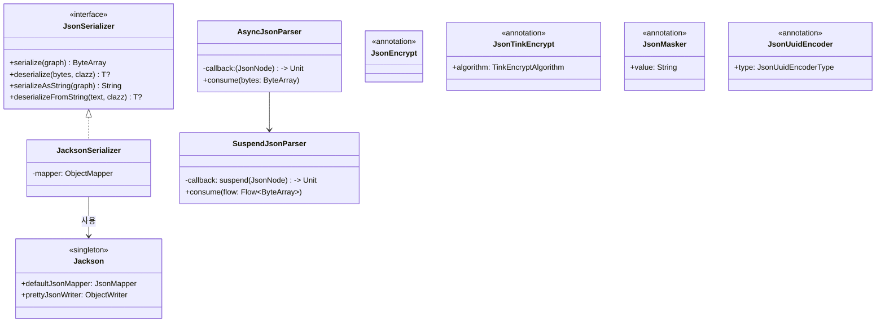
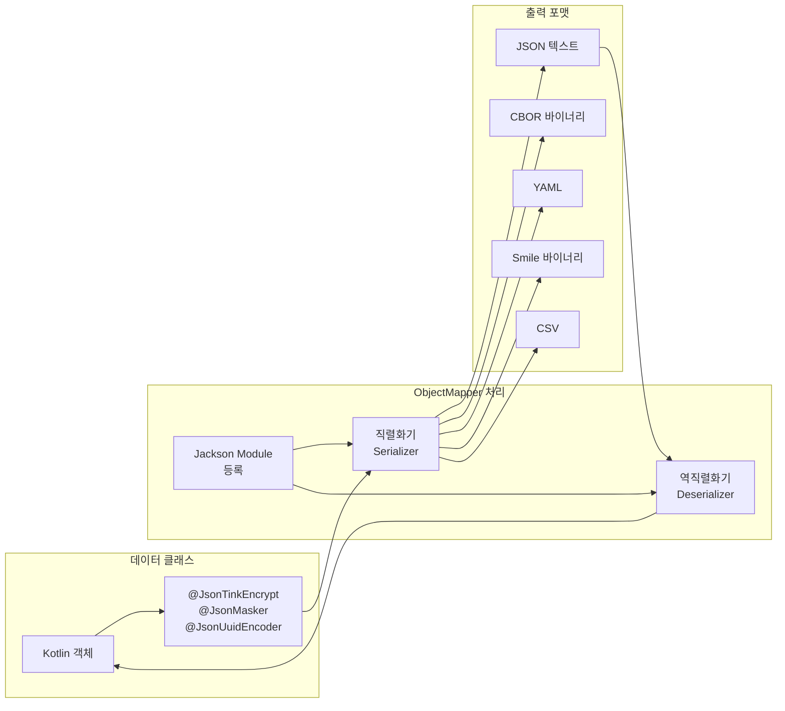
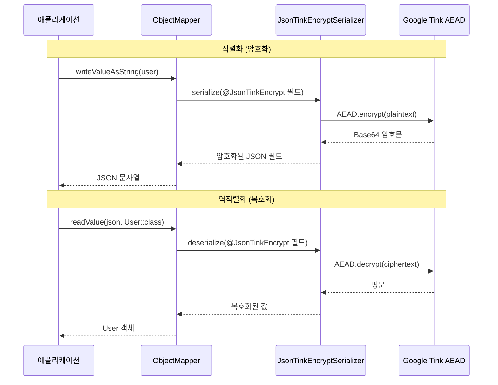

# Module bluetape4k-jackson

[English](./README.md) | 한국어

## 개요

`bluetape4k-jackson2`은 [Jackson 2.x](https://github.com/FasterXML/jackson) 라이브러리를 Kotlin DSL과 확장 함수로 래핑하여 제공하는 모듈입니다.

기본 JsonMapper 구성, ObjectMapper 확장 함수, 비동기 JSON 파싱, UUID Base62 인코딩, 필드 암호화, 필드 마스킹 등 Jackson 생태계를 Kotlin 환경에서 편리하게 사용할 수 있는 기능을 제공합니다.

## 주요 기능

### 1. JsonMapper DSL

Kotlin DSL로 간편하게 JsonMapper를 구성합니다.

```kotlin
import io.bluetape4k.jackson.*

// DSL 방식
val mapper = jsonMapper {
    findAndAddModules()
    enable(JsonReadFeature.ALLOW_TRAILING_COMMA)
    disable(DeserializationFeature.FAIL_ON_UNKNOWN_PROPERTIES)
}

// 기본 구성된 JsonMapper (Kotlin 모듈 포함)
val defaultMapper = Jackson.defaultJsonMapper

// Pretty-print 출력
val prettyJson = Jackson.prettyJsonWriter.writeValueAsString(data)
```

### 2. JacksonSerializer

`JsonSerializer` 인터페이스를 구현하며, Jackson ObjectMapper를 사용합니다.

```kotlin
import io.bluetape4k.jackson.JacksonSerializer

val serializer = JacksonSerializer()

// 바이트 배열 직렬화/역직렬화
val bytes = serializer.serialize(user)
val restored = serializer.deserialize<User>(bytes)

// 문자열 직렬화/역직렬화
val jsonText = serializer.serializeAsString(user)
val restored2 = serializer.deserializeFromString<User>(jsonText)

// 실패 시 JsonSerializationException
try {
    serializer.deserialize<User>("{not-json".toByteArray())
} catch (e: JsonSerializationException) {
    // handle
}
```

`JacksonSerializer` 실패 정책:

- `serialize(null)`은 빈 `ByteArray`를 반환합니다.
- `deserialize(null)` / `deserializeFromString(null)`은 `null`을 반환합니다.
- 그 외 직렬화/역직렬화 실패는 `JsonSerializationException` 예외를 던집니다.

### 3. ObjectMapper 확장 함수

다양한 입력 소스에서 안전하게 역직렬화하는 확장 함수를 제공합니다. 실패 시 예외 대신 null을 반환합니다.

```kotlin
import io.bluetape4k.jackson.*

val mapper = Jackson.defaultJsonMapper

// 다양한 소스에서 역직렬화 (실패 시 null)
val user = mapper.readValueOrNull<User>(jsonString)
val user2 = mapper.readValueOrNull<User>(inputStream)
val user3 = mapper.readValueOrNull<User>(byteArray)
val user4 = mapper.readValueOrNull<User>(file)

// 객체 변환
val dto = mapper.convertValueOrNull<UserDto>(entity)

// 직렬화 확장 함수
val json = mapper.writeAsString(user)
val bytes = mapper.writeAsBytes(user)
val prettyJson = mapper.prettyWriteAsString(user)
```

### 4. 비동기 JSON 파싱

Jackson의 `NonBlockingJsonParser`를 활용한 스트리밍 JSON 파싱을 지원합니다.

```kotlin
import io.bluetape4k.jackson.async.*

// 콜백 기반 비동기 파싱
val parser = AsyncJsonParser { root ->
    println("완성된 노드: $root")
}
parser.consume(chunk1)
parser.consume(chunk2)

// 코루틴 기반 파싱
val suspendParser = SuspendJsonParser { root ->
    processNode(root)  // suspend 가능
}
suspendParser.consume(byteArrayFlow)
```

언제 어떤 파서를 쓰면 좋은지:

- `AsyncJsonParser`: Netty, WebSocket, TCP, 메시지 리스너처럼 `ByteArray` 청크를 콜백으로 받는 push 스타일 코드
- `SuspendJsonParser`: `Flow<ByteArray>` 기반 파이프라인, `WebClient`/파일/브로커 스트림처럼 suspend 후처리가 필요한 코드
- 두 파서 모두 연속된 여러 JSON 루트와 루트 스칼라 JSON(`"text"`, `123`, `true`, `null`)를 처리할 수 있습니다.

### 4-1. WebClient 스트리밍 예제

`HttpbinHttp2Server`의 `/stream/3` 응답을 `WebClient`로 받아 루트 JSON 객체 3개를 순차 처리하는 예제입니다.

```kotlin
import io.bluetape4k.jackson.async.SuspendJsonParser
import io.bluetape4k.testcontainers.http.HttpbinHttp2Server
import kotlinx.coroutines.reactive.asFlow
import org.springframework.core.io.buffer.DataBuffer
import org.springframework.core.io.buffer.DataBufferUtils
import org.springframework.web.reactive.function.client.WebClient

val httpbin = HttpbinHttp2Server.Launcher.httpbinHttp2
val webClient = WebClient.builder()
    .baseUrl(httpbin.url)
    .build()

val parser = SuspendJsonParser { root ->
    println(root["url"].asText())   // /stream/3 응답의 각 JSON 객체 처리
}

val chunkFlow = webClient.get()
    .uri("/stream/3")
    .retrieve()
    .bodyToFlux(DataBuffer::class.java)
    .map { buffer ->
        try {
            ByteArray(buffer.readableByteCount()).also { buffer.read(it) }
        } finally {
            DataBufferUtils.release(buffer)
        }
    }
    .asFlow()

parser.consume(chunkFlow)
```

같은 상황에서 이미 청크를 콜백으로 받고 있다면 `AsyncJsonParser`가 더 단순합니다.

### 5. UUID Base62 인코딩

UUID를 Base62로 인코딩하여 짧은 문자열로 JSON에 저장합니다.

```kotlin
import io.bluetape4k.jackson.uuid.JsonUuidEncoder
import io.bluetape4k.jackson.uuid.JsonUuidEncoderType

data class User(
    @field:JsonUuidEncoder                              // Base62 (기본)
    val userId: UUID,
    @field:JsonUuidEncoder(JsonUuidEncoderType.PLAIN)   // 원본 UUID
    val plainId: UUID,
)

// 직렬화 결과:
// { "userId": "6gVuscij1cec8CelrpHU5h", "plainId": "413684f2-..." }
```

### 6. 필드 암호화 (@JsonEncrypt / @JsonTinkEncrypt)

민감한 데이터를 JSON 직렬화 시 자동으로 암호화/복호화합니다.

#### Jasypt 기반 (`@JsonEncrypt`) — Deprecated

```kotlin
import io.bluetape4k.jackson.crypto.JsonEncrypt

data class User(
    val username: String,
    @field:JsonEncrypt          // AES 기본 암호화 (Jasypt)
    val password: String,
)

// 직렬화: { "username": "debop", "password": "N1E79rV_n0d0eaZ..." }
// 역직렬화 시 자동 복호화
```

#### Google Tink 기반 (`@JsonTinkEncrypt`) — 권장

`bluetape4k-tink` 의존성이 필요합니다. 별도 모듈 등록 없이 어노테이션만으로 사용합니다.

```kotlin
import io.bluetape4k.jackson.crypto.JsonTinkEncrypt
import io.bluetape4k.jackson.crypto.TinkEncryptAlgorithm

data class User(
    val username: String,
    @get:JsonTinkEncrypt                                               // AES256-GCM (기본값)
    val password: String,
    @get:JsonTinkEncrypt(TinkEncryptAlgorithm.DETERMINISTIC_AES256_SIV) // DB 검색 가능한 결정적 암호화
    val mobile: String,
)

// 직렬화: { "username": "debop", "password": "AXYzK1...", "mobile": "BVp0..." }
// 역직렬화 시 자동 복호화
```

지원 알고리즘:

| `TinkEncryptAlgorithm`     | 설명                                   |
|----------------------------|--------------------------------------|
| `AES256_GCM`               | AES256-GCM 비결정적 암호화 — 범용, 기본값        |
| `AES128_GCM`               | AES128-GCM 비결정적 암호화 — 성능 우선          |
| `CHACHA20_POLY1305`        | ChaCha20-Poly1305 — HW AES 가속 없는 환경  |
| `XCHACHA20_POLY1305`       | XChaCha20-Poly1305 — 큰 nonce(192bit) |
| `DETERMINISTIC_AES256_SIV` | AES256-SIV 결정적 암호화 — DB 검색 가능        |

### 7. 필드 마스킹 (@JsonMasker)

민감한 정보를 JSON 직렬화 시 마스킹 처리합니다.

```kotlin
import io.bluetape4k.jackson.mask.JsonMasker

data class User(
    val name: String,
    @field:JsonMasker("***")    // 커스텀 마스킹 문자열
    val mobile: String,
)

// 직렬화: { "name": "debop", "mobile": "***" }
```

### 8. JsonNode 확장 함수

`JsonNode`에 값을 추가하는 DSL 스타일 확장 함수를 제공합니다.

```kotlin
import io.bluetape4k.jackson.*

val objectNode = Jackson.defaultJsonMapper.createObjectNode()
objectNode.addString("name", "name")
objectNode.addInt(42, "age")
objectNode.addBoolean(true, "active")
objectNode.addNull("description")
```

## 바이너리 / 텍스트 포맷 지원

> 구 `bluetape4k-jackson-binary`, `bluetape4k-jackson-text` 모듈이 이 모듈에 통합되었습니다.

바이너리 및 텍스트 포맷은 `compileOnly`로 선언되어 있으므로 사용할 포맷의 의존성을 런타임에 추가해야 합니다.

| 포맷         | 종류   | 런타임 의존성                         |
|------------|------|---------------------------------|
| CBOR       | 바이너리 | `jackson-dataformat-cbor`       |
| Ion        | 바이너리 | `jackson-dataformat-ion`        |
| Smile      | 바이너리 | `jackson-dataformat-smile`      |
| Avro       | 바이너리 | `jackson-dataformat-avro`       |
| Protobuf   | 바이너리 | `jackson-dataformat-protobuf`   |
| YAML       | 텍스트  | `jackson-dataformat-yaml`       |
| CSV        | 텍스트  | `jackson-dataformat-csv`        |
| TOML       | 텍스트  | `jackson-dataformat-toml`       |
| Properties | 텍스트  | `jackson-dataformat-properties` |

### CBOR 직렬화 예시

```kotlin
import com.fasterxml.jackson.dataformat.cbor.CBORFactory
import com.fasterxml.jackson.databind.ObjectMapper

val cborMapper = ObjectMapper(CBORFactory())
val bytes = cborMapper.writeValueAsBytes(user)      // 바이너리 직렬화
val restored = cborMapper.readValue<User>(bytes)    // 역직렬화
```

### YAML 직렬화 예시

```kotlin
import com.fasterxml.jackson.dataformat.yaml.YAMLFactory
import com.fasterxml.jackson.databind.ObjectMapper

val yamlMapper = ObjectMapper(YAMLFactory())
val yaml = yamlMapper.writeValueAsString(user)      // YAML 직렬화
val restored = yamlMapper.readValue<User>(yaml)     // 역직렬화
```

## 아키텍처 다이어그램

### 클래스 구조



### Jackson 직렬화 파이프라인



### 필드 암호화 흐름 (@JsonTinkEncrypt)



## 의존성

```kotlin
dependencies {
    implementation(project(":bluetape4k-jackson2"))

    // 바이너리 포맷 (필요한 것만 추가)
    implementation("com.fasterxml.jackson.dataformat:jackson-dataformat-cbor")
    implementation("com.fasterxml.jackson.dataformat:jackson-dataformat-smile")

    // 텍스트 포맷 (필요한 것만 추가)
    implementation("com.fasterxml.jackson.dataformat:jackson-dataformat-yaml")
    implementation("com.fasterxml.jackson.dataformat:jackson-dataformat-csv")
    implementation("com.fasterxml.jackson.dataformat:jackson-dataformat-toml")

    // 암호화 (선택적)
    implementation(project(":bluetape4k-crypto"))  // @JsonEncrypt (Jasypt) 사용 시
    implementation(project(":bluetape4k-tink"))    // @JsonTinkEncrypt (Google Tink) 사용 시
}
```

## 모듈 구조

```
io.bluetape4k.jackson
├── Jackson.kt                    # 기본 JsonMapper 싱글턴
├── JacksonSerializer.kt          # JsonSerializer 구현체
├── JsonMapperSupport.kt          # ObjectMapper 확장 함수
├── JsonNodeExtensions.kt         # JsonNode 확장 함수
├── JsonGeneratorExtensions.kt    # JsonGenerator 확장 함수
├── async/                        # 비동기 JSON 파싱
│   ├── AsyncJsonParser.kt        # 콜백 기반 비동기 파서
│   └── SuspendJsonParser.kt      # 코루틴 기반 파서
├── crypto/                           # 필드 암호화
│   ├── JsonEncrypt.kt                # @JsonEncrypt 어노테이션 (Jasypt, Deprecated)
│   ├── JsonEncryptSerializer.kt      # 암호화 직렬화기
│   ├── JsonEncryptDeserializer.kt    # 복호화 역직렬화기
│   ├── JsonEncryptors.kt             # Encryptor 캐시 관리
│   ├── TinkEncryptAlgorithm.kt       # Tink 알고리즘 enum
│   ├── JsonTinkEncrypt.kt            # @JsonTinkEncrypt 어노테이션 (Google Tink)
│   ├── JsonTinkEncryptSerializer.kt  # Tink 암호화 직렬화기
│   └── JsonTinkEncryptDeserializer.kt # Tink 복호화 역직렬화기
├── mask/                         # 필드 마스킹
│   ├── JsonMasker.kt             # @JsonMasker 어노테이션
│   └── JsonMaskerSerializer.kt   # 마스킹 직렬화기
└── uuid/                         # UUID 인코딩
    ├── JsonUuidEncoder.kt        # @JsonUuidEncoder 어노테이션
    ├── JsonUuidEncoderType.kt    # BASE62 / PLAIN 열거형
    ├── JsonUuidModule.kt         # Jackson Module 등록
    ├── JsonUuidBase62Serializer.kt   # UUID → Base62 직렬화
    ├── JsonUuidBase62Deserializer.kt # Base62 → UUID 역직렬화
    └── JsonUuidEncoderAnnotationInterospector.kt
```

## 테스트

```bash
./gradlew :bluetape4k-jackson2:test
```

## 참고

- [Jackson](https://github.com/FasterXML/jackson)
- [Jackson Kotlin Module](https://github.com/FasterXML/jackson-module-kotlin)
- [Url62 (Base62)](https://github.com/nicksrandall/url62)
