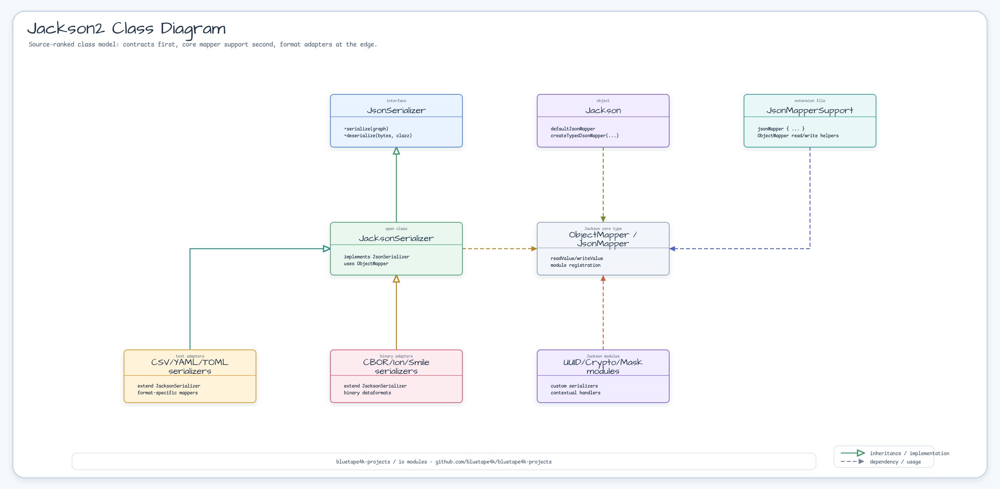
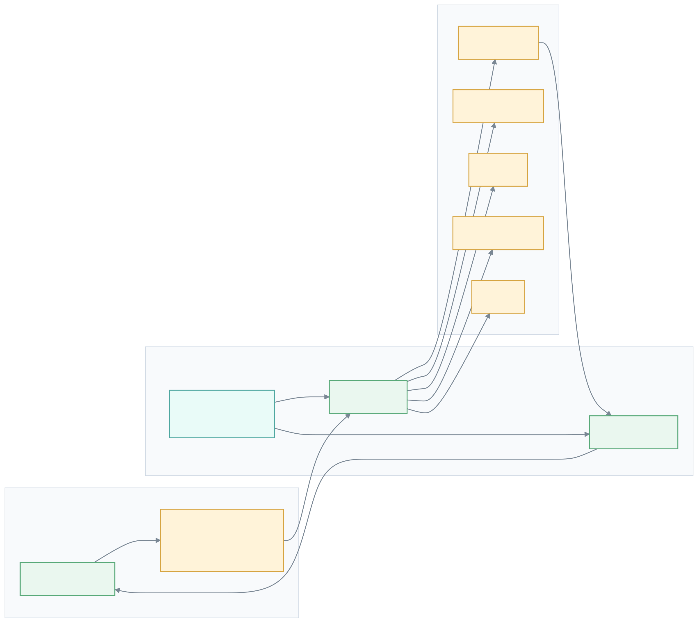
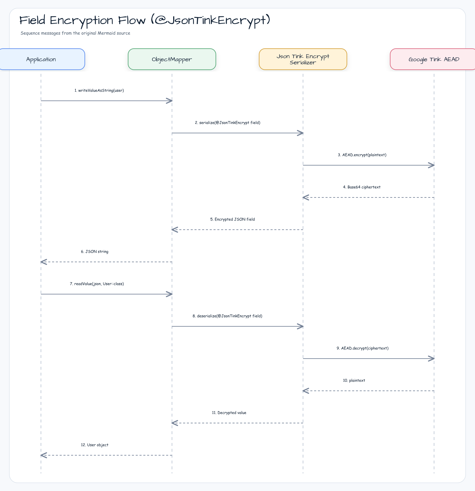

# Module bluetape4k-jackson

[English](./README.md) | 한국어

## 개요

`bluetape4k-jackson2`은 [Jackson 2.x](https://github.com/FasterXML/jackson) 라이브러리를 Kotlin DSL과 확장 함수로 래핑하여 제공하는 모듈입니다.

기본 JsonMapper 구성, ObjectMapper 확장 함수, 비동기 JSON 파싱, UUID Base62 인코딩, 필드 암호화, 필드 마스킹 등 Jackson 생태계를 Kotlin 환경에서 편리하게 사용할 수 있는 기능을 제공합니다.

## bluetape4k에서 Jackson2를 쓰는 장점

- 널리 배포된 Jackson 2.x API를 유지하면서 Kotlin 친화적인 mapper 기본값과 확장 함수를 제공합니다.
- JSON, 바이너리 포맷, UUID Base62 인코딩, 필드 마스킹, Tink 기반 필드 암호화를 한 모듈에서 다룹니다.
- 콜백 기반 바이트 청크와 코루틴 `Flow<ByteArray>` 파이프라인을 모두 처리하는 스트리밍 파서를 제공합니다.
- 비동기 파서에 명시적인 EOF API를 제공해 마지막 JSON이 잘렸을 때 "추가 입력 대기"가 아니라 빠르게 실패하도록 합니다.

## 아키텍처 다이어그램

### 클래스 구조



### Jackson 직렬화 파이프라인



### 필드 암호화 흐름 (@JsonTinkEncrypt)



## 추천 사용 시나리오

- 서비스 전반에서 Kotlin-ready `JsonMapper`가 필요하면 `Jackson.defaultJsonMapper`를 사용합니다.
- cache, messaging, storage 계층에서 공통 `JsonSerializer` 계약이 필요하면 `JacksonSerializer`를 사용합니다.
- Netty, WebSocket, TCP, listener처럼 바이트 청크를 하나씩 받는 push 스타일 코드는 `AsyncJsonParser`를 사용합니다.
- HTTP 응답, 파일 스트림, broker payload처럼 완료되는 `Flow<ByteArray>`는 `SuspendJsonParser.consumeComplete(flow)`를 사용합니다.
- JSON 문서 내부에 암호문을 유지해야 하는 필드 단위 암호화에는 `@JsonTinkEncrypt`를 사용합니다.

## Anti-Patterns

- 완료되는 스트림에서 `endOfInput()` 또는 `consumeComplete(flow)`를 생략하지 마십시오. Jackson non-blocking parser는 잘린 JSON을 보고하려면 명시적인 EOF 신호가 필요합니다.
- `endOfInput()` 또는 `consumeComplete(flow)` 이후 같은 파서를 재사용하지 마십시오. 논리 스트림마다 새 파서를 생성합니다.
- 필드 암호화를 TLS, DB 접근 제어, 키 교체, 감사 정책의 대체재로 사용하지 마십시오.
- 모든 Jackson dataformat 의존성을 기본으로 추가하지 마십시오. 애플리케이션이 실제로 읽거나 쓰는 포맷만 런타임에 추가합니다.

## 주요 기능

### 1. JsonMapper DSL

Kotlin DSL로 간편하게 JsonMapper를 구성합니다.

```kotlin
import io.bluetape4k.jackson.*

// DSL 방식
val mapper = jsonMapper {
    findAndAddModules()
    enable(JsonReadFeature.ALLOW_TRAILING_COMMA)
    disable(DeserializationFeature.FAIL_ON_UNKNOWN_PROPERTIES)
}

// 기본 구성된 JsonMapper (Kotlin 모듈 포함)
val defaultMapper = Jackson.defaultJsonMapper

// Pretty-print 출력
val prettyJson = Jackson.prettyJsonWriter.writeValueAsString(data)
```

### 안전한 다형성 Mapper

Jackson default type information이 필요한 JSON에는 `Jackson.createTypedJsonMapper(...)`를 사용하세요.
allowlist는 다형 subtype class name에 적용되며, type id는 `@class` property로 기록됩니다.

```kotlin
val mapper = Jackson.createTypedJsonMapper("com.example.model.")
val json = mapper.writeValueAsString(value)
val restored = mapper.readValue(json, ModelEnvelope::class.java)
```

신뢰할 수 없는 JSON에는 deprecated된 `Jackson.typedJsonMapper`를 사용하지 마세요. 이 mapper는
호환성을 위해 기존 `Any` base default typing 동작을 유지하므로 외부 payload에 안전하지 않습니다.

### 2. JacksonSerializer

`JsonSerializer` 인터페이스를 구현하며, Jackson ObjectMapper를 사용합니다.

```kotlin
import io.bluetape4k.jackson.JacksonSerializer

val serializer = JacksonSerializer()

// 바이트 배열 직렬화/역직렬화
val bytes = serializer.serialize(user)
val restored = serializer.deserialize<User>(bytes)

// 문자열 직렬화/역직렬화
val jsonText = serializer.serializeAsString(user)
val restored2 = serializer.deserializeFromString<User>(jsonText)

// 실패 시 JsonSerializationException
try {
    serializer.deserialize<User>("{not-json".toByteArray())
} catch (e: JsonSerializationException) {
    // handle
}
```

`JacksonSerializer` 실패 정책:

- `serialize(null)`은 빈 `ByteArray`를 반환합니다.
- `deserialize(null)` / `deserializeFromString(null)`은 `null`을 반환합니다.
- 일반적인 backend 직렬화/역직렬화 실패는 `JsonSerializationException` 예외를 던집니다.

#### ByteBuffer 계약

`serializeTo`는 설정된 mapper의 stream API로 caller-owned buffer에 직접 쓰고, `deserializeFrom`은
duplicate view를 읽습니다. 이 Jackson 전용 override는 호환 `serialize(): ByteArray`와
`deserialize(ByteArray)` 메서드를 우회합니다. optimized dispatch cell이라는 의미만 가지며, 측정 전에는
할당 개선을 주장하지 않습니다. heap, direct, slice, read-only 입력을 지원하며 입력 상태를 보존합니다. 출력 position은 성공
시에만 이동하고, read-only target과 용량 부족은 각각 raw `ReadOnlyBufferException`,
`BufferOverflowException`을 노출합니다. 실패한 출력 호출은 원래 position으로 rollback하지만 이미 기록된
바이트는 불특정 상태이므로 주변 프로토콜이 요구하면 재시도 전에 지우거나 덮어써야 합니다.
치명적인 `Error` 인스턴스는 wrapping하지 않고 동일 identity를 유지합니다.
신뢰할 수 없는 입력은 호출 전에 limit를 설정해 범위를 제한해야 하며 serializer는 remaining 범위 밖을 읽지 않습니다.

```kotlin
import io.bluetape4k.jackson.*
import io.bluetape4k.json.JsonSerializer
import io.bluetape4k.json.deserialize as deserializeRaw
import java.nio.ByteBuffer

run {
    val buffer = ByteBuffer.allocate(4096)
    serializer.serializeTo(users, buffer)
    buffer.flip()
    val restored = serializer.deserialize<List<User>>(buffer)
}
run {
    val buffer = ByteBuffer.wrap(serializer.serialize(usersByName))
    val restored = serializer.deserialize<Map<String, User>>(buffer)
}

val contract: JsonSerializer = serializer
val buffer = ByteBuffer.wrap(serializer.serialize(users))
val rawUsers: List<*>? = contract.deserializeRaw<List<User>>(buffer)
```

concrete `JacksonSerializer` extension은 generic `TypeReference` 정보를 유지합니다. 정적 타입이
`JsonSerializer`인 receiver는 기존 class-token 호환 fallback 계약을 사용하므로 collection element가
raw map으로 남습니다. YAML, Properties, CSV, TOML, CBOR, Ion, Smile도 같은 buffer override를 상속합니다.
Jackson 내부 전체에 대한 zero-allocation 주장은 하지 않습니다.

```java
ByteBuffer buffer = ByteBuffer.wrap(bytes);
User restored = serializer.deserializeFrom(buffer, User.class);
```

### 3. ObjectMapper 확장 함수

다양한 입력 소스에서 안전하게 역직렬화하는 확장 함수를 제공합니다. 실패 시 예외 대신 null을 반환합니다.

```kotlin
import io.bluetape4k.jackson.*

val mapper = Jackson.defaultJsonMapper

// 다양한 소스에서 역직렬화 (실패 시 null)
val user = mapper.readValueOrNull<User>(jsonString)
val user2 = mapper.readValueOrNull<User>(inputStream)
val user3 = mapper.readValueOrNull<User>(byteArray)
val user4 = mapper.readValueOrNull<User>(file)

// 객체 변환
val dto = mapper.convertValueOrNull<UserDto>(entity)

// 직렬화 확장 함수
val json = mapper.writeAsString(user)
val bytes = mapper.writeAsBytes(user)
val prettyJson = mapper.prettyWriteAsString(user)
```

### 4. 비동기 JSON 파싱

Jackson의 `NonBlockingJsonParser`를 활용한 스트리밍 JSON 파싱을 지원합니다.

```kotlin
import io.bluetape4k.jackson.async.*

// 콜백 기반 비동기 파싱
val parser = AsyncJsonParser { root ->
    println("완성된 노드: $root")
}
parser.consume(chunk1)
parser.consume(chunk2)
parser.endOfInput()

// 코루틴 기반 파싱
val suspendParser = SuspendJsonParser { root ->
    processNode(root)  // suspend 가능
}
suspendParser.consumeComplete(byteArrayFlow)
```

언제 어떤 파서를 쓰면 좋은지:

- `AsyncJsonParser`: Netty, WebSocket, TCP, 메시지 리스너처럼 `ByteArray` 청크를 콜백으로 받는 push 스타일 코드
- `SuspendJsonParser`: `Flow<ByteArray>` 기반 파이프라인, `WebClient`/파일/브로커 스트림처럼 suspend 후처리가 필요한 코드
- 두 파서 모두 연속된 여러 JSON 루트와 루트 스칼라 JSON(`"text"`, `123`, `true`, `null`)를 처리할 수 있습니다.
- 콜백 스트림은 더 이상 바이트가 없을 때 `endOfInput()`을 호출하고, 완료되는 `Flow` 스트림은 `consumeComplete(flow)`를 사용합니다.

### 4-1. WebClient 스트리밍 예제

`HttpbinHttp2Server`의 `/stream/3` 응답을 `WebClient`로 받아 루트 JSON 객체 3개를 순차 처리하는 예제입니다.

```kotlin
import io.bluetape4k.jackson.async.SuspendJsonParser
import io.bluetape4k.testcontainers.http.HttpbinHttp2Server
import kotlinx.coroutines.reactive.asFlow
import org.springframework.core.io.buffer.DataBuffer
import org.springframework.core.io.buffer.DataBufferUtils
import org.springframework.web.reactive.function.client.WebClient

val httpbin = HttpbinHttp2Server.Launcher.httpbinHttp2
val webClient = WebClient.builder()
    .baseUrl(httpbin.url)
    .build()

val parser = SuspendJsonParser { root ->
    println(root["url"].asText())   // /stream/3 응답의 각 JSON 객체 처리
}

val chunkFlow = webClient.get()
    .uri("/stream/3")
    .retrieve()
    .bodyToFlux(DataBuffer::class.java)
    .map { buffer ->
        try {
            ByteArray(buffer.readableByteCount()).also { buffer.read(it) }
        } finally {
            DataBufferUtils.release(buffer)
        }
    }
    .asFlow()

parser.consumeComplete(chunkFlow)
```

같은 상황에서 이미 청크를 콜백으로 받고 있다면 `AsyncJsonParser`가 더 단순합니다.

### 5. UUID Base62 인코딩

UUID를 Base62로 인코딩하여 짧은 문자열로 JSON에 저장합니다.

```kotlin
import io.bluetape4k.jackson.uuid.JsonUuidEncoder
import io.bluetape4k.jackson.uuid.JsonUuidEncoderType

data class User(
    @field:JsonUuidEncoder                              // Base62 (기본)
    val userId: UUID,
    @field:JsonUuidEncoder(JsonUuidEncoderType.PLAIN)   // 원본 UUID
    val plainId: UUID,
)

// 직렬화 결과:
// { "userId": "6gVuscij1cec8CelrpHU5h", "plainId": "413684f2-..." }
```

### 6. 필드 암호화 (@JsonTinkEncrypt)

민감한 데이터를 JSON 직렬화 시 자동으로 암호화/복호화합니다.

#### Google Tink 기반 (`@JsonTinkEncrypt`) — 권장

`bluetape4k-tink` 의존성이 필요합니다. 별도 모듈 등록 없이 어노테이션만으로 사용합니다.

```kotlin
import io.bluetape4k.jackson.crypto.JsonTinkEncrypt
import io.bluetape4k.jackson.crypto.TinkEncryptAlgorithm

data class User(
    val username: String,
    @get:JsonTinkEncrypt                                               // AES256-GCM (기본값)
    val password: String,
    @get:JsonTinkEncrypt(TinkEncryptAlgorithm.DETERMINISTIC_AES256_SIV) // 현재 JVM keyset 안에서만 결정적
    val mobile: String,
)

// 직렬화: { "username": "debop", "password": "AXYzK1...", "mobile": "BVp0..." }
// 역직렬화 시 자동 복호화
```

`@JsonTinkEncrypt`는 현재 JVM process에서 메모리로 생성되는 `TinkEncryptors` singleton keyset을 사용합니다.
재시작, rollout, multi-instance 접근 이후에도 유지되어야 하는 DB 컬럼 암호화나 검색 index에는 이 annotation을
사용하지 마세요. durable searchable storage가 필요하다면 보호된 `VersionedKeysetStore`와
`TinkDaeads.versioned(store)` 같은 `bluetape4k-tink` versioned keyset API를 사용하세요.

지원 알고리즘:

| `TinkEncryptAlgorithm`     | 설명                                   |
|----------------------------|--------------------------------------|
| `AES256_GCM`               | AES256-GCM 비결정적 암호화 — 범용, 기본값        |
| `AES128_GCM`               | AES128-GCM 비결정적 암호화 — 성능 우선          |
| `CHACHA20_POLY1305`        | ChaCha20-Poly1305 — HW AES 가속 없는 환경  |
| `XCHACHA20_POLY1305`       | XChaCha20-Poly1305 — 큰 nonce(192bit) |
| `DETERMINISTIC_AES256_SIV` | AES256-SIV 결정적 암호화 — 현재 process 안의 equality 확인용 |

### 7. 필드 마스킹 (@JsonMasker)

민감한 정보를 JSON 직렬화 시 마스킹 처리합니다.

```kotlin
import io.bluetape4k.jackson.mask.JsonMasker

data class User(
    val name: String,
    @field:JsonMasker("***")    // 커스텀 마스킹 문자열
    val mobile: String,
)

// 직렬화: { "name": "debop", "mobile": "***" }
```

### 8. JsonNode 확장 함수

`JsonNode`에 값을 추가하는 DSL 스타일 확장 함수를 제공합니다.

```kotlin
import io.bluetape4k.jackson.*

val objectNode = Jackson.defaultJsonMapper.createObjectNode()
objectNode.addString("name", "name")
objectNode.addInt(42, "age")
objectNode.addBoolean(true, "active")
objectNode.addNull("description")
```

## 바이너리 / 텍스트 포맷 지원

> 구 `bluetape4k-jackson-binary`, `bluetape4k-jackson-text` 모듈이 이 모듈에 통합되었습니다.

바이너리 및 텍스트 포맷은 `compileOnly`로 선언되어 있으므로 사용할 포맷의 의존성을 런타임에 추가해야 합니다.

| 포맷         | 종류   | 런타임 의존성                         |
|------------|------|---------------------------------|
| CBOR       | 바이너리 | `jackson-dataformat-cbor`       |
| Ion        | 바이너리 | `jackson-dataformat-ion`        |
| Smile      | 바이너리 | `jackson-dataformat-smile`      |
| Avro       | 바이너리 | `jackson-dataformat-avro`       |
| Protobuf   | 바이너리 | `jackson-dataformat-protobuf`   |
| YAML       | 텍스트  | `jackson-dataformat-yaml`       |
| CSV        | 텍스트  | `jackson-dataformat-csv`        |
| TOML       | 텍스트  | `jackson-dataformat-toml`       |
| Properties | 텍스트  | `jackson-dataformat-properties` |

### CBOR 직렬화 예시

```kotlin
import com.fasterxml.jackson.dataformat.cbor.CBORFactory
import com.fasterxml.jackson.databind.ObjectMapper

val cborMapper = ObjectMapper(CBORFactory())
val bytes = cborMapper.writeValueAsBytes(user)      // 바이너리 직렬화
val restored = cborMapper.readValue<User>(bytes)    // 역직렬화
```

### YAML 직렬화 예시

```kotlin
import com.fasterxml.jackson.dataformat.yaml.YAMLFactory
import com.fasterxml.jackson.databind.ObjectMapper

val yamlMapper = ObjectMapper(YAMLFactory())
val yaml = yamlMapper.writeValueAsString(user)      // YAML 직렬화
val restored = yamlMapper.readValue<User>(yaml)     // 역직렬화
```

## 의존성

```kotlin
dependencies {
    implementation("io.github.bluetape4k:bluetape4k-jackson2:${bluetape4kVersion}")

    // 바이너리 포맷 (필요한 것만 추가)
    implementation("com.fasterxml.jackson.dataformat:jackson-dataformat-cbor")
    implementation("com.fasterxml.jackson.dataformat:jackson-dataformat-smile")

    // 텍스트 포맷 (필요한 것만 추가)
    implementation("com.fasterxml.jackson.dataformat:jackson-dataformat-yaml")
    implementation("com.fasterxml.jackson.dataformat:jackson-dataformat-csv")
    implementation("com.fasterxml.jackson.dataformat:jackson-dataformat-toml")

    // 암호화 (선택적)
    implementation("io.github.bluetape4k:bluetape4k-tink:${bluetape4kVersion}")    // @JsonTinkEncrypt (Google Tink) 사용 시
}
```

## 모듈 구조

```
io.bluetape4k.jackson
├── Jackson.kt                    # 기본 JsonMapper 싱글턴
├── JacksonSerializer.kt          # JsonSerializer 구현체
├── JsonMapperSupport.kt          # ObjectMapper 확장 함수
├── JsonNodeExtensions.kt         # JsonNode 확장 함수
├── JsonGeneratorExtensions.kt    # JsonGenerator 확장 함수
├── async/                        # 비동기 JSON 파싱
│   ├── AsyncJsonParser.kt        # 콜백 기반 비동기 파서
│   └── SuspendJsonParser.kt      # 코루틴 기반 파서
├── crypto/                           # 필드 암호화
│   ├── TinkEncryptAlgorithm.kt       # Tink 알고리즘 enum
│   ├── JsonTinkEncrypt.kt            # @JsonTinkEncrypt 어노테이션 (Google Tink)
│   ├── JsonTinkEncryptSerializer.kt  # Tink 암호화 직렬화기
│   └── JsonTinkEncryptDeserializer.kt # Tink 복호화 역직렬화기
├── mask/                         # 필드 마스킹
│   ├── JsonMasker.kt             # @JsonMasker 어노테이션
│   └── JsonMaskerSerializer.kt   # 마스킹 직렬화기
└── uuid/                         # UUID 인코딩
    ├── JsonUuidEncoder.kt        # @JsonUuidEncoder 어노테이션
    ├── JsonUuidEncoderType.kt    # BASE62 / PLAIN 열거형
    ├── JsonUuidModule.kt         # Jackson Module 등록
    ├── JsonUuidBase62Serializer.kt   # UUID → Base62 직렬화
    ├── JsonUuidBase62Deserializer.kt # Base62 → UUID 역직렬화
    └── JsonUuidEncoderAnnotationInterospector.kt
```

## 테스트

```bash
./gradlew :bluetape4k-jackson2:test
```

## 참고

### ByteBuffer 할당 근거

[이슈 #1039 보고서](../../docs/benchmarks/2026-07-18-bytebuffer-serializer-allocation.md)는 Jackson 2 `serializeTo`의 낮은 할당을 accepted로 판정했고 `deserializeFrom`은 inconclusive였습니다. interface 기본 구현의 호환 셀은 사용 편의성 전용입니다.

| 경로 | 상태 | 한계 |
|---|---|---|
| concrete `serializeTo` | 최적화, accepted | 측정 payload/기본 mapper에 한정 |
| concrete `deserializeFrom` | 최적화, inconclusive | 할당 감소 주장 없음 |
| interface 기본 구현 | 호환 fallback | 사용 편의성 전용 |

Kotlin은 `serializer.serializeTo(value, target)`과 `serializer.deserializeFrom<Value>(source)`를 사용하고 Java는 같은 메서드에 target class를 전달합니다. 호출자는 남은 용량이 충분한 writable buffer를 제공합니다. 출력 성공은 `limit`을 넓히지 않고 `position`만 이동하며 overflow/read-only 실패는 rollback합니다. 입력은 duplicate view로 source `position`과 `limit`을 보존합니다.

- [Jackson](https://github.com/FasterXML/jackson)
- [Jackson Kotlin Module](https://github.com/FasterXML/jackson-module-kotlin)
- [Url62 (Base62)](https://github.com/nicksrandall/url62)
