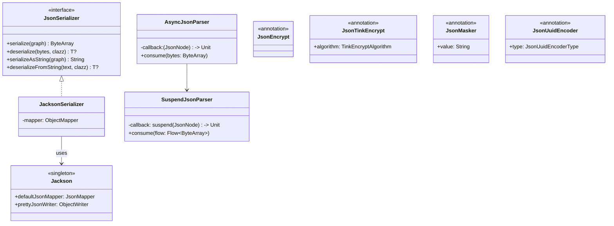
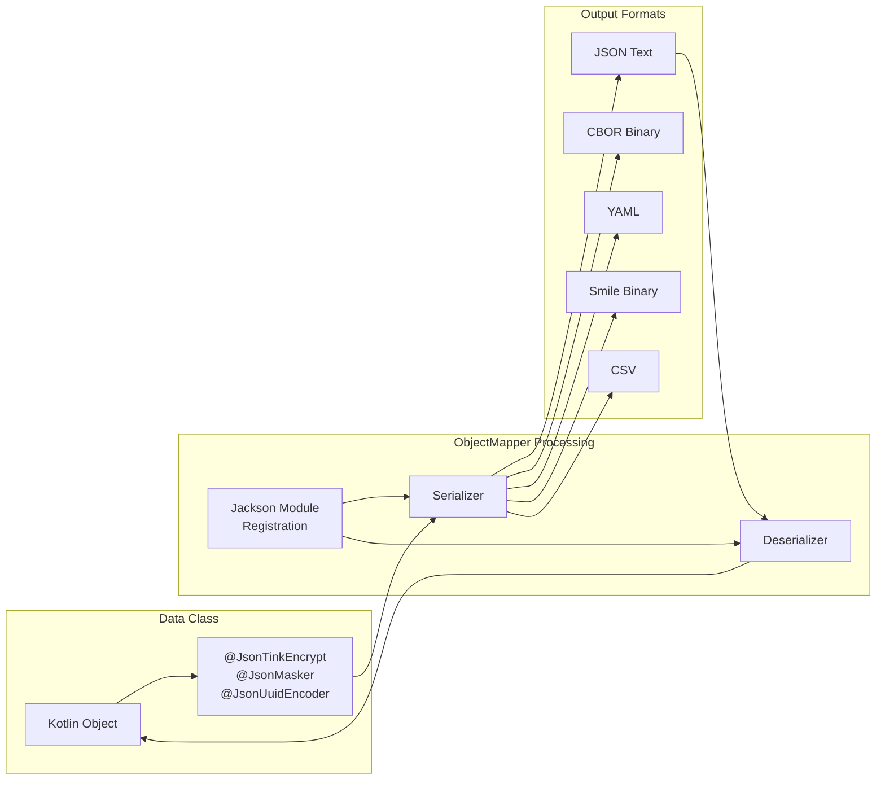
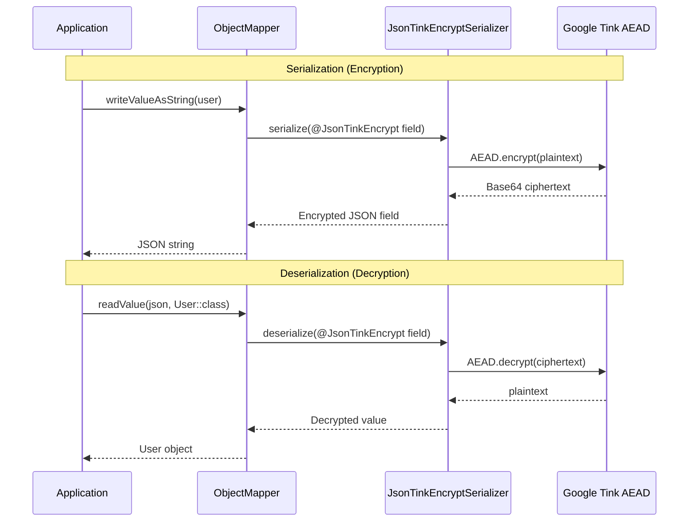

# Module bluetape4k-jackson

English | [한국어](./README.ko.md)

## Overview

`bluetape4k-jackson2` is a module that wraps the [Jackson 2.x](https://github.com/FasterXML/jackson) library with Kotlin DSL and extension functions.

It provides convenient access to the Jackson ecosystem in Kotlin, covering default `JsonMapper` configuration, `ObjectMapper` extensions, async JSON parsing, UUID Base62 encoding, field-level encryption, and field masking.

## Key Features

### 1. JsonMapper DSL

Build a `JsonMapper` concisely using Kotlin DSL.

```kotlin
import io.bluetape4k.jackson.*

// DSL style
val mapper = jsonMapper {
    findAndAddModules()
    enable(JsonReadFeature.ALLOW_TRAILING_COMMA)
    disable(DeserializationFeature.FAIL_ON_UNKNOWN_PROPERTIES)
}

// Pre-configured JsonMapper (includes the Kotlin module)
val defaultMapper = Jackson.defaultJsonMapper

// Pretty-print output
val prettyJson = Jackson.prettyJsonWriter.writeValueAsString(data)
```

### 2. JacksonSerializer

Implements the `JsonSerializer` interface backed by Jackson's `ObjectMapper`.

```kotlin
import io.bluetape4k.jackson.JacksonSerializer

val serializer = JacksonSerializer()

// Byte array serialization / deserialization
val bytes = serializer.serialize(user)
val restored = serializer.deserialize<User>(bytes)

// String serialization / deserialization
val jsonText = serializer.serializeAsString(user)
val restored2 = serializer.deserializeFromString<User>(jsonText)

// Throws JsonSerializationException on failure
try {
    serializer.deserialize<User>("{not-json".toByteArray())
} catch (e: JsonSerializationException) {
    // handle
}
```

`JacksonSerializer` failure policy:

- `serialize(null)` returns an empty `ByteArray`.
- `deserialize(null)` / `deserializeFromString(null)` returns `null`.
- All other serialization / deserialization failures throw `JsonSerializationException`.

### 3. ObjectMapper Extension Functions

Extension functions for safe deserialization from various input sources — returns `null` instead of throwing on failure.

```kotlin
import io.bluetape4k.jackson.*

val mapper = Jackson.defaultJsonMapper

// Deserialize from various sources (null on failure)
val user = mapper.readValueOrNull<User>(jsonString)
val user2 = mapper.readValueOrNull<User>(inputStream)
val user3 = mapper.readValueOrNull<User>(byteArray)
val user4 = mapper.readValueOrNull<User>(file)

// Object conversion
val dto = mapper.convertValueOrNull<UserDto>(entity)

// Serialization extensions
val json = mapper.writeAsString(user)
val bytes = mapper.writeAsBytes(user)
val prettyJson = mapper.prettyWriteAsString(user)
```

### 4. Async JSON Parsing

Streaming JSON parsing powered by Jackson's `NonBlockingJsonParser`.

```kotlin
import io.bluetape4k.jackson.async.*

// Callback-based async parsing
val parser = AsyncJsonParser { root ->
    println("Completed node: $root")
}
parser.consume(chunk1)
parser.consume(chunk2)

// Coroutine-based parsing
val suspendParser = SuspendJsonParser { root ->
    processNode(root)  // suspendable
}
suspendParser.consume(byteArrayFlow)
```

When to use each parser:

- `AsyncJsonParser`: push-style code that receives `ByteArray` chunks via callbacks — Netty, WebSocket, TCP, message listeners, etc.
- `SuspendJsonParser`: `Flow<ByteArray>`-based pipelines where post-processing must be suspendable — `WebClient`, file streams, broker streams, etc.
- Both parsers handle multiple consecutive JSON roots and scalar JSON roots (`"text"`, `123`, `true`, `null`).

### 4-1. WebClient Streaming Example

Consuming a `/stream/3` response from `HttpbinHttp2Server` via `WebClient` and processing three root JSON objects sequentially.

```kotlin
import io.bluetape4k.jackson.async.SuspendJsonParser
import io.bluetape4k.testcontainers.http.HttpbinHttp2Server
import kotlinx.coroutines.reactive.asFlow
import org.springframework.core.io.buffer.DataBuffer
import org.springframework.core.io.buffer.DataBufferUtils
import org.springframework.web.reactive.function.client.WebClient

val httpbin = HttpbinHttp2Server.Launcher.httpbinHttp2
val webClient = WebClient.builder()
    .baseUrl(httpbin.url)
    .build()

val parser = SuspendJsonParser { root ->
    println(root["url"].asText())   // process each JSON object from /stream/3
}

val chunkFlow = webClient.get()
    .uri("/stream/3")
    .retrieve()
    .bodyToFlux(DataBuffer::class.java)
    .map { buffer ->
        try {
            ByteArray(buffer.readableByteCount()).also { buffer.read(it) }
        } finally {
            DataBufferUtils.release(buffer)
        }
    }
    .asFlow()

parser.consume(chunkFlow)
```

If you are already receiving chunks via callbacks in the same scenario, `AsyncJsonParser` is simpler.

### 5. UUID Base62 Encoding

Encodes UUIDs as Base62 strings for compact JSON storage.

```kotlin
import io.bluetape4k.jackson.uuid.JsonUuidEncoder
import io.bluetape4k.jackson.uuid.JsonUuidEncoderType

data class User(
    @field:JsonUuidEncoder                              // Base62 (default)
    val userId: UUID,
    @field:JsonUuidEncoder(JsonUuidEncoderType.PLAIN)   // original UUID
    val plainId: UUID,
)

// Serialized output:
// { "userId": "6gVuscij1cec8CelrpHU5h", "plainId": "413684f2-..." }
```

### 6. Field Encryption (@JsonEncrypt / @JsonTinkEncrypt)

Automatically encrypts and decrypts sensitive fields during JSON serialization.

#### Jasypt-based (`@JsonEncrypt`) — Deprecated

```kotlin
import io.bluetape4k.jackson.crypto.JsonEncrypt

data class User(
    val username: String,
    @field:JsonEncrypt          // AES encryption via Jasypt
    val password: String,
)

// Serialized: { "username": "debop", "password": "N1E79rV_n0d0eaZ..." }
// Automatically decrypted on deserialization
```

#### Google Tink-based (`@JsonTinkEncrypt`) — Recommended

Requires the `bluetape4k-tink` dependency. No module registration needed — just annotate the field.

```kotlin
import io.bluetape4k.jackson.crypto.JsonTinkEncrypt
import io.bluetape4k.jackson.crypto.TinkEncryptAlgorithm

data class User(
    val username: String,
    @get:JsonTinkEncrypt                                               // AES256-GCM (default)
    val password: String,
    @get:JsonTinkEncrypt(TinkEncryptAlgorithm.DETERMINISTIC_AES256_SIV) // deterministic encryption for DB search
    val mobile: String,
)

// Serialized: { "username": "debop", "password": "AXYzK1...", "mobile": "BVp0..." }
// Automatically decrypted on deserialization
```

Supported algorithms:

| `TinkEncryptAlgorithm` | Description |
|------------------------|-------------|
| `AES256_GCM` | AES256-GCM non-deterministic — general purpose, default |
| `AES128_GCM` | AES128-GCM non-deterministic — performance-focused |
| `CHACHA20_POLY1305` | ChaCha20-Poly1305 — for environments without hardware AES acceleration |
| `XCHACHA20_POLY1305` | XChaCha20-Poly1305 — large nonce (192-bit) |
| `DETERMINISTIC_AES256_SIV` | AES256-SIV deterministic — searchable in DB |

### 7. Field Masking (@JsonMasker)

Masks sensitive values during JSON serialization.

```kotlin
import io.bluetape4k.jackson.mask.JsonMasker

data class User(
    val name: String,
    @field:JsonMasker("***")    // custom masking string
    val mobile: String,
)

// Serialized: { "name": "debop", "mobile": "***" }
```

### 8. JsonNode Extension Functions

DSL-style extension functions for adding values to `JsonNode`.

```kotlin
import io.bluetape4k.jackson.*

val objectNode = Jackson.defaultJsonMapper.createObjectNode()
objectNode.addString("name", "name")
objectNode.addInt(42, "age")
objectNode.addBoolean(true, "active")
objectNode.addNull("description")
```

## Binary / Text Format Support

> The former `bluetape4k-jackson-binary` and `bluetape4k-jackson-text` modules have been merged into this module.

Binary and text formats are declared as `compileOnly` dependencies, so you must add the desired format's dependency at runtime.

| Format | Type | Runtime Dependency |
|--------|------|--------------------|
| CBOR | Binary | `jackson-dataformat-cbor` |
| Ion | Binary | `jackson-dataformat-ion` |
| Smile | Binary | `jackson-dataformat-smile` |
| Avro | Binary | `jackson-dataformat-avro` |
| Protobuf | Binary | `jackson-dataformat-protobuf` |
| YAML | Text | `jackson-dataformat-yaml` |
| CSV | Text | `jackson-dataformat-csv` |
| TOML | Text | `jackson-dataformat-toml` |
| Properties | Text | `jackson-dataformat-properties` |

### CBOR Serialization Example

```kotlin
import com.fasterxml.jackson.dataformat.cbor.CBORFactory
import com.fasterxml.jackson.databind.ObjectMapper

val cborMapper = ObjectMapper(CBORFactory())
val bytes = cborMapper.writeValueAsBytes(user)      // binary serialization
val restored = cborMapper.readValue<User>(bytes)    // deserialization
```

### YAML Serialization Example

```kotlin
import com.fasterxml.jackson.dataformat.yaml.YAMLFactory
import com.fasterxml.jackson.databind.ObjectMapper

val yamlMapper = ObjectMapper(YAMLFactory())
val yaml = yamlMapper.writeValueAsString(user)      // YAML serialization
val restored = yamlMapper.readValue<User>(yaml)     // deserialization
```

## Architecture Diagrams

### Class Structure



### Jackson Serialization Pipeline



### Field Encryption Flow (@JsonTinkEncrypt)



## Dependencies

```kotlin
dependencies {
    implementation(project(":bluetape4k-jackson2"))

    // Binary formats (add only what you need)
    implementation("com.fasterxml.jackson.dataformat:jackson-dataformat-cbor")
    implementation("com.fasterxml.jackson.dataformat:jackson-dataformat-smile")

    // Text formats (add only what you need)
    implementation("com.fasterxml.jackson.dataformat:jackson-dataformat-yaml")
    implementation("com.fasterxml.jackson.dataformat:jackson-dataformat-csv")
    implementation("com.fasterxml.jackson.dataformat:jackson-dataformat-toml")

    // Encryption (optional)
    implementation(project(":bluetape4k-crypto"))  // for @JsonEncrypt (Jasypt)
    implementation(project(":bluetape4k-tink"))    // for @JsonTinkEncrypt (Google Tink)
}
```

## Module Structure

```
io.bluetape4k.jackson
├── Jackson.kt                    # Default JsonMapper singleton
├── JacksonSerializer.kt          # JsonSerializer implementation
├── JsonMapperSupport.kt          # ObjectMapper extension functions
├── JsonNodeExtensions.kt         # JsonNode extension functions
├── JsonGeneratorExtensions.kt    # JsonGenerator extension functions
├── async/                        # Async JSON parsing
│   ├── AsyncJsonParser.kt        # Callback-based async parser
│   └── SuspendJsonParser.kt      # Coroutine-based parser
├── crypto/                           # Field encryption
│   ├── JsonEncrypt.kt                # @JsonEncrypt annotation (Jasypt, Deprecated)
│   ├── JsonEncryptSerializer.kt      # Encryption serializer
│   ├── JsonEncryptDeserializer.kt    # Decryption deserializer
│   ├── JsonEncryptors.kt             # Encryptor cache management
│   ├── TinkEncryptAlgorithm.kt       # Tink algorithm enum
│   ├── JsonTinkEncrypt.kt            # @JsonTinkEncrypt annotation (Google Tink)
│   ├── JsonTinkEncryptSerializer.kt  # Tink encryption serializer
│   └── JsonTinkEncryptDeserializer.kt # Tink decryption deserializer
├── mask/                         # Field masking
│   ├── JsonMasker.kt             # @JsonMasker annotation
│   └── JsonMaskerSerializer.kt   # Masking serializer
└── uuid/                         # UUID encoding
    ├── JsonUuidEncoder.kt        # @JsonUuidEncoder annotation
    ├── JsonUuidEncoderType.kt    # BASE62 / PLAIN enum
    ├── JsonUuidModule.kt         # Jackson Module registration
    ├── JsonUuidBase62Serializer.kt   # UUID → Base62 serializer
    ├── JsonUuidBase62Deserializer.kt # Base62 → UUID deserializer
    └── JsonUuidEncoderAnnotationInterospector.kt
```

## Testing

```bash
./gradlew :bluetape4k-jackson2:test
```

## References

- [Jackson](https://github.com/FasterXML/jackson)
- [Jackson Kotlin Module](https://github.com/FasterXML/jackson-module-kotlin)
- [Url62 (Base62)](https://github.com/nicksrandall/url62)
