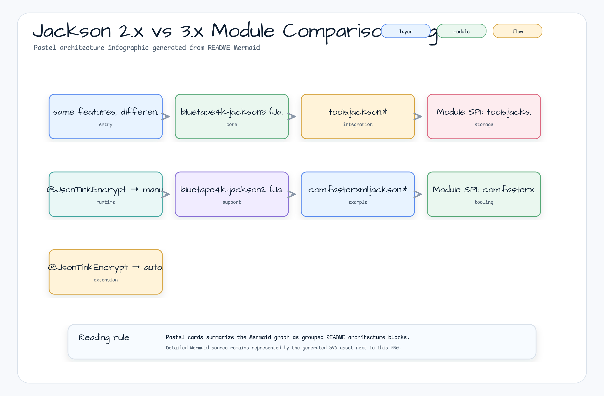
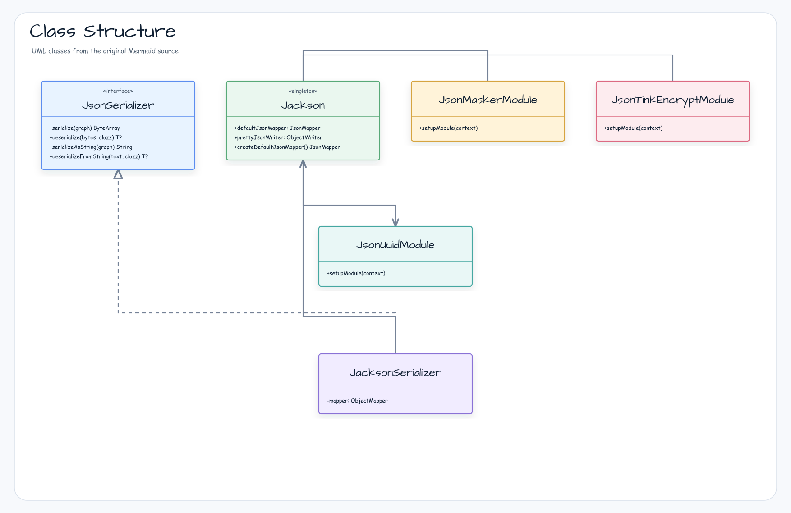
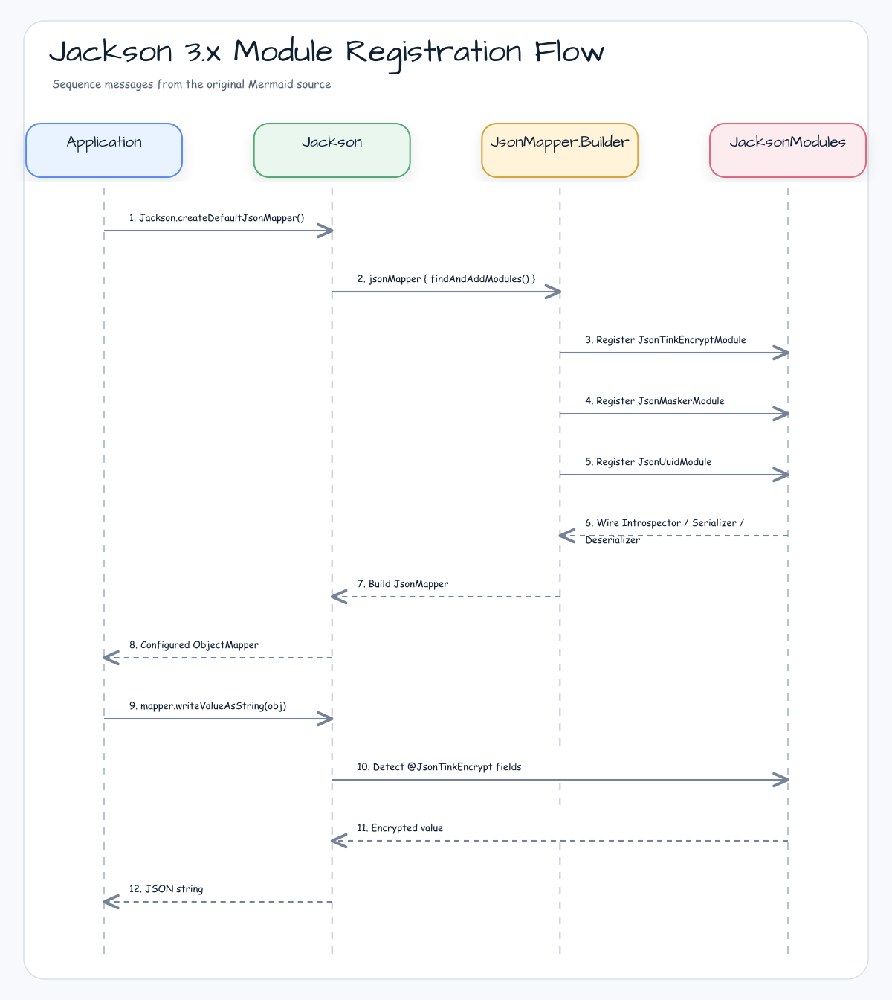

# Module bluetape4k-jackson3

English | [한국어](./README.ko.md)

## Overview

`bluetape4k-jackson3` is a module that wraps the [Jackson 3.x](https://github.com/FasterXML/jackson) library with Kotlin DSL and extension functions.

It provides the same feature set as Jackson 2.x (
`bluetape4k-jackson2`), while following the new Jackson 3.x API and package structure (`tools.jackson.*`).

## Why Jackson3 in bluetape4k

- Kotlin-first mapper setup: `jsonMapper { }` and `Jackson.defaultJsonMapper` keep Kotlin module defaults in one place.
- Safer extension functions: `readValueOrNull`, `writeAsString`, and `writeAsBytes` make common serialization paths concise.
- Streaming-ready parsing: callback and coroutine parsers process root JSON nodes without buffering a whole response first.
- Security extensions: Tink-backed field encryption and field masking can be attached to Jackson models through annotations.
- Format flexibility: binary/text format modules are compile-only here, so applications can add only the runtime formats they use.

## Architecture Diagrams

### Jackson 2.x vs 3.x Module Comparison



### Class Structure



### Jackson 3.x Module Registration Flow



## Recommended Usage Scenarios

- Prefer this module for new Kotlin code that already targets Jackson 3.x and `tools.jackson.*` packages.
- Use `JacksonSerializer` for bluetape4k serializer contracts, cache payloads, and simple byte/string JSON conversion.
- Use ObjectMapper extensions when failure-as-null is acceptable and the caller can distinguish missing data from invalid data.
- Use `AsyncJsonParser` for callback-style chunk feeds such as Netty, WebSocket, TCP, and message listeners.
- Use `SuspendJsonParser.consumeComplete(flow)` when a finite `Flow<ByteArray>` represents one complete logical stream.
- Use `@JsonTinkEncrypt` only for string fields that must be protected inside serialized JSON documents.

## Anti-Patterns

- Do not copy Jackson 2.x imports into this module. Jackson 3.x APIs live under `tools.jackson.*`, except annotations that still come from `com.fasterxml.jackson.annotation`.
- Do not rely on removed `activateDefaultTyping()` behavior. Prefer explicit polymorphic models or sealed hierarchies.
- Do not use `readValueOrNull` when invalid JSON must be audited or surfaced to callers; use throwing Jackson APIs instead.
- Do not finish a network/file stream without calling `endOfInput()` or `consumeComplete(...)`; otherwise a truncated final JSON token may look like "waiting for more input."
- Do not treat `consume(flow)` completion as EOF. It is an incremental feed API for callers that may append more chunks later.

## Jackson 2.x vs 3.x

| Item             | Jackson 2.x                             | Jackson 3.x                               |
|------------------|-----------------------------------------|-------------------------------------------|
| Package          | `com.fasterxml.jackson.*`               | `tools.jackson.*`                         |
| Module           | bluetape4k-jackson2                     | bluetape4k-jackson3                       |
| Module SPI       | `com.fasterxml.jackson.databind.Module` | `tools.jackson.databind.JacksonModule`    |
| Type info        | `activateDefaultTyping()` supported     | Removed                                   |
| JsonMapper build | `JsonMapper.builder()`                  | `jsonMapper { }` (kotlin module built-in) |

## Key Features

### 1. JsonMapper DSL

```kotlin
import io.bluetape4k.jackson3.*

// DSL style
val mapper = jsonMapper {
    findAndAddModules()
    enable(JsonReadFeature.ALLOW_TRAILING_COMMA)
    disable(DeserializationFeature.FAIL_ON_UNKNOWN_PROPERTIES)
}

// Pre-configured JsonMapper (includes the Kotlin module)
val defaultMapper = Jackson.defaultJsonMapper

// Pretty-print output
val prettyJson = Jackson.prettyJsonWriter.writeValueAsString(data)
```

### 2. JacksonSerializer

```kotlin
import io.bluetape4k.jackson3.JacksonSerializer

val serializer = JacksonSerializer()

// Byte array serialization / deserialization
val bytes = serializer.serialize(user)
val restored = serializer.deserialize<User>(bytes)

// String serialization / deserialization
val jsonText = serializer.serializeAsString(user)
val restored2 = serializer.deserializeFromString<User>(jsonText)

// Throws JsonSerializationException on failure
try {
    serializer.deserialize<User>("{not-json".toByteArray())
} catch (e: JsonSerializationException) {
    // handle
}
```

`JacksonSerializer` failure policy:

- `serialize(null)` returns an empty `ByteArray`.
- `deserialize(null)` / `deserializeFromString(null)` returns `null`.
- Ordinary backend serialization / deserialization failures throw `JsonSerializationException`.

#### ByteBuffer contract

`serializeTo` streams through the configured mapper into the caller-owned buffer, and `deserializeFrom`
reads a duplicate view. These Jackson-specific overrides bypass the compatibility `serialize(): ByteArray`
and `deserialize(ByteArray)` methods. They are optimized dispatch cells only; allocation improvement remains unclaimed until it is measured. Heap, direct, sliced, and read-only input are supported. Input state is preserved; output position advances only on success. A read-only target and insufficient capacity expose raw `ReadOnlyBufferException` and
`BufferOverflowException`, and a failed output call restores its original position. Bytes written before failure are unspecified; clear or overwrite them before retry when the surrounding protocol requires it. Fatal `Error` instances retain their identity instead of being wrapped. Set a bounded limit before passing untrusted input; the serializer cannot read outside the remaining range.

```kotlin
import io.bluetape4k.jackson3.*
import io.bluetape4k.json.JsonSerializer
import io.bluetape4k.json.deserialize as deserializeRaw
import java.nio.ByteBuffer

run {
    val buffer = ByteBuffer.allocate(4096)
    serializer.serializeTo(users, buffer)
    buffer.flip()
    val restored = serializer.deserialize<List<User>>(buffer)
}
run {
    val buffer = ByteBuffer.wrap(serializer.serialize(usersByName))
    val restored = serializer.deserialize<Map<String, User>>(buffer)
}

val contract: JsonSerializer = serializer
val buffer = ByteBuffer.wrap(serializer.serialize(users))
val rawUsers: List<*>? = contract.deserializeRaw<List<User>>(buffer)
```

The concrete `JacksonSerializer` extension retains generic type-reference information. A receiver statically typed as `JsonSerializer` uses the compatibility class-token contract, so collection elements remain raw maps. The same buffer override is inherited by YAML, Properties, CSV, TOML, CBOR, Ion, and Smile. Jackson 3 does not enable removed default typing, and no broader zero-allocation claim is made for internals. For untrusted polymorphic input, prefer `JsonTypeInfo.Id.NAME` with an explicit subtype list instead of class-name IDs.

```java
ByteBuffer buffer = ByteBuffer.wrap(bytes);
User restored = serializer.deserializeFrom(buffer, User.class);
```

### 3. ObjectMapper Extension Functions

```kotlin
import io.bluetape4k.jackson3.*

val mapper = Jackson.defaultJsonMapper

// Deserialize from various sources (null on failure)
val user = mapper.readValueOrNull<User>(jsonString)
val user2 = mapper.readValueOrNull<User>(inputStream)
val user3 = mapper.readValueOrNull<User>(byteArray)
val user4 = mapper.readValueOrNull<User>(file)
val user5 = mapper.readValueOrNull<User>(path)  // Path support

// Serialization extensions
val json = mapper.writeAsString(user)
val bytes = mapper.writeAsBytes(user)
val prettyJson = mapper.prettyWriteAsString(user)

// Retrieve registered module names
val moduleNames = mapper.registeredModuleNames()
```

### 4. Async JSON Parsing

```kotlin
import io.bluetape4k.jackson3.async.*

// Callback-based async parsing
val parser = AsyncJsonParser { root ->
    println("Completed node: $root")
}
parser.consume(chunk1)
parser.consume(chunk2)
parser.endOfInput()

// Coroutine-based parsing
val suspendParser = SuspendJsonParser { root ->
    processNode(root)  // suspendable
}
suspendParser.consumeComplete(byteArrayFlow)
```

When to use each parser:

- `AsyncJsonParser`: push-style code that receives
  `ByteArray` chunks via callbacks — Netty, WebSocket, TCP, message listeners, etc.
- `SuspendJsonParser`: `Flow<ByteArray>`-based pipelines where post-processing must be suspendable —
  `WebClient`, file streams, broker streams, etc.
- Both parsers handle multiple consecutive JSON roots and scalar JSON roots (`"text"`, `123`, `true`, `null`).
- Call `endOfInput()` when a callback stream ends, or use `consumeComplete(flow)` for a finite Flow. Jackson needs that EOF signal to report truncated final JSON.

### 4-1. WebClient Streaming Example

Consuming a `/stream/3` response from `HttpbinHttp2Server` via
`WebClient` and processing three root JSON objects sequentially.

```kotlin
import io.bluetape4k.jackson3.async.SuspendJsonParser
import io.bluetape4k.testcontainers.http.HttpbinHttp2Server
import kotlinx.coroutines.reactive.asFlow
import org.springframework.core.io.buffer.DataBuffer
import org.springframework.core.io.buffer.DataBufferUtils
import org.springframework.web.reactive.function.client.WebClient

val httpbin = HttpbinHttp2Server.Launcher.httpbinHttp2
val webClient = WebClient.builder()
    .baseUrl(httpbin.url)
    .build()

val parser = SuspendJsonParser { root ->
    println(root["url"].asText())   // process each JSON object from /stream/3
}

val chunkFlow = webClient.get()
    .uri("/stream/3")
    .retrieve()
    .bodyToFlux(DataBuffer::class.java)
    .map { buffer ->
        try {
            ByteArray(buffer.readableByteCount()).also { buffer.read(it) }
        } finally {
            DataBufferUtils.release(buffer)
        }
    }
    .asFlow()

parser.consumeComplete(chunkFlow)
```

If you are already receiving chunks via callbacks, `AsyncJsonParser` is more natural for the same scenario.

### 5. UUID Base62 Encoding

```kotlin
import io.bluetape4k.jackson3.uuid.JsonUuidEncoder
import io.bluetape4k.jackson3.uuid.JsonUuidEncoderType

data class User(
    @field:JsonUuidEncoder                              // Base62 (default)
    val userId: UUID,
    @field:JsonUuidEncoder(JsonUuidEncoderType.PLAIN)   // original UUID
    val plainId: UUID,
)
```

### 6. Field Encryption (@JsonTinkEncrypt)

Requires the `bluetape4k-tink` dependency and explicit registration of `JsonTinkEncryptModule`.

```kotlin
import io.bluetape4k.jackson3.crypto.JsonTinkEncrypt
import io.bluetape4k.jackson3.crypto.JsonTinkEncryptModule
import io.bluetape4k.jackson3.crypto.TinkEncryptAlgorithm

data class User(
    val username: String,
    @get:JsonTinkEncrypt                                               // AES256-GCM (default)
    val password: String,
    @get:JsonTinkEncrypt(TinkEncryptAlgorithm.DETERMINISTIC_AES256_SIV) // deterministic within this JVM keyset
    val mobile: String,
)

// JsonTinkEncryptModule must be registered
val mapper = Jackson.createDefaultJsonMapper().rebuild()
    .addModule(JsonTinkEncryptModule())
    .build()

// Serialized: { "username": "debop", "password": "AXYzK1...", "mobile": "BVp0..." }
// Automatically decrypted on deserialization
```

`@JsonTinkEncrypt` uses `TinkEncryptors` singleton instances, whose keysets are generated in memory for the current JVM process. Do not use this annotation for durable encrypted database columns or searchable indexes that must survive restart, rollout, or multi-instance access. For durable searchable storage, use `bluetape4k-tink` versioned keyset APIs such as `TinkDaeads.versioned(store)` with a protected `VersionedKeysetStore`.

Supported algorithms:

| `TinkEncryptAlgorithm`     | Description                                                            |
|----------------------------|------------------------------------------------------------------------|
| `AES256_GCM`               | AES256-GCM non-deterministic — general purpose, default                |
| `AES128_GCM`               | AES128-GCM non-deterministic — performance-focused                     |
| `CHACHA20_POLY1305`        | ChaCha20-Poly1305 — for environments without hardware AES acceleration |
| `XCHACHA20_POLY1305`       | XChaCha20-Poly1305 — large nonce (192-bit)                             |
| `DETERMINISTIC_AES256_SIV` | AES256-SIV deterministic — process-local equality only                 |

### 7. Field Masking (@JsonMasker)

```kotlin
import io.bluetape4k.jackson3.mask.JsonMasker

data class User(
    val name: String,
    @field:JsonMasker("***")    // custom masking string
    val mobile: String,
)
```

In Jackson 3.x, `JsonMaskerAnnotationInterospector` is automatically registered via `JsonMaskerModule`.

### 8. JsonNode Extension Functions

```kotlin
import io.bluetape4k.jackson3.*

val objectNode = Jackson.defaultJsonMapper.createObjectNode()
objectNode.addString("name", "name")
objectNode.addInt(42, "age")
objectNode.addBoolean(true, "active")
objectNode.addNull("description")
```

## Binary / Text Format Support

> The former `bluetape4k-jackson3-binary` and `bluetape4k-jackson3-text` modules have been merged into this module.

Binary and text formats are declared as
`compileOnly` dependencies, so you must add the desired format's dependency at runtime.

| Format     | Type   | Runtime Dependency               |
|------------|--------|----------------------------------|
| CBOR       | Binary | `jackson3-dataformat-cbor`       |
| Ion        | Binary | `jackson3-dataformat-ion`        |
| Smile      | Binary | `jackson3-dataformat-smile`      |
| Avro       | Binary | `jackson3-dataformat-avro`       |
| Protobuf   | Binary | `jackson3-dataformat-protobuf`   |
| YAML       | Text   | `jackson3-dataformat-yaml`       |
| CSV        | Text   | `jackson3-dataformat-csv`        |
| TOML       | Text   | `jackson3-dataformat-toml`       |
| Properties | Text   | `jackson3-dataformat-properties` |

### CBOR Serialization Example

```kotlin
import tools.jackson.dataformat.cbor.CBORFactory
import tools.jackson.databind.ObjectMapper

val cborMapper = ObjectMapper(CBORFactory())
val bytes = cborMapper.writeValueAsBytes(user)      // binary serialization
val restored = cborMapper.readValue<User>(bytes)    // deserialization
```

### YAML Serialization Example

```kotlin
import tools.jackson.dataformat.yaml.YAMLFactory
import tools.jackson.databind.ObjectMapper

val yamlMapper = ObjectMapper(YAMLFactory())
val yaml = yamlMapper.writeValueAsString(user)      // YAML serialization
val restored = yamlMapper.readValue<User>(yaml)     // deserialization
```

## Dependencies

```kotlin
dependencies {
    implementation("io.github.bluetape4k:bluetape4k-jackson3:${bluetape4kVersion}")

    // Binary formats (add only what you need)
    implementation("tools.jackson.dataformat:jackson-dataformat-cbor3")
    implementation("tools.jackson.dataformat:jackson-dataformat-smile3")

    // Text formats (add only what you need)
    implementation("tools.jackson.dataformat:jackson-dataformat-yaml3")
    implementation("tools.jackson.dataformat:jackson-dataformat-csv3")
    implementation("tools.jackson.dataformat:jackson-dataformat-toml3")

    // Encryption (optional, for @JsonTinkEncrypt)
    implementation("io.github.bluetape4k:bluetape4k-tink:${bluetape4kVersion}")
}
```

## Module Structure

```
io.bluetape4k.jackson3
├── Jackson.kt                    # Default JsonMapper singleton
├── JacksonSerializer.kt          # JsonSerializer implementation
├── JsonMapperSupport.kt          # ObjectMapper extension functions
├── JsonNodeExtensions.kt         # JsonNode extension functions
├── JsonGeneratorExtensions.kt    # JsonGenerator extension functions
├── async/                        # Async JSON parsing
│   ├── AsyncJsonParser.kt        # Callback-based async parser
│   └── SuspendJsonParser.kt      # Coroutine-based parser
├── crypto/                                       # Field encryption
│   ├── TinkEncryptAlgorithm.kt                   # Tink algorithm enum
│   ├── JsonTinkEncrypt.kt                        # @JsonTinkEncrypt annotation (Google Tink)
│   ├── JsonTinkEncryptModule.kt                  # Tink Module registration
│   ├── JsonTinkEncryptAnnotationIntrospector.kt  # Tink Introspector
│   ├── JsonTinkEncryptSerializer.kt              # Tink encryption serializer
│   └── JsonTinkEncryptDeserializer.kt            # Tink decryption deserializer
├── mask/                         # Field masking
│   ├── JsonMasker.kt             # @JsonMasker annotation
│   ├── JsonMaskerModule.kt       # Jackson 3.x Module registration
│   ├── JsonMaskerAnnotationInterospector.kt
│   └── JsonMaskerSerializer.kt   # Masking serializer
└── uuid/                         # UUID encoding
    ├── JsonUuidEncoder.kt        # @JsonUuidEncoder annotation
    ├── JsonUuidEncoderType.kt    # BASE62 / PLAIN enum
    ├── JsonUuidModule.kt         # Jackson 3.x Module registration
    ├── JsonUuidBase62Serializer.kt   # UUID → Base62 serializer
    ├── JsonUuidBase62Deserializer.kt # Base62 → UUID deserializer
    └── JsonUuidEncoderAnnotationInterospector.kt
```

## Testing

```bash
./gradlew :bluetape4k-jackson3:test
```

## References

### ByteBuffer allocation evidence

The [issue #1039 report](../../docs/benchmarks/2026-07-18-bytebuffer-serializer-allocation.md) accepted lower allocation for Jackson 3 `serializeTo`; `deserializeFrom` was inconclusive. Interface-default compatibility remains ergonomic-only.

| Path                       | Status                  | Limitation                           |
|----------------------------|-------------------------|--------------------------------------|
| concrete `serializeTo`     | optimized; accepted     | measured payload/default mapper only |
| concrete `deserializeFrom` | optimized; inconclusive | no allocation-reduction claim        |
| interface default          | compatibility fallback  | ergonomic-only                       |

Kotlin calls `serializeTo`/reified `deserializeFrom`; Java supplies the target class to the same API. Caller-owned targets must be writable and have sufficient remaining capacity. Success advances output `position` without widening `limit`; overflow/read-only failure rolls back. Duplicate-backed input preserves source `position` and `limit`.

### Caller-owned `OutputStream` API

`JacksonSerializer.serializeJsonToStream` writes through the configured mapper without first materializing JSON as a
`ByteArray`; the interface default remains an allocating compatibility fallback. The stream is borrowed only for the synchronous call and is never retained, closed, or flushed by the serializer. Keep the call and destination thread-confined. Stage the output and discard it on failure because partial JSON may remain.

```kotlin
val serializer = JacksonSerializer()
val staging = ByteArrayOutputStream()
val json = try {
    serializer.serializeJsonToStream(value, staging)
    staging.toByteArray()
} catch (e: IOException) {
    staging.reset()
    throw e
} finally {
    staging.close()
}
```

```java
static byte[] encode(JacksonSerializer serializer, Object value) throws IOException {
    ByteArrayOutputStream staging = new ByteArrayOutputStream();
    try (staging) {
        serializer.serializeJsonToStream(value, staging);
        return staging.toByteArray();
    } catch (IOException failure) {
        staging.reset();
        throw failure;
    }
}
```

`deserializeFrom` supports Lettuce's read-only, non-array-backed bounded view while preserving caller state. The
[issue #756 report](../../docs/benchmarks/2026-07-22-issue-756-lettuce-buffer-codec-allocation.md) classified Jackson 3 heap/direct Lettuce cells as inconclusive: retain the ergonomic direct path, but make no allocation-reduction claim. The result is limited to the measured payload/default mapper, pooled pre-sized 512-byte reusable targets, and no growth.

- [Jackson 3.x](https://github.com/FasterXML/jackson)
- [Jackson 3.x Release Notes](https://github.com/FasterXML/jackson/wiki/Jackson-Release-3.0)
- [Jackson Kotlin Module](https://github.com/FasterXML/jackson-module-kotlin)
