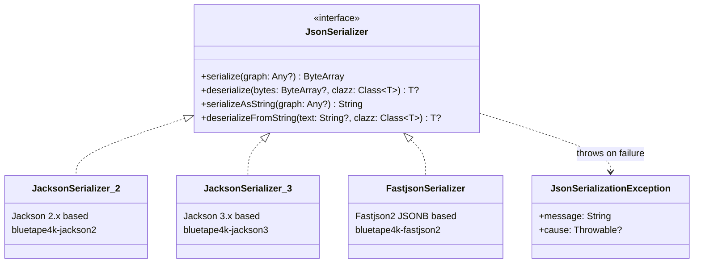
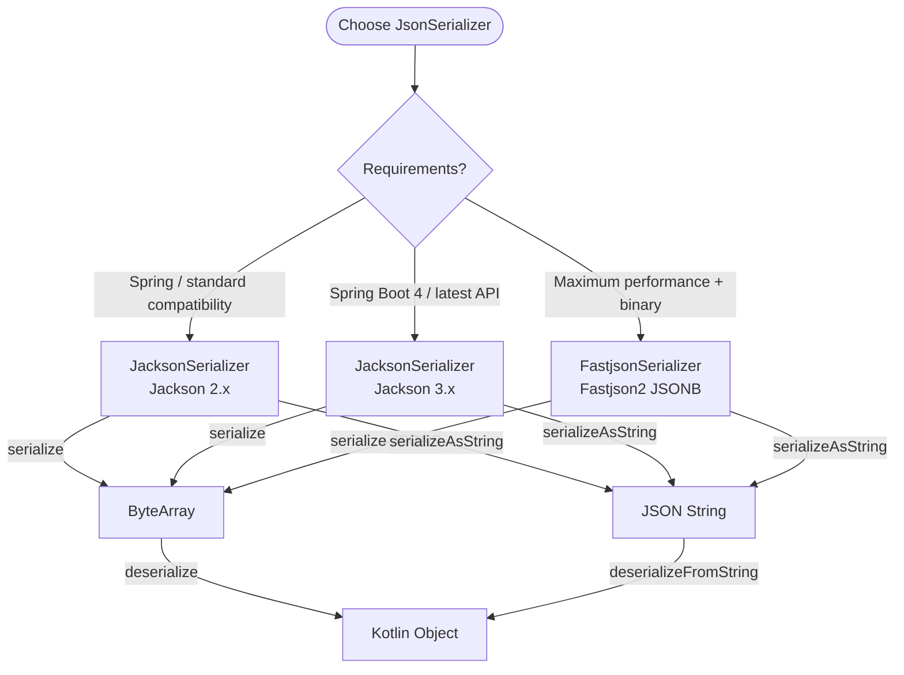

# Module bluetape4k-json

English | [한국어](./README.ko.md)

## Overview

`bluetape4k-json` is a module that defines a common interface for JSON serialization and deserialization.

It provides the `JsonSerializer` interface so that various JSON libraries (Jackson, Fastjson2, etc.) can be used through a single API, along with convenience extension functions that leverage Kotlin's reified types.

## Architecture

### JsonSerializer Interface and Implementations



### Implementation Selection Flow



## Key Features

### JsonSerializer Interface

A common interface that all JSON serialization implementations must conform to.

### Supported Methods

| Method                               | Description                                      |
|--------------------------------------|--------------------------------------------------|
| `serialize(graph)`                   | Serializes an object to a JSON `ByteArray`       |
| `deserialize(bytes, clazz)`          | Deserializes a `ByteArray` to the specified type |
| `serializeAsString(graph)`           | Serializes an object to a JSON string            |
| `deserializeFromString(text, clazz)` | Deserializes a JSON string to the specified type |

### Failure Policy

- `serialize(null)` returns an empty `ByteArray`.
- `deserialize(null)` / `deserializeFromString(null)` returns `null`.
- All other serialization / deserialization failures throw `JsonSerializationException`.

### Kotlin Reified Extension Functions

Deserialize without specifying a class parameter — the type is inferred automatically.

## Implementations

| Implementation       | Module               | Underlying Library |
|----------------------|----------------------|--------------------|
| `JacksonSerializer`  | bluetape4k-jackson2  | Jackson 2.x        |
| `JacksonSerializer`  | bluetape4k-jackson3  | Jackson 3.x        |
| `FastjsonSerializer` | bluetape4k-fastjson2 | Fastjson2 (JSONB)  |

## Usage Examples

```kotlin
import io.bluetape4k.json.JsonSerializer
import io.bluetape4k.json.deserialize
import io.bluetape4k.json.deserializeFromString

val serializer: JsonSerializer = JacksonSerializer() // or FastjsonSerializer()

// Byte array serialization / deserialization
val bytes = serializer.serialize(data)
val restored = serializer.deserialize<Data>(bytes)

// String serialization / deserialization
val jsonText = serializer.serializeAsString(data)
val restored2 = serializer.deserializeFromString<Data>(jsonText)

// No Class parameter needed — type inferred automatically
val user = serializer.deserialize<User>(bytes)
val user2 = serializer.deserializeFromString<User>(jsonText)
```

## Module Structure

```
io.bluetape4k.json
└── JsonSerializer.kt    # Common interface and reified extension functions
```

## Dependencies

```kotlin
dependencies {
    implementation(project(":bluetape4k-json"))
}
```

## References

- [Jakarta JSON Processing](https://jakarta.ee/specifications/jsonp/)
- [Jackson](https://github.com/FasterXML/jackson)
- [Fastjson2](https://github.com/alibaba/fastjson2)
