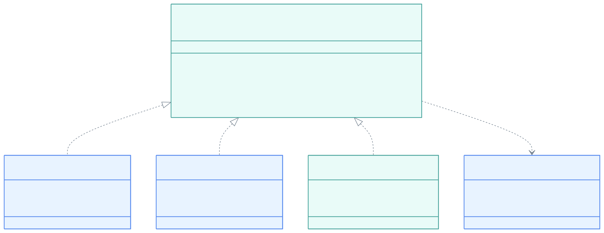
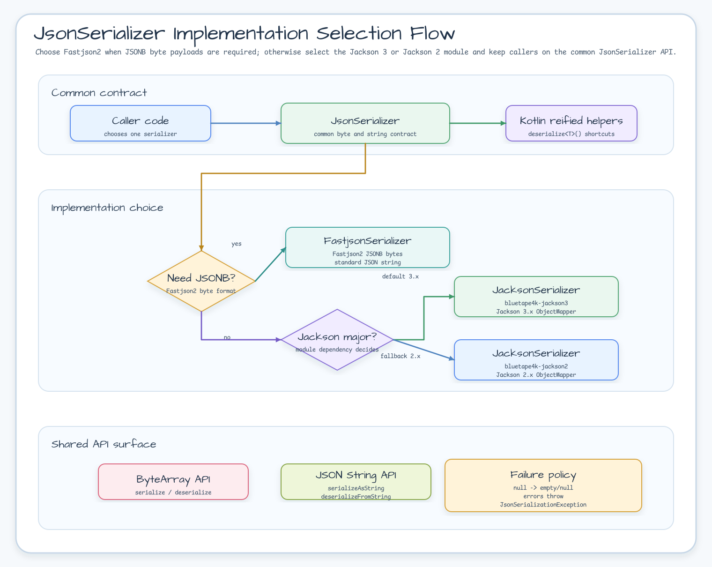

# Module bluetape4k-json

English | [한국어](./README.ko.md)

## Overview

`bluetape4k-json` defines the small JSON serialization SPI shared by the
Jackson 2, Jackson 3, and Fastjson2 modules.

The module does not discover or select a JSON backend at runtime. Application
code wires a concrete serializer, keeps callers typed as `JsonSerializer`, and
uses the same byte, string, and Kotlin reified helper contracts across
implementations.

## Architecture

### JsonSerializer Class Structure



### Serializer Call Flow



## Key Features

### JsonSerializer SPI

The shared interface requires the `ByteArray` based `serialize` and
`deserialize` operations. String methods are default facade methods unless a
serializer overrides them, and Kotlin reified extensions pass `T::class.java`
for callers.

### Supported Methods

| Method                               | Contract                                              |
|--------------------------------------|-------------------------------------------------------|
| `serialize(graph)`                   | Serializes an object to backend-owned JSON bytes      |
| `deserialize(bytes, clazz)`          | Deserializes bytes to the requested JVM class         |
| `serializeAsString(graph)`           | Default path converts `serialize(graph)` to UTF-8 text |
| `deserializeFromString(text, clazz)` | Default path converts UTF-8 text and delegates to bytes |

### Failure Policy

- `serializeAsString(null)` returns an empty string in the default interface method.
- `deserializeFromString(null)` returns `null` in the default interface method.
- Jackson 2, Jackson 3, and Fastjson2 serializers return an empty `ByteArray` for `serialize(null)`.
- Deserialization failures are wrapped in `JsonSerializationException`.

### Kotlin Reified Extension Functions

Deserialize without passing a `Class<T>` argument at the call site:
`deserialize<T>(bytes)` and `deserializeFromString<T>(text)` delegate to the
same interface methods with `T::class.java`.

## Implementations

| Implementation       | Module               | Backend contract                          |
|----------------------|----------------------|-------------------------------------------|
| `JacksonSerializer`  | bluetape4k-jackson2  | Jackson 2 `ObjectMapper` byte/text JSON   |
| `JacksonSerializer`  | bluetape4k-jackson3  | Jackson 3 `ObjectMapper` byte/text JSON   |
| `FastjsonSerializer` | bluetape4k-fastjson2 | JSONB bytes plus explicit JSON text paths |

## Usage Examples

```kotlin
import io.bluetape4k.json.JsonSerializer
import io.bluetape4k.json.deserialize
import io.bluetape4k.json.deserializeFromString
import io.bluetape4k.jackson.JacksonSerializer
// or io.bluetape4k.fastjson2.FastjsonSerializer

val serializer: JsonSerializer = JacksonSerializer() // or FastjsonSerializer()

// Byte array serialization / deserialization
val bytes = serializer.serialize(data)
val restored = serializer.deserialize<Data>(bytes)

// String serialization / deserialization
val jsonText = serializer.serializeAsString(data)
val restored2 = serializer.deserializeFromString<Data>(jsonText)

// No Class parameter needed at the call site
val user = serializer.deserialize<User>(bytes)
val user2 = serializer.deserializeFromString<User>(jsonText)
```

## Module Structure

```
io.bluetape4k.json
└── JsonSerializer.kt    # Common interface and reified extension functions
```

## Dependencies

```kotlin
dependencies {
    implementation(project(":bluetape4k-json"))
}
```

## References

- [Jakarta JSON Processing](https://jakarta.ee/specifications/jsonp/)
- [Jackson](https://github.com/FasterXML/jackson)
- [Fastjson2](https://github.com/alibaba/fastjson2)
