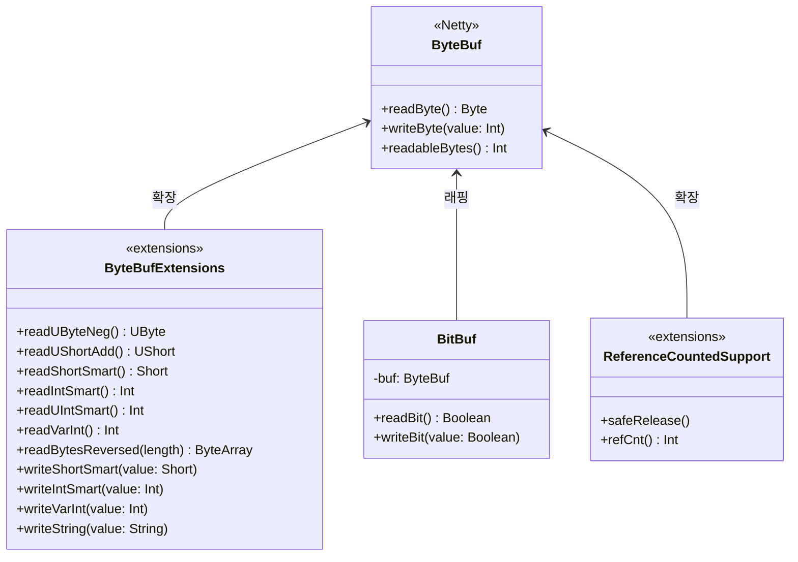
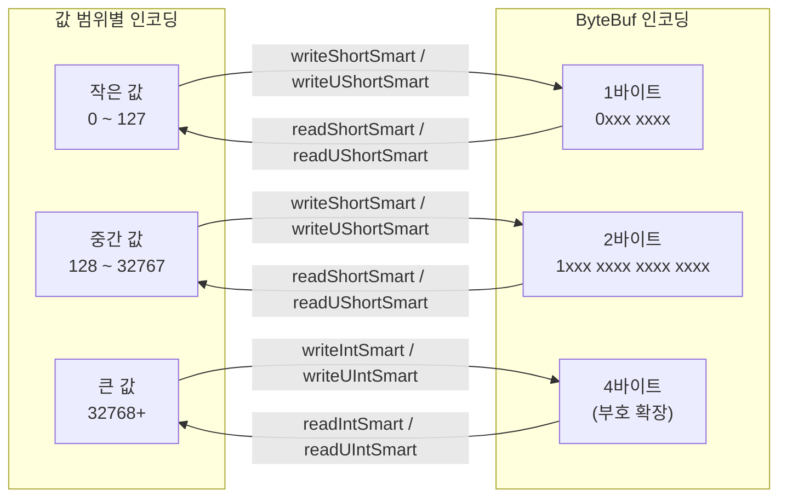
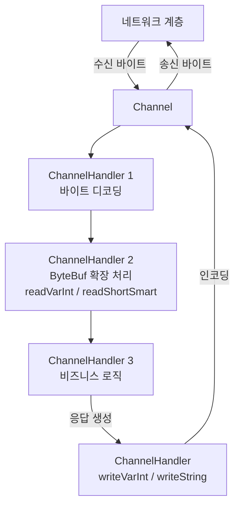

# Module bluetape4k-netty

Netty 라이브러리를 사용할 때 필요한 확장 함수들을 제공합니다.

## 개요

`bluetape4k-netty`는 [Netty](https://netty.io/) 프레임워크를 Kotlin 환경에서 더 편리하게 사용할 수 있도록 다양한 확장 함수와 유틸리티를 제공합니다. 특히
`ByteBuf` 조작을 위한 풍부한 API를 포함하고 있습니다.

### 주요 기능

- **ByteBuf 확장 함수**: 바이트 읽기/쓰기 확장 함수
- **Smart Number 인코딩**: 가변 길이 숫자 인코딩
- **부호 없는 숫자 처리**: UByte, UShort, UInt, ULong 지원
- **문자열 읽기/쓰기**: 널 종료 문자열 처리
- **ByteBuf 유틸리티**: ReferenceCounted, Throwable 처리

## 의존성 추가

```kotlin
dependencies {
    implementation("io.github.bluetape4k:bluetape4k-netty:${version}")
    implementation("io.netty:netty-all:4.1.115.Final")
}
```

## 기본 사용법

### 1. ByteBuf 읽기

```kotlin
import io.bluetape4k.netty.buffer.*

val buf: ByteBuf = ...

// 기본 읽기
val byte = buf.readByte()
val short = buf.readShort()
val int = buf.readInt()
val long = buf.readLong()

// 부호 없는 읽기
val uByte: UByte = buf.readUByteNeg()
val uShort: UShort = buf.readUShortAdd()
val uInt: Long = buf.readUIntME()

// Smart 인코딩 읽기
val smartShort: Short = buf.readShortSmart()
val smartInt: Int = buf.readIntSmart()
val smartUInt: Int = buf.readUIntSmart()

// 가변 길이 읽기
val varInt: Int = buf.readVarInt()

// 바이트 배열 읽기
val bytes: ByteArray = buf.getBytes()
val reversed: ByteArray = buf.readBytesReversed(length)
```

### 2. ByteBuf 쓰기

```kotlin
import io.bluetape4k.netty.buffer.*

val buf: ByteBuf = ...

// 기본 쓰기
buf.writeByte(0xFF)
buf.writeShort(1000)
buf.writeInt(100000)
buf.writeLong(10000000000L)

// Smart 인코딩 쓰기
buf.writeShortSmart(100)
buf.writeIntSmart(10000)
buf.writeUIntSmart(50000)

// 가변 길이 쓰기
buf.writeVarInt(123456)

// 문자열 쓰기 (널 종료)
buf.writeString("Hello, World!")

// 버전이 있는 문자열 쓰기
buf.writeVersionedString("Data", version = 1)

// 바이트 배열 쓰기
buf.writeBytesReversed(byteArray)
buf.writeBytesAdd(byteArray)
```

### 3. 인덱스 기반 접근 (읽기 위치 이동 없음)

```kotlin
import io.bluetape4k.netty.buffer.*

val buf: ByteBuf = ...

// 인덱스로 읽기
val byte = buf.getByte(index)
val uByte = buf.getUByteAdd(index)
val short = buf.getShortAdd(index)
val medium = buf.getMediumLME(index)
val smallLong = buf.getSmallLong(index)

// 인덱스로 쓰기
buf.setByte(index, 0xFF)
buf.setByteAdd(index, 128)
buf.setMediumLME(index, value)
```

### 4. 바이트 배열 변환

```kotlin
import io.bluetape4k.netty.buffer.*

// ByteBuf에서 ByteArray로
val bytes = buf.getBytes(start = 0, length = buf.readableBytes(), copy = true)

// 역순으로 읽기
val reversed = buf.getBytesReversed()

// Add 오프셋 적용하여 읽기
val added = buf.getBytesAdd(index, length)
```

### 5. ReferenceCounted 지원

```kotlin
import io.bluetape4k.netty.util.*

// 안전한 release
buf.safeRelease()

// retain 카운트 확인
val count = buf.refCnt()
```

## Smart 인코딩

Smart 인코딩은 값의 크기에 따라 바이트 수를 최적화하는 가변 길이 인코딩 방식입니다.

| 값 범위 | 인코딩 크기 |
|------|--------|
| 작은 값 | 1바이트   |
| 중간 값 | 2바이트   |
| 큰 값  | 4바이트   |

```kotlin
// 작은 값: 1바이트
buf.writeUShortSmart(100)  // 1바이트

// 중간 값: 2바이트
buf.writeUShortSmart(300)  // 2바이트

// 큰 값: 4바이트
buf.writeUIntSmart(100000) // 4바이트
```

## 주요 파일/클래스 목록

### Buffer (buffer/)

| 파일                              | 설명                    |
|---------------------------------|-----------------------|
| `ByteBufExtensions.kt`          | ByteBuf 확장 함수 (읽기/쓰기) |
| `ByteBufUtilSupport.kt`         | ByteBufUtil 확장        |
| `BitBuf.kt`, `BitBufImpl.kt`    | 비트 단위 버퍼              |
| `Smart.kt`, `USmart.kt`         | Smart 인코딩 상수          |
| `Medium.kt`, `UMedium.kt`       | 24비트 Medium 타입        |
| `SmallLong.kt`, `USmallLong.kt` | 48비트 SmallLong 타입     |

### Util (util/)

| 파일                           | 설명                  |
|------------------------------|---------------------|
| `ReferenceCountedSupport.kt` | ReferenceCounted 확장 |
| `ThrowableUtilSupport.kt`    | Throwable 유틸리티      |
| `StringUtilSupport.kt`       | 문자열 유틸리티            |

### Transport

| 파일                         | 설명          |
|----------------------------|-------------|
| `NettyTransportSupport.kt` | Netty 전송 지원 |

## 아키텍처 다이어그램

### ByteBuf 확장 API 구조



### Smart 인코딩 데이터 흐름



### Netty 채널 파이프라인 처리 흐름



## 테스트

```bash
./gradlew :bluetape4k-netty:test
```

## 참고

- [Netty](https://netty.io/)
- [Netty ByteBuf](https://netty.io/wiki/bytebuf-api.html)
- [Netty User Guide](https://netty.io/wiki/user-guide.html)
