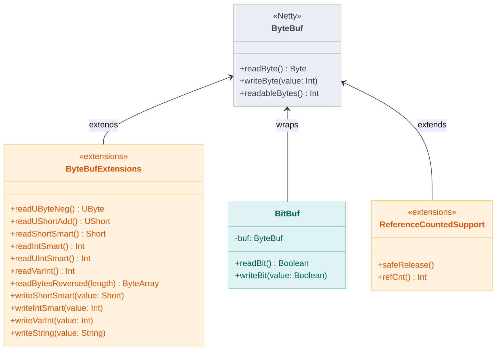
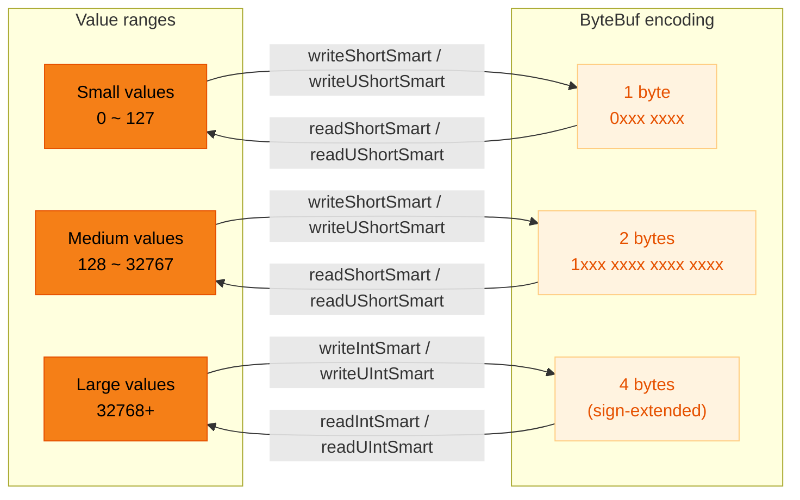
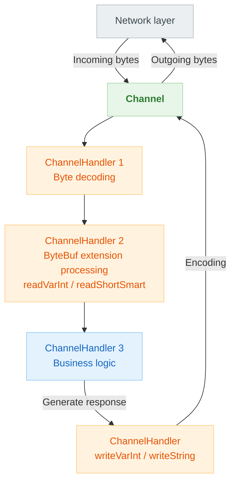

# Module bluetape4k-netty

English | [한국어](./README.ko.md)

Extension functions for working with the Netty framework.

## Overview

`bluetape4k-netty` provides various extension functions and utilities for using the [Netty](https://netty.io/) framework more conveniently in Kotlin. It is particularly rich in API for
`ByteBuf` manipulation.

### Key Features

- **ByteBuf extension functions**: Read/write extensions for ByteBuf
- **Smart number encoding**: Variable-length number encoding
- **Unsigned number support**: UByte, UShort, UInt, ULong
- **String read/write**: Null-terminated string handling
- **ByteBuf utilities**: ReferenceCounted and Throwable handling

## Adding the Dependency

```kotlin
dependencies {
    implementation("io.github.bluetape4k:bluetape4k-netty:${version}")
    implementation("io.netty:netty-all:4.1.115.Final")
}
```

## Basic Usage

### 1. Reading from ByteBuf

```kotlin
import io.bluetape4k.netty.buffer.*

val buf: ByteBuf = Unpooled.buffer()

// Basic reads
val byte = buf.readByte()
val short = buf.readShort()
val int = buf.readInt()
val long = buf.readLong()

// Unsigned reads
val uByte: UByte = buf.readUByteNeg()
val uShort: UShort = buf.readUShortAdd()
val uInt: Long = buf.readUIntME()

// Smart encoding reads
val smartShort: Short = buf.readShortSmart()
val smartInt: Int = buf.readIntSmart()
val smartUInt: Int = buf.readUIntSmart()

// Variable-length read
val varInt: Int = buf.readVarInt()

// Byte array reads
val bytes: ByteArray = buf.getBytes()
val reversed: ByteArray = buf.readBytesReversed(length)
```

### 2. Writing to ByteBuf

```kotlin
import io.bluetape4k.netty.buffer.*

val buf: ByteBuf = Unpooled.buffer()

// Basic writes
buf.writeByte(0xFF)
buf.writeShort(1000)
buf.writeInt(100000)
buf.writeLong(10000000000L)

// Smart encoding writes
buf.writeShortSmart(100)
buf.writeIntSmart(10000)
buf.writeUIntSmart(50000)

// Variable-length write
buf.writeVarInt(123456)

// String write (null-terminated)
buf.writeString("Hello, World!")

// Versioned string write
buf.writeVersionedString("Data", version = 1)

// Byte array writes
buf.writeBytesReversed(byteArray)
buf.writeBytesAdd(byteArray)
```

### 3. Index-based Access (no reader index movement)

```kotlin
import io.bluetape4k.netty.buffer.*

val buf: ByteBuf = Unpooled.buffer()

// Read by index
val byte = buf.getByte(index)
val uByte = buf.getUByteAdd(index)
val short = buf.getShortAdd(index)
val medium = buf.getMediumLME(index)
val smallLong = buf.getSmallLong(index)

// Write by index
buf.setByte(index, 0xFF)
buf.setByteAdd(index, 128)
buf.setMediumLME(index, value)
```

### 4. Byte Array Conversion

```kotlin
import io.bluetape4k.netty.buffer.*

// ByteBuf to ByteArray
val bytes = buf.getBytes(start = 0, length = buf.readableBytes(), copy = true)

// Read in reverse order
val reversed = buf.getBytesReversed()

// Read with add offset
val added = buf.getBytesAdd(index, length)
```

### 5. ReferenceCounted Support

```kotlin
import io.bluetape4k.netty.util.*

// Safe release
buf.safeRelease()

// Check retain count
val count = buf.refCnt()
```

## Smart Encoding

Smart encoding is a variable-length encoding that optimizes byte count based on the magnitude of the value.

| Value Range   | Encoded Size |
|---------------|--------------|
| Small values  | 1 byte       |
| Medium values | 2 bytes      |
| Large values  | 4 bytes      |

```kotlin
// Small value: 1 byte
buf.writeUShortSmart(100)  // 1 byte

// Medium value: 2 bytes
buf.writeUShortSmart(300)  // 2 bytes

// Large value: 4 bytes
buf.writeUIntSmart(100000) // 4 bytes
```

## Key Files / Classes

### Buffer (buffer/)

| File                            | Description                              |
|---------------------------------|------------------------------------------|
| `ByteBufExtensions.kt`          | ByteBuf extension functions (read/write) |
| `ByteBufUtilSupport.kt`         | ByteBufUtil extensions                   |
| `BitBuf.kt`, `BitBufImpl.kt`    | Bit-level buffer                         |
| `Smart.kt`, `USmart.kt`         | Smart encoding constants                 |
| `Medium.kt`, `UMedium.kt`       | 24-bit Medium type                       |
| `SmallLong.kt`, `USmallLong.kt` | 48-bit SmallLong type                    |

### Util (util/)

| File                         | Description                 |
|------------------------------|-----------------------------|
| `ReferenceCountedSupport.kt` | ReferenceCounted extensions |
| `ThrowableUtilSupport.kt`    | Throwable utilities         |
| `StringUtilSupport.kt`       | String utilities            |

### Transport

| File                       | Description             |
|----------------------------|-------------------------|
| `NettyTransportSupport.kt` | Netty transport support |

## Architecture Diagrams

### ByteBuf Extension API Structure



### Smart Encoding Data Flow



### Netty Channel Pipeline Processing Flow



## Testing

```bash
./gradlew :bluetape4k-netty:test
```

## References

- [Netty](https://netty.io/)
- [Netty ByteBuf](https://netty.io/wiki/bytebuf-api.html)
- [Netty User Guide](https://netty.io/wiki/user-guide.html)
