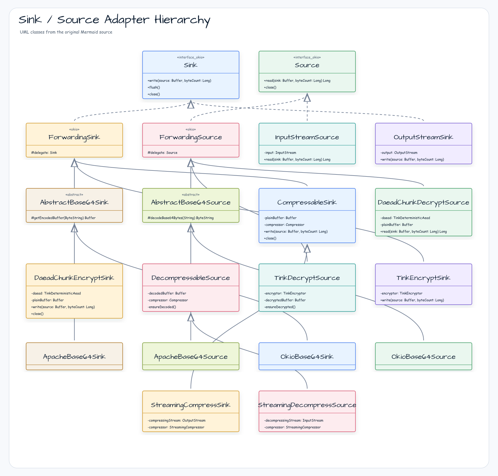
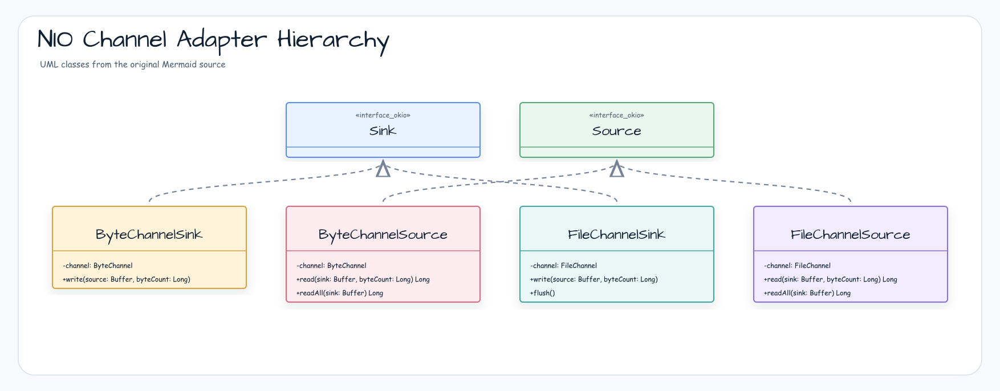
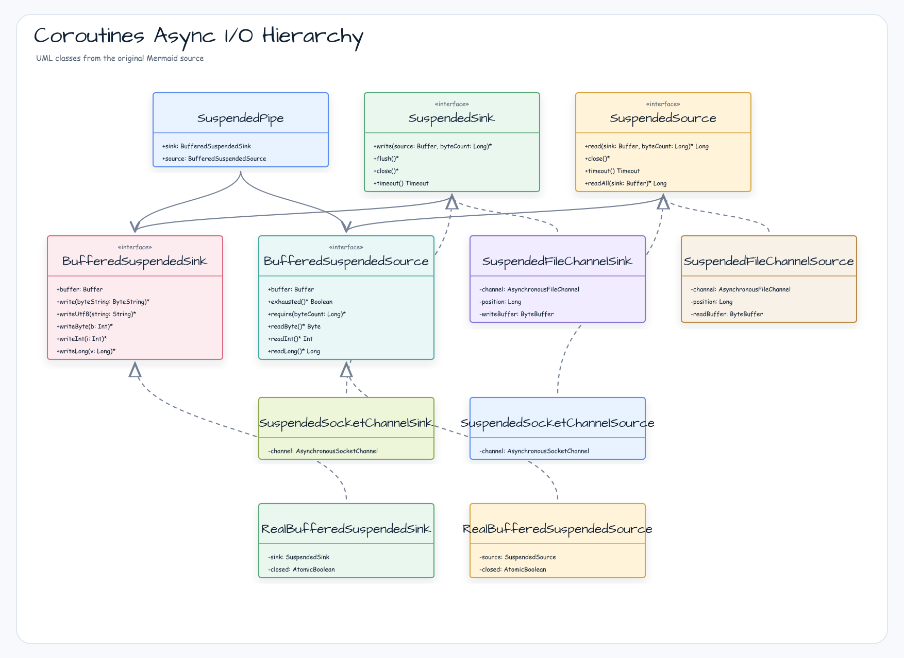
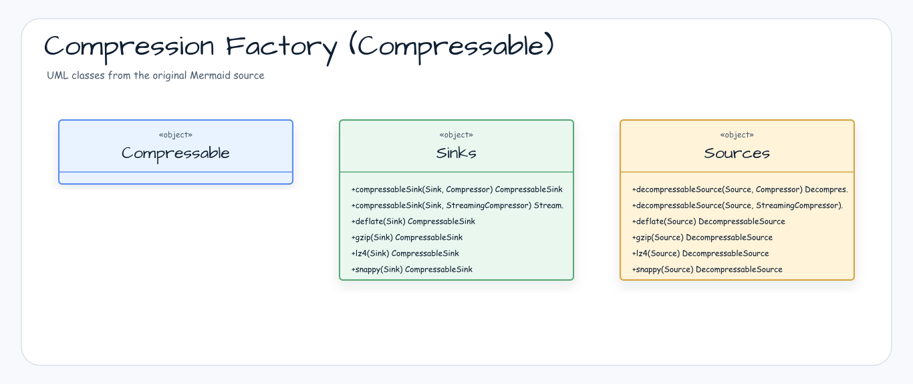
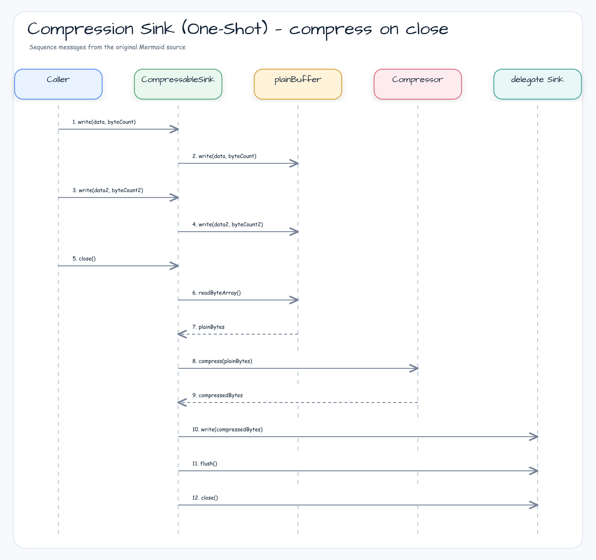
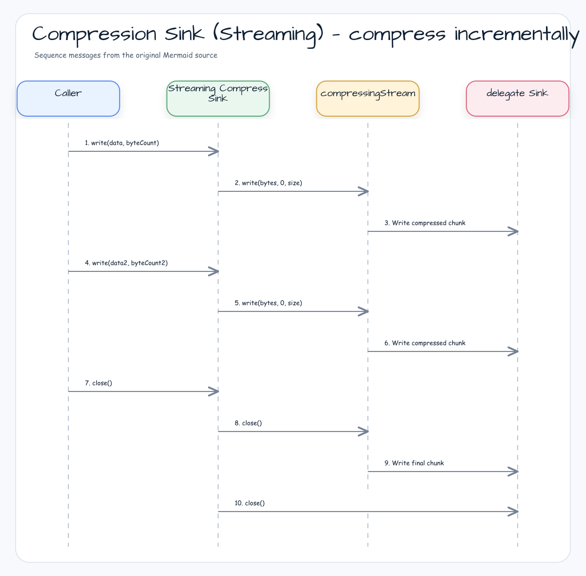
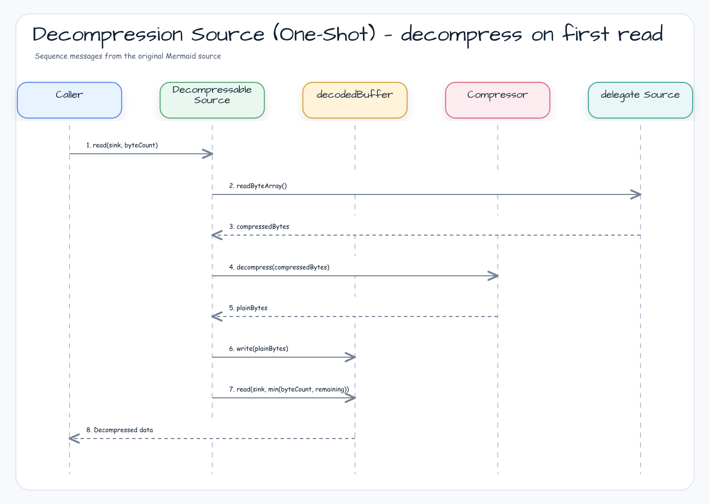
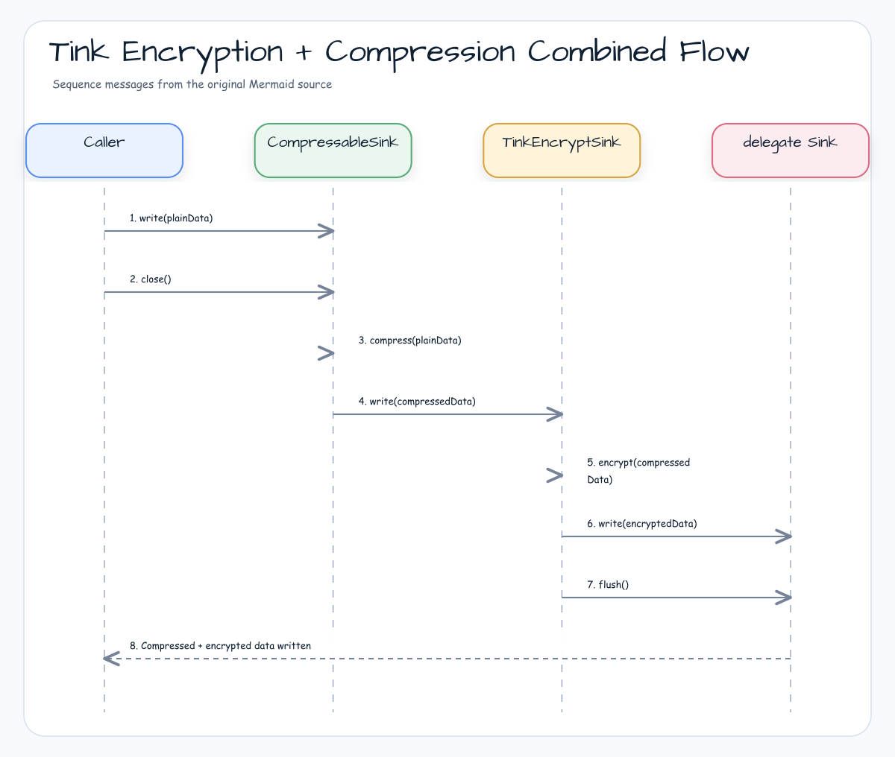
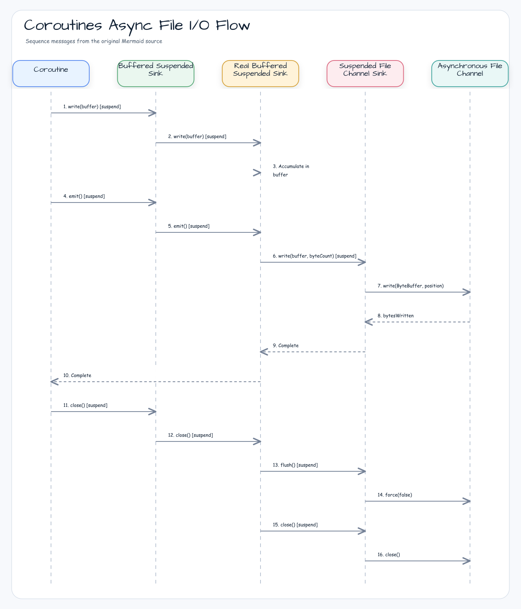

# Module bluetape4k-okio

[English](./README.md) | 한국어

## 개요

`bluetape4k-okio`는 Square의 [Okio](https://square.github.io/okio/) 라이브러리를 기반으로 한 고성능 I/O 확장 모듈입니다. Okio의 `Source`/
`Sink` 추상화 위에 압축, 암호화, Base64 인코딩, NIO 채널 통합, Kotlin Coroutines 비동기 I/O 등을 제공합니다.

## Okio를 쓰는 이유

Okio는 `java.io`와 `java.nio`를 직접 사용할 때 자주 생기는 장황한 코드, 불필요한 할당, 애매한
read 계약을 줄이기 위한 실용적인 I/O 계층입니다. 핵심 모델은 작습니다. 데이터는 `Source`와
`Sink`를 통해 흐르고, 호출자는 보통 `BufferedSource`, `BufferedSink`, `Buffer`, `ByteString`으로
작업합니다.

주요 장점:

- **조합 가능한 스트림 파이프라인**: 압축, 암호화, Base64, hashing, channel adapter를
  `Source`/`Sink` 위의 작은 decorator로 단계적으로 조합할 수 있습니다.
- **효율적인 버퍼링**: `Buffer`는 재사용 가능한 segment로 byte를 저장하며, buffer 간 데이터
  이동 시 매번 전체 byte를 복사하지 않아도 됩니다.
- **값으로 다루는 바이너리 데이터**: `ByteString`은 immutable byte sequence이므로 비교, 인코딩,
  디코딩, hashing, 모듈 경계 전달에 적합합니다.
- **byte와 text를 하나의 API로 처리**: raw byte, UTF-8, primitive number, line-oriented protocol을
  같은 buffered API로 다룰 수 있어 byte stream과 reader/writer wrapper를 오갈 필요가 줄어듭니다.
- **더 안전한 I/O 계약**: `Timeout`, 단순한 `Source`/`Sink` 인터페이스, buffered read를 통해
  `InputStream.available()` 또는 single-byte read에 의존하는 오류를 피할 수 있습니다.
- **테스트 용이성**: `Buffer`는 source와 sink 역할을 모두 할 수 있어 codec/protocol 로직을 파일,
  socket, 임시 stream 없이 검증하기 쉽습니다.
- **이 모듈의 coroutine 확장**: `SuspendedSource`, `SuspendedSink`, suspended file/socket channel,
  `SuspendedPipe`를 통해 Okio 스타일 pipeline을 structured concurrency 코드에서도 사용할 수 있습니다.

## 추천 사용 시나리오

다음 요구가 있다면 `bluetape4k-okio` 사용을 권장합니다:

- **Protocol 또는 payload codec**: binary protocol, framed message, length-prefixed record,
  checksum, UTF-8 line parser를 `Buffer`와 `BufferedSource` 기반으로 구현할 때.
- **Streaming transformation**: `Source`/`Sink` 형태를 유지하면서 압축, 복원, 암호화, 복호화,
  Base64 인코딩을 조합해야 할 때.
- **대용량 payload 처리**: payload 전체를 하나의 byte array로 올리면 안 되는 경우 streaming
  compressor, DAEAD chunk encryption, buffered copy를 사용할 때.
- **레거시 I/O와 현대적 I/O 연결**: `InputStream`, `OutputStream`, `ReadableByteChannel`,
  `WritableByteChannel`, `FileChannel`을 하나의 Okio 기반 pipeline으로 맞출 때.
- **Coroutine 기반 서비스**: 호출자가 이미 structured concurrency를 사용하고 있고 raw stream
  호출로 coroutine dispatcher를 blocking하면 안 되는 경우 suspended file/socket adapter와
  `SuspendedPipe`를 사용할 때.
- **I/O 코드의 결정적 테스트**: source와 sink를 `Buffer`로 모델링하고, 파일/socket 테스트는
  integration boundary에만 둘 때.
- **보안 민감 payload envelope**: payload가 여러 번 나뉘어 기록되고 associated data를 각 frame과
  함께 인증해야 할 때 DAEAD chunk encryption을 사용할 때.

권장 기본값:

- 리소스를 소유하는 source/sink는 항상 `use {}`로 감쌉니다.
- 크기를 알 수 없거나 큰 payload에는 streaming adapter를 우선 사용합니다.
- 여러 번의 write로 만들어지는 암호화 payload에는 DAEAD chunk encryption을 우선 사용합니다.
- 프로토콜 요구가 없다면 압축을 먼저 적용하고 그 결과를 암호화합니다.
- public immutable boundary에는 `ByteString`, 내부 mutable 작업 영역에는 `Buffer`를 사용합니다.
- coroutine 코드에서는 blocking stream을 직접 감싸기보다 `SuspendedSource`/`SuspendedSink`와
  suspended buffered API를 사용합니다.

## Anti-Patterns

이 모듈을 사용할 때 다음 패턴은 피하세요:

- **`InputStream.available()`에 의존하지 마세요.** read 가능 여부 판단에는 `request`, `require`,
  `exhausted`, `readUtf8Line`, protocol-specific length check 같은 buffered Okio API를 사용하세요.
- **hot path에서 raw stream을 1 byte씩 읽지 마세요.** source를 buffer로 감싸고 `BufferedSource`에서
  byte, string, primitive 값을 읽으세요.
- **입력이 제한되어 있고 신뢰할 수 있는 경우가 아니면 `readByteArray()`나 `readUtf8()`로 큰 stream을
  한 번에 materialize하지 마세요.** sink로 streaming하거나 frame 단위로 처리하세요.
- **압축/암호화 sink의 `close()`를 빠뜨리지 마세요.** 일부 adapter는 footer, frame, ciphertext를
  close 시점에 확정합니다.
- **multi-write payload에 legacy `TinkEncryptSink`를 사용하지 마세요.** write마다 독립 ciphertext가
  만들어지는 반면 matching decrypt source는 단일 ciphertext를 기대합니다. incremental write에는
  DAEAD chunk encryption을 사용하세요.
- **DAEAD 복호화에 다른 associated data를 넘기지 마세요.** associated data는 인증 대상이며 암호화
  시점과 완전히 같은 값을 사용해야 합니다.
- **coroutine cancellation을 삼키지 마세요.** 특히 `close()`나 cleanup 경로에서 broad exception
  handling 전에 `CancellationException`을 다시 던져야 합니다.
- **양수 read 요청에 `0L`을 반복 반환하는 `SuspendedSource`를 구현하지 마세요.** 양수 read는 진행,
  진행 가능 시점까지 suspend, EOF의 `-1L` 중 하나여야 합니다. Buffered suspended source는 무한 루프를
  막기 위해 반복 no-progress read 이후 빠르게 실패합니다.
- **ownership 규칙 없이 mutable `Buffer`를 여러 thread/coroutine에서 공유하지 마세요.** 경계를
  넘길 때는 `SuspendedPipe`, immutable `ByteString`, 또는 상위 queue/channel을 사용하세요.
- **one-shot adapter와 streaming adapter를 혼용하지 마세요.** one-shot 압축/복원은 전체 payload를
  버퍼링합니다. 입력이 제한되지 않았다면 streaming adapter가 더 안전한 기본값입니다.

## 주요 기능

### 1. Buffer / ByteString 유틸리티

Okio `Buffer`와 `ByteString` 생성을 위한 팩토리 함수와 확장 함수를 제공합니다.

```kotlin
import io.bluetape4k.okio.*

// Buffer 생성
val buffer = bufferOf("Hello, Okio!")
val buffer2 = bufferOf(byteArrayOf(1, 2, 3))
val buffer3 = bufferOf(inputStream)

// ByteString 생성
val byteString = byteStringOf("Hello")
val byteString2 = byteStringOf(byteArrayOf(1, 2, 3))
```

### 2. Source / Sink 확장

`InputStream`/`OutputStream`을 Okio `Source`/`Sink`로 변환하는 어댑터를 제공합니다.

```kotlin
import io.bluetape4k.okio.*

// InputStream → Source
val source = inputStream.asSource()

// OutputStream → Sink
val sink = outputStream.asSink()
```

### 3. NIO 채널 지원

Java NIO `ReadableByteChannel`/`WritableByteChannel`/`FileChannel`을 Okio와 통합합니다.

```kotlin
import io.bluetape4k.okio.channels.*

// ByteChannel → Source/Sink
val source = readableByteChannel.asSource()
val sink = writableByteChannel.asSink()

// FileChannel → Source/Sink
val fileSource = FileChannelSource(fileChannel)
val fileSink = FileChannelSink(fileChannel)
```

### 4. 압축 스트림

`bluetape4k-io`의 `Compressor`/`StreamingCompressor`를 Okio Sink/Source로 래핑하여 스트리밍 압축/해제를 지원합니다.

```kotlin
import io.bluetape4k.okio.compress.*
import io.bluetape4k.io.compressor.Compressors

// 압축 Sink (close 시점에 압축 확정)
val compressSink = sink.asCompressSink(Compressors.LZ4)
compressSink.use { cs ->
    cs.write(buffer, buffer.size)
}

// 복원 Source
val decompressSource = source.asDecompressSource(Compressors.LZ4)
decompressSource.use { ds ->
    ds.read(outputBuffer, Long.MAX_VALUE)
}

// StreamingCompressor 사용 (대용량 스트리밍)
val streamingSink = sink.asCompressSink(Compressors.Streaming.Zstd)
val streamingSource = source.asDecompressSource(Compressors.Streaming.Zstd)
```

**주의사항:**

- `CompressableSink`는 `close()` 시점에 압축 결과가 확정됩니다. 반드시 `close()` 또는 `use {}`를 사용하세요.
- `StreamingCompressSink`도 footer/finalize 기록을 위해 `close()`가 필요합니다.

### 5. Tink 암호화

Google Tink AEAD 기반 암호화 Sink/Source를 제공합니다.

```kotlin
import io.bluetape4k.okio.tink.*
import io.bluetape4k.tink.encrypt.TinkEncryptors

// 암호화 Sink
val encryptSink = sink.asTinkEncryptSink(TinkEncryptors.AES256_GCM)
encryptSink.write(buffer, buffer.size)

// 복호화 Source
val decryptSource = source.asTinkDecryptSource(TinkEncryptors.AES256_GCM)
val result = Buffer()
decryptSource.read(result, Long.MAX_VALUE)
```

레거시 `TinkEncryptSink`/`TinkDecryptSource` 쌍은 스트림 전체를 **단일 ciphertext**로 취급합니다.
`TinkEncryptSink`는 `close()` 시점에 암호화를 확정하고, `TinkDecryptSource`는 위임 Source를
끝까지 읽은 뒤 단일 ciphertext로 복호화합니다. 복수의 `write()` 호출은 복수의 독립 ciphertext를
생성하므로 `TinkDecryptSource`로 복호화할 수 없습니다. 기존 단일 ciphertext payload 호환이
필요할 때만 이 어댑터를 사용하세요.

대용량 payload 또는 여러 번의 `write()` 호출로 기록되는 데이터에는 DAEAD 청크 어댑터를 사용합니다.
복호화는 한 번에 하나의 청크 ciphertext만 메모리에 적재하므로 페이로드 전체를 메모리에 올리지 않습니다:

```kotlin
import io.bluetape4k.okio.tink.*
import io.bluetape4k.tink.daead.TinkDaeads

val daead = TinkDaeads.AES256_SIV
val contextBytes = "my-context".toByteArray()

val encrypted = Buffer()
encrypted.asDaeadChunkEncryptSink(
    daead,
    chunkSize = DEFAULT_DAEAD_CHUNK_SIZE,   // 기본 64 KiB; 필요 시 재정의
    associatedData = contextBytes,
).use { encryptSink ->
    encryptSink.write(buffer, buffer.size)
}

val decrypted = Buffer()
encrypted.asDaeadChunkDecryptSource(
    daead,
    associatedData = contextBytes,          // 암호화 시 사용한 값과 동일해야 함
).use { decryptSource ->
    decryptSource.read(decrypted, Long.MAX_VALUE)
}
```

DAEAD 청크 암호화는 각 frame을 `[1-byte flags][8-byte big-endian ciphertext length][ciphertext]`
형식으로 기록합니다. `DEFAULT_DAEAD_CHUNK_SIZE`는 64 KiB입니다. 청크 index와 final-frame flag는
DAEAD associated data에 바인딩되므로 frame 순서 변경, 중복 재생, whole-frame truncation은 복호화 중
실패하며, final frame 뒤에 trailing data가 남아도 실패합니다. final frame은 `close()`에서 기록되므로
암호화 Sink는 반드시 닫아야 하며, `use {}` 사용을 권장합니다.
이는 v2 DAEAD chunk format이며 기존 `[8-byte length][ciphertext]` frame과 wire-compatible하지 않습니다.

Deterministic AEAD는 같은 키, 평문, 연관 데이터에 대해 같은 암호문을 생성합니다.
따라서 반복 평문 청크 패턴이 노출될 수 있습니다. 연관 데이터는 인증되지만 암호화되지 않으며,
**복호화할 때 암호화 시점과 같은 값을 전달해야 합니다**.

**암호화 + 압축 조합:**

```kotlin
// 압축 → 암호화
val combinedSink = sink
    .asTinkEncryptSink(TinkEncryptors.AES256_GCM)
    .asCompressSink(Compressors.Zstd)

combinedSink.use { it.write(buffer, buffer.size) }
```

### 6. Base64 인코딩/디코딩

Okio Sink/Source 기반 Base64 인코딩/디코딩을 제공합니다.

```kotlin
import io.bluetape4k.okio.base64.*

// Base64 인코딩 Sink
val encodeSink = ApacheBase64Sink(delegate)
encodeSink.write(buffer, buffer.size)

// Base64 디코딩 Source
val decodeSource = ApacheBase64Source(delegate)
decodeSource.read(outputBuffer, Long.MAX_VALUE)
```

### 7. Kotlin Coroutines 비동기 I/O

Okio Source/Sink를 Kotlin Coroutines `suspend` 함수로 래핑하여 비동기 I/O를 제공합니다.

```kotlin
import io.bluetape4k.okio.coroutines.*
import java.nio.file.Paths

// Suspended 파일 읽기
suspend fun readFileAsync(path: String): ByteArray {
    val source = SuspendedFileChannelSource(Paths.get(path))
    val buffer = Buffer()
    source.use { it.readAll(buffer) }
    return buffer.readByteArray()
}

// Suspended 파일 쓰기
suspend fun writeFileAsync(path: String, data: ByteArray) {
    val sink = SuspendedFileChannelSink(Paths.get(path))
    val buffer = Buffer().write(data)
    sink.use {
        it.write(buffer)
        it.flush()
    }
}

// Suspended Socket 통신
val socketSource = SuspendedSocketChannelSource(socketChannel)
val socketSink = SuspendedSocketChannelSink(socketChannel)
```

버퍼링된 suspended source는 잘못 구현되었거나 non-blocking 성격의 delegate가 양수 read 요청에
`0L`을 반복 반환하는 상황을 방어합니다. `request`, `skip`, `select`, `indexOf`,
`readAll`처럼 추가 데이터가 필요한 연산은 무한 루프 대신 반복 no-progress read 이후
`IOException`을 던집니다.

**Suspended Pipe (생산자-소비자 패턴):**

```kotlin
import io.bluetape4k.okio.coroutines.*

val pipe = SuspendedPipe()

// 생산자
launch {
    pipe.sink.use { sink ->
        sink.write(Buffer().writeUtf8("Hello"))
        sink.flush()
    }
}

// 소비자
launch {
    pipe.source.use { source ->
        val buffer = Buffer()
        source.read(buffer, Long.MAX_VALUE)
    }
}
```

## 의존성 추가

### Gradle (Kotlin DSL)

```kotlin
dependencies {
    implementation("io.github.bluetape4k:bluetape4k-okio:${version}")

    // 필수 (자동 포함)
    // io.github.bluetape4k:bluetape4k-io
    // com.squareup.okio:okio

    // 선택적 의존성 (필요한 기능에 따라 추가)
    implementation("io.github.bluetape4k:bluetape4k-tink:${version}")        // Tink 암호화
    implementation("io.github.bluetape4k:bluetape4k-coroutines:${version}")  // Coroutines 비동기 I/O
    implementation("commons-codec:commons-codec:1.17.0")                     // Base64
}
```

## 모듈 구조

```
io.bluetape4k.okio
├── BufferSupport.kt            # Buffer 팩토리 (bufferOf)
├── ByteStringSupport.kt        # ByteString 팩토리 (byteStringOf)
├── SinkSupport.kt              # Sink 확장 함수
├── SourceSupport.kt            # Source 확장 함수
├── InputStreamSource.kt        # InputStream → Source 어댑터
├── OutputStreamSink.kt         # OutputStream → Sink 어댑터
├── channels/                   # NIO 채널 통합
│   ├── FileChannelSink.kt
│   ├── FileChannelSource.kt
│   ├── ByteChannelSink.kt
│   └── ByteChannelSource.kt
├── compress/                   # 압축 스트림
│   ├── CompressableSink.kt     # Compressor 기반 압축 Sink
│   ├── DecompressableSource.kt # Compressor 기반 복원 Source
│   ├── SinkWithCompressor.kt   # 레거시 호환 압축 Sink
│   ├── SourceWithCompressor.kt # 레거시 호환 복원 Source
│   └── Compressable.kt         # 압축 인터페이스
├── tink/                       # Tink AEAD 및 DAEAD 청크 암호화
│   ├── TinkEncryptSink.kt
│   ├── TinkDecryptSource.kt
│   ├── DaeadChunkEncryptSink.kt
│   └── DaeadChunkDecryptSource.kt
├── base64/                     # Base64 인코딩/디코딩
│   ├── ApacheBase64Sink.kt
│   ├── ApacheBase64Source.kt
│   ├── OkioBase64Sink.kt
│   └── OkioBase64Source.kt
└── coroutines/                 # Kotlin Coroutines 비동기 I/O
    ├── SuspendedSource.kt
    ├── SuspendedSink.kt
    ├── SuspendedFileChannelSource.kt
    ├── SuspendedFileChannelSink.kt
    ├── SuspendedSocketChannelSource.kt
    ├── SuspendedSocketChannelSink.kt
    ├── SuspendedPipe.kt
    └── [Buffered 구현체 등]
```

## 클래스 구조

### Sink / Source 어댑터 계층

Okio의 `Sink`/`Source` 추상화 위에 압축, 암호화, Base64 인코딩 등을 데코레이터 패턴으로 제공합니다.



### NIO 채널 어댑터 계층

Java NIO `FileChannel`/`ByteChannel`을 Okio `Sink`/`Source`로 변환합니다.



### Coroutines 비동기 I/O 계층

Kotlin Coroutines `suspend` 함수 기반 비동기 Sink/Source 추상화입니다.



### 압축 팩토리 (Compressable)

`Compressable` 오브젝트를 통해 다양한 알고리즘의 압축/복원 Sink/Source를 편리하게 생성할 수 있습니다.



## 시퀀스 다이어그램

### 압축 Sink (One-Shot) — compress on close

`CompressableSink`는 모든 데이터를 내부 버퍼에 축적한 뒤, `close()` 시점에 한 번에 압축합니다.



### 압축 Sink (Streaming) — compress incrementally

`StreamingCompressSink`는 데이터를 수신할 때마다 즉시 압축하여 대용량 스트리밍에 적합합니다.



### 복원 Source (One-Shot) — decompress on first read

`DecompressableSource`는 첫 번째 `read()` 호출 시 전체 데이터를 복원하고 캐싱합니다.



### Tink 암호화 + 압축 조합 흐름

`Sink` 데코레이터를 체이닝하여 압축 후 암호화를 적용합니다.



### Coroutines 비동기 파일 I/O 흐름

`AsynchronousFileChannel`을 사용하여 논블로킹 파일 I/O를 수행합니다.



## 라이선스

MIT License

## 참고

- [Okio Documentation](https://square.github.io/okio/)
- [Google Tink](https://developers.google.com/tink)
- [bluetape4k-io](../io/README.ko.md)
- [bluetape4k-tink](../tink/README.ko.md)
