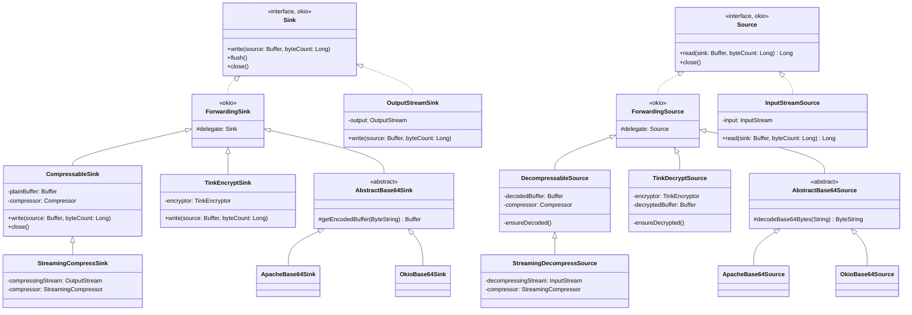
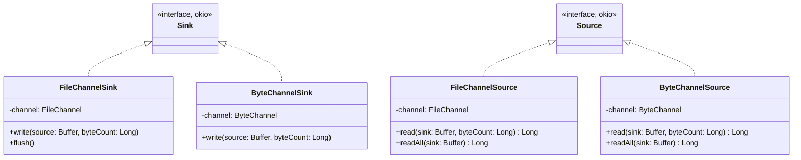
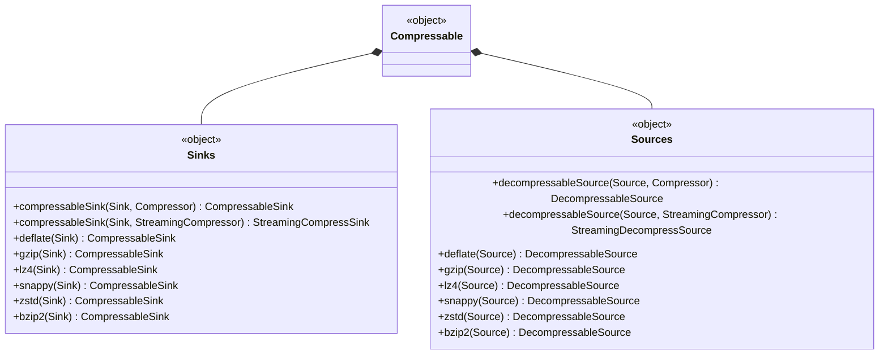
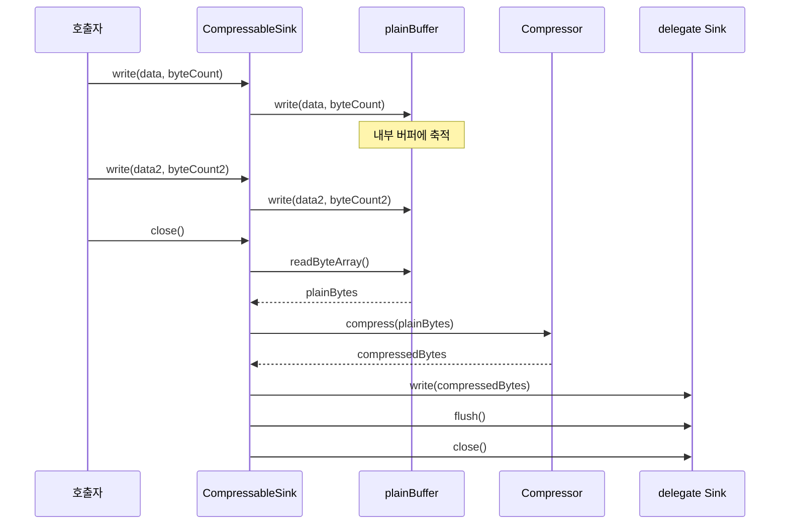
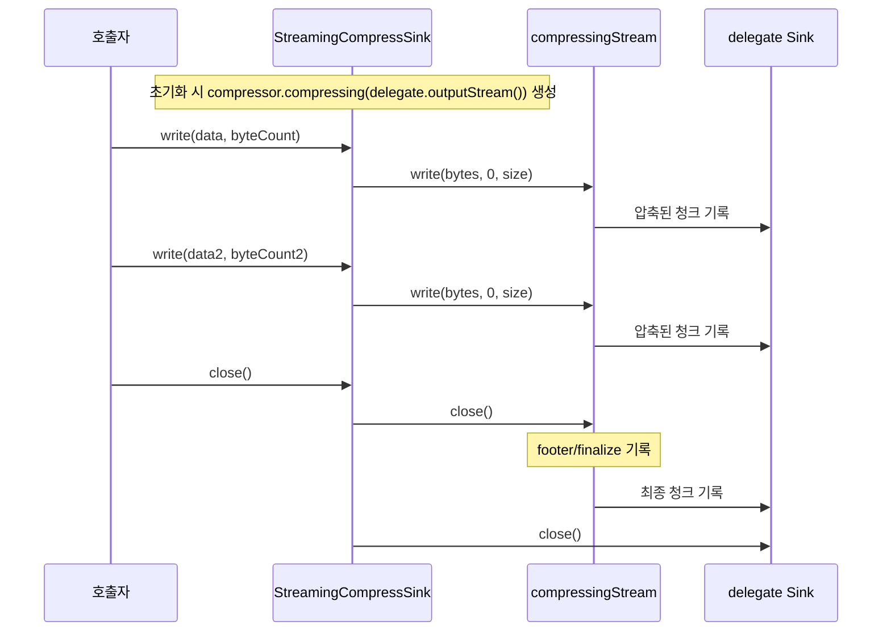
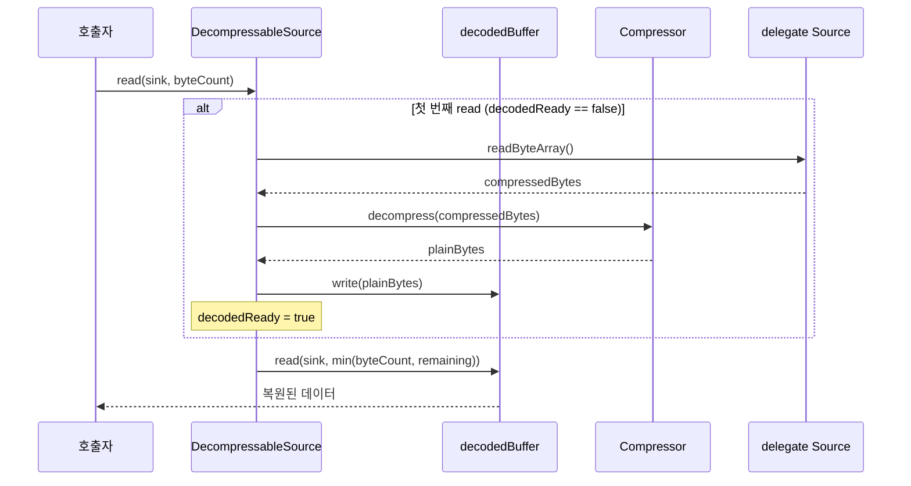
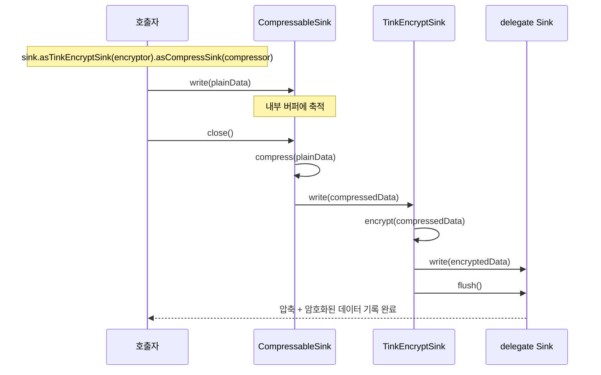
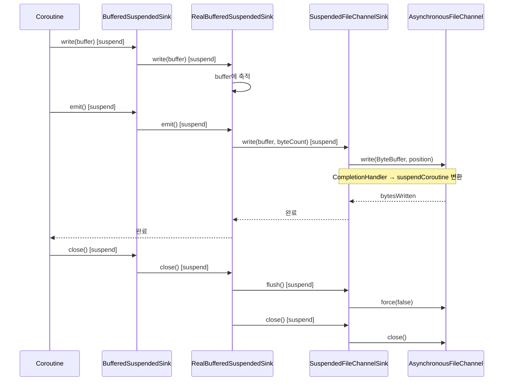

# Module bluetape4k-okio

## 개요

`bluetape4k-okio`는 Square의 [Okio](https://square.github.io/okio/) 라이브러리를 기반으로 한 고성능 I/O 확장 모듈입니다.
Okio의 `Source`/`Sink` 추상화 위에 압축, 암호화, Base64 인코딩, NIO 채널 통합, Kotlin Coroutines 비동기 I/O 등을 제공합니다.

## 주요 기능

### 1. Buffer / ByteString 유틸리티

Okio `Buffer`와 `ByteString` 생성을 위한 팩토리 함수와 확장 함수를 제공합니다.

```kotlin
import io.bluetape4k.okio.*

// Buffer 생성
val buffer = bufferOf("Hello, Okio!")
val buffer2 = bufferOf(byteArrayOf(1, 2, 3))
val buffer3 = bufferOf(inputStream)

// ByteString 생성
val byteString = byteStringOf("Hello")
val byteString2 = byteStringOf(byteArrayOf(1, 2, 3))
```

### 2. Source / Sink 확장

`InputStream`/`OutputStream`을 Okio `Source`/`Sink`로 변환하는 어댑터를 제공합니다.

```kotlin
import io.bluetape4k.okio.*

// InputStream → Source
val source = inputStream.asSource()

// OutputStream → Sink
val sink = outputStream.asSink()
```

### 3. NIO 채널 지원

Java NIO `ReadableByteChannel`/`WritableByteChannel`/`FileChannel`을 Okio와 통합합니다.

```kotlin
import io.bluetape4k.okio.channels.*

// ByteChannel → Source/Sink
val source = readableByteChannel.asSource()
val sink = writableByteChannel.asSink()

// FileChannel → Source/Sink
val fileSource = FileChannelSource(fileChannel)
val fileSink = FileChannelSink(fileChannel)
```

### 4. 압축 스트림

`bluetape4k-io`의 `Compressor`/`StreamingCompressor`를 Okio Sink/Source로 래핑하여 스트리밍 압축/해제를 지원합니다.

```kotlin
import io.bluetape4k.okio.compress.*
import io.bluetape4k.io.compressor.Compressors

// 압축 Sink (close 시점에 압축 확정)
val compressSink = sink.asCompressSink(Compressors.LZ4)
compressSink.use { cs ->
    cs.write(buffer, buffer.size)
}

// 복원 Source
val decompressSource = source.asDecompressSource(Compressors.LZ4)
decompressSource.use { ds ->
    ds.read(outputBuffer, Long.MAX_VALUE)
}

// StreamingCompressor 사용 (대용량 스트리밍)
val streamingSink = sink.asCompressSink(Compressors.Streaming.Zstd)
val streamingSource = source.asDecompressSource(Compressors.Streaming.Zstd)
```

**주의사항:**
- `CompressableSink`는 `close()` 시점에 압축 결과가 확정됩니다. 반드시 `close()` 또는 `use {}`를 사용하세요.
- `StreamingCompressSink`도 footer/finalize 기록을 위해 `close()`가 필요합니다.

### 5. Tink 암호화 (권장)

Google Tink AEAD 기반 암호화 Sink/Source를 제공합니다.

```kotlin
import io.bluetape4k.okio.tink.*
import io.bluetape4k.tink.encrypt.TinkEncryptors

// 암호화 Sink
val encryptSink = sink.asTinkEncryptSink(TinkEncryptors.AES256_GCM)
encryptSink.write(buffer, buffer.size)

// 복호화 Source
val decryptSource = source.asTinkDecryptSource(TinkEncryptors.AES256_GCM)
val result = Buffer()
decryptSource.read(result, Long.MAX_VALUE)
```

**암호화 + 압축 조합:**

```kotlin
// 압축 → 암호화
val combinedSink = sink
    .asTinkEncryptSink(TinkEncryptors.AES256_GCM)
    .asCompressSink(Compressors.Zstd)

combinedSink.use { it.write(buffer, buffer.size) }
```

### 6. Base64 인코딩/디코딩

Okio Sink/Source 기반 Base64 인코딩/디코딩을 제공합니다.

```kotlin
import io.bluetape4k.okio.base64.*

// Base64 인코딩 Sink
val encodeSink = ApacheBase64Sink(delegate)
encodeSink.write(buffer, buffer.size)

// Base64 디코딩 Source
val decodeSource = ApacheBase64Source(delegate)
decodeSource.read(outputBuffer, Long.MAX_VALUE)
```

### 7. Kotlin Coroutines 비동기 I/O

Okio Source/Sink를 Kotlin Coroutines `suspend` 함수로 래핑하여 비동기 I/O를 제공합니다.

```kotlin
import io.bluetape4k.okio.coroutines.*
import java.nio.file.Paths

// Suspended 파일 읽기
suspend fun readFileAsync(path: String): ByteArray {
    val source = SuspendedFileChannelSource(Paths.get(path))
    val buffer = Buffer()
    source.use { it.readAll(buffer) }
    return buffer.readByteArray()
}

// Suspended 파일 쓰기
suspend fun writeFileAsync(path: String, data: ByteArray) {
    val sink = SuspendedFileChannelSink(Paths.get(path))
    val buffer = Buffer().write(data)
    sink.use {
        it.write(buffer)
        it.flush()
    }
}

// Suspended Socket 통신
val socketSource = SuspendedSocketChannelSource(socketChannel)
val socketSink = SuspendedSocketChannelSink(socketChannel)
```

**Suspended Pipe (생산자-소비자 패턴):**

```kotlin
import io.bluetape4k.okio.coroutines.*

val pipe = SuspendedPipe()

// 생산자
launch {
    pipe.sink.use { sink ->
        sink.write(Buffer().writeUtf8("Hello"))
        sink.flush()
    }
}

// 소비자
launch {
    pipe.source.use { source ->
        val buffer = Buffer()
        source.read(buffer, Long.MAX_VALUE)
    }
}
```

## 의존성 추가

### Gradle (Kotlin DSL)

```kotlin
dependencies {
    implementation("io.github.bluetape4k:bluetape4k-okio:${version}")

    // 필수 (자동 포함)
    // io.github.bluetape4k:bluetape4k-io
    // com.squareup.okio:okio

    // 선택적 의존성 (필요한 기능에 따라 추가)
    implementation("io.github.bluetape4k:bluetape4k-tink:${version}")        // Tink 암호화
    implementation("io.github.bluetape4k:bluetape4k-coroutines:${version}")  // Coroutines 비동기 I/O
    implementation("commons-codec:commons-codec:1.17.0")                     // Base64
}
```

## 모듈 구조

```
io.bluetape4k.okio
├── BufferSupport.kt            # Buffer 팩토리 (bufferOf)
├── ByteStringSupport.kt        # ByteString 팩토리 (byteStringOf)
├── SinkSupport.kt              # Sink 확장 함수
├── SourceSupport.kt            # Source 확장 함수
├── InputStreamSource.kt        # InputStream → Source 어댑터
├── OutputStreamSink.kt         # OutputStream → Sink 어댑터
├── channels/                   # NIO 채널 통합
│   ├── FileChannelSink.kt
│   ├── FileChannelSource.kt
│   ├── ByteChannelSink.kt
│   └── ByteChannelSource.kt
├── compress/                   # 압축 스트림
│   ├── CompressableSink.kt     # Compressor 기반 압축 Sink
│   ├── DecompressableSource.kt # Compressor 기반 복원 Source
│   ├── SinkWithCompressor.kt   # 레거시 호환 압축 Sink
│   ├── SourceWithCompressor.kt # 레거시 호환 복원 Source
│   └── Compressable.kt         # 압축 인터페이스
├── tink/                       # Tink AEAD 암호화 (권장)
│   ├── TinkEncryptSink.kt
│   └── TinkDecryptSource.kt
├── base64/                     # Base64 인코딩/디코딩
│   ├── ApacheBase64Sink.kt
│   ├── ApacheBase64Source.kt
│   ├── OkioBase64Sink.kt
│   └── OkioBase64Source.kt
└── coroutines/                 # Kotlin Coroutines 비동기 I/O
    ├── SuspendedSource.kt
    ├── SuspendedSink.kt
    ├── SuspendedFileChannelSource.kt
    ├── SuspendedFileChannelSink.kt
    ├── SuspendedSocketChannelSource.kt
    ├── SuspendedSocketChannelSink.kt
    ├── SuspendedPipe.kt
    └── [Buffered 구현체 등]
```

## 클래스 구조

### Sink / Source 어댑터 계층

Okio의 `Sink`/`Source` 추상화 위에 압축, 암호화, Base64 인코딩 등을 데코레이터 패턴으로 제공합니다.



### NIO 채널 어댑터 계층

Java NIO `FileChannel`/`ByteChannel`을 Okio `Sink`/`Source`로 변환합니다.



### Coroutines 비동기 I/O 계층

Kotlin Coroutines `suspend` 함수 기반 비동기 Sink/Source 추상화입니다.


### 압축 팩토리 (Compressable)

`Compressable` 오브젝트를 통해 다양한 알고리즘의 압축/복원 Sink/Source를 편리하게 생성할 수 있습니다.



## 시퀀스 다이어그램

### 압축 Sink (One-Shot) — compress on close

`CompressableSink`는 모든 데이터를 내부 버퍼에 축적한 뒤, `close()` 시점에 한 번에 압축합니다.



### 압축 Sink (Streaming) — compress incrementally

`StreamingCompressSink`는 데이터를 수신할 때마다 즉시 압축하여 대용량 스트리밍에 적합합니다.



### 복원 Source (One-Shot) — decompress on first read

`DecompressableSource`는 첫 번째 `read()` 호출 시 전체 데이터를 복원하고 캐싱합니다.



### Tink 암호화 + 압축 조합 흐름

`Sink` 데코레이터를 체이닝하여 압축 후 암호화를 적용합니다.



### Coroutines 비동기 파일 I/O 흐름

`AsynchronousFileChannel`을 사용하여 논블로킹 파일 I/O를 수행합니다.



## 라이선스

Apache License 2.0

## 참고

- [Okio Documentation](https://square.github.io/okio/)
- [Google Tink](https://developers.google.com/tink)
- [bluetape4k-io](../io/README.md)
- [bluetape4k-tink](../tink/README.md)
