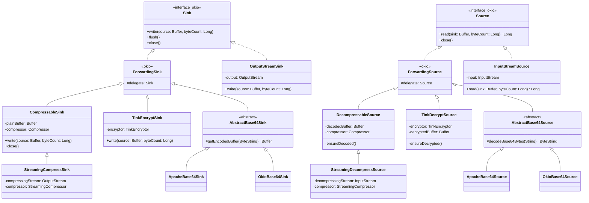
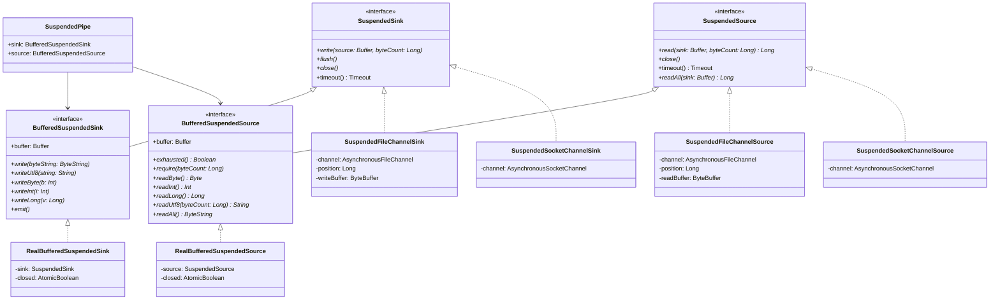
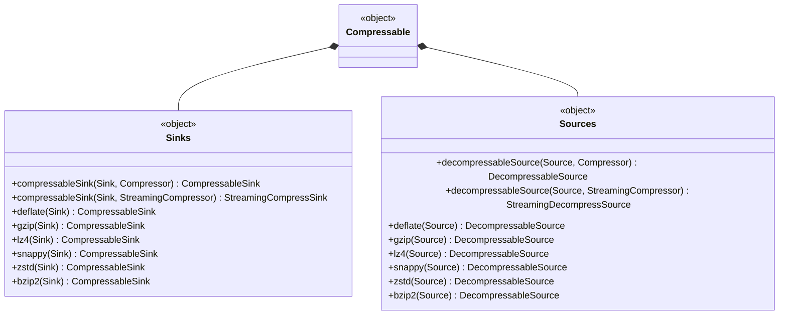
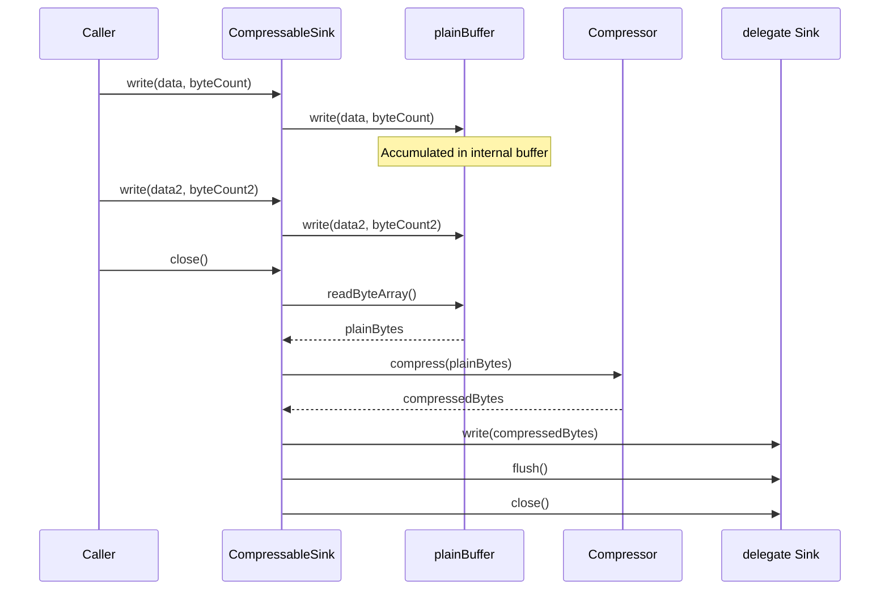
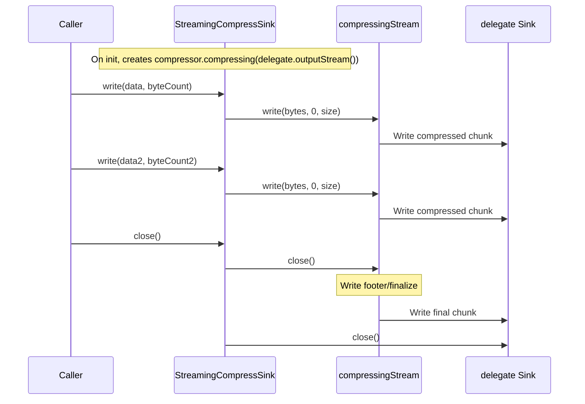
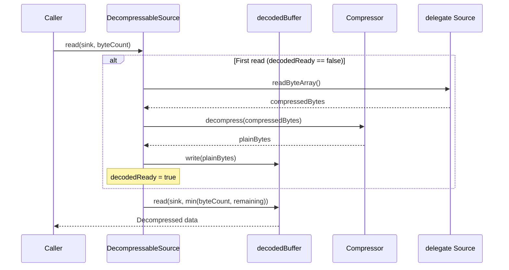
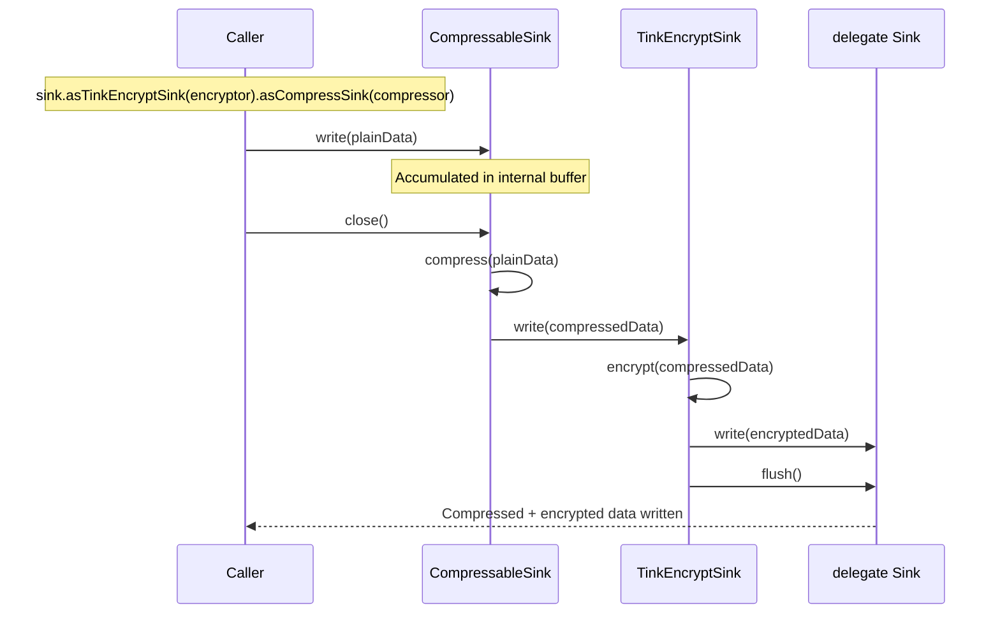
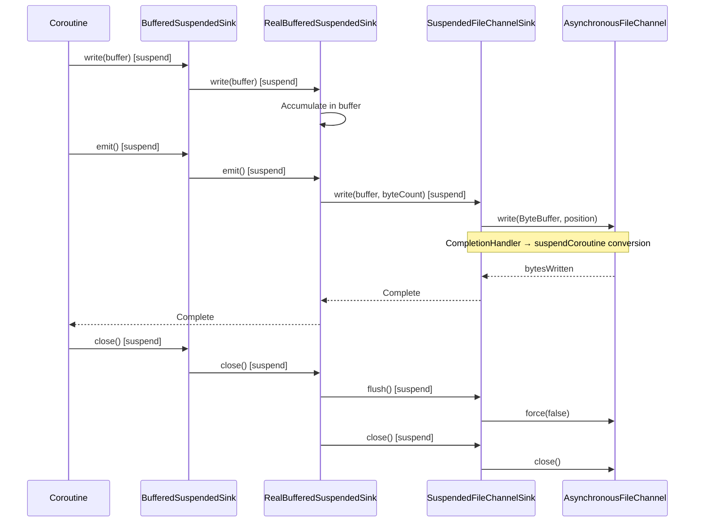

# Module bluetape4k-okio

English | [한국어](./README.ko.md)

## Overview

`bluetape4k-okio` is a high-performance I/O extension module built on Square's [Okio](https://square.github.io/okio/) library. On top of Okio's
`Source`/
`Sink` abstractions, it provides compression, encryption, Base64 encoding, NIO channel integration, and Kotlin Coroutines async I/O.

## Key Features

### 1. Buffer / ByteString Utilities

Factory functions and extension functions for creating Okio `Buffer` and `ByteString` instances.

```kotlin
import io.bluetape4k.okio.*

// Creating Buffers
val buffer = bufferOf("Hello, Okio!")
val buffer2 = bufferOf(byteArrayOf(1, 2, 3))
val buffer3 = bufferOf(inputStream)

// Creating ByteStrings
val byteString = byteStringOf("Hello")
val byteString2 = byteStringOf(byteArrayOf(1, 2, 3))
```

### 2. Source / Sink Extensions

Adapters to convert `InputStream`/`OutputStream` into Okio `Source`/`Sink`.

```kotlin
import io.bluetape4k.okio.*

// InputStream → Source
val source = inputStream.asSource()

// OutputStream → Sink
val sink = outputStream.asSink()
```

### 3. NIO Channel Support

Integrates Java NIO `ReadableByteChannel`/`WritableByteChannel`/`FileChannel` with Okio.

```kotlin
import io.bluetape4k.okio.channels.*

// ByteChannel → Source/Sink
val source = readableByteChannel.asSource()
val sink = writableByteChannel.asSink()

// FileChannel → Source/Sink
val fileSource = FileChannelSource(fileChannel)
val fileSink = FileChannelSink(fileChannel)
```

### 4. Compression Streams

Wraps `bluetape4k-io`'s `Compressor`/`StreamingCompressor` as Okio Sink/Source for streaming compression.

```kotlin
import io.bluetape4k.okio.compress.*
import io.bluetape4k.io.compressor.Compressors

// Compression Sink (compression is finalized on close)
val compressSink = sink.asCompressSink(Compressors.LZ4)
compressSink.use { cs ->
    cs.write(buffer, buffer.size)
}

// Decompression Source
val decompressSource = source.asDecompressSource(Compressors.LZ4)
decompressSource.use { ds ->
    ds.read(outputBuffer, Long.MAX_VALUE)
}

// Using StreamingCompressor (for large-scale streaming)
val streamingSink = sink.asCompressSink(Compressors.Streaming.Zstd)
val streamingSource = source.asDecompressSource(Compressors.Streaming.Zstd)
```

**Important notes:**

- `CompressableSink` finalizes compression at `close()`. Always use `close()` or `use {}`.
- `StreamingCompressSink` also requires `close()` to write the footer/finalize bytes.

### 5. Tink Encryption (Recommended)

Provides encryption Sink/Source based on Google Tink AEAD.

```kotlin
import io.bluetape4k.okio.tink.*
import io.bluetape4k.tink.encrypt.TinkEncryptors

// Encryption Sink
val encryptSink = sink.asTinkEncryptSink(TinkEncryptors.AES256_GCM)
encryptSink.write(buffer, buffer.size)

// Decryption Source
val decryptSource = source.asTinkDecryptSource(TinkEncryptors.AES256_GCM)
val result = Buffer()
decryptSource.read(result, Long.MAX_VALUE)
```

**Encryption + Compression combined:**

```kotlin
// Compress then encrypt
val combinedSink = sink
    .asTinkEncryptSink(TinkEncryptors.AES256_GCM)
    .asCompressSink(Compressors.Zstd)

combinedSink.use { it.write(buffer, buffer.size) }
```

### 6. Base64 Encoding/Decoding

Okio Sink/Source-based Base64 encoding and decoding.

```kotlin
import io.bluetape4k.okio.base64.*

// Base64 encoding Sink
val encodeSink = ApacheBase64Sink(delegate)
encodeSink.write(buffer, buffer.size)

// Base64 decoding Source
val decodeSource = ApacheBase64Source(delegate)
decodeSource.read(outputBuffer, Long.MAX_VALUE)
```

### 7. Kotlin Coroutines Async I/O

Wraps Okio Source/Sink as Kotlin Coroutines `suspend` functions for async I/O.

```kotlin
import io.bluetape4k.okio.coroutines.*
import java.nio.file.Paths

// Suspended file read
suspend fun readFileAsync(path: String): ByteArray {
    val source = SuspendedFileChannelSource(Paths.get(path))
    val buffer = Buffer()
    source.use { it.readAll(buffer) }
    return buffer.readByteArray()
}

// Suspended file write
suspend fun writeFileAsync(path: String, data: ByteArray) {
    val sink = SuspendedFileChannelSink(Paths.get(path))
    val buffer = Buffer().write(data)
    sink.use {
        it.write(buffer)
        it.flush()
    }
}

// Suspended socket communication
val socketSource = SuspendedSocketChannelSource(socketChannel)
val socketSink = SuspendedSocketChannelSink(socketChannel)
```

**Suspended Pipe (producer-consumer pattern):**

```kotlin
import io.bluetape4k.okio.coroutines.*

val pipe = SuspendedPipe()

// Producer
launch {
    pipe.sink.use { sink ->
        sink.write(Buffer().writeUtf8("Hello"))
        sink.flush()
    }
}

// Consumer
launch {
    pipe.source.use { source ->
        val buffer = Buffer()
        source.read(buffer, Long.MAX_VALUE)
    }
}
```

## Adding the Dependency

### Gradle (Kotlin DSL)

```kotlin
dependencies {
    implementation("io.github.bluetape4k:bluetape4k-okio:${version}")

    // Required (included automatically)
    // io.github.bluetape4k:bluetape4k-io
    // com.squareup.okio:okio

    // Optional (add based on features needed)
    implementation("io.github.bluetape4k:bluetape4k-tink:${version}")        // Tink encryption
    implementation("io.github.bluetape4k:bluetape4k-coroutines:${version}")  // Coroutines async I/O
    implementation("commons-codec:commons-codec:1.17.0")                     // Base64
}
```

## Module Structure

```
io.bluetape4k.okio
├── BufferSupport.kt            # Buffer factory (bufferOf)
├── ByteStringSupport.kt        # ByteString factory (byteStringOf)
├── SinkSupport.kt              # Sink extension functions
├── SourceSupport.kt            # Source extension functions
├── InputStreamSource.kt        # InputStream → Source adapter
├── OutputStreamSink.kt         # OutputStream → Sink adapter
├── channels/                   # NIO channel integration
│   ├── FileChannelSink.kt
│   ├── FileChannelSource.kt
│   ├── ByteChannelSink.kt
│   └── ByteChannelSource.kt
├── compress/                   # Compression streams
│   ├── CompressableSink.kt     # Compressor-based compression Sink
│   ├── DecompressableSource.kt # Compressor-based decompression Source
│   ├── SinkWithCompressor.kt   # Legacy-compatible compression Sink
│   ├── SourceWithCompressor.kt # Legacy-compatible decompression Source
│   └── Compressable.kt         # Compression interface
├── tink/                       # Tink AEAD encryption (recommended)
│   ├── TinkEncryptSink.kt
│   └── TinkDecryptSource.kt
├── base64/                     # Base64 encoding/decoding
│   ├── ApacheBase64Sink.kt
│   ├── ApacheBase64Source.kt
│   ├── OkioBase64Sink.kt
│   └── OkioBase64Source.kt
└── coroutines/                 # Kotlin Coroutines async I/O
    ├── SuspendedSource.kt
    ├── SuspendedSink.kt
    ├── SuspendedFileChannelSource.kt
    ├── SuspendedFileChannelSink.kt
    ├── SuspendedSocketChannelSource.kt
    ├── SuspendedSocketChannelSink.kt
    ├── SuspendedPipe.kt
    └── [Buffered implementations, etc.]
```

## Class Structure

### Sink / Source Adapter Hierarchy

Compression, encryption, and Base64 encoding are layered on top of Okio's `Sink`/
`Source` abstractions using the decorator pattern.



### NIO Channel Adapter Hierarchy

Converts Java NIO `FileChannel`/`ByteChannel` to Okio `Sink`/`Source`.


### Coroutines Async I/O Hierarchy

Async Sink/Source abstraction based on Kotlin Coroutines `suspend` functions.



### Compression Factory (Compressable)

The
`Compressable` object provides a convenient way to create compression/decompression Sink/Source for various algorithms.



## Sequence Diagrams

### Compression Sink (One-Shot) — compress on close

`CompressableSink` accumulates all data in an internal buffer and compresses everything at `close()`.



### Compression Sink (Streaming) — compress incrementally

`StreamingCompressSink` compresses data immediately as it arrives, making it ideal for large-scale streaming.



### Decompression Source (One-Shot) — decompress on first read

`DecompressableSource` decompresses and caches all data on the first `read()` call.



### Tink Encryption + Compression Combined Flow

Compression followed by encryption using chained Sink decorators.



### Coroutines Async File I/O Flow

Non-blocking file I/O using `AsynchronousFileChannel`.



## License

Apache License 2.0

## References

- [Okio Documentation](https://square.github.io/okio/)
- [Google Tink](https://developers.google.com/tink)
- [bluetape4k-io](../io/README.md)
- [bluetape4k-tink](../tink/README.md)
