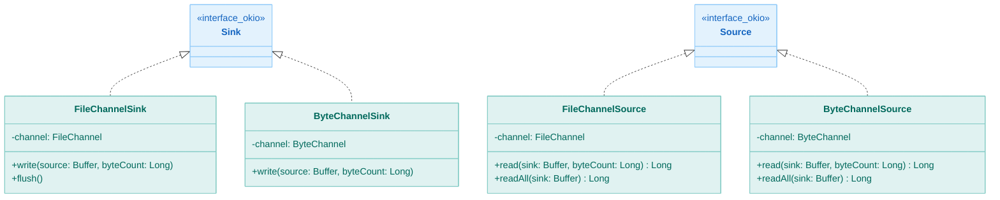
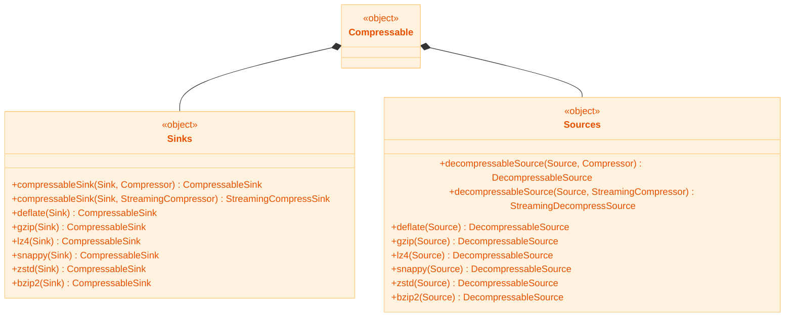
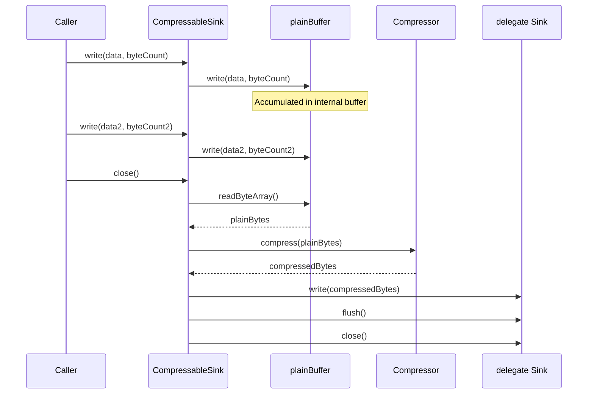
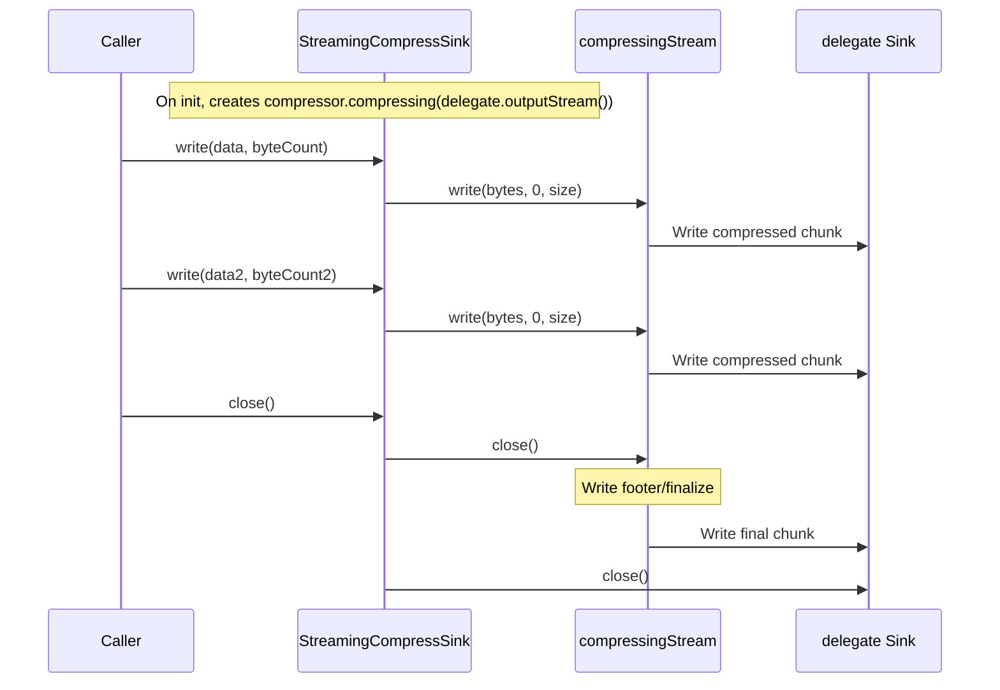
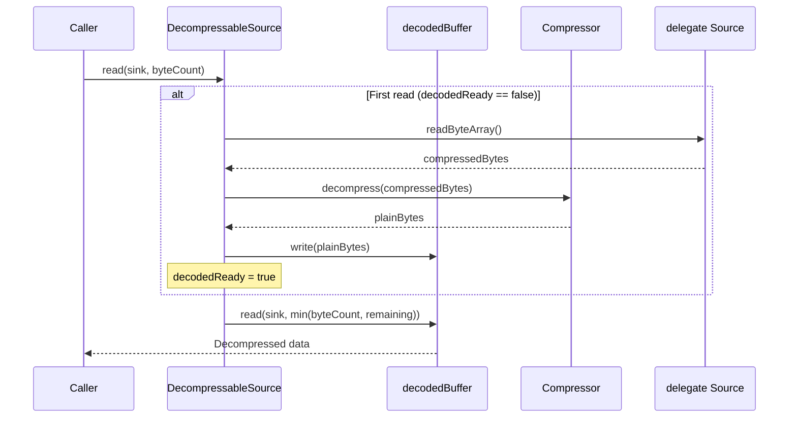
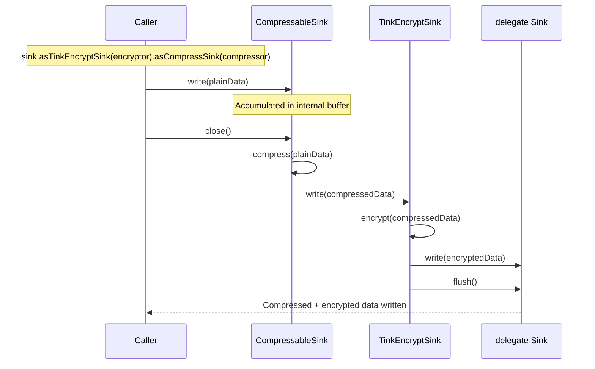
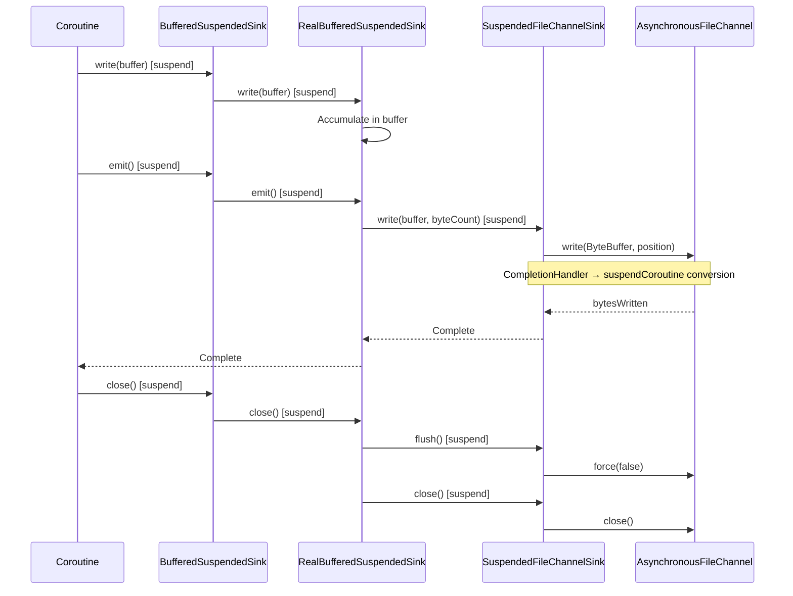

# Module bluetape4k-okio

English | [한국어](./README.ko.md)

## Overview

`bluetape4k-okio` is a high-performance I/O extension module built on Square's [Okio](https://square.github.io/okio/) library. On top of Okio's
`Source`/
`Sink` abstractions, it provides compression, encryption, Base64 encoding, NIO channel integration, and Kotlin Coroutines async I/O.

## Why Okio

Okio is a pragmatic replacement layer for the parts of `java.io` and `java.nio`
that tend to create awkward, allocation-heavy, or error-prone code. The core
model is intentionally small: data flows through `Source` and `Sink`, and callers
usually work with `BufferedSource`, `BufferedSink`, `Buffer`, and `ByteString`.

Key strengths:

- **Composable stream pipeline**: compression, encryption, Base64, hashing, and
  channel adapters can be layered as small decorators around `Source`/`Sink`.
- **Efficient buffering**: `Buffer` stores bytes in reusable segments and can move
  data between buffers without copying every byte.
- **Binary data as values**: `ByteString` makes immutable bytes easy to compare,
  encode, decode, hash, and pass across module boundaries.
- **One API for bytes and text**: the same buffered API handles raw bytes,
  UTF-8, primitive numbers, and line-oriented protocols without switching
  between byte streams and reader/writer wrappers.
- **Safer I/O contracts**: `Timeout`, compact `Source`/`Sink` interfaces, and
  buffered reads avoid common `InputStream.available()` and single-byte-read
  pitfalls.
- **Testability**: `Buffer` can stand in for both a source and a sink, so most
  codec and protocol logic can be tested without files, sockets, or temp
  streams.
- **Coroutine-friendly extensions in this module**: `SuspendedSource`,
  `SuspendedSink`, suspended file/socket channels, and `SuspendedPipe` make Okio
  style pipelines usable from structured concurrency code.

## Recommended Usage Scenarios

Use `bluetape4k-okio` when your code needs one or more of these behaviors:

- **Protocol or payload codecs**: implement binary protocols, framed messages,
  length-prefixed records, checksums, or UTF-8 line parsers with `Buffer` and
  `BufferedSource`.
- **Streaming transformations**: compress, decompress, encrypt, decrypt, or
  Base64-encode data while preserving the `Source`/`Sink` shape of the pipeline.
- **Large payload processing**: prefer streaming compressors, DAEAD chunk
  encryption, and buffered copying when payloads should not be materialized as a
  single byte array.
- **Bridging legacy and modern I/O**: adapt `InputStream`, `OutputStream`,
  `ReadableByteChannel`, `WritableByteChannel`, and `FileChannel` into a common
  Okio-based pipeline.
- **Coroutine-based services**: use suspended file/socket adapters and
  `SuspendedPipe` when the caller is already using structured concurrency and
  should not block a coroutine dispatcher with raw stream operations.
- **Deterministic tests for I/O code**: model sources and sinks with `Buffer`,
  then add file/socket tests only for the integration boundary.
- **Security-sensitive payload envelopes**: use DAEAD chunk encryption when the
  payload is written incrementally and associated data must be authenticated with
  every frame.

Recommended defaults:

- Prefer `use {}` around every source and sink that owns a resource.
- Prefer streaming adapters for unknown or large payload sizes.
- Prefer DAEAD chunk encryption for multi-write encrypted payloads.
- Keep compression before encryption unless the protocol explicitly requires the
  opposite order.
- Treat `ByteString` as the public immutable boundary type and `Buffer` as the
  mutable working area.
- In coroutine code, prefer `SuspendedSource`/`SuspendedSink` and the suspended
  buffered APIs instead of wrapping blocking stream calls directly.

## Anti-Patterns

Avoid these patterns when using this module:

- **Do not rely on `InputStream.available()`** to decide whether a read can
  complete. Use buffered Okio reads such as `request`, `require`, `exhausted`,
  `readUtf8Line`, or protocol-specific length checks.
- **Do not read one byte at a time from raw streams** in hot paths. Buffer the
  source and consume bytes, strings, or primitives through `BufferedSource`.
- **Do not materialize large streams with `readByteArray()` or `readUtf8()`**
  unless the input is bounded and trusted. Stream to a sink or process frames
  incrementally.
- **Do not forget `close()` on compression or encryption sinks**. Some adapters
  finalize footers, frames, or ciphertext only when closed.
- **Do not use legacy `TinkEncryptSink` for multi-write payloads**. It creates
  independent ciphertexts per write while the matching decrypt source expects a
  single ciphertext. Use DAEAD chunk encryption for incremental writes.
- **Do not reuse mismatched associated data** for DAEAD decryption. Associated
  data is authenticated and must be identical to the encryption value.
- **Do not swallow coroutine cancellation**. Re-throw `CancellationException`
  before broad exception handling, especially around `close()` and cleanup paths.
- **Do not implement a `SuspendedSource` that repeatedly returns `0L` for
  positive read requests**. A positive read should either make progress, suspend
  until progress is possible, or return `-1L` at EOF. Buffered suspended sources
  fail fast after repeated no-progress reads to avoid infinite loops.
- **Do not share a mutable `Buffer` across concurrent writers/readers without
  ownership discipline**. Use `SuspendedPipe`, immutable `ByteString`, or a
  higher-level queue/channel when ownership crosses coroutine or thread
  boundaries.
- **Do not mix one-shot and streaming adapters accidentally**. One-shot
  compression/decompression buffers the full payload; streaming adapters are the
  safer default for unbounded input.

## Key Features

### 1. Buffer / ByteString Utilities

Factory functions and extension functions for creating Okio `Buffer` and `ByteString` instances.

```kotlin
import io.bluetape4k.okio.*

// Creating Buffers
val buffer = bufferOf("Hello, Okio!")
val buffer2 = bufferOf(byteArrayOf(1, 2, 3))
val buffer3 = bufferOf(inputStream)

// Creating ByteStrings
val byteString = byteStringOf("Hello")
val byteString2 = byteStringOf(byteArrayOf(1, 2, 3))
```

### 2. Source / Sink Extensions

Adapters to convert `InputStream`/`OutputStream` into Okio `Source`/`Sink`.

```kotlin
import io.bluetape4k.okio.*

// InputStream → Source
val source = inputStream.asSource()

// OutputStream → Sink
val sink = outputStream.asSink()
```

### 3. NIO Channel Support

Integrates Java NIO `ReadableByteChannel`/`WritableByteChannel`/`FileChannel` with Okio.

```kotlin
import io.bluetape4k.okio.channels.*

// ByteChannel → Source/Sink
val source = readableByteChannel.asSource()
val sink = writableByteChannel.asSink()

// FileChannel → Source/Sink
val fileSource = FileChannelSource(fileChannel)
val fileSink = FileChannelSink(fileChannel)
```

### 4. Compression Streams

Wraps `bluetape4k-io`'s `Compressor`/`StreamingCompressor` as Okio Sink/Source for streaming compression.

```kotlin
import io.bluetape4k.okio.compress.*
import io.bluetape4k.io.compressor.Compressors

// Compression Sink (compression is finalized on close)
val compressSink = sink.asCompressSink(Compressors.LZ4)
compressSink.use { cs ->
    cs.write(buffer, buffer.size)
}

// Decompression Source
val decompressSource = source.asDecompressSource(Compressors.LZ4)
decompressSource.use { ds ->
    ds.read(outputBuffer, Long.MAX_VALUE)
}

// Using StreamingCompressor (for large-scale streaming)
val streamingSink = sink.asCompressSink(Compressors.Streaming.Zstd)
val streamingSource = source.asDecompressSource(Compressors.Streaming.Zstd)
```

**Important notes:**

- `CompressableSink` finalizes compression at `close()`. Always use `close()` or `use {}`.
- `StreamingCompressSink` also requires `close()` to write the footer/finalize bytes.

### 5. Tink Encryption

Provides encryption Sink/Source based on Google Tink AEAD.

```kotlin
import io.bluetape4k.okio.tink.*
import io.bluetape4k.tink.encrypt.TinkEncryptors

// Encryption Sink
val encryptSink = sink.asTinkEncryptSink(TinkEncryptors.AES256_GCM)
encryptSink.write(buffer, buffer.size)

// Decryption Source
val decryptSource = source.asTinkDecryptSource(TinkEncryptors.AES256_GCM)
val result = Buffer()
decryptSource.read(result, Long.MAX_VALUE)
```

The legacy `TinkEncryptSink`/`TinkDecryptSource` pair treats the entire stream as a
**single ciphertext**: `TinkEncryptSink` finalizes encryption on `close()`, and
`TinkDecryptSource` reads the delegate source to completion before producing any
plaintext. Use this adapter only with existing single-ciphertext payloads; using
multiple `write()` calls produces multiple independent ciphertexts that
`TinkDecryptSource` cannot decode.

For large payloads or data written with multiple `write()` calls, use the DAEAD
chunk adapter instead. Decryption is incremental — only one chunk's ciphertext is
held in memory at a time, regardless of total payload size:

```kotlin
import io.bluetape4k.okio.tink.*
import io.bluetape4k.tink.daead.TinkDaeads

val daead = TinkDaeads.AES256_SIV
val contextBytes = "my-context".toByteArray()

val encrypted = Buffer()
encrypted.asDaeadChunkEncryptSink(
    daead,
    chunkSize = DEFAULT_DAEAD_CHUNK_SIZE,   // 64 KiB default; override as needed
    associatedData = contextBytes,
).use { encryptSink ->
    encryptSink.write(buffer, buffer.size)
}

val decrypted = Buffer()
encrypted.asDaeadChunkDecryptSource(
    daead,
    associatedData = contextBytes,          // must match encryption value
).use { decryptSource ->
    decryptSource.read(decrypted, Long.MAX_VALUE)
}
```

DAEAD chunk encryption writes each frame as `[1-byte flags][8-byte big-endian
ciphertext length][ciphertext]`. `DEFAULT_DAEAD_CHUNK_SIZE` is 64 KiB. The
chunk index and final-frame flag are bound into DAEAD associated data so frame
reorder, duplicate replay, whole-frame truncation, and trailing data after the
final frame fail during decryption.
This is the v2 DAEAD chunk format and is not wire-compatible with older
`[8-byte length][ciphertext]` frames.
Always close the encrypt sink, preferably with `use {}`, because the final frame
is written on `close()`.

Deterministic AEAD produces the same ciphertext for the same key, plaintext, and
associated data. This can reveal repeated plaintext chunks. Associated data is
authenticated but not encrypted, and the **same value must be supplied for
decryption**.

**Encryption + Compression combined:**

```kotlin
// Compress then encrypt
val combinedSink = sink
    .asTinkEncryptSink(TinkEncryptors.AES256_GCM)
    .asCompressSink(Compressors.Zstd)

combinedSink.use { it.write(buffer, buffer.size) }
```

### 6. Base64 Encoding/Decoding

Okio Sink/Source-based Base64 encoding and decoding.

```kotlin
import io.bluetape4k.okio.base64.*

// Base64 encoding Sink
val encodeSink = ApacheBase64Sink(delegate)
encodeSink.write(buffer, buffer.size)

// Base64 decoding Source
val decodeSource = ApacheBase64Source(delegate)
decodeSource.read(outputBuffer, Long.MAX_VALUE)
```

### 7. Kotlin Coroutines Async I/O

Wraps Okio Source/Sink as Kotlin Coroutines `suspend` functions for async I/O.

```kotlin
import io.bluetape4k.okio.coroutines.*
import java.nio.file.Paths

// Suspended file read
suspend fun readFileAsync(path: String): ByteArray {
    val source = SuspendedFileChannelSource(Paths.get(path))
    val buffer = Buffer()
    source.use { it.readAll(buffer) }
    return buffer.readByteArray()
}

// Suspended file write
suspend fun writeFileAsync(path: String, data: ByteArray) {
    val sink = SuspendedFileChannelSink(Paths.get(path))
    val buffer = Buffer().write(data)
    sink.use {
        it.write(buffer)
        it.flush()
    }
}

// Suspended socket communication
val socketSource = SuspendedSocketChannelSource(socketChannel)
val socketSink = SuspendedSocketChannelSink(socketChannel)
```

Buffered suspended sources guard against broken or non-blocking delegates that
repeatedly return `0L` for positive read requests. Operations that need more
data, such as `request`, `skip`, `select`, `indexOf`, and `readAll`, throw an
`IOException` after repeated no-progress reads instead of spinning forever.

**Suspended Pipe (producer-consumer pattern):**

```kotlin
import io.bluetape4k.okio.coroutines.*

val pipe = SuspendedPipe()

// Producer
launch {
    pipe.sink.use { sink ->
        sink.write(Buffer().writeUtf8("Hello"))
        sink.flush()
    }
}

// Consumer
launch {
    pipe.source.use { source ->
        val buffer = Buffer()
        source.read(buffer, Long.MAX_VALUE)
    }
}
```

## Adding the Dependency

### Gradle (Kotlin DSL)

```kotlin
dependencies {
    implementation("io.github.bluetape4k:bluetape4k-okio:${version}")

    // Required (included automatically)
    // io.github.bluetape4k:bluetape4k-io
    // com.squareup.okio:okio

    // Optional (add based on features needed)
    implementation("io.github.bluetape4k:bluetape4k-tink:${version}")        // Tink encryption
    implementation("io.github.bluetape4k:bluetape4k-coroutines:${version}")  // Coroutines async I/O
    implementation("commons-codec:commons-codec:1.17.0")                     // Base64
}
```

## Module Structure

```
io.bluetape4k.okio
├── BufferSupport.kt            # Buffer factory (bufferOf)
├── ByteStringSupport.kt        # ByteString factory (byteStringOf)
├── SinkSupport.kt              # Sink extension functions
├── SourceSupport.kt            # Source extension functions
├── InputStreamSource.kt        # InputStream → Source adapter
├── OutputStreamSink.kt         # OutputStream → Sink adapter
├── channels/                   # NIO channel integration
│   ├── FileChannelSink.kt
│   ├── FileChannelSource.kt
│   ├── ByteChannelSink.kt
│   └── ByteChannelSource.kt
├── compress/                   # Compression streams
│   ├── CompressableSink.kt     # Compressor-based compression Sink
│   ├── DecompressableSource.kt # Compressor-based decompression Source
│   ├── SinkWithCompressor.kt   # Legacy-compatible compression Sink
│   ├── SourceWithCompressor.kt # Legacy-compatible decompression Source
│   └── Compressable.kt         # Compression interface
├── tink/                       # Tink AEAD and DAEAD chunk encryption
│   ├── TinkEncryptSink.kt
│   ├── TinkDecryptSource.kt
│   ├── DaeadChunkEncryptSink.kt
│   └── DaeadChunkDecryptSource.kt
├── base64/                     # Base64 encoding/decoding
│   ├── ApacheBase64Sink.kt
│   ├── ApacheBase64Source.kt
│   ├── OkioBase64Sink.kt
│   └── OkioBase64Source.kt
└── coroutines/                 # Kotlin Coroutines async I/O
    ├── SuspendedSource.kt
    ├── SuspendedSink.kt
    ├── SuspendedFileChannelSource.kt
    ├── SuspendedFileChannelSink.kt
    ├── SuspendedSocketChannelSource.kt
    ├── SuspendedSocketChannelSink.kt
    ├── SuspendedPipe.kt
    └── [Buffered implementations, etc.]
```

## Class Structure

### Sink / Source Adapter Hierarchy

Compression, encryption, and Base64 encoding are layered on top of Okio's `Sink`/
`Source` abstractions using the decorator pattern.


```mermaid
classDiagram
    class Sink {
        <<interface_okio>>
        +write(source: Buffer, byteCount: Long)
        +flush()
        +close()
    }

    class Source {
        <<interface_okio>>
        +read(sink: Buffer, byteCount: Long) Long
        +close()
    }

    class ForwardingSink {
        <<okio>>
        #delegate: Sink
    }

    class ForwardingSource {
        <<okio>>
        #delegate: Source
    }

    class InputStreamSource {
        -input: InputStream
        +read(sink: Buffer, byteCount: Long) Long
    }

    class OutputStreamSink {
        -output: OutputStream
        +write(source: Buffer, byteCount: Long)
    }

    class CompressableSink {
        -plainBuffer: Buffer
        -compressor: Compressor
        +write(source: Buffer, byteCount: Long)
        +close()
    }

    class StreamingCompressSink {
        -compressingStream: OutputStream
        -compressor: StreamingCompressor
    }

    class DecompressableSource {
        -decodedBuffer: Buffer
        -compressor: Compressor
        -ensureDecoded()
    }

    class StreamingDecompressSource {
        -decompressingStream: InputStream
        -compressor: StreamingCompressor
    }

    class TinkEncryptSink {
        -encryptor: TinkEncryptor
        +write(source: Buffer, byteCount: Long)
    }

    class TinkDecryptSource {
        -encryptor: TinkEncryptor
        -decryptedBuffer: Buffer
        -ensureDecrypted()
    }

    class DaeadChunkEncryptSink {
        -daead: TinkDeterministicAead
        -plainBuffer: Buffer
        +write(source: Buffer, byteCount: Long)
        +close()
    }

    class DaeadChunkDecryptSource {
        -daead: TinkDeterministicAead
        -plainBuffer: Buffer
        +read(sink: Buffer, byteCount: Long) Long
    }

    class AbstractBase64Sink {
        <<abstract>>
        #getEncodedBuffer(ByteString) Buffer
    }

    class AbstractBase64Source {
        <<abstract>>
        #decodeBase64Bytes(String) ByteString
    }


    Sink <|.. ForwardingSink
    Source <|.. ForwardingSource
    Source <|.. InputStreamSource
    Sink <|.. OutputStreamSink

    ForwardingSink <|-- CompressableSink
    CompressableSink <|-- StreamingCompressSink
    ForwardingSource <|-- DecompressableSource
    DecompressableSource <|-- StreamingDecompressSource

    ForwardingSink <|-- TinkEncryptSink
    ForwardingSource <|-- TinkDecryptSource
    ForwardingSink <|-- DaeadChunkEncryptSink
    ForwardingSource <|-- DaeadChunkDecryptSource

    ForwardingSink <|-- AbstractBase64Sink
    AbstractBase64Sink <|-- ApacheBase64Sink
    AbstractBase64Sink <|-- OkioBase64Sink
    ForwardingSource <|-- AbstractBase64Source
    AbstractBase64Source <|-- ApacheBase64Source
    AbstractBase64Source <|-- OkioBase64Source

    style Sink fill:#E3F2FD,stroke:#90CAF9,color:#1565C0
    style Source fill:#E3F2FD,stroke:#90CAF9,color:#1565C0
    style ForwardingSink fill:#ECEFF1,stroke:#B0BEC5,color:#37474F
    style ForwardingSource fill:#ECEFF1,stroke:#B0BEC5,color:#37474F
    style InputStreamSource fill:#E0F2F1,stroke:#80CBC4,color:#00695C
    style OutputStreamSink fill:#E0F2F1,stroke:#80CBC4,color:#00695C
    style CompressableSink fill:#FCE4EC,stroke:#F48FB1,color:#AD1457
    style StreamingCompressSink fill:#FCE4EC,stroke:#F48FB1,color:#AD1457
    style DecompressableSource fill:#FCE4EC,stroke:#F48FB1,color:#AD1457
    style StreamingDecompressSource fill:#FCE4EC,stroke:#F48FB1,color:#AD1457
    style TinkEncryptSink fill:#FCE4EC,stroke:#F48FB1,color:#AD1457
    style TinkDecryptSource fill:#FCE4EC,stroke:#F48FB1,color:#AD1457
    style DaeadChunkEncryptSink fill:#FCE4EC,stroke:#F48FB1,color:#AD1457
    style DaeadChunkDecryptSource fill:#FCE4EC,stroke:#F48FB1,color:#AD1457
    style AbstractBase64Sink fill:#E3F2FD,stroke:#90CAF9,color:#1565C0
    style AbstractBase64Source fill:#E3F2FD,stroke:#90CAF9,color:#1565C0
    style ApacheBase64Sink fill:#E0F2F1,stroke:#80CBC4,color:#00695C
    style ApacheBase64Source fill:#E0F2F1,stroke:#80CBC4,color:#00695C
    style OkioBase64Sink fill:#E0F2F1,stroke:#80CBC4,color:#00695C
    style OkioBase64Source fill:#E0F2F1,stroke:#80CBC4,color:#00695C
```

### NIO Channel Adapter Hierarchy

Converts Java NIO `FileChannel`/`ByteChannel` to Okio `Sink`/`Source`.


```mermaid
classDiagram
    class Sink {
        <<interface_okio>>
    }
    class Source {
        <<interface_okio>>
    }

    class FileChannelSink {
        -channel: FileChannel
        +write(source: Buffer, byteCount: Long)
        +flush()
    }

    class FileChannelSource {
        -channel: FileChannel
        +read(sink: Buffer, byteCount: Long) Long
        +readAll(sink: Buffer) Long
    }

    class ByteChannelSink {
        -channel: ByteChannel
        +write(source: Buffer, byteCount: Long)
    }

    class ByteChannelSource {
        -channel: ByteChannel
        +read(sink: Buffer, byteCount: Long) Long
        +readAll(sink: Buffer) Long
    }

    Sink <|.. FileChannelSink
    Sink <|.. ByteChannelSink
    Source <|.. FileChannelSource
    Source <|.. ByteChannelSource

    style Sink fill:#E3F2FD,stroke:#90CAF9,color:#1565C0
    style Source fill:#E3F2FD,stroke:#90CAF9,color:#1565C0
    style FileChannelSink fill:#E0F2F1,stroke:#80CBC4,color:#00695C
    style FileChannelSource fill:#E0F2F1,stroke:#80CBC4,color:#00695C
    style ByteChannelSink fill:#E0F2F1,stroke:#80CBC4,color:#00695C
    style ByteChannelSource fill:#E0F2F1,stroke:#80CBC4,color:#00695C
```

### Coroutines Async I/O Hierarchy

Async Sink/Source abstraction based on Kotlin Coroutines `suspend` functions.


```mermaid
classDiagram
    class SuspendedSink {
        <<interface>>
        +write(source: Buffer, byteCount: Long)*
        +flush()*
        +close()*
        +timeout() Timeout
    }

    class SuspendedSource {
        <<interface>>
        +read(sink: Buffer, byteCount: Long)* Long
        +close()*
        +timeout() Timeout
        +readAll(sink: Buffer)* Long
    }

    class BufferedSuspendedSink {
        <<interface>>
        +buffer: Buffer
        +write(byteString: ByteString)*
        +writeUtf8(string: String)*
        +writeByte(b: Int)*
        +writeInt(i: Int)*
        +writeLong(v: Long)*
        +emit()*
    }

    class BufferedSuspendedSource {
        <<interface>>
        +buffer: Buffer
        +exhausted()* Boolean
        +require(byteCount: Long)*
        +readByte()* Byte
        +readInt()* Int
        +readLong()* Long
        +readUtf8(byteCount: Long)* String
        +readAll()* ByteString
    }

    class RealBufferedSuspendedSink {
        -sink: SuspendedSink
        -closed: AtomicBoolean
    }

    class RealBufferedSuspendedSource {
        -source: SuspendedSource
        -closed: AtomicBoolean
    }

    class SuspendedFileChannelSink {
        -channel: AsynchronousFileChannel
        -position: Long
        -writeBuffer: ByteBuffer
    }

    class SuspendedFileChannelSource {
        -channel: AsynchronousFileChannel
        -position: Long
        -readBuffer: ByteBuffer
    }

    class SuspendedSocketChannelSink {
        -channel: AsynchronousSocketChannel
    }

    class SuspendedSocketChannelSource {
        -channel: AsynchronousSocketChannel
    }

    class SuspendedPipe {
        +sink: BufferedSuspendedSink
        +source: BufferedSuspendedSource
    }

    SuspendedSink <|-- BufferedSuspendedSink
    BufferedSuspendedSink <|.. RealBufferedSuspendedSink

    SuspendedSource <|-- BufferedSuspendedSource
    BufferedSuspendedSource <|.. RealBufferedSuspendedSource

    SuspendedSink <|.. SuspendedFileChannelSink
    SuspendedSink <|.. SuspendedSocketChannelSink
    SuspendedSource <|.. SuspendedFileChannelSource
    SuspendedSource <|.. SuspendedSocketChannelSource

    SuspendedPipe --> BufferedSuspendedSink
    SuspendedPipe --> BufferedSuspendedSource

    style SuspendedSink fill:#F3E5F5,stroke:#CE93D8,color:#6A1B9A
    style SuspendedSource fill:#F3E5F5,stroke:#CE93D8,color:#6A1B9A
    style BufferedSuspendedSink fill:#F3E5F5,stroke:#CE93D8,color:#6A1B9A
    style BufferedSuspendedSource fill:#F3E5F5,stroke:#CE93D8,color:#6A1B9A
    style RealBufferedSuspendedSink fill:#E0F2F1,stroke:#80CBC4,color:#00695C
    style RealBufferedSuspendedSource fill:#E0F2F1,stroke:#80CBC4,color:#00695C
    style SuspendedFileChannelSink fill:#E0F2F1,stroke:#80CBC4,color:#00695C
    style SuspendedFileChannelSource fill:#E0F2F1,stroke:#80CBC4,color:#00695C
    style SuspendedSocketChannelSink fill:#E0F2F1,stroke:#80CBC4,color:#00695C
    style SuspendedSocketChannelSource fill:#E0F2F1,stroke:#80CBC4,color:#00695C
    style SuspendedPipe fill:#FFFDE7,stroke:#FFF176,color:#F57F17
```

### Compression Factory (Compressable)

The
`Compressable` object provides a convenient way to create compression/decompression Sink/Source for various algorithms.


```mermaid
classDiagram
    class Compressable {
        <<object>>
    }

    class Sinks {
        <<object>>
        +compressableSink(Sink, Compressor) CompressableSink
        +compressableSink(Sink, StreamingCompressor) StreamingCompressSink
        +deflate(Sink) CompressableSink
        +gzip(Sink) CompressableSink
        +lz4(Sink) CompressableSink
        +snappy(Sink) CompressableSink
        +zstd(Sink) CompressableSink
        +bzip2(Sink) CompressableSink
    }

    class Sources {
        <<object>>
        +decompressableSource(Source, Compressor) DecompressableSource
        +decompressableSource(Source, StreamingCompressor) StreamingDecompressSource
        +deflate(Source) DecompressableSource
        +gzip(Source) DecompressableSource
        +lz4(Source) DecompressableSource
        +snappy(Source) DecompressableSource
        +zstd(Source) DecompressableSource
        +bzip2(Source) DecompressableSource
    }

    Compressable *-- Sinks
    Compressable *-- Sources

    style Compressable fill:#FFF3E0,stroke:#FFCC80,color:#E65100
    style Sinks fill:#FFF3E0,stroke:#FFCC80,color:#E65100
    style Sources fill:#FFF3E0,stroke:#FFCC80,color:#E65100
```

## Sequence Diagrams

### Compression Sink (One-Shot) — compress on close

`CompressableSink` accumulates all data in an internal buffer and compresses everything at `close()`.


```mermaid
sequenceDiagram
        participant C as Caller
        participant CS as CompressableSink
        participant PB as plainBuffer
        participant Comp as Compressor
        participant D as delegate Sink

    C->>CS: write(data, byteCount)
    CS->>PB: write(data, byteCount)
    Note over PB: Accumulated in internal buffer

    C->>CS: write(data2, byteCount2)
    CS->>PB: write(data2, byteCount2)

    C->>CS: close()
    CS->>PB: readByteArray()
    PB-->>CS: plainBytes
    CS->>Comp: compress(plainBytes)
    Comp-->>CS: compressedBytes
    CS->>D: write(compressedBytes)
    CS->>D: flush()
    CS->>D: close()
```

### Compression Sink (Streaming) — compress incrementally

`StreamingCompressSink` compresses data immediately as it arrives, making it ideal for large-scale streaming.


```mermaid
sequenceDiagram
        participant C as Caller
        participant SS as StreamingCompressSink
        participant CS as compressingStream
        participant D as delegate Sink

    Note over SS: On init, creates compressor.compressing(delegate.outputStream())

    C->>SS: write(data, byteCount)
    SS->>CS: write(bytes, 0, size)
    CS->>D: Write compressed chunk

    C->>SS: write(data2, byteCount2)
    SS->>CS: write(bytes, 0, size)
    CS->>D: Write compressed chunk

    C->>SS: close()
    SS->>CS: close()
    Note over CS: Write footer/finalize
    CS->>D: Write final chunk
    SS->>D: close()
```

### Decompression Source (One-Shot) — decompress on first read

`DecompressableSource` decompresses and caches all data on the first `read()` call.


```mermaid
sequenceDiagram
        participant C as Caller
        participant DS as DecompressableSource
        participant DB as decodedBuffer
        participant Comp as Compressor
        participant D as delegate Source

    C->>DS: read(sink, byteCount)
    alt First read (decodedReady == false)
        DS->>D: readByteArray()
        D-->>DS: compressedBytes
        DS->>Comp: decompress(compressedBytes)
        Comp-->>DS: plainBytes
        DS->>DB: write(plainBytes)
        Note over DS: decodedReady = true
    end
    DS->>DB: read(sink, min(byteCount, remaining))
    DB-->>C: Decompressed data
```

### Tink Encryption + Compression Combined Flow

Compression followed by encryption using chained Sink decorators.


```mermaid
sequenceDiagram
        participant C as Caller
        participant CS as CompressableSink
        participant ES as TinkEncryptSink
        participant D as delegate Sink

    Note over C: sink.asTinkEncryptSink(encryptor).asCompressSink(compressor)

    C->>CS: write(plainData)
    Note over CS: Accumulated in internal buffer

    C->>CS: close()
    CS->>CS: compress(plainData)
    CS->>ES: write(compressedData)
    ES->>ES: encrypt(compressedData)
    ES->>D: write(encryptedData)
    ES->>D: flush()
    D-->>C: Compressed + encrypted data written
```

### Coroutines Async File I/O Flow

Non-blocking file I/O using `AsynchronousFileChannel`.


```mermaid
sequenceDiagram
        participant C as Coroutine
        participant BS as BufferedSuspendedSink
        participant RS as RealBufferedSuspendedSink
        participant FS as SuspendedFileChannelSink
        participant CH as AsynchronousFileChannel

    C->>BS: write(buffer) [suspend]
    BS->>RS: write(buffer) [suspend]
    RS->>RS: Accumulate in buffer
    C->>BS: emit() [suspend]
    BS->>RS: emit() [suspend]
    RS->>FS: write(buffer, byteCount) [suspend]
    FS->>CH: write(ByteBuffer, position)
    Note over FS,CH: CompletionHandler → suspendCoroutine conversion
    CH-->>FS: bytesWritten
    FS-->>RS: Complete
    RS-->>C: Complete

    C->>BS: close() [suspend]
    BS->>RS: close() [suspend]
    RS->>FS: flush() [suspend]
    FS->>CH: force(false)
    RS->>FS: close() [suspend]
    FS->>CH: close()
```

## License

Apache License 2.0

## References

- [Okio Documentation](https://square.github.io/okio/)
- [Google Tink](https://developers.google.com/tink)
- [bluetape4k-io](../io/README.md)
- [bluetape4k-tink](../tink/README.md)
