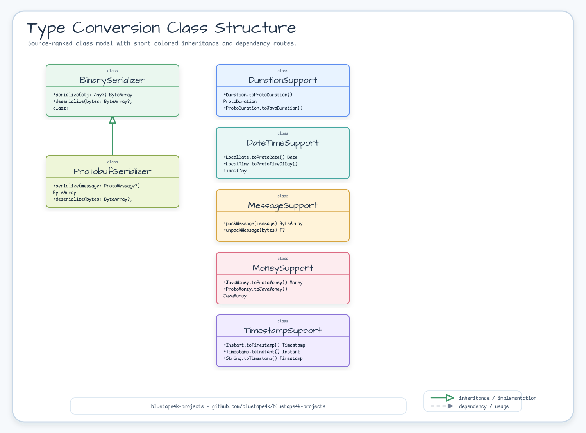
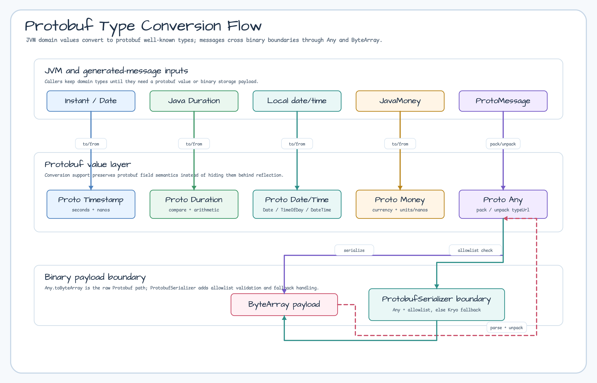
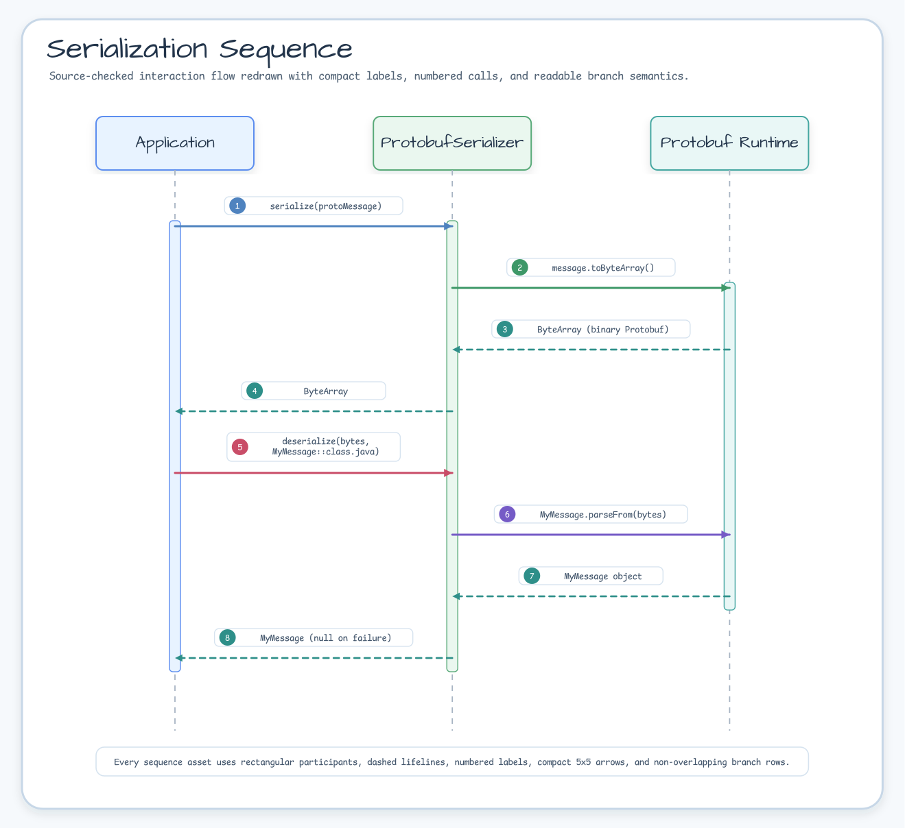

# Module bluetape4k-protobuf

[English](./README.md) | 한국어

Google Protocol Buffers 메시지 처리를 위한 Kotlin 확장 라이브러리입니다.

## 개요

`bluetape4k-protobuf`는 Protobuf 메시지의 변환, 직렬화, 타입 별칭 등 순수 Protobuf 유틸리티를 제공합니다. gRPC에 의존하지 않으므로 Protobuf 메시지만 사용하는 모듈에서 경량으로 활용할 수 있습니다.

## 아키텍처

### Protobuf 클래스 구조



### Protobuf 타입 변환 흐름



### ProtobufSerializer 허용 목록 시퀀스



## 주요 기능

- **타입 별칭**: `ProtoMessage`, `ProtoAny`, `ProtoTimestamp`, `ProtoDuration`, `ProtoMoney` 등
- **Timestamp 변환**: `Instant` ↔ `Timestamp`, RFC3339 파싱
- **Duration 변환**: Java `Duration` ↔ Protobuf `Duration`, 비교/연산 연산자
- **DateTime 변환**: `LocalDate`/`LocalTime`/`LocalDateTime` ↔ Protobuf `Date`/`TimeOfDay`/`DateTime`
- **Money 변환**: JavaMoney ↔ Protobuf `Money`
- **메시지 유틸리티**: `Any` 기반 pack/unpack
- **Protobuf 직렬화기**: 허용 목록 기반 보안이 적용된 `BinarySerializer` 구현체 (`ProtobufSerializer`)

### 보안: ProtobufSerializer 허용 목록

신뢰 프로필: `AllowListedTypes`.

`ProtobufSerializer`는 역직렬화 전에 각 `Any` 메시지의 `typeUrl`을 허용 목록과 대조합니다.
허용 목록에 없는 접두사를 가진 클래스는 `SecurityException`을 발생시킵니다 (`BinarySerializationException`으로 래핑).

**기본 허용 접두사** (`DEFAULT_ALLOWED_PREFIXES`):

| 접두사 | 설명 |
|---|---|
| `io.bluetape4k.` | 모든 bluetape4k 도메인 메시지 |
| `com.google.protobuf.` | 표준 Protobuf 잘 알려진 타입 |

**커스텀 허용 목록 예시:**

```kotlin
// 좁힘: 특정 패키지만 허용
val narrowSerializer = ProtobufSerializer(
    allowedClassPrefixes = setOf("io.bluetape4k.", "com.mycompany.proto.")
)

// 확장: 기본값에 추가 패키지 포함
val expandedSerializer = ProtobufSerializer(
    allowedClassPrefixes = ProtobufSerializer.DEFAULT_ALLOWED_PREFIXES + setOf("com.example.")
)
```

`ProtobufSerializer()`의 기본 동작은 strict입니다. Protobuf `Message`만 처리하며 비 Protobuf 값이나
바이트는 거부합니다. `ProtobufSerializer(fallback = nonNullSerializer)`와
`ProtobufSerializer.trustedInternalProtobuf(...)`는 모든 producer와 저장 payload를 신뢰할 수 있는 저장소에만
사용하는 호환 fallback입니다. 신뢰할 수 없는 payload에는 두 profile을 사용하지 마세요. fallback은 terminal
allowlist 위반이나 `Message`가 아닌 타입으로 확인된 경우를 우회하지 않습니다.

`RedissonProtobufCodec()`과 `RedissonProtobufCodec(allowedClassPrefixes)`도 strict입니다. 기본값으로 Kryo5나
다른 fallback codec을 사용하지 않습니다. `RedissonProtobufCodec(fallbackCodec)`과
`RedissonProtobufCodec.trustedInternal(...)`는 신뢰 저장소 전용 fallback opt-in입니다. 완전히 신뢰하는 레거시
환경에서 Protobuf class 전체 허용이 임시로 필요할 때만 migration escape hatch를 명시적으로 설정하세요:

```kotlin
val codec = RedissonProtobufCodec(
    allowedClassPrefixes = RedissonProtobufCodec.ALLOW_ALL_CLASSES_UNSAFE,
)
```

Decode 시 정확히 하나의 NIO buffer를 노출하는 contiguous input(`nioBufferCount() == 1`)만 lower-copy 경로를
사용합니다. Composite input은 copied compatibility 경로에 남고 trusted fallback decode도 별도로 복사한 input으로
격리됩니다. 이는 zero-copy를 보장한다는 의미가 아닙니다.

`ALLOW_ALL_CLASSES_UNSAFE`는 Protobuf class allowlist만 변경합니다. fallback codec을 활성화하지 않으므로 이
생성자에서는 비 Protobuf 값이 계속 거부됩니다.

프로덕션에서는 좁은 커스텀 허용 목록을 권장합니다:

```kotlin
val codec = RedissonProtobufCodec(
    allowedClassPrefixes = ProtobufSerializer.DEFAULT_ALLOWED_PREFIXES + setOf("com.example.proto.")
)
```

## 사용 예시

### 1. 타입 별칭

```kotlin
import io.bluetape4k.protobuf.*

val message: ProtoMessage = myProtoMessage
val any: ProtoAny = ProtoAny.pack(message)
val empty: ProtoEmpty = PROTO_EMPTY
```

### 2. Timestamp 변환

```kotlin
import io.bluetape4k.protobuf.*

val timestamp = Instant.now().toTimestamp()
val instant = timestamp.toInstant()
val fromRfc3339 = "2024-01-01T00:00:00Z".toTimestamp()
```

### 3. Duration 변환

```kotlin
import io.bluetape4k.protobuf.*

val protoDuration = java.time.Duration.ofMinutes(5).toProtoDuration()
val javaDuration = protoDuration.toJavaDuration()

// 비교 및 연산
val sum = duration1 + duration2
val diff = duration1 - duration2
```

### 4. Money 변환

```kotlin
import io.bluetape4k.protobuf.*
import org.javamoney.moneta.Money

val javaMoney = Money.of(10000, "KRW")
val protoMoney = javaMoney.toProtoMoney()
val backToJava = protoMoney.toJavaMoney()
```

### 5. 메시지 Pack/Unpack

```kotlin
import io.bluetape4k.protobuf.*
import java.nio.ByteBuffer

val bytes = packMessage(myMessage)
val restored: MyMessage? = unpackMessage(bytes)

val target = ByteBuffer.allocateDirect(4096).apply { position(8) }
val written = packMessageTo(myMessage, target)
val source = target.duplicate().apply {
    position(8)
    limit(8 + written)
}
val decoded = unpackMessage<MyMessage>(source)
```

caller-owned 경로는 호출 간 재사용하는 넉넉한 크기의 buffer를 위한 API입니다. 테스트나 내부 크기 검증에서는
별도 public size API를 추가하지 않고 정확한 capacity를 계산할 수 있습니다:

```kotlin
val packed = com.google.protobuf.Any.pack(myMessage)
val exactTarget = ByteBuffer.allocate(packed.serializedSize)
packMessageTo(myMessage, exactTarget)
```

운영 코드에서는 의도적으로 더 큰 재사용 buffer를 유지하는 편이 좋습니다. 정확한 크기를 구하려면 실제 쓰기
전에 packed `Any`를 먼저 만들어야 하므로 기대한 allocation 이점 일부가 사라집니다. 기존 `ByteArray` 호출자는
마이그레이션할 필요가 없습니다.

### 6. ProtobufSerializer (BinarySerializer 구현)

```kotlin
import io.bluetape4k.protobuf.serializers.ProtobufSerializer
import java.nio.ByteBuffer

val serializer = ProtobufSerializer()
val bytes = serializer.serialize(protoMessage)
val message = serializer.deserialize<MyMessage>(bytes)

val target = ByteBuffer.allocateDirect(4096).apply { position(8) }
val written = serializer.serializeTo(protoMessage, target)
val source = target.duplicate().apply {
    position(8)
    limit(8 + written)
}
val decoded = serializer.deserializeFrom<MyMessage>(source)
```

target의 소유권은 caller에게 있습니다. preflight `BufferOverflowException`은 target을 변경하지 않지만 쓰기가
시작된 뒤 실패하면 `position`만 복원되며 기존 바이트는 이미 덮어쓰였을 수 있습니다. 재사용하기 전에
caller-owned prefix 전체를 다시 초기화하거나 buffer를 폐기하세요. 여기서 `HEADER_SIZE`는 caller가 정한 prefix
경계입니다:

```kotlin
try {
    serializer.serializeTo(message, target)
} catch (failure: Throwable) {
    target.clear()
    target.position(HEADER_SIZE)
    // 재사용하기 전에 caller-owned prefix byte를 모두 다시 쓰거나 target을 폐기합니다.
    throw failure
}
```

추천 사용 방법:

- 값이 모두 Protobuf 메시지라면 `packMessage` / `unpackMessage` 또는 각 메시지의 `parseFrom`을 직접 사용하는 편이 가장 단순합니다.
- 내부 캐시나 세션처럼 Protobuf 메시지와 과거 JVM 객체가 섞인 신뢰 저장소에서는 모든 producer와 저장 payload를 신뢰할 수 있는지 확인한 뒤 명시적인 trusted fallback profile을 사용합니다.
- 서비스 간 wire protocol 자체는 gRPC/Protobuf 규약에 맡기고, `ProtobufSerializer`는 애플리케이션 내부 바이너리 저장/전달 경계에서 사용하는 편이 관리가 쉽습니다.

## 주요 파일/클래스 목록

| 파일                                  | 설명                                                              |
|-------------------------------------|-----------------------------------------------------------------|
| `TypeAlias.kt`                      | Protobuf 메시지 타입 별칭 (`ProtoMessage`, `ProtoAny`, `ProtoMoney` 등) |
| `TimestampSupport.kt`               | `Instant`/`Date` ↔ `Timestamp` 변환, RFC3339 파싱                   |
| `DurationSupport.kt`                | Java `Duration` ↔ Protobuf `Duration` 변환, 연산자                   |
| `DateTimeSupport.kt`                | `LocalDate`/`LocalTime`/`LocalDateTime` ↔ Protobuf 날짜/시간 변환     |
| `MoneySupport.kt`                   | JavaMoney ↔ Protobuf `Money` 변환                                 |
| `MessageSupport.kt`                 | `Any` 기반 메시지 pack/unpack 유틸리티                                   |
| `serializers/ProtobufSerializer.kt` | `BinarySerializer` 구현체 (Protobuf + fallback 직렬화)                |

## 의존성 추가

```kotlin
dependencies {
    implementation("io.github.bluetape4k:bluetape4k-protobuf:${version}")
}
```

## 테스트

```bash
./gradlew :bluetape4k-protobuf:test
```

## 참고

- [Protocol Buffers](https://protobuf.dev/)
- [Protobuf Kotlin](https://protobuf.dev/getting-started/kotlintutorial/)
