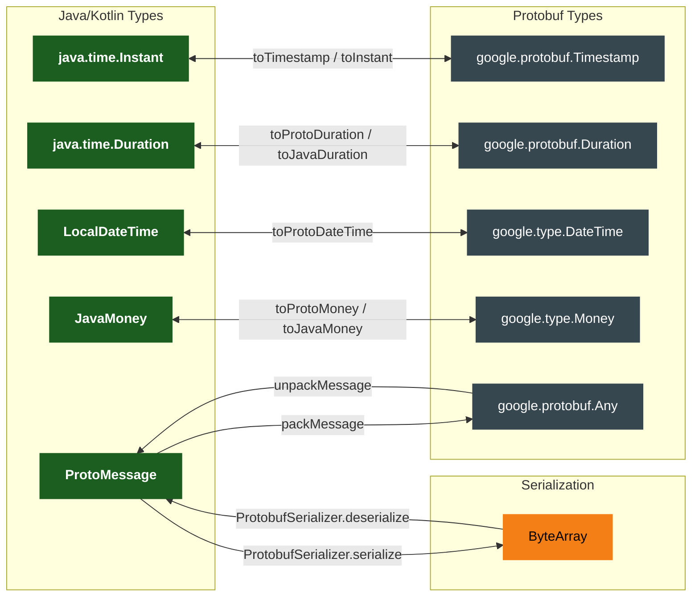
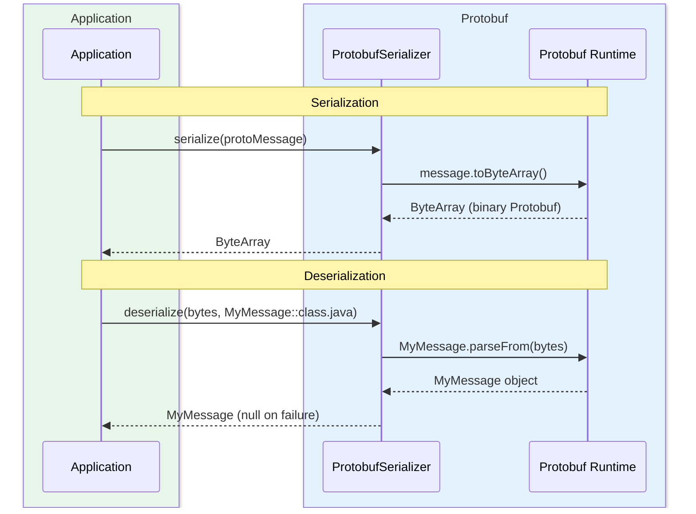

# Module bluetape4k-protobuf

English | [한국어](./README.ko.md)

A Kotlin extension library for working with Google Protocol Buffers messages.

## Overview

`bluetape4k-protobuf` provides pure Protobuf utilities for message conversion, serialization, and type aliasing. Because it has no dependency on gRPC, it can be used as a lightweight addition to any module that only needs Protobuf message handling.

## Architecture

### Type Conversion Class Structure

```mermaid
classDiagram
    class BinarySerializer {
        <<interface>>
        +serialize(obj: Any?) ByteArray
        +deserialize(bytes: ByteArray?, clazz: Class~T~) T?
    }

    class ProtobufSerializer {
        +serialize(message: ProtoMessage?) ByteArray
        +deserialize(bytes: ByteArray?, clazz: Class~T~) T?
    }

    class TimestampSupport {
        <<extensions>>
        +Instant.toTimestamp() Timestamp
        +Timestamp.toInstant() Instant
        +String.toTimestamp() Timestamp
    }

    class DurationSupport {
        <<extensions>>
        +Duration.toProtoDuration() ProtoDuration
        +ProtoDuration.toJavaDuration() Duration
        +ProtoDuration.plus(other) ProtoDuration
        +ProtoDuration.minus(other) ProtoDuration
    }

    class DateTimeSupport {
        <<extensions>>
        +LocalDate.toProtoDate() Date
        +LocalTime.toProtoTimeOfDay() TimeOfDay
        +LocalDateTime.toProtoDateTime() DateTime
    }

    class MoneySupport {
        <<extensions>>
        +JavaMoney.toProtoMoney() Money
        +ProtoMoney.toJavaMoney() JavaMoney
    }

    class MessageSupport {
        <<extensions>>
        +packMessage(message) ByteArray
        +unpackMessage(bytes) T?
    }

    BinarySerializer <|.. ProtobufSerializer

    style BinarySerializer fill:#1565C0,stroke:#0D47A1,color:#FFFFFF
    style ProtobufSerializer fill:#00897B,stroke:#00695C,color:#FFFFFF
    style TimestampSupport fill:#E65100,stroke:#BF360C,color:#FFFFFF
    style DurationSupport fill:#E65100,stroke:#BF360C,color:#FFFFFF
    style DateTimeSupport fill:#E65100,stroke:#BF360C,color:#FFFFFF
    style MoneySupport fill:#E65100,stroke:#BF360C,color:#FFFFFF
    style MessageSupport fill:#E65100,stroke:#BF360C,color:#FFFFFF
```



### Protobuf Type Conversion Flow



### Serialization Sequence



## Key Features

- **Type aliases**: `ProtoMessage`, `ProtoAny`, `ProtoTimestamp`, `ProtoDuration`, `ProtoMoney`, etc.
- **Timestamp conversion**: `Instant` ↔ `Timestamp`, RFC3339 parsing
- **Duration conversion**: Java `Duration` ↔ Protobuf `Duration`, comparison and arithmetic operators
- **DateTime conversion**: `LocalDate`/`LocalTime`/`LocalDateTime` ↔ Protobuf `Date`/`TimeOfDay`/`DateTime`
- **Money conversion**: JavaMoney ↔ Protobuf `Money`
- **Message utilities**: pack/unpack based on `Any`
- **Protobuf serializer**: `BinarySerializer` implementation (`ProtobufSerializer`)

## Usage Examples

### 1. Type Aliases

```kotlin
import io.bluetape4k.protobuf.*

val message: ProtoMessage = myProtoMessage
val any: ProtoAny = ProtoAny.pack(message)
val empty: ProtoEmpty = PROTO_EMPTY
```

### 2. Timestamp Conversion

```kotlin
import io.bluetape4k.protobuf.*

val timestamp = Instant.now().toTimestamp()
val instant = timestamp.toInstant()
val fromRfc3339 = "2024-01-01T00:00:00Z".toTimestamp()
```

### 3. Duration Conversion

```kotlin
import io.bluetape4k.protobuf.*

val protoDuration = java.time.Duration.ofMinutes(5).toProtoDuration()
val javaDuration = protoDuration.toJavaDuration()

// Comparison and arithmetic
val sum = duration1 + duration2
val diff = duration1 - duration2
```

### 4. Money Conversion

```kotlin
import io.bluetape4k.protobuf.*
import org.javamoney.moneta.Money

val javaMoney = Money.of(10000, "KRW")
val protoMoney = javaMoney.toProtoMoney()
val backToJava = protoMoney.toJavaMoney()
```

### 5. Message Pack/Unpack

```kotlin
import io.bluetape4k.protobuf.*

val bytes = packMessage(myMessage)
val restored: MyMessage? = unpackMessage(bytes)
```

### 6. ProtobufSerializer (BinarySerializer Implementation)

```kotlin
import io.bluetape4k.protobuf.serializers.ProtobufSerializer

val serializer = ProtobufSerializer()
val bytes = serializer.serialize(protoMessage)
val message = serializer.deserialize<MyMessage>(bytes)
```

Recommended usage patterns:

- If all values are Protobuf messages, using `packMessage` / `unpackMessage` or each message's own
  `parseFrom` directly is the simplest approach.
- For stores that mix Protobuf messages with general JVM objects (e.g., caches, sessions, queues),
  `ProtobufSerializer` paired with a fallback serializer is more practical.
- Leave the service-to-service wire protocol to gRPC/Protobuf conventions, and use
  `ProtobufSerializer` at internal binary storage and delivery boundaries within the application.

## Key Files / Classes

| File                                | Description                                                                    |
|-------------------------------------|--------------------------------------------------------------------------------|
| `TypeAlias.kt`                      | Protobuf message type aliases (`ProtoMessage`, `ProtoAny`, `ProtoMoney`, etc.) |
| `TimestampSupport.kt`               | `Instant`/`Date` ↔ `Timestamp` conversion, RFC3339 parsing                     |
| `DurationSupport.kt`                | Java `Duration` ↔ Protobuf `Duration` conversion and operators                 |
| `DateTimeSupport.kt`                | `LocalDate`/`LocalTime`/`LocalDateTime` ↔ Protobuf date/time conversion        |
| `MoneySupport.kt`                   | JavaMoney ↔ Protobuf `Money` conversion                                        |
| `MessageSupport.kt`                 | `Any`-based message pack/unpack utilities                                      |
| `serializers/ProtobufSerializer.kt` | `BinarySerializer` implementation (Protobuf + fallback serialization)          |

## Dependencies

```kotlin
dependencies {
    implementation("io.github.bluetape4k:bluetape4k-protobuf:${version}")
}
```

## Testing

```bash
./gradlew :bluetape4k-protobuf:test
```

## References

- [Protocol Buffers](https://protobuf.dev/)
- [Protobuf Kotlin](https://protobuf.dev/getting-started/kotlintutorial/)
