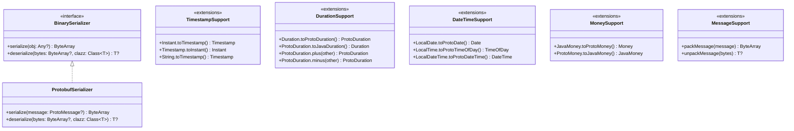
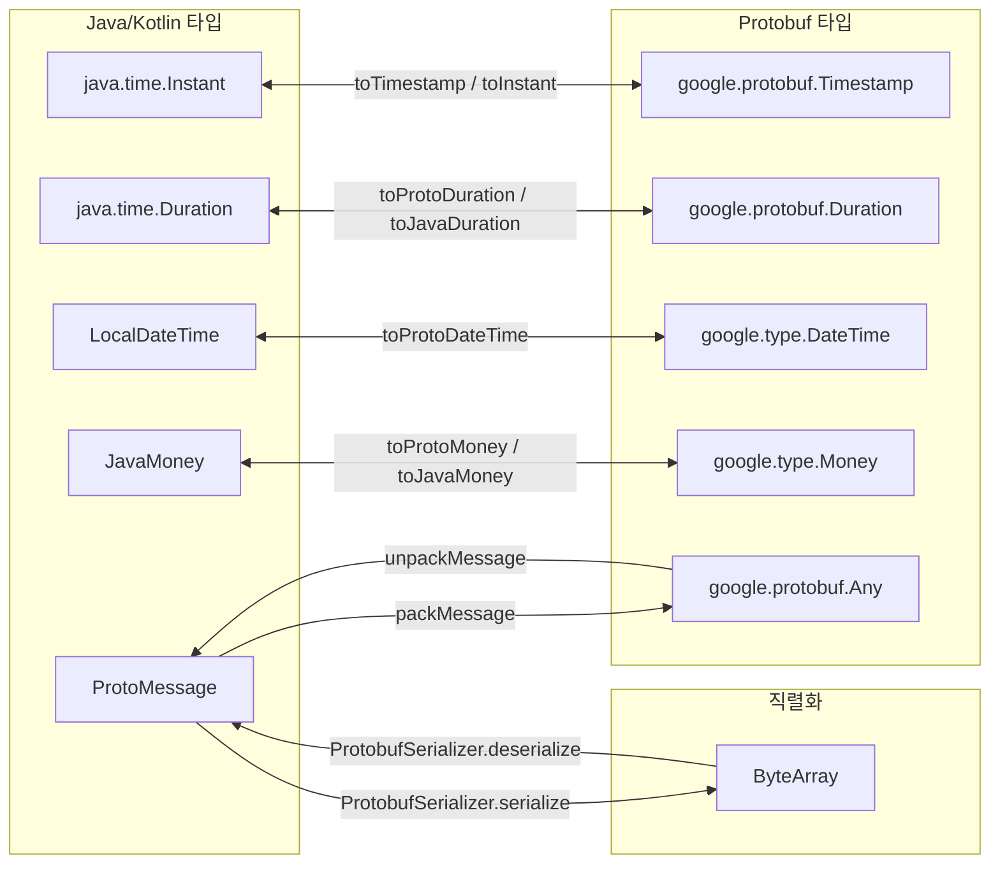
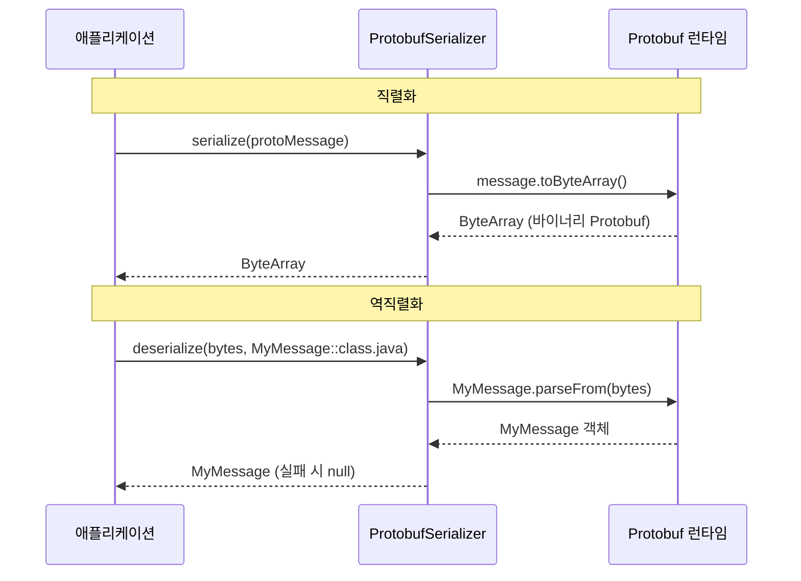

# Module bluetape4k-protobuf

Google Protocol Buffers 메시지 처리를 위한 Kotlin 확장 라이브러리입니다.

## 개요

`bluetape4k-protobuf`는 Protobuf 메시지의 변환, 직렬화, 타입 별칭 등 순수 Protobuf 유틸리티를 제공합니다. gRPC에 의존하지 않으므로 Protobuf 메시지만 사용하는 모듈에서 경량으로 활용할 수 있습니다.

### 주요 기능

- **타입 별칭**: `ProtoMessage`, `ProtoAny`, `ProtoTimestamp`, `ProtoDuration`, `ProtoMoney` 등
- **Timestamp 변환**: `Instant` ↔ `Timestamp`, RFC3339 파싱
- **Duration 변환**: Java `Duration` ↔ Protobuf `Duration`, 비교/연산 연산자
- **DateTime 변환**: `LocalDate`/`LocalTime`/`LocalDateTime` ↔ Protobuf `Date`/`TimeOfDay`/`DateTime`
- **Money 변환**: JavaMoney ↔ Protobuf `Money`
- **메시지 유틸리티**: `Any` 기반 pack/unpack
- **Protobuf 직렬화기**: `BinarySerializer` 구현체 (`ProtobufSerializer`)

## 의존성 추가

```kotlin
dependencies {
    implementation("io.github.bluetape4k:bluetape4k-protobuf:${version}")
}
```

## 사용 예시

### 1. 타입 별칭

```kotlin
import io.bluetape4k.protobuf.*

val message: ProtoMessage = myProtoMessage
val any: ProtoAny = ProtoAny.pack(message)
val empty: ProtoEmpty = PROTO_EMPTY
```

### 2. Timestamp 변환

```kotlin
import io.bluetape4k.protobuf.*

val timestamp = Instant.now().toTimestamp()
val instant = timestamp.toInstant()
val fromRfc3339 = "2024-01-01T00:00:00Z".toTimestamp()
```

### 3. Duration 변환

```kotlin
import io.bluetape4k.protobuf.*

val protoDuration = java.time.Duration.ofMinutes(5).toProtoDuration()
val javaDuration = protoDuration.toJavaDuration()

// 비교 및 연산
val sum = duration1 + duration2
val diff = duration1 - duration2
```

### 4. Money 변환

```kotlin
import io.bluetape4k.protobuf.*
import org.javamoney.moneta.Money

val javaMoney = Money.of(10000, "KRW")
val protoMoney = javaMoney.toProtoMoney()
val backToJava = protoMoney.toJavaMoney()
```

### 5. 메시지 Pack/Unpack

```kotlin
import io.bluetape4k.protobuf.*

val bytes = packMessage(myMessage)
val restored: MyMessage? = unpackMessage(bytes)
```

### 6. ProtobufSerializer (BinarySerializer 구현)

```kotlin
import io.bluetape4k.protobuf.serializers.ProtobufSerializer

val serializer = ProtobufSerializer()
val bytes = serializer.serialize(protoMessage)
val message = serializer.deserialize<MyMessage>(bytes)
```

추천 사용 방법:

- 값이 모두 Protobuf 메시지라면 `packMessage` / `unpackMessage` 또는 각 메시지의 `parseFrom`을 직접 사용하는 편이 가장 단순합니다.
- 캐시/세션/큐처럼 Protobuf 메시지와 일반 JVM 객체가 섞여 들어오는 저장소라면 `ProtobufSerializer`가 fallback serializer와 함께 더 유용합니다.
- 서비스 간 wire protocol 자체는 gRPC/Protobuf 규약에 맡기고, `ProtobufSerializer`는 애플리케이션 내부 바이너리 저장/전달 경계에서 사용하는 편이 관리가 쉽습니다.

## 주요 파일/클래스 목록

| 파일 | 설명 |
|------|------|
| `TypeAlias.kt` | Protobuf 메시지 타입 별칭 (`ProtoMessage`, `ProtoAny`, `ProtoMoney` 등) |
| `TimestampSupport.kt` | `Instant`/`Date` ↔ `Timestamp` 변환, RFC3339 파싱 |
| `DurationSupport.kt` | Java `Duration` ↔ Protobuf `Duration` 변환, 연산자 |
| `DateTimeSupport.kt` | `LocalDate`/`LocalTime`/`LocalDateTime` ↔ Protobuf 날짜/시간 변환 |
| `MoneySupport.kt` | JavaMoney ↔ Protobuf `Money` 변환 |
| `MessageSupport.kt` | `Any` 기반 메시지 pack/unpack 유틸리티 |
| `serializers/ProtobufSerializer.kt` | `BinarySerializer` 구현체 (Protobuf + fallback 직렬화) |

## 아키텍처 다이어그램

### 타입 변환 클래스 구조



### Protobuf 타입 변환 흐름



### 직렬화 시퀀스



## 테스트

```bash
./gradlew :bluetape4k-protobuf:test
```

## 참고

- [Protocol Buffers](https://protobuf.dev/)
- [Protobuf Kotlin](https://protobuf.dev/getting-started/kotlintutorial/)
