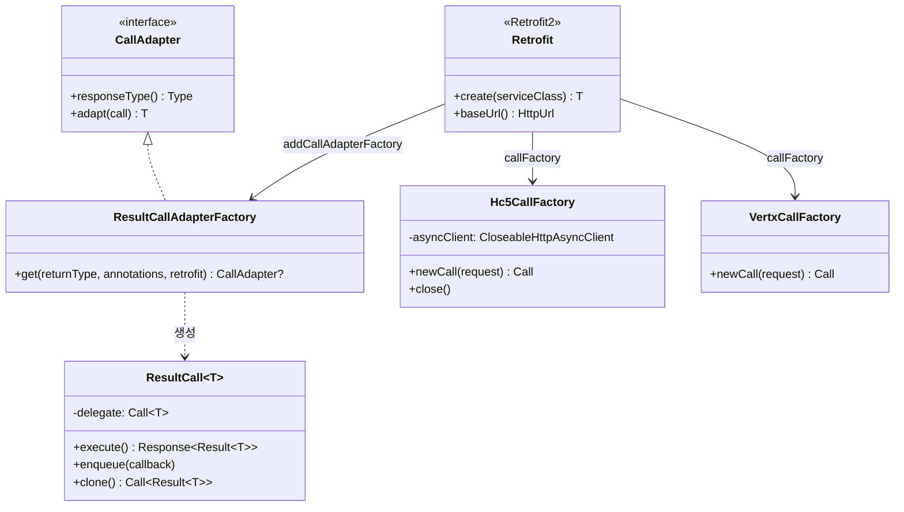
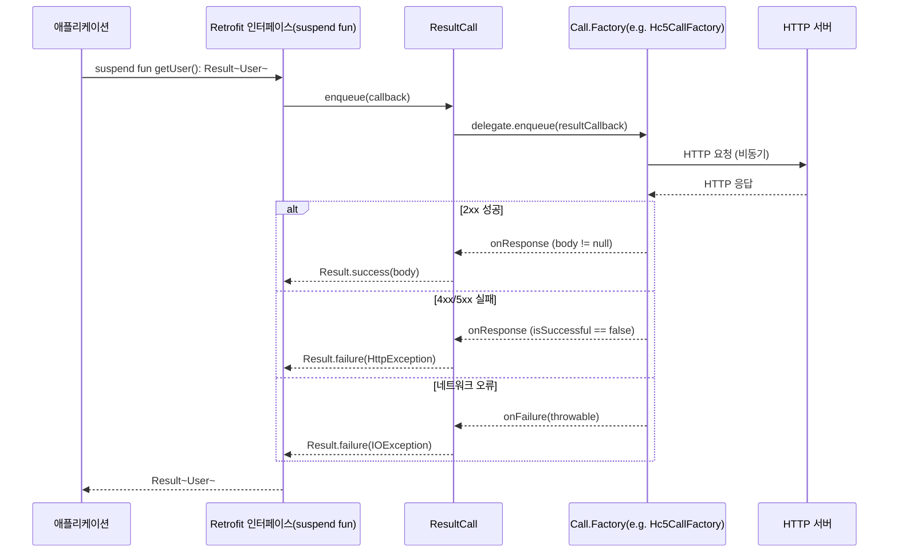

# Module bluetape4k-retrofit2

## 개요

`bluetape4k-retrofit2`는 [Retrofit2](https://square.github.io/retrofit/)를 Kotlin DSL과 Coroutines로 확장하여 제공하는 모듈입니다.

OkHttp 기본 전송 외에 Apache HC5, Vert.x, AsyncHttpClient 등 다양한 HTTP 전송 계층을 지원하며, Kotlin
`Result` 타입 기반의 에러 핸들링과 Reactive Streams 어댑터를 자동 감지하여 등록합니다.

## 주요 기능

### 1. Retrofit Builder DSL

Kotlin DSL로 간편하게 Retrofit 인스턴스를 구성합니다.

```kotlin
import io.bluetape4k.retrofit2.*

// DSL 방식
val retrofit = retrofit("https://api.github.com", defaultJsonConverterFactory) {
    callFactory(okhttp3Client())
    addCallAdapterFactory(ResultCallAdapterFactory())
}

// 팩토리 함수 방식 (CallAdapter 자동 감지)
val retrofit = retrofitOf(
    baseUrl = "https://api.github.com",
    callFactory = okhttp3Client(),
    converterFactory = defaultJsonConverterFactory,
)

// 서비스 인터페이스 생성
val api = retrofit.service<GitHubApi>()
```

### 2. Result 패턴 지원

`ResultCallAdapterFactory`를 통해 API 응답을 Kotlin `Result` 타입으로 안전하게 래핑합니다.

```kotlin
interface GitHubApi {
    @GET("users/{username}")
    suspend fun getUser(@Path("username") username: String): Result<User>

    @GET("users/{username}/repos")
    suspend fun getUserRepos(@Path("username") username: String): Result<List<Repo>>
}

// Result 패턴으로 에러 핸들링
val result = api.getUser("octocat")
result.onSuccess { user ->
    println("User: ${user.name}")
}.onFailure { error ->
    println("Error: ${error.message}")
}
```

### 3. Coroutines 지원

suspend 함수를 선언하면 자동으로 Coroutines 환경에서 비동기 요청을 수행합니다.

```kotlin
interface HttpbinApi {
    @GET("get")
    suspend fun get(): HttpbinResponse

    @POST("post")
    suspend fun post(@Body body: Map<String, Any>): HttpbinResponse
}

// Coroutines 환경에서 병렬 요청
suspend fun fetchMultiple(api: HttpbinApi) = coroutineScope {
    val response1 = async { api.get() }
    val response2 = async { api.get() }
    awaitAll(response1, response2)
}
```

추천 사용 방법:

- 새 API 설계에서는 가능하면 `suspend fun` 또는 `suspend fun ...: Result<T>` 형태를 우선 사용합니다.
- 기존 Java 호출부와의 호환이나 명시적 취소/콜백 브리지가 필요할 때만 `Call<T>` + `executeAsync()`를 선택하는 편이 단순합니다.
- Resilience4j `Retry`와 함께 사용할 때는 이 모듈의 `executeAsync(retry)` / `suspendExecute(retry)`를 사용하면 내부적으로 `clone()`된 새 `Call`로 재시도합니다.
- `ResultCallAdapterFactory`는 HTTP 오류를 `Result.failure(HttpException)`로 정규화하므로, 비즈니스 레이어에서 예외 대신 `Result` 중심으로 합성할 때 특히 유용합니다.

### 4. 다양한 HTTP 전송 계층 (CallFactory)

OkHttp3 외에 다양한 HTTP 클라이언트를 `Call.Factory`로 사용할 수 있습니다.

| CallFactory       | 기반 라이브러리                | 특성                  |
|-------------------|-------------------------|---------------------|
| OkHttpClient (기본) | OkHttp3                 | 경량, HTTP/2, 범용      |
| Hc5CallFactory    | Apache HttpComponents 5 | 풍부한 설정, 엔터프라이즈 환경   |
| VertxCallFactory  | Vert.x                  | 이벤트 루프 기반, 고성능      |
| AhcCallFactory    | AsyncHttpClient         | Netty 기반, 대량 비동기 요청 |

```kotlin
// Apache HC5 기반 Retrofit
val retrofit = retrofitOf(
    baseUrl = "https://api.example.com",
    callFactory = Hc5CallFactory(httpClient),
)

// Vert.x 기반 Retrofit
val retrofit = retrofitOf(
    baseUrl = "https://api.example.com",
    callFactory = VertxCallFactory(vertxClient),
)
```

### 5. Reactive Streams 어댑터 자동 감지

클래스패스에 존재하는 Reactive 라이브러리의 어댑터를 자동으로 등록합니다.

- **RxJava2**: `RxJava2CallAdapterFactory`
- **RxJava3**: `RxJava3CallAdapterFactory`
- **Reactor**: `ReactorCallAdapterFactory`

```kotlin
// RxJava3 API
interface GitHubRxApi {
    @GET("users/{username}")
    fun getUser(@Path("username") username: String): Single<User>

    @GET("users/{username}/repos")
    fun getUserRepos(@Path("username") username: String): Flowable<List<Repo>>
}

// Reactor API
interface GitHubReactorApi {
    @GET("users/{username}")
    fun getUser(@Path("username") username: String): Mono<User>
}
```

### 6. Converter Factory

Jackson 기반의 JSON 변환을 기본 제공하며, Scalars 변환도 지원합니다.

```kotlin
// 기본 Jackson Converter (bluetape4k-jackson2 기반)
val jsonFactory = defaultJsonConverterFactory

// 커스텀 ObjectMapper 사용
val customFactory = jacksonConverterFactoryOf(customObjectMapper)

// Scalars Converter (String, primitive 타입)
val scalarsFactory = defaultScalarsConverterFactory
```

## API 정의 예시

```kotlin
interface HttpbinApi {
    // 동기 호출
    @GET("get")
    fun get(): Call<HttpbinResponse>

    // Coroutines
    @GET("get")
    suspend fun getSuspend(): HttpbinResponse

    // Result 패턴
    @GET("get")
    suspend fun getResult(): Result<HttpbinResponse>

    // Path/Query 파라미터
    @GET("anything/{path}")
    suspend fun anything(
        @Path("path") path: String,
        @Query("key") key: String,
    ): HttpbinAnythingResponse

    // POST with Body
    @POST("post")
    suspend fun post(@Body body: Map<String, Any>): HttpbinResponse
}
```

## 의존성

```kotlin
dependencies {
    implementation(project(":bluetape4k-retrofit2"))

    // 선택적 의존성
    implementation("com.squareup.retrofit2:converter-jackson")       // Jackson 변환
    implementation("com.squareup.retrofit2:converter-scalars")       // Scalars 변환
    implementation("com.squareup.retrofit2:adapter-rxjava3")         // RxJava3 어댑터
    implementation("com.jakewharton.retrofit:retrofit2-reactor-adapter") // Reactor 어댑터
}
```

## 클래스 구조

### Retrofit2 + Result 패턴 통합 구조



### suspend 함수 기반 HTTP 요청 흐름 (Result 패턴)



## 모듈 구조

```
io.bluetape4k.retrofit2
├── RetrofitSupport.kt               # Retrofit Builder DSL 및 팩토리 함수
├── RetrofitCallSupport.kt           # Call 확장 함수
├── SuspendRetrofitCallSupport.kt    # Suspend Call 확장 함수
├── ExceptionSupport.kt              # 예외 처리 유틸리티
├── result/                          # Result 패턴
│   ├── ResultCall.kt                # Result 래핑 Call 구현체
│   └── ResultCallAdapterFactory.kt  # Result CallAdapter 팩토리
└── clients/                         # HTTP 전송 계층
    ├── hc5/                         # Apache HC5 CallFactory
    │   ├── Hc5CallFactory.kt
    │   └── Hc5OkHttp3Support.kt
    ├── vertx/                       # Vert.x CallFactory
    │   ├── VertxCallFactory.kt
    │   └── VertxOkHttp3Support.kt
    └── ahc/                         # AsyncHttpClient CallFactory
        └── AhcCallFactorySupport.kt
```

## 테스트

```bash
# Retrofit2 모듈 테스트 실행
./gradlew :bluetape4k-retrofit2:test
```

## 참고

- [Retrofit](https://square.github.io/retrofit/)
- [OkHttp](https://square.github.io/okhttp/)
- [Jackson](https://github.com/FasterXML/jackson)
- [RxJava3](https://github.com/ReactiveX/RxJava)
- [Project Reactor](https://projectreactor.io/)
