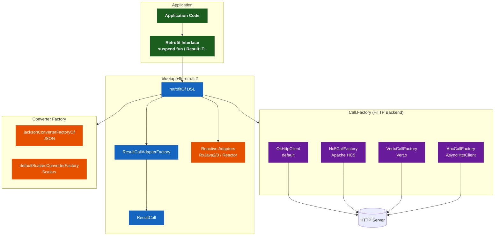
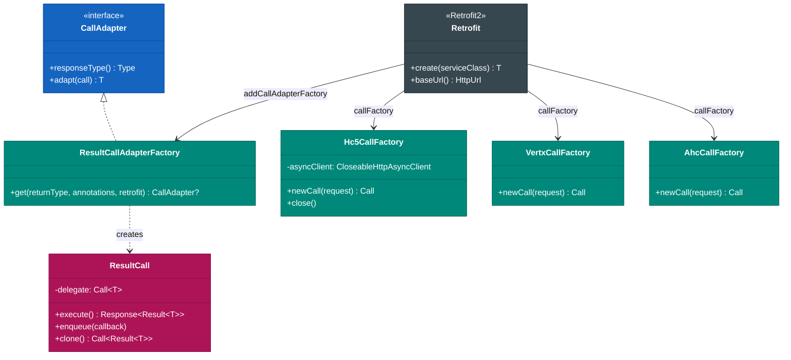
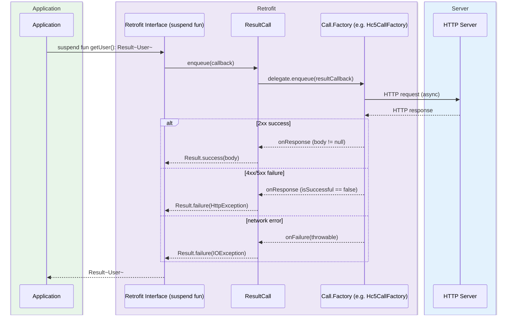

# Module bluetape4k-retrofit2

English | [한국어](./README.ko.md)

## Overview

`bluetape4k-retrofit2` is a module that extends [Retrofit2](https://square.github.io/retrofit/) with Kotlin DSL and Coroutines support.

Beyond the default OkHttp transport, it supports multiple HTTP backends including Apache HC5, Vert.x, and AsyncHttpClient. It also provides error handling via Kotlin's
`Result` type and automatically detects and registers Reactive Streams adapters.

## Architecture

### Overall Architecture: Retrofit2 + Coroutines + Result Pattern



### Retrofit2 + Result Pattern Integration



### Suspend Function HTTP Request Flow (Result Pattern)



## Key Features

### 1. Retrofit Builder DSL

Build a Retrofit instance concisely using Kotlin DSL.

```kotlin
import io.bluetape4k.retrofit2.*

// DSL style
val retrofit = retrofit("https://api.github.com", defaultJsonConverterFactory) {
    callFactory(okhttp3Client())
    addCallAdapterFactory(ResultCallAdapterFactory())
}

// Factory function style (auto-detects CallAdapters)
val retrofit = retrofitOf(
    baseUrl = "https://api.github.com",
    callFactory = okhttp3Client(),
    converterFactory = defaultJsonConverterFactory,
)

// Create a service interface
val api = retrofit.service<GitHubApi>()
```

### 2. Result Pattern Support

`ResultCallAdapterFactory` wraps API responses safely in Kotlin's `Result` type.

```kotlin
interface GitHubApi {
    @GET("users/{username}")
    suspend fun getUser(@Path("username") username: String): Result<User>

    @GET("users/{username}/repos")
    suspend fun getUserRepos(@Path("username") username: String): Result<List<Repo>>
}

// Error handling with the Result pattern
val result = api.getUser("octocat")
result.onSuccess { user ->
    println("User: ${user.name}")
}.onFailure { error ->
    println("Error: ${error.message}")
}
```

### 3. Coroutines Support

Declare suspend functions and async requests are automatically made in a coroutines context.

```kotlin
interface HttpbinApi {
    @GET("get")
    suspend fun get(): HttpbinResponse

    @POST("post")
    suspend fun post(@Body body: Map<String, Any>): HttpbinResponse
}

// Parallel requests in a coroutines context
suspend fun fetchMultiple(api: HttpbinApi) = coroutineScope {
    val response1 = async { api.get() }
    val response2 = async { api.get() }
    awaitAll(response1, response2)
}
```

Recommended usage:

- For new API designs, prefer `suspend fun` or `suspend fun ...: Result<T>` wherever possible.
- Use `Call<T>` +
  `executeAsync()` only when compatibility with existing Java callers or explicit cancellation/callback bridging is needed.
- When using Resilience4j `Retry`, use this module's `executeAsync(retry)` / `suspendExecute(retry)` — they retry with a
  `clone()`d `Call` internally.
- `ResultCallAdapterFactory` normalizes HTTP errors to
  `Result.failure(HttpException)`, making it especially useful when composing the business layer around
  `Result` instead of exceptions.

### 4. Multiple HTTP Backends (CallFactory)

Use HTTP clients other than OkHttp3 as a `Call.Factory`.

| CallFactory            | Underlying Library      | Characteristics                             |
|------------------------|-------------------------|---------------------------------------------|
| OkHttpClient (default) | OkHttp3                 | Lightweight, HTTP/2, general purpose        |
| Hc5CallFactory         | Apache HttpComponents 5 | Rich configuration, enterprise environments |
| VertxCallFactory       | Vert.x                  | Event-loop based, high performance          |
| AhcCallFactory         | AsyncHttpClient         | Netty-based, high-volume async requests     |

```kotlin
// Retrofit with Apache HC5
val retrofit = retrofitOf(
    baseUrl = "https://api.example.com",
    callFactory = Hc5CallFactory(httpClient),
)

// Retrofit with Vert.x
val retrofit = retrofitOf(
    baseUrl = "https://api.example.com",
    callFactory = VertxCallFactory(vertxClient),
)
```

### 5. Reactive Streams Adapter Auto-Detection

Automatically registers adapters for Reactive libraries found on the classpath.

- **RxJava2**: `RxJava2CallAdapterFactory`
- **RxJava3**: `RxJava3CallAdapterFactory`
- **Reactor**: `ReactorCallAdapterFactory`

```kotlin
// RxJava3 API
interface GitHubRxApi {
    @GET("users/{username}")
    fun getUser(@Path("username") username: String): Single<User>

    @GET("users/{username}/repos")
    fun getUserRepos(@Path("username") username: String): Flowable<List<Repo>>
}

// Reactor API
interface GitHubReactorApi {
    @GET("users/{username}")
    fun getUser(@Path("username") username: String): Mono<User>
}
```

### 6. Converter Factory

Provides Jackson-based JSON conversion out of the box, with Scalars conversion also supported.

```kotlin
// Default Jackson Converter (based on bluetape4k-jackson2)
val jsonFactory = defaultJsonConverterFactory

// Custom ObjectMapper
val customFactory = jacksonConverterFactoryOf(customObjectMapper)

// Scalars Converter (String, primitive types)
val scalarsFactory = defaultScalarsConverterFactory
```

## Usage Examples

```kotlin
interface HttpbinApi {
    // Synchronous call
    @GET("get")
    fun get(): Call<HttpbinResponse>

    // Coroutines
    @GET("get")
    suspend fun getSuspend(): HttpbinResponse

    // Result pattern
    @GET("get")
    suspend fun getResult(): Result<HttpbinResponse>

    // Path / Query parameters
    @GET("anything/{path}")
    suspend fun anything(
        @Path("path") path: String,
        @Query("key") key: String,
    ): HttpbinAnythingResponse

    // POST with Body
    @POST("post")
    suspend fun post(@Body body: Map<String, Any>): HttpbinResponse
}
```

## Module Structure

```
io.bluetape4k.retrofit2
├── RetrofitSupport.kt               # Retrofit Builder DSL and factory functions
├── RetrofitCallSupport.kt           # Call extension functions
├── SuspendRetrofitCallSupport.kt    # Suspend Call extension functions
├── ExceptionSupport.kt              # Exception handling utilities
├── result/                          # Result pattern
│   ├── ResultCall.kt                # Result-wrapping Call implementation
│   └── ResultCallAdapterFactory.kt  # Result CallAdapter factory
└── clients/                         # HTTP transport backends
    ├── hc5/                         # Apache HC5 CallFactory
    │   ├── Hc5CallFactory.kt
    │   └── Hc5OkHttp3Support.kt
    ├── vertx/                       # Vert.x CallFactory
    │   ├── VertxCallFactory.kt
    │   └── VertxOkHttp3Support.kt
    └── ahc/                         # AsyncHttpClient CallFactory
        └── AhcCallFactorySupport.kt
```

## Dependencies

```kotlin
dependencies {
    implementation(project(":bluetape4k-retrofit2"))

    // Optional dependencies
    implementation("com.squareup.retrofit2:converter-jackson")       // Jackson conversion
    implementation("com.squareup.retrofit2:converter-scalars")       // Scalars conversion
    implementation("com.squareup.retrofit2:adapter-rxjava3")         // RxJava3 adapter
    implementation("com.jakewharton.retrofit:retrofit2-reactor-adapter") // Reactor adapter
}
```

## Testing

```bash
# Run Retrofit2 module tests
./gradlew :bluetape4k-retrofit2:test
```

## References

- [Retrofit](https://square.github.io/retrofit/)
- [OkHttp](https://square.github.io/okhttp/)
- [Jackson](https://github.com/FasterXML/jackson)
- [RxJava3](https://github.com/ReactiveX/RxJava)
- [Project Reactor](https://projectreactor.io/)
